# 我们如何在不到一个月的时间内获得 7000 多名用户

> 原文：<https://medium.com/hackernoon/how-we-acquired-7000-users-in-less-than-a-month-57d43f84a316>

在这个故事中，我将深入探讨并尝试向您全面展示我们是如何准备无偿工作的，以便为我们的 SaaS 工具报告带来牵引力、曝光率、社区增长和乘风破浪

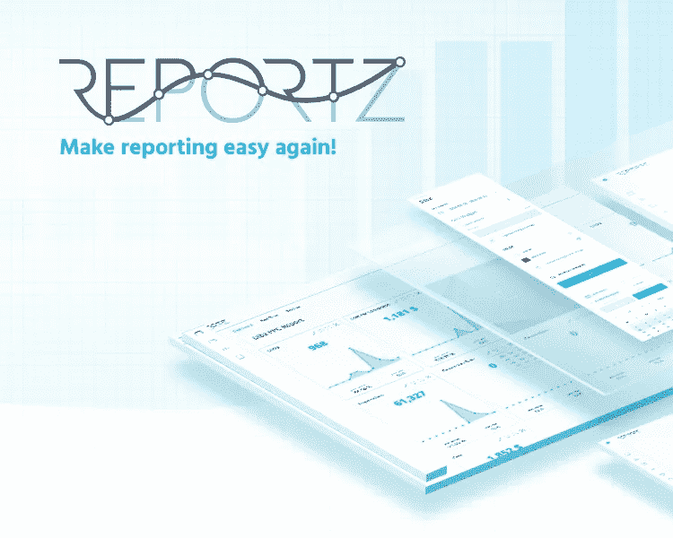

# 在我们开始之前…

[Reportz.io](https://reportz.io/) 是一款简洁明了的 KPI 报告[工具](https://hackernoon.com/tagged/tool)，可以帮助代理机构、自由职业者、企业家和所有其他[坏蛋](https://hackernoon.com/tagged/badasses)节省时间、自动化客户报告并消灭死敌！

我们创建它是为了满足我们的内部需求，因为在时间[时，我们每月为 300 多个客户提供服务](https://fourdots.com/)，我们尝试的所有工具(我们尝试了所有工具)都不能满足我们作为全栈代理的需求，我们只是无耻地对他们平台上的每一次点击进行追加销售，这是我们非常不喜欢的…

# 自举。

Reportz 只是我们的一个工具，每一个都是 100%自举的。我们从来不希望有人坐在我们的头上告诉我们该做什么，因为一切都是从我们的口袋里支付的-我们的主要策略是:

> “尽我们所能利用一切获取渠道”

…在投入燃烧 PPC 预算之前。

You know how it goes…

我们还面临着这样的情况，我们正在与一些最大的、资金雄厚的公司竞争，(我们和 Klipfolio 之间的主要区别是，我们不想要那 1200 万美元的种子基金投资😛)所以我们真的有 ***比其他人更专注于做“那件事”*** 为了有机会，你将有机会在本文后面找到，因为我真的涵盖了所有内容。

# 前期准备。

我们做的第一个活动是寻找产品。

***在我们的产品搜索发布后，我们获得了最初的 531 名用户。***

在我们的朋友蒋曦儿·伊莉莎白·德·米尔(你知道她来自 GrowthHackers 和 Zest.is)的帮助下，这个活动进行得非常好，我们最终获得了 ***3 个当天最受欢迎产品*** 🏅但最终，这 531 人中只有不到 100 人成为付费用户，因为我们最初的入职+培养努力是一场灾难。💩

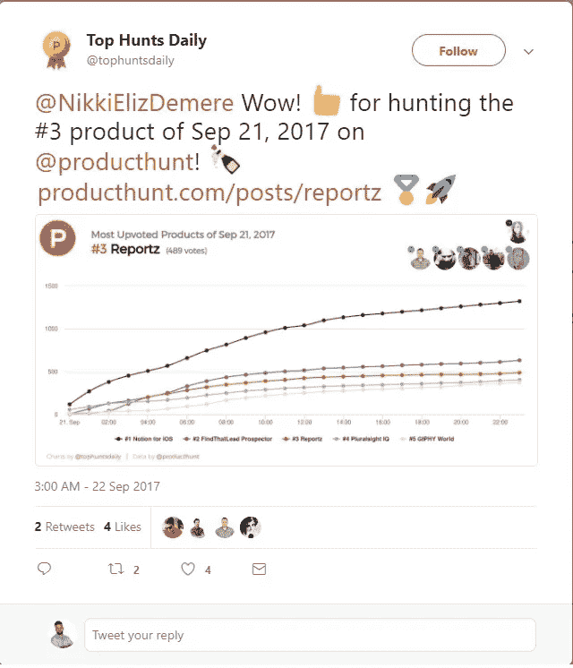

产品搜索帮助我们发现问题、收集反馈并修改我们的入职计划。

这也帮助我认识到，在投入任何收购努力之前，我们必须清楚地认识到我们所处的位置，以及实现我们目标的必要条件

*   我们的入职很糟糕，我们必须改进
*   描绘客户旅程并评估棘手问题
*   创建 ICP(理想客户角色),并针对独特的细分市场对所有活动进行细分
*   由于工具的性质/功能/复杂性，认识到客户的成功将是我们提高转化率的关键部分。

在接下来的几个月里，我们[致力于开发](https://reportz.io/integrations/)，构建集成，与合作伙伴建立关系，以及[准备教育材料。](https://www.youtube.com/channel/UCUYtZEgVbMsow1b4fisTbtA)

我们希望 ***无论如何都不要以*** 告终，这意味着 ***优化入职培训，尽可能降低总体复杂性*** 同时制作有用的内容和大量其他教育材料，以帮助我们的用户入职。

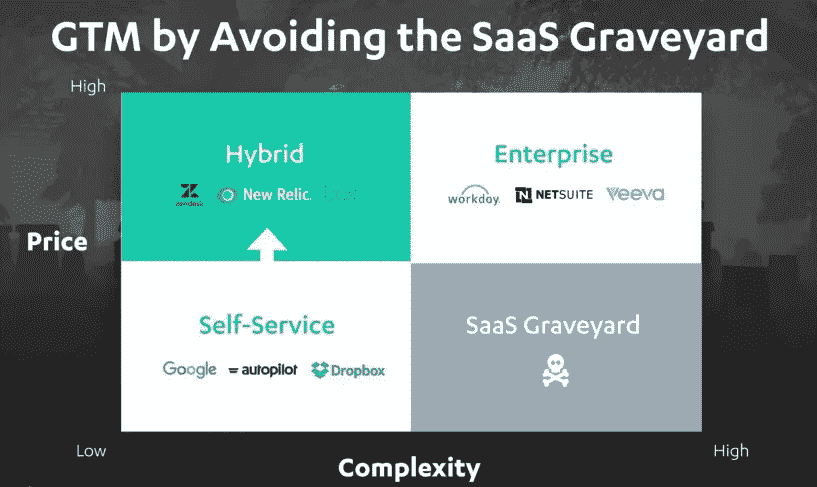

You don’t want to end up there…

# 准备。

## 行业问题。

如上所述，我们必须弄清楚我们做得更好的一件事是什么，这将使我们在激烈的竞争中脱颖而出。

***很像夏奇拉的臀部，数据不会说谎。***

***在调查并与我们的用户*** 交谈后，我们意识到人们对报告工具有 5 个主要问题不满意:

1.  **复杂程度**
2.  **价格**
3.  **追加销售**
4.  **教育材料**
5.  **客户成功&支持**

## 我们是如何解决的？

1.  我们没有创建预定义的指标，而是整合了每个人都能识别的**原始指标**
2.  我们的定价模式是 **"** 按使用付费 **"** ，因此用户只需按月支付他使用的**仪表盘金额**
3.  **我们没有追加销售**—**—**无论你是自由职业者还是企业，一切都包括在内，这完全符合我们的定价模式
4.  我们以各种格式创建了一个强大的教育材料库+我们有一个**“创始人演示”选项，对所有用户都是免费的**
5.  从首席执行官到支持经理，每个人都有内线电话，所以如果有新手“吃不消”的用户，有经验的人可以加入进来

## 绘制促销渠道

传统上，我们将通道映射为:

## **拥有**

*   博客
*   时事通讯

## **赚了**

*   脸书集团
*   影响者
*   平台
*   商务化人际关系网
*   Quora
*   Reddit
*   油管（国外视频网站）
*   客座博文
*   出版
*   伙伴关系

## **已付**

*   脸书广告
*   广告词
*   宾加兹
*   Quora 广告
*   公关文章

如前所述，我们的主要目标是充分利用 1。第二。玩聪明点。

为了让所有的麻烦都值得，我们需要一个 ***的基础，为我们未来的活动*** 和无偿的努力，这将帮助我们产生 ***的宣传，接收持续的反馈，并做出必要的噪音*** ，这将帮助我们 ***获得大人物的关注。***

It came to my mind just like that.

因为我是巴尔干地区最大的电子商务社区 ***的创建者，我们确切地知道拥有一个由狂热粉丝组成的积极参与的社区将对我们有很大帮助。***

我还知道创建社区的最佳方式是:

1.  使它成为一个有趣的地方
2.  *让它成为一个有价值的地方*
3.  *找到一个大的流量来源，你会重定向到它*

通常，我们会一如既往地开展 ***快速影响者活动***…

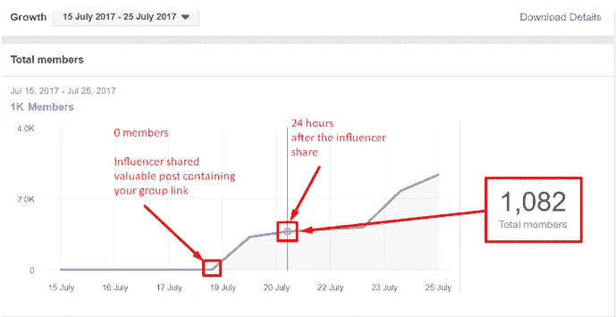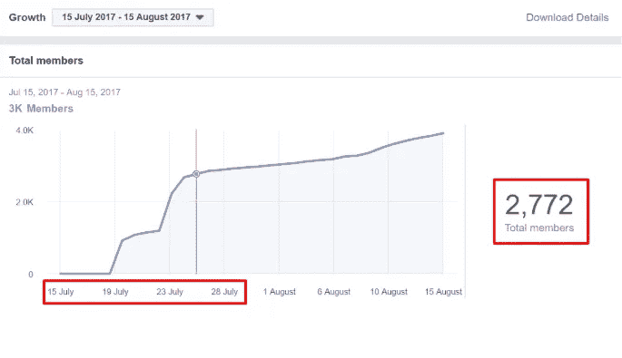

…但这一次我们需要一些不同的东西。

P.S.
[*我们在 Reportz 博客*](https://reportz.io/blog/how-to-build-and-grow-a-successful-facebook-group-in-under-a-month/) *上写了一篇完整的关于建立社区的“如何文章”，如果你想了解更多，可以查看一下。*

# 相扑

自从诺亚·哈根说了“去你的脸书”并去追求他年轻时的梦想后，相扑就成了相扑公司最赚钱的部门之一。

有趣的事实:
*在我们准备 AppSumo 的过程中，我发现了一个案例研究，其中有一些有趣的结果*

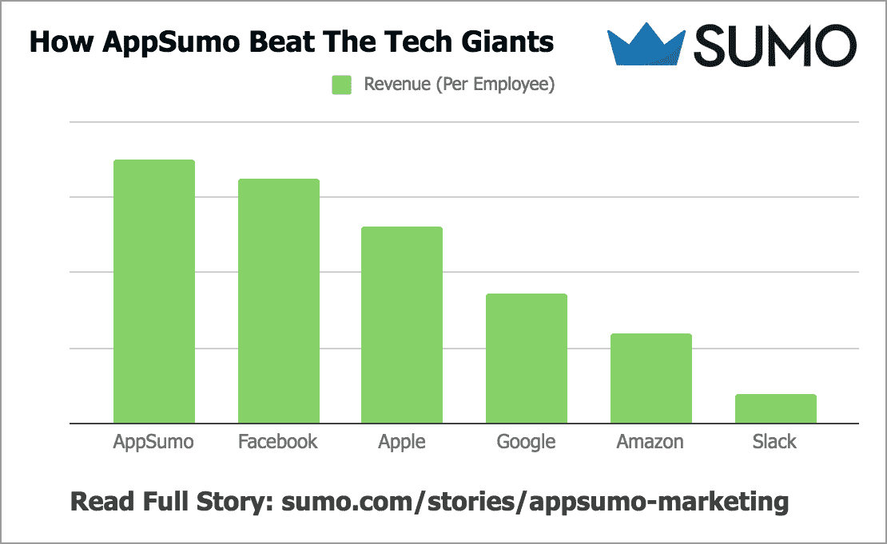

我相信你对 AppSumo 很熟悉，但如果你不知道，它基本上是一个面向企业家的 Groupon，为他们的观众提供各种 SaaS 工具的疯狂折扣…

现在，就我个人而言，我不是折扣活动的粉丝，但我不得不承认， ***在全球 100 多万名企业家*** 面前亮相是一个不错的开始。

介绍结束后，我与 AppSummo 的业务开发主管 Olman 进行了 45 分钟的通话。

一切都安排得很快，因为在打电话之前就已经做好了准备。

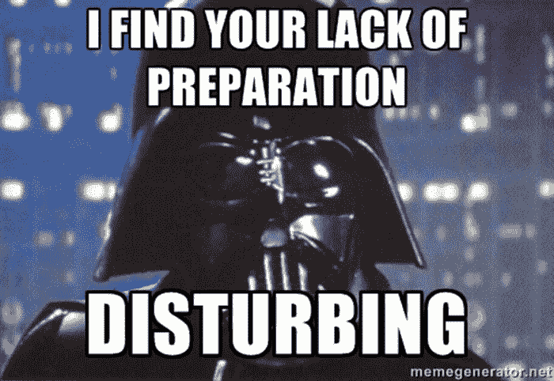

I do.

我们于 5 月 7 日上线。

注意:
我创建了一个关于我们 AppSumo 发布的专用帖子，所以我不会在这里跳到关于 AppSumo 的细节，但是…

在我们进一步讨论之前，你应该对…略知一二

## 在 AppSumo 上进行交易:

*   AppSumo 抽取 60%-70%的利润
*   他们投放广告，雇佣有影响力的人和分支机构
*   LTD(终身交易)每张优惠券最常见的价格是 49 美元
*   每次活动的平均销售额从 25000 到 35000 不等
*   平均退款率从 12%到 16%不等
*   毫无疑问，退款期限为 60 天
*   你可以提供一个“可堆叠的交易”,这样一个用户可以买更多
*   大多数观众是自由职业者和小规模团队，但也有一些例外

此外，请确保:

*   雇用和培训支持人员，因为它会变得疯狂
*   检查您的服务器状态，因为如果您没有足够的容量，它将崩溃
*   准备好与您的工具相关的所有帮助文章、材料和讲义
*   训练你的支持团队，用耐心和同情心武装他们
*   监控所有 LTD 社区，与用户互动，回答问题并为他们提供帮助
*   创建一个(临时的)公共路线图，因为很多人会要求它
*   了解特定受众，了解他们的痛点和价值

在我们的宣传活动之后，我们帮助了不少人登陆 AppSumo，让他们的产品扶摇直上。

***如果你想让我帮你相扑，请联系我*** [***这里***](https://calendly.com/ognjen-vukovic/30mintalk) ***。***

## 我们的统计数据:

*   **售出优惠券后退款率:5304**
*   **退款率- 11.69%**

而随着 [*Reportz.io*](https://reportz.io) 我们作为 2018 最佳竞选 ***落幕。***

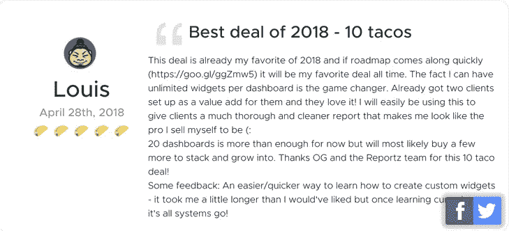

They are talking about us…

# 真值

如果你认为💸这就是你应该去看相扑的原因，你应该向上滚动一点，再读一遍我的相扑部分…

这些活动的真正价值来自:

1.  **获得巨大的曝光率和可信度**
2.  **有机会创建一个早期采用者、倡导者和分支机构社区，帮助您开展其他活动**
3.  **获得关于您的产品、集成和功能更新的评价和反馈的机会**

…为了达到你更高、更长远的目标，通常要摆脱这种波动。

# **乘风破浪**🌊

## 1.获得巨大的曝光率和可信度(统计数据通过 Reportz.io 显示)

创造这种势头对于您的拓展、合作、加盟和影响者工作至关重要…

从 5 月 1 日到 6 月 10 日，我们得到了…

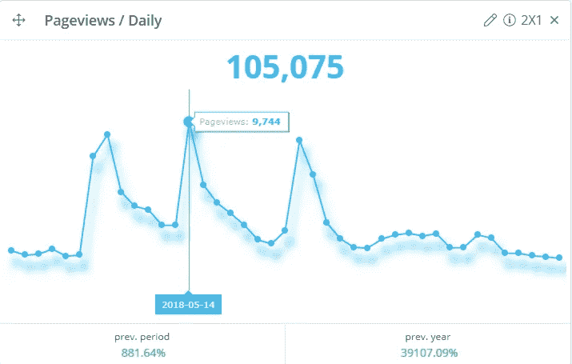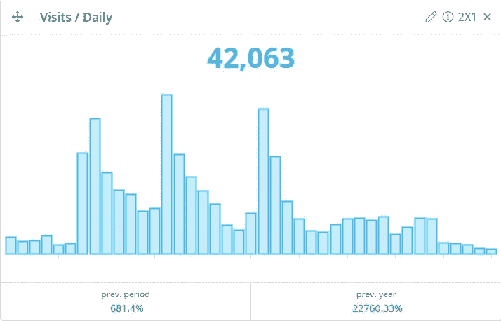

Of course I am using Reportz.io

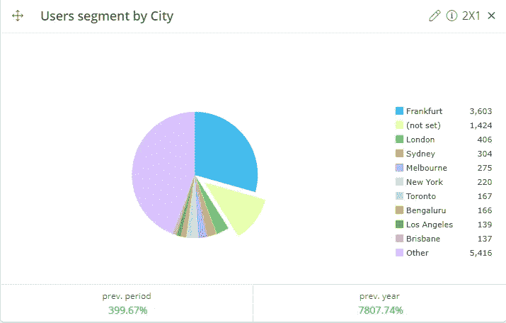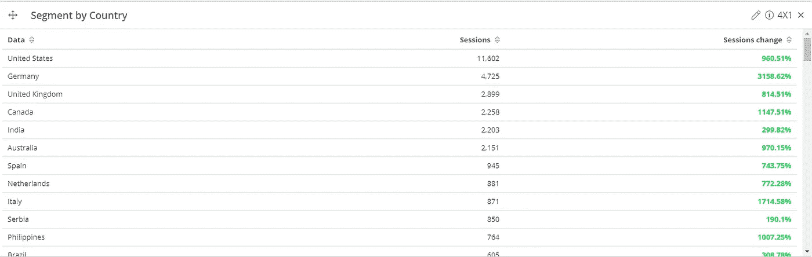

我们利用这种曝光来“推动”一些其他活动。

我的好朋友 Rad Basta 也是 Reportz.io 的首席执行官，他的文章于 5 月 29 日在《福布斯》上发表。

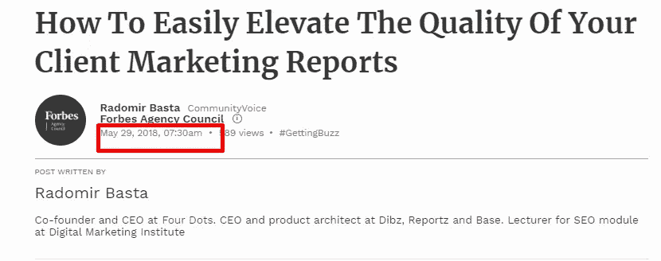

AppSumo 宣传片之后的曝光给了我们足够的可信度来拓展我们的 B2B 目标，并吸引了一些更大的鱼…

*FE。*

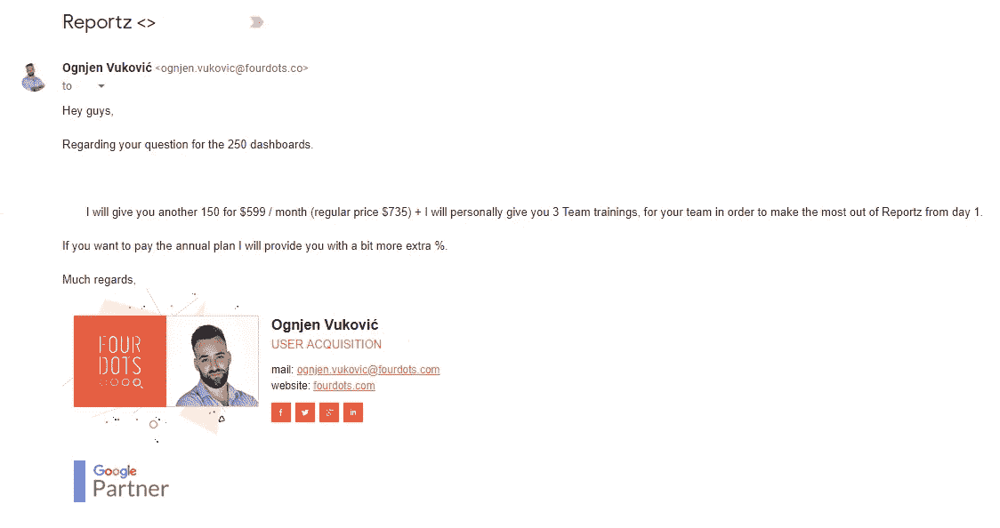

Closing big deals is fun.

*100 个常规仪表板+我慷慨提供的 150 个仪表板=每月 560 美元+599 美元= 1159 美元，仅来自这个单一用户…每年 13.908 美元，仅来自这个单一用户…*

让我和我最喜欢的一个人一起进入播客 [***LinkedIn“价值轰炸机”***](https://www.linkedin.com/in/ognjen-vukovi%C4%87-154b9210b/) [***安德烈·津克维奇***](https://www.linkedin.com/in/azinkevich/)

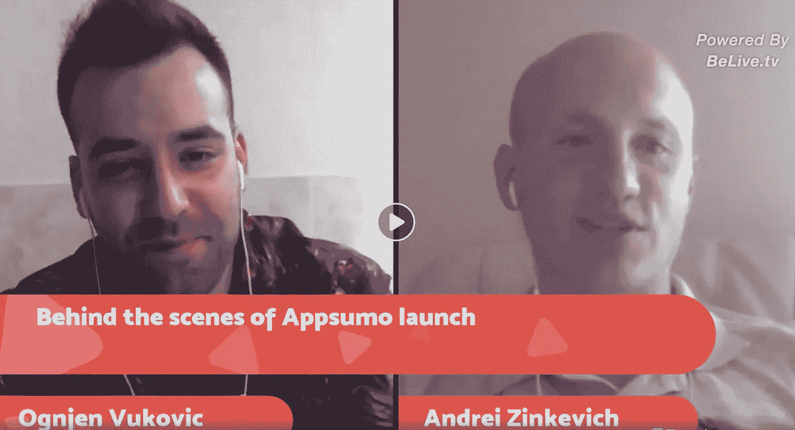

还有很多其他很酷的东西…

## 2.有机会创建一个早期采用者、倡导者和分支机构的社区，这将有助于您执行所有其他活动。

Reportz 社区从 5 名成员增长到 987 名成员，增长了 100%。

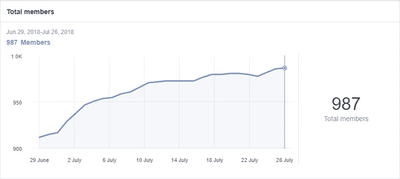

*   我们收到了很多关于如何改进标准功能的反馈…

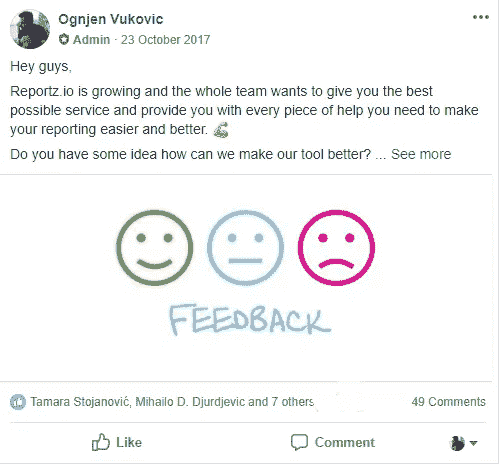

*   我们使用“社区之声”与我们计划集成的其他工具的人员取得联系…

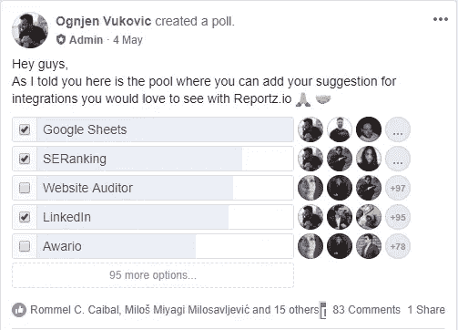

我们用它来创建第一批子公司，将促进报告…

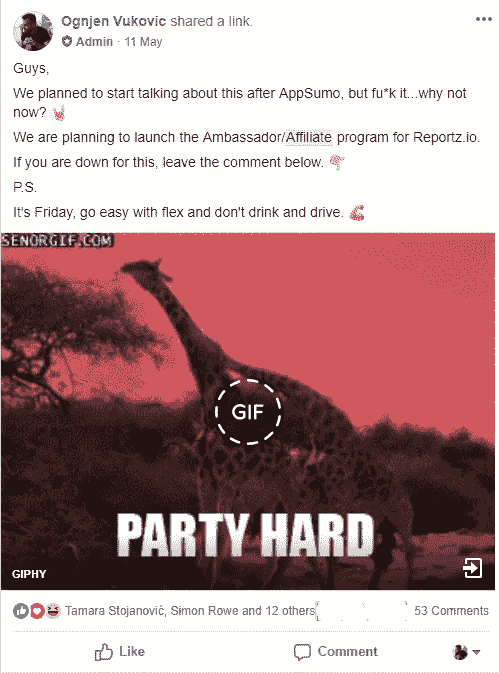

除了时事通讯之外，我们还把它作为沟通和培养人才的主要渠道之一。

此外，在 AppSumo 发布期间，以及发布后，我们得到了 100 多个测试(只列出最喜欢的)…

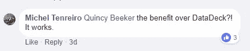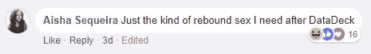

We don’t speak about competition but our users do.

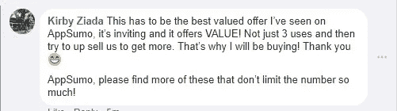

We are known as generous guys…

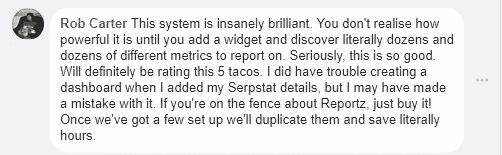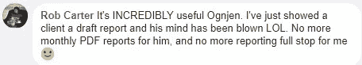

Listen to this man.

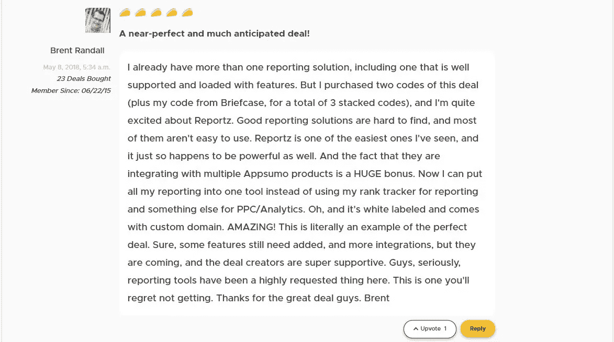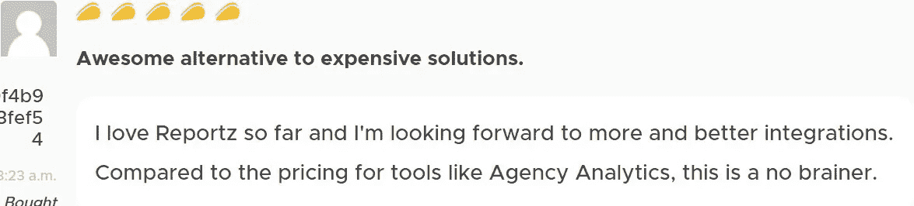

Indeed.

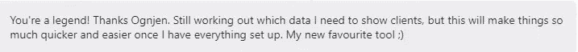

:)

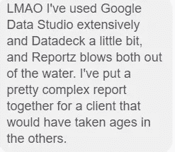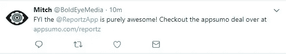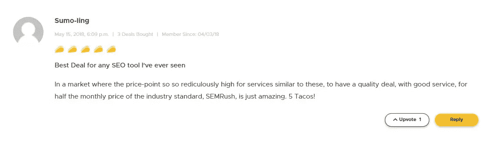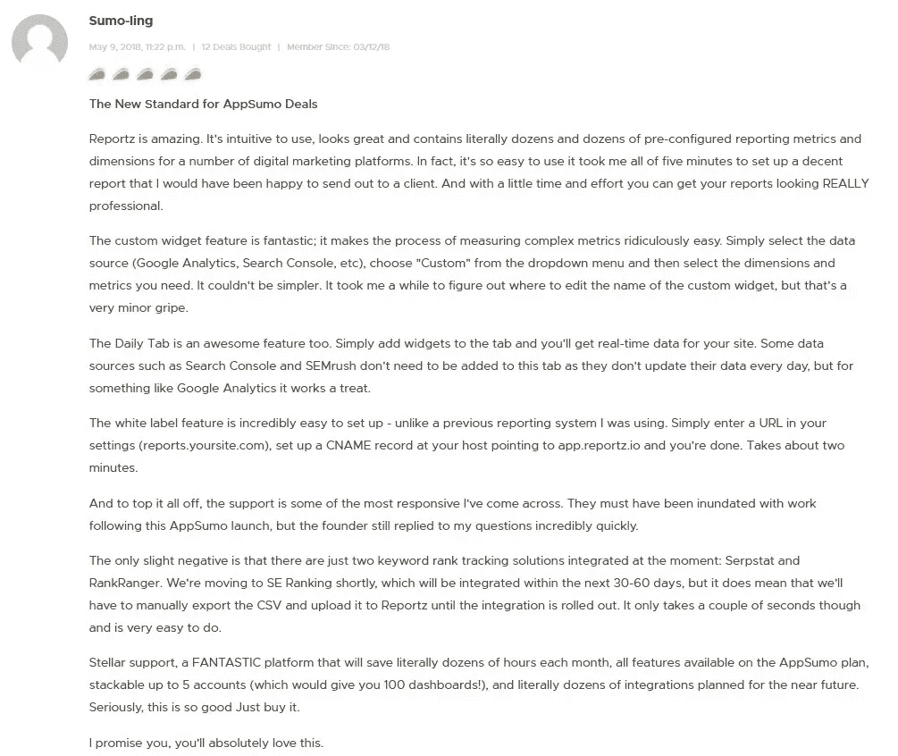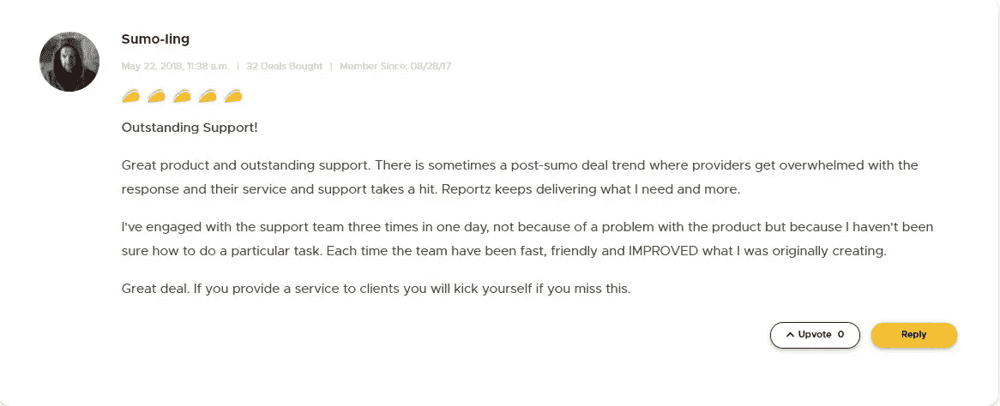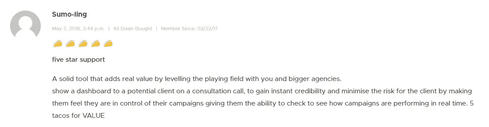

Listen to this man.

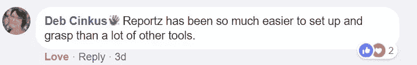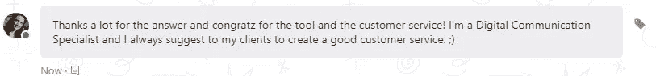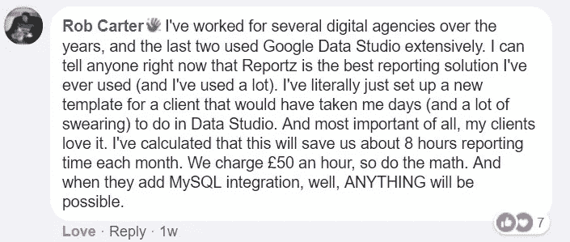

***记得我跟你说过我们行业的问题吗…***

1.  **复杂性**
2.  **价格**
3.  **追加销售**
4.  **教育材料**
5.  **客户成功&支持**

嗯，从之前的截图中你可以看到，我们成功地克服了所有这些问题……然而，最大的问题是这个工具的复杂性。

这就是为什么我们仍然和创始人们一起做 [***免费试玩。***](https://calendly.com/ognjen-vukovic/30mintalk)

30 天后，它看起来像这样…

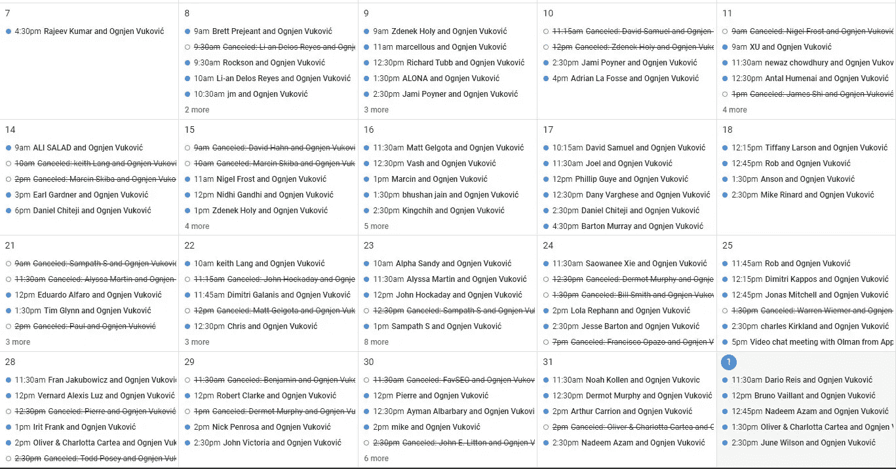

在 60 天内，我们有:

*   预订了 264 辆
*   完成了 227 次演示

在发布期间和发布后，我们有:

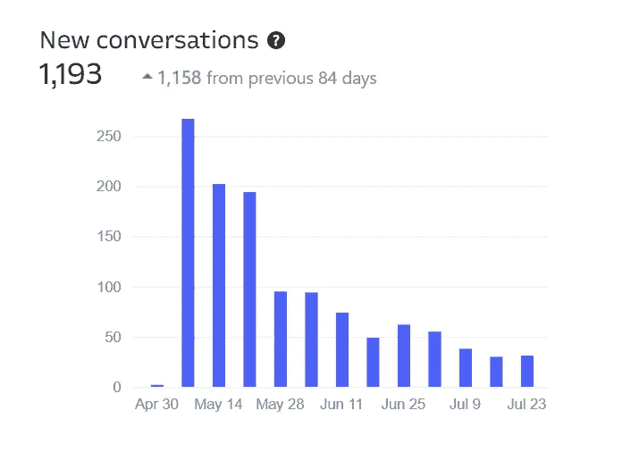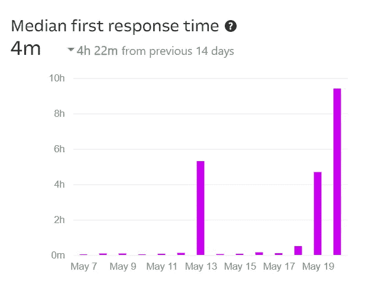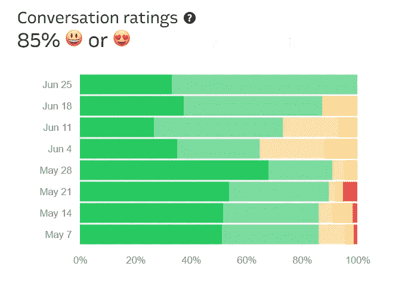

总的来说，我们真的把所有的注意力转移到了用户和他们学习曲线的缩短上。

# 结尾词。

不要把 AppSumo 当成你的利润来源。

当然你会做一些数字，但请记住，AppSumo 采取了最大的一部分+这是“一次性”付款，我们不喜欢…

相反，试着利用相扑带来的动力让你的其他动作发挥作用。

我们使用 AppSumo 及其带来的巨大影响来帮助我们执行:

*   B2B 推广活动
*   社会运动
*   与保险公司接洽和谈判
*   免费获取公关报道
*   接近并创建初始会员基础
*   壮大我们的社区
*   发展时事通讯

而 AppSumo 正是我们需要的浪潮。🌊

如果你想给 Reportz.io 一个旋转，你非常欢迎这样做。

[***一定要联系我，我会亲自带你经历一切，向你展示技巧和诀窍，帮助你让客户报告自动运行！***](https://calendly.com/ognjen-vukovic/30mintalk)

干杯！🍻