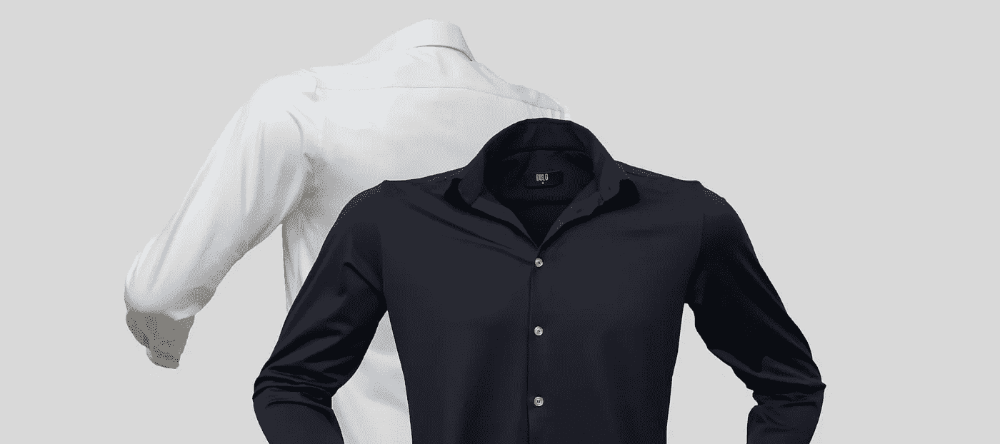

# 我们如何在全职程序员的工作中发展服装生意

> 原文：<https://medium.com/hackernoon/how-we-bootstrapped-an-apparel-business-while-working-as-programmers-full-time-574849be500f>

## *零经验入行*

Our first attempts at product photography and the images we launched with. We call it “Ghost Shirts” 👻

当我的联合创始人、前高中同学马林在谷歌社交网站(Google Hangouts)上提到这一想法时，我立刻产生了共鸣。

他当时正在回我们的祖国保加利亚的途中，这一切开始对我们有意义了。我们开始思考如何利用这个国家在裁缝方面的专业知识和传统，并致力于实现这个想法。我们看到了一个很好的机会，可以将负担得起的生产成本、卓越的质量以及回馈和重新连接我们的根的方式结合起来。

几个月前，我们在一个受欢迎的美国播客上听到一则广告，关于美国一家公司开始使用运动面料制作礼服衬衫。我们对将正装衬衫变成一种无障碍体验的想法非常感兴趣，并遵循“挠痒痒”的理念，我们希望为自己创造产品，并希望找到其他可能也想要它的人的市场。这就是 [DULO](https://weardulo.com/) 的创意是如何诞生的。

# **卑微的出身**

这个产品立刻引起了我们的注意，但是考虑到所有的进口关税和运输成本，我们最终没有购买它，但是它确实留在了我们的脑海里。

当时，我们都在阿姆斯特丹工作，全职做程序员(现在仍然如此),我们有一些积蓄，可以用来启动和自筹资金制作最初的产品。

我们还受到了 Gary Vee 的“记录与创造”概念的启发[，所以我们从第一天开始记录我们的旅程](https://weardulo.com/blog)。

我说的第一天，其实是指第一天。为了记录每一个步骤，我们在内容策略和制作上投入了无数的时间。这就是我们如何从头开始建立我们的社区，也是为什么在没有投资者的情况下，我们在推出后的第一个月就获得了 2000 美元收入的最大原因之一。我们的博客是一个详细的目录和指南，告诉任何对一个想法充满热情的人如何从零开始创业。

# **零制造经验**

所以，在我们决定完全投入并执行这个想法之后，是时候去发现在家乡创造这个产品是否可行了。

我们浏览了一些服装制造公司的在线目录，联系了最相关的公司，还有那些有网站或电子邮件的公司，你会惊讶有多少没有，我们在一周的时间内安排了尽可能多的会议，这样我们可以放下工作，飞回去见见那些可以帮助我们开始这个过程的人。

棘手的是，我们甚至不知道我们在找什么。是使用这些布料的公司，还是制造这些布料的公司？是公司生产礼服衬衫，还是我们可以在任何地方生产，只要我们有面料？

我们第一次开会的时候，大多数人都不知道我们要做什么，为什么要做。尽管如此，通过每次谈话，我们对这个行业及其流程了解得越来越多。我们对产品应该是什么样子以及它需要有什么属性有一个比较清晰的愿景，所以我们利用这些对话开始拼凑我们如何解决它的难题。

Our first ever meeting was in that white caravan at the back of this posh scene.

除了一家公司之外，我们见过的公司/个人没有一家确认他们能够创造出产品或者至少找到所需的技术面料。

给那些对开始自己的事情犹豫不决的人一个提示。

不要害怕投入到你毫无经验的事情中，边做边学，创造人际关系和环境，让人们/伴侣可以弥补你的弱点，而你专注于自己的优势。

# **有时候选择越少越好**

我们的旅行接近尾声，我们只有一个明显的选择，我们没有什么可失去的。他们同意着手为我们制作一些样品。几个月过去了，我们第二次回家看了第一批样品，说实话，这很令人兴奋。这将是我们第一次看到视觉的物理表现。

Yes. That colour. I know.

最关键的是面料，尽管颜色很糟糕，但这种材料看起来像我们想象的那样。从远处看，它们就像一件普通的棉衬衫，但你可以感觉到它的柔软和流动性。

没有任何其他的制造选择，我们握手言和，决定继续做几轮原型，最后每轮都分发出去，收集反馈，为下一轮迭代。

经过前前后后的三轮迭代，我们终于觉得我们已经具备了将高端产品投放市场所需的质量。

我们还没有为这个品牌取一个名字，但是我们希望它在这个过程中的某个时候自然而然地出现。我们有一篇博文专门讲述了我们是如何在 DULO 上停下来的，如果你感兴趣的话，可以去看看。

通常，最好的决定是在耐心等待过程出现之后做出的，通过经历和实践获得清晰。

> **简而言之，我们在 11 月 1 日推出了我们的网站，并在第一个月就成功赚了 2000 欧元。**

# **外卖时间**

*   从第一天开始发布内容，我们就可以在发布前建立(即使是小规模的)受众。什么都比发射蟋蟀强；)
*   三轮原型和大约 60 件发给测试人员的衬衫在我们发布后就产生了销售，以及帮助我们迭代、改进和准备产品市场的反馈。

On set of our first ever professional product shoot. We did two DIY ones with a total budget of $200 before this one. It was about time we invested in a proper one :)

*   这也是一个很好的数据点，与产品互动的人喜欢它，并愿意为它付费。这极大地鼓舞了士气，也证明了我们产品的概念。
*   期待在高潮时启动，然后进行几个月的现实检查。坚持下去，我们现在开始看到有机增长，无论是在销售方面，还是在关注我们内容的人方面。
*   我们没有在数字广告上花费太多美元，而是专注于以[播客](https://weardulo.com/podcast)、 [vlog](https://www.youtube.com/watch?v=D_shr4AHytU&list=PLkbellABjPjULjohHD93GiekEdCRQBARt) 和[博客](https://weardulo.com/blog)的形式创建内容，并向我们敬仰并希望与 DULO 合作的企业家发送免费衬衫，也就是影响者营销。

我们希望创建一个鼓励和促进企业家精神的品牌，事实上，我们在没有任何外部投资和任何行业经验的情况下成功实现了这一目标，这证明了更多的人可以做到这一点，只要他们决定致力于一个想法，最重要的是，长期持续地投入工作。

对于任何想开始的人来说，储存耐心和纪律，然后开始吧！你会在前进的道路上发现它，即使一开始你没有发现它，失败只是你可以建立并继续前进的数据点。