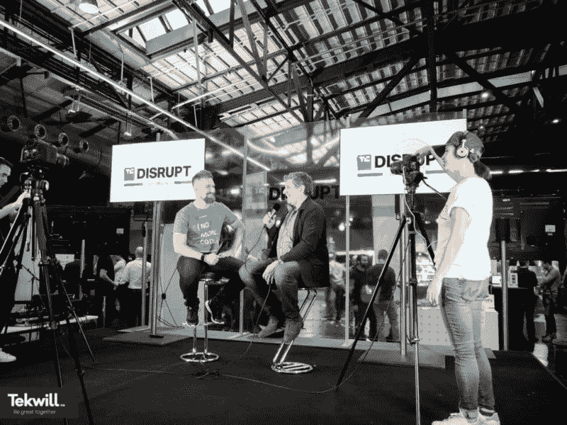

# 我们如何在两年内将我们的无代码 Web 开发创业公司发展成一个 20 人的团队

> 原文：<https://medium.com/hackernoon/how-we-bootstrapped-our-no-code-web-development-startup-to-a-team-of-20-in-2-years-5d12f84f9824>

**TL；博士**

这篇文章是关于我们如何在一个全新的无代码 web 开发领域中引导 [Zeroqode](https://zeroqode.com) 的。利用 DIY、广泛的社区支持、超高效和实惠的营销，我们将我们的开发店从 3 个人发展成了一个 20 人的公司。这篇文章讲述了我们如何运行两个并行品牌的无代码服务和无代码产品。我们如何在不到两年的时间里成为无代码 web 开发领域的全球领导者，以及我们在这个过程中学到了什么。

**背景**

从 21 岁到 32 岁，我经营着多项业务，其中大部分都是线下业务。32 岁时，我决定休息一年，事实上这持续了几年。在此期间，我把大部分精力花在了自我成长和东方实践上，之后我决定是时候再次做些真正的事情了:)。

2015 年，我有了一个小众社交网络的想法，但继续开发了一个在我看来更简单的产品——冥想应用。我花了大约 50，000 美元建造它，回报很少(在这里阅读更多关于这个)。因为这次糟糕的经历，我再也不想为了实现一个[创业](https://hackernoon.com/tagged/startup)的想法而雇佣开发人员了。

**这个想法是如何诞生的**

有一天，我收到了 Product Hunt 发来的简讯，其中介绍了[Bubble](https://bubble.is/?ref=9BJPDWAH)——一个易于使用的无代码应用构建平台。我很感兴趣，决定试一试泡泡。起初，他们的高价让我望而却步。当时，Bubble 是按访问人数收费的。我心想，如果我打算开发的应用程序变得非常受欢迎，我每月的开销将会增长得太高。当我几个月后回来查看时，他们改变了定价策略。他们的收费模式现在是按工作流收费，而且变得更加实惠。(最近，Bubble 再次改变了他们的定价，现在他们的每月计划仅从 14 美元/月开始。)

这才是我真正开始学习平台的时候。我很快浏览了他们所有的基础教程，发现这个构建器非常容易使用。我只用了一周时间就完成了我的应用程序，大部分时间我都在打磨 UI，而不是构建核心功能。

在这样做的过程中，我意识到我对构建过程比对应用程序本身更感兴趣。这就是我的想法——为他人构建没有代码的应用程序会很酷！

我惊讶地发现，没有其他公司专门致力于不用代码构建应用程序。我联系了 Emmanuel Straschnov([Bubble](https://www.indiehackers.com/interview/bubble-c5e87bdbf9)的联合创始人)，询问他们是否有兴趣让我们成为 Bubble 的合作伙伴，并提供基于他们平台的无代码 web 开发服务。事实上，他们很快就会推出他们的合作伙伴计划，这是我接近 Emmanuel 的最佳时机。

我决定建立一个登陆页面，因为我的设计技巧很糟糕(老实说，现在仍然如此)，我找到了一个自由设计师，他花了 200 美元制作了草稿。

我认为这是我投入这项业务的唯一投资(嗯，加上域名)。我给这家公司取名为 [Bubblewits](https://bubblewits.com/?utm_source=BlogPost&utm_medium=Blog&utm_campaign=BootstrapPost) ，因为我想重申我们专注于使用 Bubble 进行 web 开发——我认为这会让一家“新手”公司在潜在客户眼中更加可信。

我独自开始泡泡糖，但大约 7 个月后，弗拉德·拉林加入了我。我们在一个共同工作的空间相遇，我们是那里的居民。弗拉德和我共用一张桌子。

在我之前的业务中，我从未有过联合创始人，我更喜欢独角戏。这一次，我明白了有一个你可以依赖和分担责任的伙伴是很棒的。

一开始，我们专注于定制开发服务，仅几个月后，我们构建并发布了第一个无代码应用模板，这成为了 [Zeroqode](https://zeroqode.com/?utm_source=BlogPost&utm_medium=Blog&utm_campaign=BootstrapPost) 的基础。

获得客户本身就是一个完整的过程，我们必须想出创新且廉价的方法来找到他们。这就是与 Bubble 的官方合作派上用场的地方。我们的大量客户是从 Bubble 的合作伙伴页面推荐给我们的。此外，我们在泡泡论坛上一直很活跃。我们通过发布在 Bubble 上构建复杂事物的技巧和解决方案来帮助其他用户，并发布我们构建的新产品的更新，如模板和插件。

出于更好地推广我们产品的需要，我们将 Zeroqode 从 Bubblewits 分支。在 Zeroqode 之前，Bubble Template Marketplace 页面是展示我们产品的唯一地方。随着越来越多的模板被其他用户发布，页面变得过于拥挤，因此结构对我们不利。我们在寻找一种更好的方式来接触我们的客户，并解释产品如何工作以及它为什么有用。

我们通过展示我们的模板推出了 Zeroqode，然后更多的产品(如[插件](https://zeroqode.com/plugins?utm_source=BlogPost&utm_medium=Blog&utm_campaign=BootstrapPost)、[无代码后端](https://zeroqode.com/backends?utm_source=BlogPost&utm_medium=Blog&utm_campaign=BootstrapPost)和[网络到原生解决方案](https://zeroqode.com/native?utm_source=BlogPost&utm_medium=Blog&utm_campaign=BootstrapPost))一步步被添加到我们的产品组合中。后来，我们开始展示[精选资源](https://zeroqode.com/courses?utm_source=BlogPost&utm_medium=Blog&utm_campaign=BootstrapPost)来教授如何构建 Bubble。

我们所有的产品都旨在帮助我们的客户将应用开发速度提高 10 倍。例如，无代码应用程序模板易于设置且价格合理，它们具有内置功能和可靠的更新。这些不只是简单的设计模型，而是完整的、功能齐全的、响应迅速的网络应用程序，主要是再现众所周知的、经过验证的网站或应用程序的功能。模板可以在没有代码的情况下进行修改，以更快的速度和更低的成本推出任何产品。我们已经发布了几十个模板，并在继续构建更多的模板——从类似于 AirBNB、Linkedin、Instagram、Trello 的模板到后端和 Telegram 机器人。我们的目标是让 Zeroqode 为复杂的网络应用程序服务，就像 Themeforest/Wordpress 为简单的网站服务一样。

**对 Zeroqode 的自举效应**

自举从来都不是一种有计划的方法。在我们的例子中，这更像是一种环境——它自然发生了。当我想到创办公司所需的资源(登录页面和域名)时，我意识到我只需要几百美元，而且我知道我自己能负担得起这笔费用。我不确定整个想法是否可行，所以这只是一个非常成功的实验。

我以前的生意都不是自举的。我的第一家创业公司是一家销售电脑和提供 IT 服务的 IT 公司。为了筹集运营资金，我从父母那里贷了一笔款，后来又从当地银行贷了一笔更大的款。我的另外两项业务是通过回拨和服装零售业务与长途电话提供商相关的。对于这两者，我都经历了同样的过程。所以自举对我来说是新的。

自举让我们在决策过程中有了更多的灵活性和自由度。我们能够专注于带领公司实现我们作为一个团队共同设定的目标。在筹集资金时，投资者通常会用他们对你的业务的愿景来模糊你的目标。

自举是一种有效的方式来满足我们对正确做生意的渴望。它促使我们想出快速和创新的方法来提高效率。它激励我们在最短的时间内做好我们正在做的事情。我们没有多余的资源浪费在错误上。当我们失败时，我们从失败中学到了很多，只是因为它更痛苦。例如，当你获得投资时，你有足够的资金来立即雇佣一个团队。我们在 2016 年 5 月推出后仅 3 个月就雇佣了第一名员工。我们的第一位员工是安娜——一位伟大的设计师，她从未做过任何编程或编码工作。她很快学会了这个平台，现在是我们最熟练的泡泡设计师/开发者之一。

我们是世界上第一家(现在仍然是)培训设计师不用代码就能构建功能性应用的公司。通过这种方式，一个人可以构建所有东西——设计、数据库结构、工作流、API 等..我们非常谨慎地雇佣员工，并且只在我们能够负担得起的情况下雇佣，但是随着我们业务的增长，我们已经能够从 2 人的团队发展到 20 人的团队。

另一个相关的例子是营销。如今，任何初创公司面临的主要挑战都是营销和推广。获得融资的创业公司可以分配大量的营销预算。因为我们负担不起，我们不得不寻找游击营销的替代品，不会花我们太多。

**我们的游击营销策略**

他们说你需要花钱来赚钱，大多数情况下这是真的。但是，当你决定启动你的创业公司时，通常只有非常有限的预算可以花，或者在营销上花钱可能根本不是一个选择。在这种情况下，我们不得不发挥创造力，提出高效且符合预算的营销解决方案。

当我在开发 Zenify——冥想应用时，我了解到在[产品搜索](https://www.producthunt.com)上发布是流量和新用户的一个非常重要的来源。因此，我们也在产品搜索上推出了 Zeroqode。发布会很成功，我们获得了日徽章的第三名产品，这给了我们显著的流量提升(阅读更多关于[我们如何在产品搜索](https://blog.zeroqode.com/how-we-got-800-upvotes-on-product-hunt-and-made-it-to-3-product-of-the-day-aec06eeb7e84?utm_source=BlogPost&utm_medium=Blog&utm_campaign=BootstrapPost)中获得 800+的投票)。我们还推出了我们的新模板和产品搜索辅助项目，以收集反馈并让社区了解我们的新闻。我们建立的最成功的附带项目之一是 [Postman Collections](https://postmancollections.com?utm_source=BlogPost&utm_medium=Blog&utm_campaign=BootstrapPost) ，它是 Postman tool 最大的 API 集合库。这个项目是建立在我们的[产品狩猎克隆模板](https://zeroqode.com/template/daily-hunts-like-producthunt-1507812247305x257803851702206460?utm_source=BlogPost&utm_medium=Blog&utm_campaign=BootstrapPost)仅用了 2 周。我们还在[设计师新闻](https://www.designernews.co)和[黑客新闻](https://news.ycombinator.com)上发布了我们的新产品，以获得更多关注。

为了更好地吸引观众的注意力，我们发起了两个“最佳创业创意”竞赛，并向第一名、第二名和第三名分发了模板。我们在[独立黑客](https://www.indiehackers.com)、 [Reddit](https://www.reddit.com/) 、 [HackerNews](https://news.ycombinator.com) 和[我们的论坛](https://forum.zeroqode.com?utm_source=BlogPost&utm_medium=Blog&utm_campaign=BootstrapPost)等平台上公布了比赛。

在国际会议上展示你的创业也是让世界了解你自己的好方法。我们得到了当地支持组织的赞助，在柏林科技博客 TechCrunch Disrupt 上展出。在大会上，我们获得了一个名为“外卡”的奖项，这让我们有机会接受 TechCrunch 新闻门户网站的采访，并获得全球曝光率(阅读 [TechCrunch 关于我们的报道](http://tcrn.ch/2msrjoC)，并了解更多关于[我们如何在柏林的 TechCrunch Disrupt 上获得外卡](https://blog.zeroqode.com/how-we-won-the-wild-card-at-techcrunch-disrupt-berlin-and-got-interviewed-by-techcrunch-9927f5fdb12b?utm_source=BlogPost&utm_medium=Blog&utm_campaign=BootstrapPost))。

我们参加的另一个会议是迪拜的 STEP，这使我们能够进一步扩大我们的受众，并与来自一个全新和独特地区的潜在客户和合作伙伴建立联系。

**zero qode 发展的未来**

在分析公司应该向何处发展时，我们决定继续致力于自举。我们不需要大的预算，除非我们选择在营销上花很多钱。幸运的是，我们的游击战略对我们很有效。目前，增加投资会分散我们经营业务的注意力，迫使我们处理获得资金所需的所有手续和程序。此外，我们不想放弃对公司和决策过程的控制。

然而，当我们达到下一个级别时，我们将修改我们的业务战略，并根据当时的情况及时做出新的决定。

**吸取的教训**

自举并不适用于所有的初创企业。自举的决定不一定是唯一的方式，也没有理想的资本结构来发展公司。

一些公司从创业开始，然后融资。有些从未筹集资金，而其他人没有投资就没有机会。如果你有一个颠覆行业的巨大机会，而快速执行和资本是你成功的核心，那么寻求投资可能是唯一的途径。自举正好相反。

在决定是启动还是寻求投资时，考虑你的优先事项、机会和市场动态。然后，做出符合你的情况的明智选择。我们做出了自己的选择，到目前为止，这种选择对我们非常有效。

**加入我们的** [**简讯**](https://zeroqode.com/subscribe) **不定期接收关于构建产品和无代码创业的提示。**

