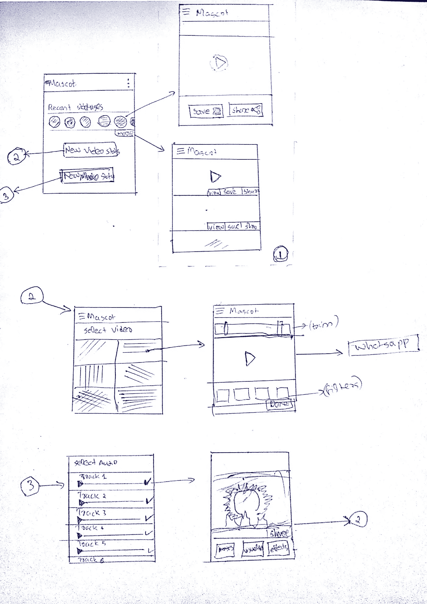
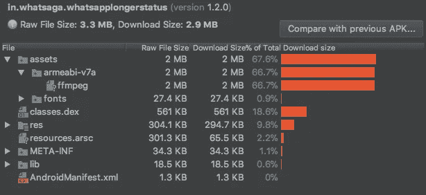

# 我们如何将应用程序的大小从 31 MB 缩减到 2.6 MB，以及它教会了我们什么

> 原文：<https://medium.com/hackernoon/how-we-brought-down-the-size-of-our-app-from-31-mb-to-2-6-mb-and-what-it-taught-us-3a75963317f9>

## ***TL；当涉及到你的产品质量时，不要固执己见。***

四周前，我在 Play Store 发布了我的第一个应用[。在谈到故事的细节之前，先介绍一下背景。](https://goo.gl/nvjNRc)

我是政府工程学院计算机系四年级学生**伊尔沙德**。在过去的几年里，我一直致力于编程和应用程序开发。

故事开始于大约 5 个月前；当有一天，大二的**阿图尔·奈尔**跟我说，他想学 Android 应用开发。

学习任何东西的最好方法实际上就是去做。我的建议是先做一个简单的 Android 应用，然后在这个过程中学习。我加入了一个应用程序的陈词滥调。

> **一个老生常谈的想法……**

一个应用程序，只显示其他 WhatsApp 用户的最近状态，并可以选择分享和保存。
用户可以向 WhatsApp 发布超过 30 秒的视频。
用户可以通过添加定制的可视化和图像来发布音频状态。
NB: *WhatsApp 状态功能当时还年轻。所以这听起来是个好主意。*

> **于是我们开始制作！**

这是我那天画的整个应用程序的草图。

*(我们代号 it 项目吉祥物；不知道为什么*😂 *)*

***Excuse my bad doodling skills combined with terrible handwriting 😁***

> **又发生了什么？**

嗯，我们把任务分成三份。

1.  "最近"
2.  "视频状态"
3.  "音频状态"

我最初的兴奋和热情使我在 2-3 天内建立了“最近”功能，因为这对我们来说是一个相当简单和熟悉的任务。

然后我开始协助 Atul 开发视频状态功能。由于我还有其他几个项目，大部分时间我只研究 Android 视频库之类的东西，而他则尝试一些实际的代码。

> **“视频状态”功能完成..但是等等…**

是的，他是一个很好的学习者，在一周内，他给我发了一个 apk，有我们谈论的视频分割功能！一切都很顺利，但只有一个问题！

> **apk 大小 31 mb，我根本不接受。**

我们决定使用著名的 [ffmpeg](https://www.ffmpeg.org/) 库进行视频处理。最简单的方法是通过编写命令来使用著名的 [Ffmpeg-Android](https://github.com/WritingMinds/ffmpeg-android) 库。我们使用最初的[预建库](https://github.com/WritingMinds/ffmpeg-android/releases/tag/v0.3.4)，它本身超过 27 mb。这导致了 apk 的巨大规模

我告诉他，我们应该努力，尽可能减少它。

经过更多的研究，谷歌搜索和几个星期后，他又来找我，apk 大小现在是 ***18 mb*** ！。这款应用的工作原理和以前一模一样。他遵循[这个](https://github.com/WritingMinds/ffmpeg-android-java/issues/66)并且只包含了 armv7 版本的 ffmpeg，这有助于将应用大小减少一半。

所以我说好吧。这很好！但是还不够好！我告诉他…

> “应用程序大小应小于 5 MB。否则，人们不会下载它，因此，我们不会发布它。”

我对此很固执。我向他展示了 Play Store 中的一些视频编辑器应用程序，它们只占用不到 5 MB 的空间，我说*“如果他们能做到的话；为什么我们不能？”*

所以我们又开始了，但是这个项目拖了很久，因为我们都忙于学术和考试。

> 有一天，他给我发信息说他把它的容量降到了 10 MB 以下！(我告诉过你这家伙不错)

好的，这就够了..但是 ***我很固执*** *。我研究了一些本地开发的东西和方法来为 Android 编译我们自己的 ffmpeg，只有基本的特性。没有一件事做得好。*

时间过得很慢，日子一天天过去。有一天，他告诉我一个好消息

> 他做到了 2.6 MB！(比最初的小 12 倍！！！)

他也很固执！..他在互联网上彻底研究了这个问题，找到了正确的解决方案。基本上他找了个原生 C++编译。所以文件的 ffmpeg 与最少的功能，包括我们想要的功能。它是 4 MB。然后他把它压缩成只需要 2 MB 的 aar。下面是对 1.2 版 apk 文件的分析。

*(哎呀..其实就是****2.9 MB*******现在*** *最新更新后包括支持 WhatsApp for Business)**

**

*Package analysis of WhatSaga version 1.2.0*

*我们还使用了 proguard minify 和 drawable optimisation 等功能，这样其他资源就不会占用太多空间。事情进展得更快了，我们没有等到创建“音频状态”功能*。我们在几天内就在 Play Store 上发布了我们的应用程序！！*

*我们把它命名为 **WhatSaga， *(*** *因为这个名字很像 WhatsApp，而* ***Saga*** *的意思是* ***更长的故事*** *这是我们的主要特色！。)*如果你是好奇型的，一定要看看我们的应用:[https://goo.gl/nvjNRc](https://goo.gl/nvjNRc)*

> ***“好的。所以呢？”***

*让我们来看看我写这篇文章的原因。想象一下，如果我不固执的话！我可能会满足于 10-15mb 的解决方案，甚至更糟。这与 2.6 兆字节的相比是很糟糕的*

*你可能会问，在用户拥有千兆字节内存和带宽的现代手机中，应用程序的大小真的如此重要吗？*

> ***答案是肯定的！。应用程序大小比你想象的更重要。***

*如果你有两个应用程序在相同的用户界面上做同样的事情，其中一个比另一个稍微重 3-4 MBs，你会选择哪一个？答案显然是较轻的那个。**更少的应用程序大小= >更多快乐的用户***

> *那么，我从中学到了什么？*

## *要固执！*

*耶！！对你正在制作的任何东西的质量要固执己见。无论是**设计、** **执行时间**还是**视觉质量** **和外观、**任何东西；固执己见，把自己和团队推向极限。在你的产品达到你想要的质量之前，不要放弃。*

*如果你已经读到这里，感谢你阅读这篇很长的文章。这是我第一篇关于媒体的文章，所以请原谅我的错误，并给我反馈和建议:)。[考虑在 twitter 上关注我，了解我即将发表的文章的更多更新](http://twitter.com/irshadshalu)。谢谢大家！！*

*如果你想了解完美主义的一个极端版本，请查看 [**为什么 iPad 从来没有附带计算器应用**](https://www.cultofmac.com/421893/why-the-ipad-has-never-shipped-with-a-calculator-app/)*