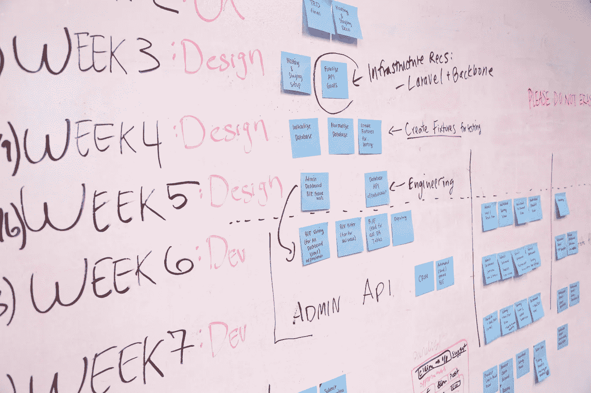

# 我们如何在一周冲刺中打造我们的 SaaS 产品——原始产品 Ep。2

> 原文：<https://medium.com/hackernoon/how-we-build-our-saas-product-in-1-week-sprints-raw-product-ep-2-4e9f6cf78b02>

## 我们如何在 GreenShoot Labs 划分我们的一周，这如何与我们的长期目标和计划联系起来，以及一些关于短时间 1 周短跑的利弊的个人想法。

在 Raw Product 的最后一期中，我们谈到了我们在 Slack store 上的经验以及从中得到的一些教训。在这一集里，我将分享我们如何组织我们的一周，尝试用混合的 Scrum/Kanban 方法将长期目标和短期反应结合起来。

通常的免责声明适用。这就是我们做事的方式——而不是做事的方式，并且它适用于我们当前的团队规模(一个小型的、集中的、分散的 6 人团队)。我发现阅读其他团队如何处理这些问题非常有用，所以希望这是一种为我从中获得的知识和经验分享付费的方式。

# 大图—目标和计划

在进入一周之前，有必要看一下更大的图片。除了我们的战略愿景，我们还为自己设定了月度和季度目标以及可衡量的结果。然后，这些转化为具体的计划(更大的、连贯的工作)和对我们想要为任何计划投入多少时间的理解。

例如，我们当前的目标之一是让 SaaS 应用程序变得可购买！

是的，我知道这是一个非常基本的 SaaS 工具。我们很早就推出了，并没有太担心人们会如何支付我们。我们拼凑了一些稍微合理的价格，使用了 [Laravel Spark](https://spark.laravel.com/) 和 [Stripe](https://stripe.com) ，因此我们可以接受付款，但几乎没有触及任何开箱即用的设置。现在，我们知道人们确实对该工具感兴趣，他们甚至愿意完成最基本的支付流程，我们准备投入时间来使支付流程变得愉快、更有意义，并激发对我们服务的信心。这意味着替代价格计划的正确建模和支持这些计划的技术的实施，与我们当前品牌一致的设计，以及一个让人放心的过程(这也意味着正确理解在整个欧盟收取增值税(销售税)的乐趣)。这些要点也大致转化为将支持使应用程序可购买的总体目标的计划。

顺便说一下，我们最近已经把我们的计划推进到[啊哈！](https://www.aha.io/)。我们发现它是一个非常全面(即使有些复杂)的工具，现在它非常适合我们的方法。以至于我们直接采用了它的许多产品术语(如目标、计划、想法、特性等)。

好了——大图基本就绪，让我们看看一周是如何形成的。

# 星期一

## 发布、分析、重新规划(如果需要)

我们尽可能经常发布，但周一是“官方”发布日。任何在上周没有发布，但通过了所有代码审查、测试和质量保证阶段的东西都将在周一发布。负责发布的人将此作为一天的主要任务，而其他人可以在问题出现时加入——否则人们就开始他们的 sprint 任务。我们希望有一天能够自动化更多的这些方面，这样发布就不是某个人必须负责的事情，但是我们还没有做到。

周一也是我们集中分析前一周反馈的一天，并将其转化为行动。我们使用 Google Analytics、Hotjar、New Relic 等工具以及我们自己的应用参与度指标。

有了现成的数据，我们就可以审查我们的计划，并决定是否需要进行任何调整。我们问自己这样的问题:

1.  我们是否看到了之前发布的特性的预期结果？
2.  是否有任何新的数据/理解指向要开发的不同功能或目标或计划的变化？
3.  是否有任何基础设施、安全问题需要明确关注？
4.  从技术和 UX 的角度来看，是否有任何更大的工作需要重新思考，因为它们已经进行得更深入了？

这是一个有效过程的关键是，我们都非常开放，愿意接受我们上周认为绝对最佳的行动方案可能不再是那个方案。

> **观点松散**无疑正在成为绿芽实验室文化的一个定义性方面。

# 星期二和星期三

## 开发、设计、模型、讨论、计划

星期二和星期三是完成事情的日子。它是深入的、不间断的创造和适当的合作的结合。这意味着编码员编码，设计师设计，UXers 模型，规划者计划，我们都分享想法，互相支持来完成工作。

到周三下午，我们应该已经发布了几个新功能，有了新功能的模型，并有了下周的具体任务计划。

# 星期四

## 反馈

到周四，我们的目标是完成足够多的工作，以便其他人可以对其进行反馈。我们可以讨论功能的技术挑战，并提供关于模型的反馈。虽然不容易，但我们的目标是为下周的工作做到这一点，这样我们就有时间在自己的大脑中酝酿想法。

# 星期五

## 总结、回顾、回顾并计划下周

到周五，我们将结束我们的冲刺。我们回顾已经完成的工作，我们将要发布的内容，留在板上的内容，以及根据可用性移入板上的新项目。我们对这一周进行回顾，找出哪些做得好，哪些做得不好，以及我们要改进的地方。

# 好的，坏的和丑陋的

我描述的周线图是一个有点理想化的版本。我们试图尽可能地坚持下去，但如果事情不总是这样，我们也不会自责。我们是一个小团队，我们需要处理任何出现的问题。总的来说，以下是我对这个过程的一些想法:

1.  一周短跑节省了我们很多时间。我们是一个小团队，我们经常交流。我们仍然发现事情可能会偏离轨道。如果我们没有 1 周的冲刺，这些偏差实际上会很昂贵。一周冲刺迫使所有的工作和计划单元变成更易管理的部分。
2.  **我不确定它将如何扩展到更大的团队。**在参加 GreenShoot Labs 之前，我几乎只进行 2 到 3 周的短跑训练。此外，许多工作是在一个为客户服务的机构内部进行的。我不敢想象必须以这种速度与一个有多个利益相关者的大团队一起运行。话虽如此，我还是很不情愿地回到更大的冲刺阶段。
3.  **这种速度令人筋疲力尽，令人难以置信。**一个流传的笑话是，当我们快到周末的时候，总会有人不变地弹出来说“我不敢相信已经是星期五了”。我喜欢这样。
4.  与生活其他部分的平衡至关重要。为了能够跟上步伐，我们需要……调整自己的步伐。几个月前，我经历了几周更加紧张的工作，以获得更多的东西，但很快就缩减。这是不可持续的。

我的(显而易见但不太容易实现的)学习:

> 创建一家 SaaS 公司(尤其是自举公司)是一场马拉松。毅力和连续性远比在一团火球中燃尽重要。

这是我们的一周。希望听到你的想法和建议，如果你有类似的帖子，请添加到评论中。

[GreenShoot Labs](https://greenshootlabs.com) 打造使用自动化、数据和对话界面的产品，让团队更快乐、更高效。

我们的第一款产品发布在 Slack 应用目录上— [TeamChecklist](https://slack.com/apps/A8N5U44CA-teamchecklist-tasks-and-reminders) 通过自动通知和报告，让您的团队更好地完成通用、可重复的流程和任务。