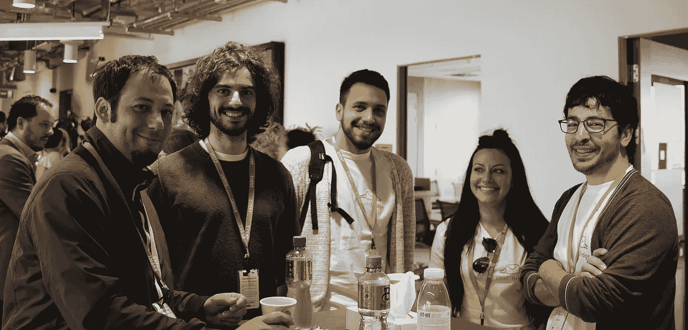
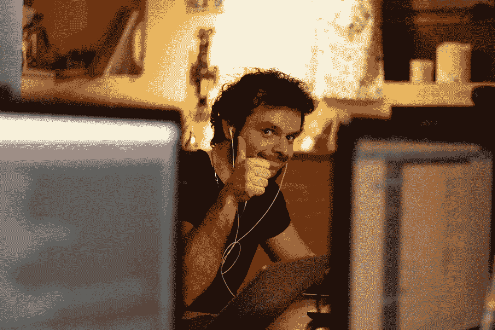
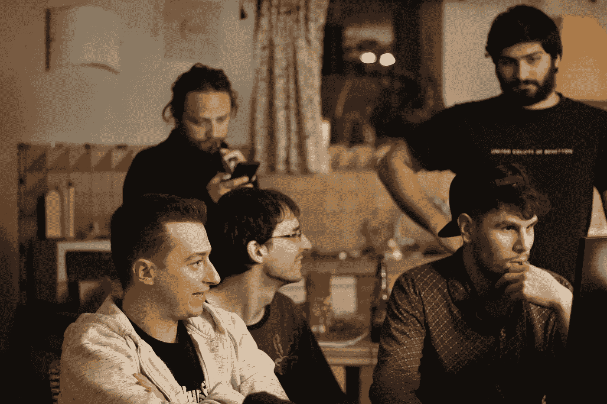

# 我们如何在几乎没有资金的情况下，在 8 个月内建立了一个 25 人的团队

> 原文：<https://medium.com/hackernoon/how-we-built-a-25-talents-team-in-8-months-with-almost-no-money-d8732465a41f>

大约两年前，我和我的合伙人亚历克斯一起创办了 LeadsBridge，作为另一家公司的副业，但我们很快意识到它的命运比我们想象的要大得多。

仅仅过了 100 天，业务增长如此之快，以至于我们再也无法独自应对。

**我们需要雇用其他人。**

但不仅仅是*任何其他人。*

我们需要雇用愿意为我们的项目付出血汗和眼泪的人才。会像创始人一样思考和行动的人。

尽管如此，我们没有太多的钱可以提供，也没有其他的经济利益:尽管业务在增长，但我们仍然在自力更生。

萦绕在我们脑海中的问题是:

> 我们如何提供价值来吸引最优秀的人才与我们合作？
> 
> 我们如何吸引专业人士加入我们的项目？

一旦我们设法让他们上船..

> 我们如何让他们长期和我们在一起？

我们必须随机应变。

很快，我们意识到，我们唯一的选择是利用其他非常令人向往但极其罕见的工作条件。

经过几周的头脑风暴，我们想出了一个成功的策略，让我们的团队在大约 8 个月的时间里，从只有 2 名联合创始人发展到拥有 25 名来自世界各地的人才。

如果您想了解我们的战略，这是我们提供的内容:

## **企业文化**💡

说服人才和你一起工作的最有效的方法之一，就是提供一个优秀的企业文化和工作环境。

我知道，如今大多数公司都声称提供这种服务，但实际上是“一切照旧”。但是我们真的需要。

> 我们坚信，工作不应该被视为一种负担，而是一种授权和有益的努力。

这就是为什么，从一开始，我们的目标就是建立一个工作环境，让每个团队成员都能尽最大努力。

我们通过鼓励团队成员(包括创始人)之间透明和诚实的对等交流做到了这一点:没有隐藏的信息，没有未说出口的事情。人们重视诚实，即使是在生涩或不舒服的时候，也比任何扯淡的正式交流重要得多。

我们还创造了一个环境，让人们可以快速学习，并最大限度地发挥他们的潜力。我们首先通过*真正*相信他们的潜力来做到这一点，这意味着提供学习新技能的工具或教育课程。但更重要的是，通过不断提供指导和寻求反馈来改善我们的合作。因此，我们的许多团队成员在我们的组织内改变了一次或多次他们的主要任务，并最终做了他们最擅长的事情，这显然对双方都有利。

总的来说，我们要求团队成员遵守的规则很少，他们存在的唯一目的是尊重彼此的时间和努力。

> 人们不需要规则来负责任和做惊人的工作。他们只需要一个环境来表扬他们，并促进他们的最佳作品出来。

如果你将这一现实与大公司相比，在大公司中，许多人被当作数字对待，被官僚主义和最佳实践所淹没，你就会明白这是多么有价值。**人的因素起着巨大的作用**，它可以胜过更高的工资和福利。

## **远程工作**🌴

我们成功利用的另一个方面是提供 100%远程工作的机会，这仍然很少见，对许多人来说很有吸引力。

事实上，远程工作在地点、日常事务和工作效率方面给了人们极大的自由和灵活性。

鉴于其有利但仍具挑战性的性质，对许多人来说，这是一个提高自我管理、团队合作和沟通等软技能的机会。

此外，许多人都很想从内部了解一家初创公司是如何运作的。通过桌面应用程序与来自世界各地的其他人进行协调，从而为国际业务的发展做出贡献，这种事情并不是每天都会发生的。

它有一种迷人的复杂性，人们很容易对此感到兴奋。

## **职业黑客**🚀

我们需要管理一个相对较小的团队，我们在关注的微观领域组织我们的工作，他们各自有一个 3-5 人的微观团队。每个团队都是一个独立的世界，但这有助于项目的共同发展。

对于一个刚刚被雇佣的人来说，在微型团队中工作是一个快速提升他/她在组织中地位的机会。事实上，在初创公司航行的不确定性海洋中，**学习曲线是陡峭而直接的**。即使你从第一步开始，仅仅几个月的努力和奉献就有可能达到你自己管理他人的水平。

与许多公司的陈旧环境相比，这一相位对许多人的职业生涯有刺激和吸引力，随着时间的推移，被根深蒂固的权力动态所腐蚀。

## **分享营业利润**🎂

我们要明确的另一个方面是我们实施的奖励制度。我们相信工作环境必须是参与性的，所以如果一家初创公司的成长得益于其成员的工作，那么重视*它*并奖励*他们*是很重要的。

我们通过在年底分享一些营业利润来做到这一点。没有什么太疯狂的——作为一家初创公司，仍然在不确定的水域航行——而是一些象征性的但具体的东西。

我们不想成为另一家雇佣资源“*只是为了完成工作*”的公司。我们宁愿减少薪水来投资未来。未来是由我们的才能塑造的。

这让我想到了最后一个关于定义天赋的问题。

在我看来，有才华的人不一定是拥有国际双学位和在某个领域有 25 年以上经验的人。

在我看来，人才是内心有强烈渴望学习、成长并为建设事业做出贡献的人。将不确定性视为检验自己技能、承担责任和尝试不同任务的机会的人。为了集体努力而愿意推迟满足的人。

归根结底，在拥有一个伟大的想法或革命性的产品之前，你需要有一群不可思议的人愿意为一个项目的成长倾注他们的鲜血、汗水和泪水。

这就是迄今为止 LeadsBridge 取得成功的原因，并且将永远如此。

## **。。。
感谢**您的阅读。如果你喜欢这个故事，请为我们鼓掌！我们很感激。谢谢你。💜

