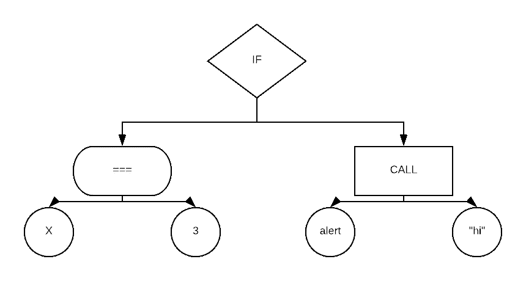

# 我们如何构建基于云的编程语言:云中的 ASTs

> 原文：<https://medium.com/hackernoon/how-we-built-a-cloud-based-programming-language-asts-in-the-cloud-bb5c45c32bab>

***建筑泡沫。*** *在这一系列的帖子中，我们的工程团队谈论了 Bubble 的内部工作原理，这是一种基于云的可视化编程语言，它让编程变得人人都可以使用。*

如果你曾经试图构建一个编译器或解释器，你可能熟悉抽象语法树，通常缩写为 ASTs。AST 代表代码在计算机看来的样子。它是程序的赤裸裸的结构，去掉了所有的标点和空格，按层次组织成一棵树。

例如，在 Javascript 中，代码

```
if (x === 3) {
 alert('hi!');
}
```

可能会变成这样的图表



每当计算机编译或运行计算机程序时，它首先将程序员键入的代码转换成 AST，然后导航 AST 来实际执行它。

[泡泡](https://bubble.is)不像传统的编程语言，没有代码。它只是一个 AST，没有任何语法。我们不是将 Bubble 应用程序存储为代码，而是存储树本身。我们基于 web 的可视化编辑器直接操纵 AST。

因为 Bubble 应用程序被存储为 ast 而不是代码，所以随着时间的推移，我们比传统编程语言更容易发展 Bubble 语言。我们可以对 Bubble 程序员使用的用户界面进行彻底的修改，而不会破坏与现有用户应用程序的兼容性，因为我们可以编写代码来解释现有的 ast 并将它们转换为新的格式。

由于这个原因，Bubble 是解释的，而不是编译的:当运行 Bubble 应用程序时，我们将原始 AST 提供给一个知道如何执行它的解释器，这意味着当我们改变 Bubble 的工作方式时，没有必要重新编译现有的应用程序。

所以，因为 ASTs 是泡沫语言的核心——它们基本上是泡沫语言——我们在构建泡沫时面临的第一个决定就是使用什么技术来存储和传输它们。

剧透提示:我们选了 JSON。

JSON 是在基于 web 的环境中表示数据树的明显选择，原因有两个。首先，它是一种标准格式，可以很容易地作为纯文本在互联网上发送。第二，它非常灵活且易于构建树:您只需嵌套对象，使用键和值的任意组合。最后，Bubble 是用 Javascript 编写的(确切地说，是 CoffeeScript，但我们将在另一篇文章中讨论)，因此 JSON 文档可以直接转换为 Javascript 对象图，没有任何奇怪的阻抗不匹配。

当我们第一次开始开发 Bubble 时，我们设想每个 Bubble 应用程序都是一个 JSON 文档，我们可以根据需要在网络上发送。我们认为我们可以把所有东西都存储在内存中，要么在用户的浏览器中，要么在服务器上。哈！现在回想起来，这真是天真得令人眼花缭乱。

当我们第一次看到一个 5 MB 文档的应用程序时，我们有一个“哦，该死”的瞬间。我们的代码将整个 5 MBs 加载到内存中来做*任何事情*，我们开始观察 Bubble 平台爬行到一个令人讨厌的停顿(今天，有超过 100 MBs 的 Bubble 应用程序)。

显然，我们必须以某种方式将应用程序分成块，并且只发送执行任何给定操作所需的块。在某些情况下，这相当容易。例如，当在服务器上运行 Bubble 工作流时，表示该工作流的所有代码都在 AST 的单个分支中。

然而，在其他情况下，事情会变得更难。Bubble 中有很多东西引用了应用程序的其他部分:例如，元素引用样式，动作引用元素，表达式引用用户定义的类型。

因此，弄清楚我们需要加载应用程序的哪一部分来做某件事会变得很复杂。通常我们需要在应用程序的一部分加载数据，这些数据将包含对应用程序另一部分的引用，我们也需要加载另一部分，但在加载第一部分之前我们不会知道。

在某些情况下，高效的做法是预先加载一大块应用程序。当用户在 web 浏览器中显示气泡页面时，我们知道我们需要 AST 来呈现页面上的所有元素，因此将它们捆绑在一起并发送是有意义的。

在其他情况下，当我们发现需要数据时，延迟加载数据会更有效:当在服务器上运行工作流时，如果服务器操作引用了应用程序中的其他内容，我们希望能够将它引用的节点(通常只有几个字节的数据)临时拉入内存。

让这样一个混乱的问题如此接近我们产品的核心机制是不好的。我们希望能够开发 Bubble，而不必不断地处理什么数据在何时何地可用的问题。所以，当我们遇到一个我们不想处理的棘手问题时，我们做了我们经常做的事情:我们发明了一个抽象层。

我们称这个层为 JSON base——有点缺乏创造性。它是对 JSON 文档中一个节点的抽象。从 JSONBase 继承的每个对象都有一个应用程序名称和应用程序版本，用于标识它属于哪个文档，它还有一个路径，用于指示它指向文档中的哪个节点。例如，路径“a.b.c”指的是

```
{
 a: {
 b: {
 c: ← THIS
 }
 }
}
```

JSONsBase(或简称为 JSON)完全是抽象的。JSON 指向的键，甚至整个子树，可能实际存在，也可能不存在。这意味着我们可以使用它们，而不用担心空引用的错误，也不用担心数据是否被加载。我们已经从实际的 JSON 对象本身抽象出了 JSON 文档中的位置。

JSONs 公开了导航树和访问数据的方法。例如，在代表‘a . b . c’的 json 上调用`json.child('d')`会产生 JSON‘a . b . c . d’；调用`json.parent()`产生‘a . b’。`json.raw()`返回一个 javascript 对象，表示存储在树中这个位置的数据；`json.exists()`返回一个布尔值，表明是否有任何数据存储在那里。

JSONBase 是一个抽象基类；它定义了一个接口和一些功能，但是没有说明数据是如何存储或加载的。我们实际上有三个单独的 JSONBase 实现，对应于 Bubble 代码运行的三个主要环境:在 Bubble 可视化编辑器中，在用户访问基于 Bubble 构建的页面时在用户的 web 浏览器中，以及在我们的 web 服务器上。

最简单的是 RuntimeJSON:这是我们在浏览器中渲染泡泡 app 时使用的。RuntimeJSON 是关于速度的:当我们渲染一个页面时，我们希望它尽可能的快。RuntimeJSON 根本没有取数据的能力。我们在服务器上预先计算需要应用程序的哪些部分来呈现页面，然后将它们发送过来:RuntimeJSON 是内存中加载的实际数据的一个薄薄的包装器。

相比之下，我们在 web 浏览器中使用的 EditorJSON 是气泡编辑器的一部分，它非常灵活。当有人使用气泡编辑器时，我们需要的应用程序数据子集会随着他们导航到应用程序的不同部分而动态变化，因此 EditorJSON 能够根据需要动态查询服务器以获得更多数据。

EditorJSON 还能够处理对应用程序对象的更改。每个 EditorJSON 对象都有一个`.set(data)`方法来覆盖应用程序树的这一部分。当调用`set`时，EditorJSON 将它保存在 web 浏览器的内存中，并向服务器发送一个请求，将它永久保存到我们的数据库中。

最后，EditorJSON 有一个通知机制，让依赖该数据的编辑器代码的其他部分知道已经有了更新，这样他们就可以根据需要重新绘制 UI。(我们使用与 React 类似的数据绑定方式……这是另一篇文章的主题！)因为多个用户可能会同时编辑同一个应用程序，EditorJSON 会定期向服务器轮询其他用户所做的任何更新，以便我们可以实时显示这些编辑。

正如您可能想象的那样，EditorJSON 的代码比 RuntimeJSON 的代码复杂得多，而且性能也不如后者。但由于它们共享相同的 JSONBase 接口，我们的大部分代码不需要知道它在处理两者中的哪一个:我们可以编写与其中任何一个兼容的代码，然后在运行一个 app 时获得 RuntimeJSON 的性能(我们称之为“运行模式”)，或者 Bubble 可视化编辑器中实时数据更新的灵活性(“编辑模式”)。

ServerJSON 在 Bubble 服务器的运行模式下使用，介于 RuntimeJSON 和 EditorJSON 之间。我们在服务器上加载数据，以便为页面构建 HTML，计算我们需要将应用程序树的哪些部分发送到 web 浏览器，以及执行在服务器上运行的工作流。

因此，像 EditorJSON 一样，我们需要在需要时动态加载数据，因为在任何时候我们的服务器都可能需要执行任何用户应用程序的任何部分。然而，与 EditorJSON 相比，性能是重中之重，因为当运行一个应用程序时，我们希望尽可能快。幸运的是，我们可以让它比 EditorJSON 更简单、更快，不用担心应用程序所有者会做出改变。在执行单个页面或工作流时，我们希望呈现应用程序的一致视图，因此我们既不需要也不想考虑更改。

JSONBase 证明了抽象的力量。通过在代表 Bubble 应用程序 AST 的原始 JSON 文档周围包装一层，我们能够编写管理数兆字节文档的代码，只将我们实际需要的部分加载到内存中，而不会将该企业的复杂性泄漏到我们代码库的其余部分。

JSONs 不是 Bubble 语言解释器中唯一的抽象层次。原始的 AST 很好，但是就其本身而言，我们不知道所有这些 JSON 树*意味着什么*。你可以在我们系列的下一篇文章《云中的树，第二部分》中读到。

*觉得这个有意思？* [*我们一直在寻找优秀的工程师加入我们*！](https://bubble.is/jobs)

*原载于 2018 年 5 月 2 日*[*blog . bubble . is*](https://blog.bubble.is/trees-in-the-clouds-a09b83668d10)*。*