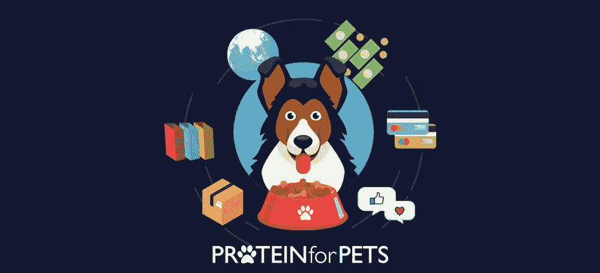

# 我们如何建立一个每月 80 万美元的宠物食品电子商务应用程序

> 原文：<https://medium.com/hackernoon/how-we-built-an-800k-per-month-e-commerce-application-for-pet-food-27d20fbccfb2>

到 2018 年底，电子商务销售额预计将达到 4140 亿美元。

如果你进入 B2C 领域，那么没有电子商务应用，你会失血过多。在互联网占主导地位的世界里，网上购物体验受到观众的高度重视。随着新的商务形式被引入市场，电子商务应用程序为可持续生存奠定了基础。

在这篇博客中，我将分享 SayOne 为宠物食品行业建立电子商务平台背后的故事，该平台每月产生 80 万美元的收入。

# 宠物用蛋白质:一种电子商务应用理念

总部设在美国，宠物蛋白质或 P4P 是一家领先的宠物食品和配件在线零售商。创始人 Marco 和 Ber Giannini 发起了“宠物蛋白质”,旨在缓解宠物父母的生活。

为了更进一步，他们想出了自己最健康、最高质量的宠物食品，以合理的价格命名为“裸体”。除了食物之外，还有给宠物的玩具、配件等等。在三年的时间里，他们仅在南加州就成功地开设了 10 家商店。

随着社区的发展，需求也开始增加。大多数顾客期待个性化的体验。他们意识到，一个提供完美宠物产品的订阅箱，送到他们家门口，可能会成为宠物食品世界的主要破坏者。因此，专门针对宠物食品行业的电子商务应用程序是最终的选择。

P4P 想给宠物食品行业带来一场彻底的变革。在忙碌的一天，没有人想经历最后一分钟去买宠物食品的事情。有了订阅箱，每个月都会有足够的宠物食品送到顾客家门口。此外，为自己的宠物确定合适的饮食计划的麻烦将由 P4P 专家处理。基于父母提供的输入，饮食计划将被定制以适合宠物的需要。

# 为宠物建立一个基于在线订阅的购物平台

当宠物蛋白质找到我们时，他们已经有了一个多供应商的在线购物平台。顾客可以在购买后到商店取货，或者直接送货上门。但是，没有中央库存管理系统。当用户请求订单时，系统必须分析每个商店的库存才能处理订单。这对整个 P4P 团队来说既耗时又乏味。

这是一个棘手而富有挑战性的局面。但是当我与我们的团队协商时，空气中的兴奋多于恐惧或担忧。采用敏捷的 Scrum 方法，我们与我们最好的技术和业务专家团队一起启动了这个项目。

就像它说的，总有一个解决办法来完成事情。它也适用于这种情况。实际上，问题并不在于没有一个集中的仓库。相反，问题在于缺乏对客户的可见性。如果客户可以直接访问库存来查看产品可用性，这将为 P4P 团队节省大量时间和精力。最终，这成为了解决方案。

这是一个棘手而富有挑战性的局面。然而，当我向我们的团队咨询时，空气中的兴奋多于恐惧或担忧。他们的兴奋增强了我的信心，计划开始了。我们决定建立一个平台来管理产品库存，并在网站上显示这些信息。在 P4P 网上购物时，顾客可以直接查看特定地点的库存。

我们在系统中集成了哪些功能？

*   一个使用 Python/Django 构建的直观和改进的电子商务平台。
*   一个定制的集成和配置的应用程序，集成了光速云。
*   使用 Stripe 部署的轻松支付系统。
*   一个可扩展的门户网站，包括大使计划、搜索功能和订单处理等功能。

# 结果呢

该平台目前用于库存管理和销售。正如我们所说的，我们的团队正在向它添加更多的功能。最后，没有比工作得到赏识更好的感觉了。这是他们对我们的评价:

“SayOne Technologies 擅长估计他们何时能完成某个项目。从项目管理的角度来看，它们非常灵活，这对我们独特的业务环境非常重要。例如，如果他们一直在做一个为期五天的项目，而其他东西坏了，需要立即修理，说一个人会立即停止其他工作。我们处在与客户打交道的第一线，所以我很欣赏他们的团队能够根据需要改变工作重点”。

寻找电子商务开发服务？[今天就和我们的专家](https://www.sayonetech.com/contact/)谈谈吧！

*最初发布于*[*https://www . sayone tech . com/blog/how-we-build-dollar-80 万美元-每月-电子商务-申请-宠物食品/*](https://www.sayonetech.com/blog/how-we-built-dollar-800K-per-month-ecommerce-application-for-pet-food/) *。*