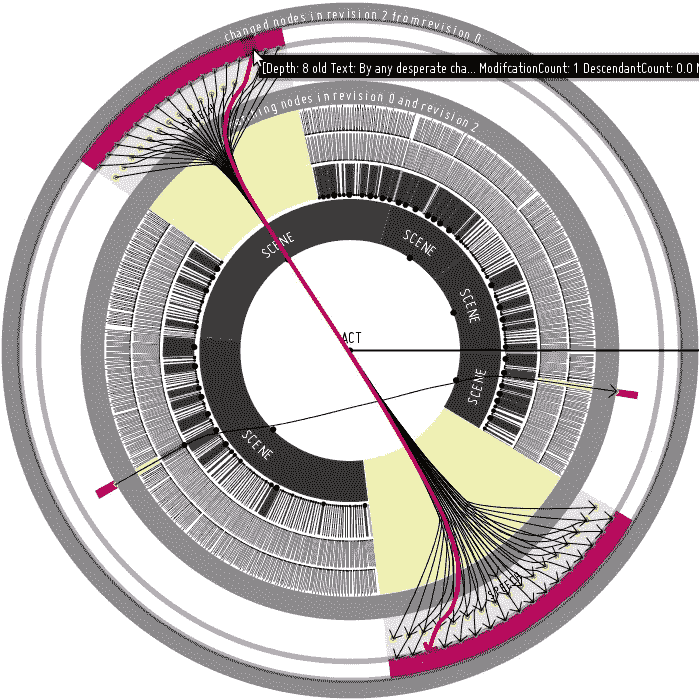

# RESTful API——基于 Vert.x、Keycloak 和 kot Lin/协程的设计

> 原文：<https://medium.com/hackernoon/how-we-built-an-asynchronous-temporal-restful-api-based-on-vert-x-4570f681a3>

## 我们如何为 Sirix.io(开源)构建一个异步的时态 RESTful API

Interactive Visualization — Uses Hierarchical Edge Bundles to visualize moved nodes.

# 为什么现在存储历史数据变得可行

生命受制于不断的进化。我们的数据也是如此，无论是研究、商业还是个人信息管理。因此，令人惊讶的是，数据库通常只保持当前状态。然而，随着闪存驱动器(例如固态硬盘)的出现，与旋转磁盘形成鲜明对比的是，固态硬盘在随机访问数据方面要快得多，并且不太擅长擦除或覆盖数据，我们现在能够开发智能的版本控制算法和存储系统来保持过去的状态，同时不影响效率/性能。因此，搜索/插入/删除操作应该是对数时间的(O(log(n))，以便与常用的索引结构竞争。

# 临时存储系统 SirixDB

> Sirix 是一个版本化的临时存储系统，其核心是日志结构。

我们支持 **N 个只读**事务，这些事务被绑定到一个**单一版本**(每个事务可以从任何过去的版本开始)*并发*到**一个单一资源上的写**事务。因此，我们的系统基于**快照隔离**。写事务可以将最近的修订恢复到任何过去的修订。然后，可以提交对此过去修订的更改，以创建新的快照，从而创建新的修订。

> 在事务提交期间，以内部索引树结构的后序遍历方式将写操作批处理并同步到磁盘。因此，我们能够在父指针中存储页面的哈希，就像 **ZFS 一样，用于将来的完整性检查**。

快照，即在每次提交期间创建的新修订。除了数字的*修订号*之外，*时间戳*被序列化。随后可以通过指定 ID 或时间戳来打开修订。使用时间戳需要对时间戳数组进行二进制搜索，这些时间戳持久存储在第二个文件中，并在启动时加载到内存中。如果找到准确的时间戳或与给定时间点最接近的修订，则搜索结束。数据永远不会写回同一个位置，因此不会就地修改。**取而代之的是，Sirix 在记录层使用写时复制(COW)语义(创建页面片段，通常不复制整页)。每当一个页面必须被修改时，已经改变的记录以及一些未改变的记录被写入一个新的位置。具体复制哪些记录取决于使用的版本控制算法**。因此，它特别适合固态硬盘等基于闪存的驱动器。对数据库中资源的更改发生在上述资源绑定的单次写事务中。因此，首先必须在特定资源上打开 ResourceManager，以启动单个资源范围的事务。请注意，我们已经开始处理数据库范围的事务:-)

我们最近写了另一篇[文章](https://link.medium.com/DI6qr33v7S)，提供了更多关于 Sirix 背后原理的背景信息。

# 简单的基于事务游标的 API

下面显示了一个简单的 Java 代码，用于创建数据库、数据库中的资源以及 XML 文档的导入。它将被分解成我们的内部表示(这可以被认为是一个持久的 DOM 实现，因此涉及到内存布局和二进制序列化格式)。

JSON 的原生存储将是下一个。一般来说，每种类型的数据都可以存储在 Sirix 中，只要它可以由生成的顺序、稳定的记录标识符获取，该标识符由 Sirix 在插入期间分配，并且插入了定制的串行化器/解串行化器。然而，我们正在开发几个小的层来本地存储 JSON 数据。

# Vert.x、Kotlin/Coroutines 和 Keycloak

另一方面，Vert.x 是在 Node.js 的基础上为 JVM 设计的。Vert.x 中的一切都应该是非阻塞的。因此，一个称为事件循环的线程可以处理大量的请求。阻塞调用必须在一个特殊的线程池上处理。默认情况下，每个 CPU 有两个事件循环(多反应器模式)。

我们使用**科特林**，因为它简单明了。其中一个非常有趣的特性是协程。从概念上讲，它们就像非常轻量级的线程。虽然创建线程非常昂贵，但创建协程并不昂贵。协同程序允许像顺序代码一样编写异步代码。每当由于阻塞调用或长时间运行的任务而被挂起时，底层线程不会被阻塞，并且可以被重用。在幕后，每个挂起的函数通过 Kotlin 编译器获得另一个参数，一个 continuation，它存储在哪里恢复函数(正常恢复，异常恢复)。

**Keycloak** 通过 OAuth2(密码凭证流)用作授权服务器，因为我们决定不自己实现授权。

# 构建服务器时需要考虑的事项

首先，我们必须决定哪一个流程最适合我们的需求。因为我们构建了一个通常不被用户代理/浏览器使用的 REST-API，所以我们决定使用**密码凭证流。**很简单:首先获取一个访问令牌，然后在授权头中随每个请求一起发送。

为了获得访问令牌，首先必须对一个 **POST /login —** route 发出一个请求，在请求体中以 JSON-object 的形式发送用户名/密码凭证。

实现如下所示:

协程处理程序是一个简单的扩展函数:

协程在 Vert.x 事件循环(调度程序)上启动。

为了执行一个运行时间更长的处理程序，我们使用

对于这些任务，Vert.x 使用不同的线程池。因此，任务在另一个线程中执行。注意，事件循环不会被阻塞，协程会被挂起。

# 通过示例进行 API 设计

*现在我们再次将焦点转移到我们的 API，并通过示例展示它是如何设计的*。我们首先需要设置我们的服务器和 Keycloak(阅读 [http://sirix.io](http://sirix.io) 如何做这件事)。

一旦两台服务器都启动并运行，我们就能够编写一个简单的 HTTP-Client。我们首先必须用给定的“用户名/密码”JSON-Object 从`/login`端点获得一个令牌。在 Kotlin 中使用异步 HTTP-Client(来自 Vert.x ),看起来像这样:

然后，这个访问令牌必须在每个后续请求的授权 HTTP 头中发送。存储第一个资源如下所示(简单的 HTTP PUT-Request):

首先，创建一个名为`database`的包含一些元数据的空数据库，然后用名称`resource1`存储 XML 片段。PUT HTTP-Request 是等幂的。具有相同 URL 端点的另一个 PUT 请求将删除以前的数据库和资源，并重新创建数据库/资源。

HTTP 响应代码应该是 200(一切正常)，在这种情况下，HTTP-body 产生:

我们正在序列化从存储系统中为元素节点生成的 id。

通过一个`GET HTTP-Request`到`https://localhost:9443/database/resource1`，我们也能够再次检索存储的资源。

然而，到目前为止，这并不真正有趣。我们可以通过`POST-Request`更新资源。假设我们像以前一样检索了访问令牌，我们可以简单地做一个后请求，并使用我们以前收集的关于节点 id 的信息:

有趣的部分是我们用作端点的 URL。我们简单地说，选择 ID 为 3 的节点，然后插入给定的 XML 片段作为第一个子节点。这会产生以下序列化的 XML 文档:

每个 PUT-以及 POST-请求都隐式地`commits`底层事务。因此，我们现在能够发送第一个 GET-request 来再次检索整个资源的内容，例如通过指定一个简单的 XPath-query 来选择所有修订`GET https://localhost:9443/database/resource1?query=/xml/all-time::*`中的根节点，并获得下面的 XPath-result:

注意，我们在 query-parameter 中使用了一个时间旅行轴。一般来说，我们支持几个额外的时间 XPath 轴:未来、未来或自我、过去、过去或自我、前一个、前一个或自我、下一个、下一个或自我、第一个、最后一个、所有时间

时间轴兼容节点测试:

<时间轴> :: <节点测试>

定义为

<时间轴>:*/self::<节点测试>。

当然，通常的方法是，首先使用一个标准的 XPath 轴导航到您感兴趣的节点，例如后代和/或子轴，添加谓词，然后及时导航，观察节点和子树是如何变化的。这是一个令人难以置信的强大特性，可能是未来文章的主题。

通过在 GET-request 中指定要序列化的修订范围(开始和结束修订参数),也可以达到同样的目的:

`GET [https://localhost:9443/database/resource1?start-revision=1&end-revision=2](https://localhost:9443/database/resource1?start-revision=1&end-revision=2)`

或者通过时间戳:

`GET [https://localhost:9443/database/resource1?start-revision-timestamp=2018-12-20T18:00:00&end-revision-timestamp=2018-12-20T19:00:00](https://localhost:9443/database/resource1?start-revision-timestamp=2018-12-20T18:00:00&end-revision-timestamp=2018-12-20T19:00:00)`

但是，如果我们首先打开一个资源，然后通过一个查询选择单个节点，那么使用时间轴会更快，否则必须对每个打开的修订执行相同的查询(解析、编译、执行……)。

我们当然也能够通过更新 XQuery 表达式(这不是很 RESTful)或简单的`DELETE` HTTP-request 来删除资源或其中的任何子树:

这将删除 ID 为 3 的节点，在我们的例子中，因为它是一个元素节点，所以删除了整个子树。当然，它是作为修订版 3 提交的，因此所有旧的修订版仍然可以查询整个子树，就像在事务提交期间一样(在第一个修订版中，它只是名为“bar”的元素，没有任何子树)。

如果我们想要获得一个 diff，目前是以 XQuery Update 语句的形式，只需调用 XQuery 函数`sdb:diff`，它被定义为:

`sdb:diff($coll as xs:string, $res as xs:string, $rev1 as xs:int, $rev2 as xs:int) as xs:string`

我们当然可以指定其他序列化格式。

例如，我们可以在上面创建的数据库/resource1 上发送这样的 GET-request:

`GET [https://localhost:9443/?query=](https://localhost:9443/?query=sdb:diff('database','resource1',1,2))sdb%3Adiff%28%27database%27%2C%27resource1%27%2C1%2C2%29`

请注意，查询字符串必须是 URL 编码的，因此解码它的

`[sdb:diff('database','resource1',1,2)](https://localhost:9443/?query=sdb:diff('database','resource1',1,2))`

并且我们正在比较修订版 1 和 2(但是对于我们比较的每个修订版元组，不同的性能肯定在相同的时间复杂度上)。在我们的示例中，diff 的输出是这个 XQuery-Update 语句，该语句包装在一个封闭的 sequence-element 中:

这意味着`database`中的`resource1`在第一次修改时打开。然后将子树`<xml>foo<bar/></xml>`附加到具有稳定 node-ID 3 的节点，作为第一个子节点。

如果你喜欢这个，请给我们一些掌声，让更多的人看到它或 Github 上的一颗星…最重要的是检查一下(**我们很乐意听到任何建议，反馈，对未来工作的建议，例如关于 JSON 或云的水平扩展的工作，错误报告；-)，只是一切…请联系** ) :-)

# 我们的开源库: [http://sirix.io](http://sirix.io)