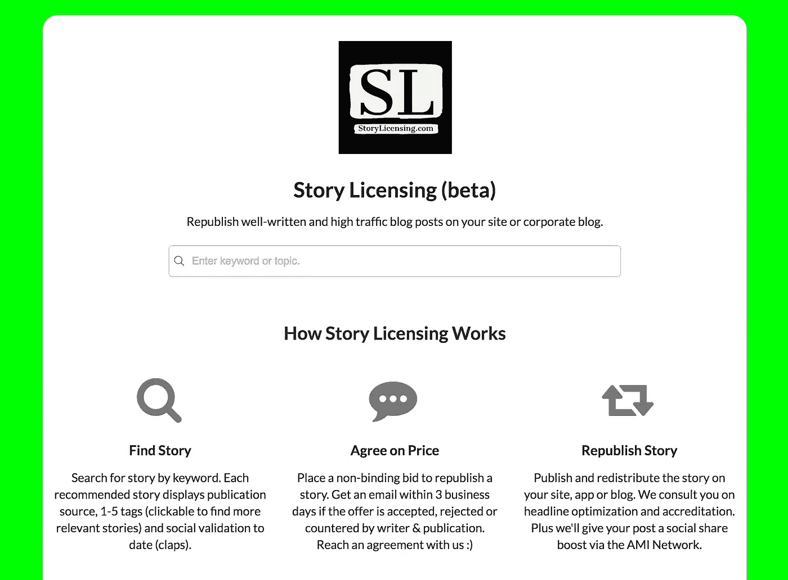
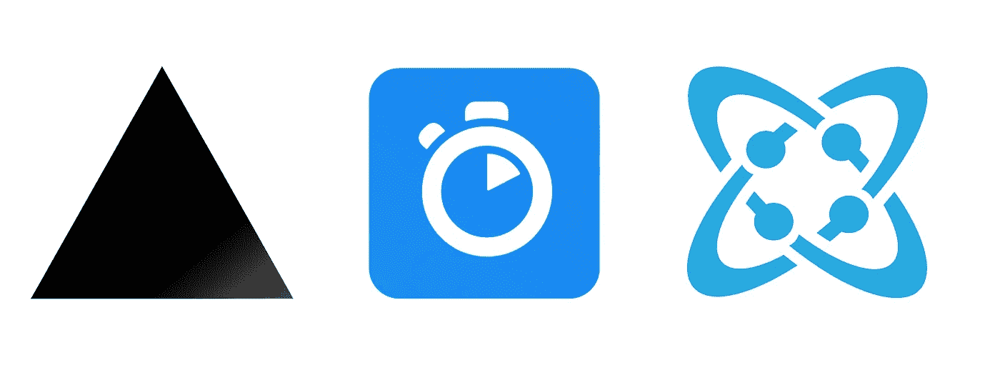
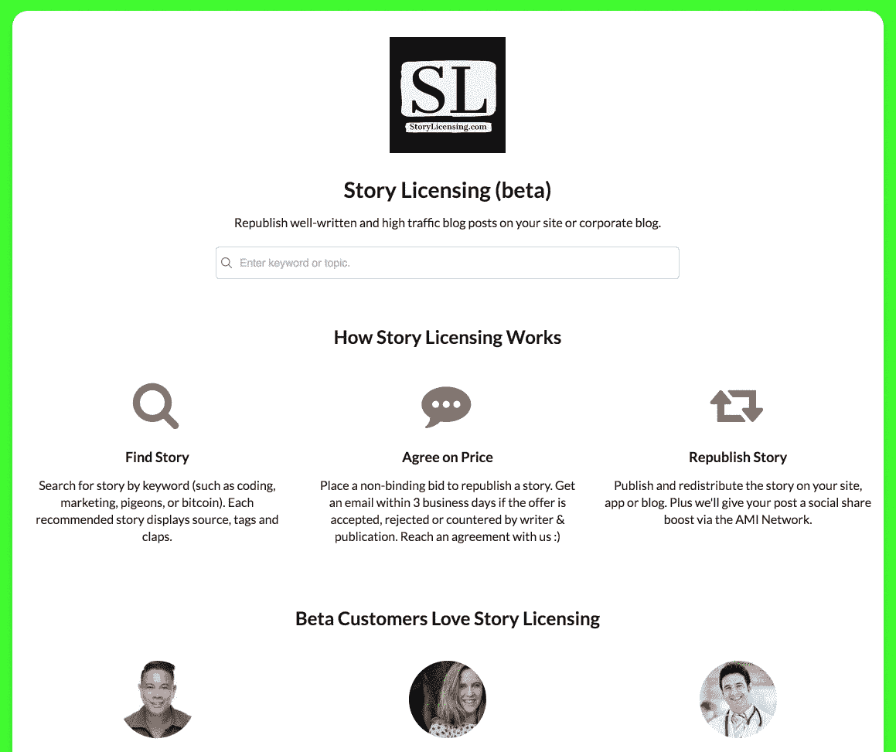
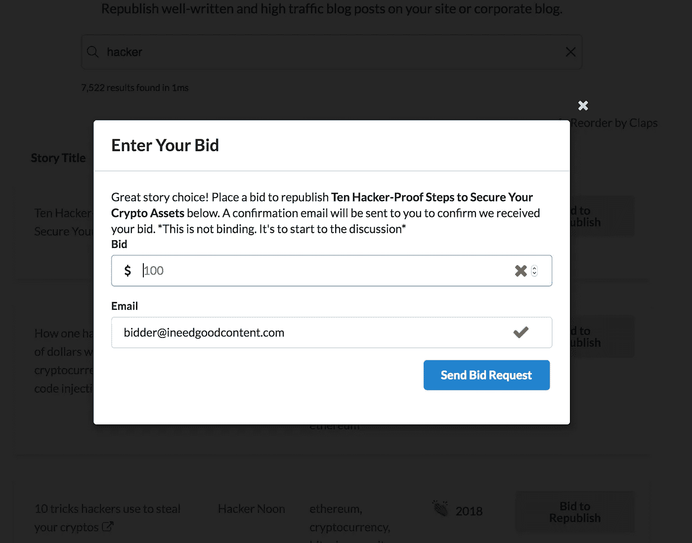

# 我们如何使用 Next.js、Algolia 和 Cosmic JS 构建故事授权应用程序

> 原文：<https://medium.com/hackernoon/how-we-built-the-story-licensing-app-using-next-js-algolia-and-cosmic-js-e078301e461c>

我们最近使用一些最强大的开发工具构建了 [Story Licensing](https://storylicensing.com/) 应用程序。通过将非核心开发功能卸载到可用的 API 服务上，我们能够以超乎我想象的速度构建这个应用程序。我很高兴与大家分享我们是如何做到的。

# TL；速度三角形定位法(dead reckoning)

[查看现场故事授权应用](https://storylicensing.com/)

# 要求

Project manager

每个应用程序都有一个目标和需求。对于这个应用程序，目标是获得对购买转贴来自 [AMI Publications](http://www.amipublications.com/) 网络中的出版物的在线内容的权利感兴趣的线索。我们的要求:

1.故事(对于我们的应用程序，发布在 [@ami](http://twitter.com/ami) 网站上的故事)需要快速方便地搜索
2。故事需要向感兴趣的领导者表明公开可用的社会确认(掌声)的排名
3。能够捕获销售线索的电子邮件(在搜索行动之前)
4。捕获投标请求数据的能力:故事标题，领导电子邮件，搜索词投标和发送电子邮件给管理员
5。通过内容管理系统由内容管理者管理拷贝内容的能力

# 服务

对于这款应用，我们知道我们不想构建和管理*一切*。相反，我们希望将非核心开发卸载到可用的最佳服务中，只构建我们需要的东西。任何时间紧迫的 web 项目(几乎每个项目)都应该这样做，这样你就不会不必要地重复已经存在的高级功能。因此，对于这个应用程序，我们决定使用:

1. [Cosmic JS](https://cosmicjs.com/) 用于内容管理、数据存储，这也是我们使用[媒体备份应用](https://cosmicjs.com/apps/medium-backup)存储媒体文章的地方。
2。 [Algolia](https://algolia.com/) 搜索故事。绝对满足我们的快速搜索需求(快！)
3。用于发送邮件通知的 send grid[4。](https://sendgrid.com/) [@ami](https://twitter.com/ami) 提供故事库

因此，通过所有这些，我们为各自的功能提供了同类最佳的服务。构建我们的应用程序需要将这些服务锁定在一起。

# 构建搜索功能

Measure twice…

对于这个应用程序，我知道我想使用 [React](https://reactjs.org/) (主要出于个人偏好)。因此，为了与“只构建你必须构建的东西”的主题保持一致，对我来说，自然的框架选择是 [Next.js](https://nextjs.org/) 。他们的价值主张是“让应用变得简单”。它使 React 应用程序的启动和运行变得容易，无需大量的样板开发，同时提供了良好的开发人员体验。

为了集成 Algolia，我需要在 React 应用程序中实现搜索栏。幸运的是，他们有一个优秀的 [InstantSearch React 组件](https://community.algolia.com/react-instantsearch/)，可以轻松集成到 React 应用中。只需设置您的`appId`、`apiKey`和`indexName`。你可以在你的 Algolia 仪表盘上找到这些。

现在我已经实现了搜索栏，我需要向 Algolia 添加记录。为此，我需要将 Cosmic JS 保存的 Medium 文章添加到 Algolia 中。我创建了一个脚本，将 Cosmic JS 中的对象添加到我们的 Algolia 搜索索引中。

这里是`add-records.js`:

接下来，我需要为故事获得掌声，因为故事的中型 XML 提要(例如:[https://hackernoon.com/feed](https://hackernoon.com/feed))不包括我们应用程序的这一重要信息。为此，我需要创建一个可以每天运行的工作者脚本，更新我们所有的故事鼓掌计数。

这里是`get-claps.js`:

该脚本执行以下操作:获取 Algolia 中所有保存的记录，点击 [@ami](https://twitter.com/ami) story URL，获取 JSON 数据，解析该数据以获得鼓掌次数，然后更新 Algolia 中的记录。这个过程可以在后台运行，以获取和保存每个故事的最新掌声计数。这将增加我们在 Algolia 的每日记录行动配额，增加我们的成本，但值得为每个故事获得最新的社会认可。

对于来自 Algolia 的搜索结果，搜索词相关性获得优先权，但是我们也可以重新排序故事，以在顶部显示最高的鼓掌计数:

# 保存销售线索电子邮件和投标请求

由于这个应用程序的目标是为潜在客户保存投标请求，我们选择 SendGrid 作为可靠的电子邮件服务提供商。我创建了两个端点，用于在搜索之前保存销售线索电子邮件，以及在发现一个故事之后保存投标请求信息。

这里是`leads.js`和`bids.js`:

请注意，对于这两个操作(主要电子邮件和投标请求)，我们也将数据存储在 Cosmic JS 中。这已经完成，所以我们可以使用这些数据进行管理记录。Cosmic JS 现在可以通过 Cosmic API 查看、查询和交付这些数据到任何未来的应用程序中。

# 最后

完成后的应用程序现在可以帮助您从 [AMI Publications](http://www.amipublications.com/) network 中找到高质量的内容，以获得您的网站或博客的许可。[点击这里查看](https://storylicensing.com/)。

## 使用的资源

[宇宙 JS NPM 模块](https://www.npmjs.com/package/cosmicjs)
[Algolia React instant search NPM 模块](https://www.npmjs.com/package/react-instantsearch)
[SendGrid NPM 模块](https://www.npmjs.com/package/@sendgrid/mail)

我对这个项目的进展很满意。由于使用了可用的最佳服务和开发工具(Algolia、SendGrid、Next.js 和 Cosmic JS)来交付快速和可伸缩的应用程序，开发速度很快。让我知道你的想法，[加入 Slack 上的对话](https://cosmicjs.com/community)并[在 Twitter 上关注 Cosmic JS](https://twitter.com/cosmic_js)。