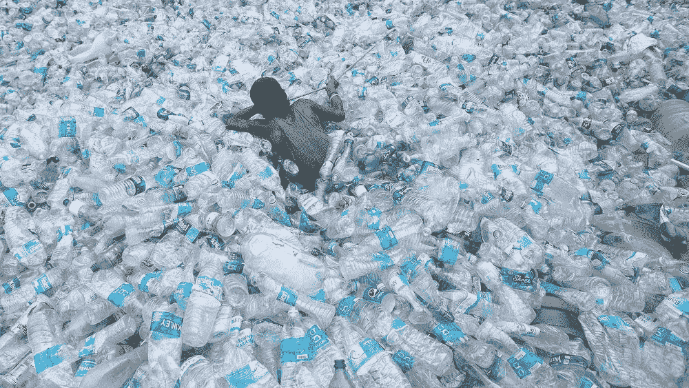
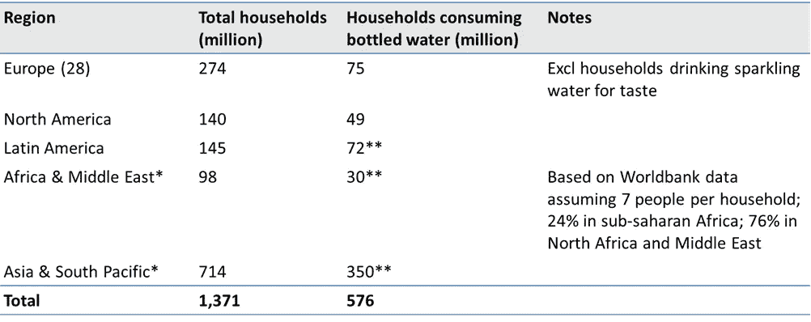
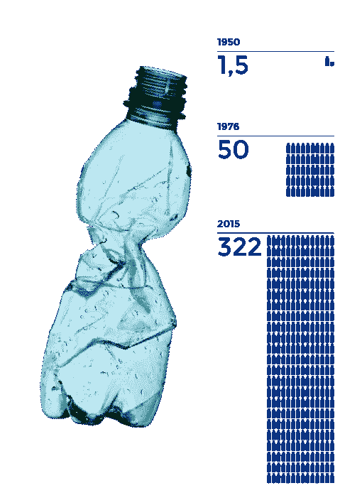
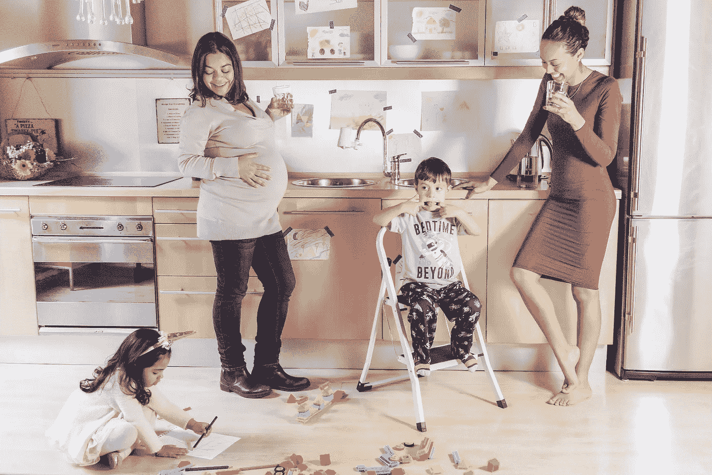

# 我们现在如何轻松地阻止塑料垃圾

> 原文：<https://medium.com/hackernoon/how-we-can-easily-stop-plastic-waste-now-16107096a841>

Swimming in a sea of plastic (Source: Fabbaloo)

好的。所以现在对大多数人来说很明显我们有一个塑料问题。我们的海洋实际上是在塑料中游泳。

问题是:我们能做些什么？

有一个相当简单的解决方案。但在我们找到解决方案之前，我们需要了解问题以及我们是如何走到这一步的。

**问题**

在生产的 83 亿公吨塑料中，只有 9%被回收。最近，这一数字约为 14%，但事实是，即使我们的意图是好的，我们在回收塑料方面的糟糕表现仍然给 T2 带来巨大挑战。

为简单起见，我们将重点关注一次性塑料水瓶，但许多其他塑料，如袋子、香烟盒、尿布、食品包装、其他饮料、衣服上的微珠等。同样重要。

**一个明显的例子:瓶装水**

全球瓶装水市场持续增长，目前约有 6 亿家庭在消费瓶装水。2017 年，瓶装水市场达到 3910 亿升，2009 年至 2016 年期间平均每年增长 6%。按照目前的增长速度，到 2022 年，将有 9000 多万个家庭消费瓶装水。

Table: Bottled water consumption worldwide

**有电有水的家庭(世卫组织)*

***基于人口和瓶装水消耗量的估计。在某些情况下，它可能包括重新灌装的大瓶。*

假设每个家庭平均每天消费约 2 瓶，这意味着每年 5.76 亿 x365 = 2100 亿瓶。这与每年消耗 4800 亿个塑料瓶的估计非常吻合，其中 50%是水。

Gobal annual bottled water consumption in millions of tons of plastic

**为什么这么多人喝瓶装水？**

在过去的 30 年里，欧洲和北美的自来水质量在味道和质量上都有了很大的提高。尽管如此，瓶装水的消耗量从零上升到了上面的惊人数字。

消费者列举的主要原因是:

*   更喜欢瓶装水的味道
*   关注自来水的质量和对健康的影响
*   取代含糖饮料
*   瓶装水的便利性

除此之外，瓶装水行业多年来一直积极宣传矿泉水和矿泉水的健康益处。因此，几乎一半的人认为瓶装水比自来水更健康。

**我们如何解决这个问题？**

世界上有许多非常具有挑战性的问题，如气候变化、不平等和恐怖主义，这些问题极难解决。瓶装水不在其中。

事实上，瓶装水对大多数家庭来说是完全没有必要的。在北美和欧洲，超过 95%的家庭可以获得干净的自来水。在世界上许多其他有自来水供应的地区，用一种负担得起的过滤器就可以很容易地使自来水变得安全。

尽管如此，还是有太多的家庭因为口味偏好或错误的健康考虑而选择瓶装水。政府有责任教育人民，并提供饮用水解决方案的指导方针，就像他们在回收利用、水消费、酒精和一般健康方面所做的那样。

这包括告知人们瓶装水在运输、废物和塑料污染方面造成的问题，并提供替代品。对于低收入家庭来说，补贴清洁饮用水的解决方案可能是明智的。

With education and water filters everyone can safely drink tap water

下一步是什么？

在教育和监管的帮助下，欧洲和北美可以在短短几年内减少至少 75%的瓶装水消费，将大部分消费限制在玻璃瓶中的气泡矿泉水。瓶装水消费大国中国、印度、墨西哥和印度尼西亚也可以这样做，尽管当地自来水的质量要求对滤水器进行更严格的监管。

消费者省下的钱将用于其他消费，从而创造新的就业机会，取代瓶装水行业。

如果我们对所有主要类别的一次性塑料做同样的事情，那么塑料废物就可以大大减少。

我们还在等什么？让我们现在就开始游说家人、朋友和政治家吧！

*免责声明:*

*我是* [*TAPP 水务*](http://tappwater.com) *的联合创始人，我的使命是为清洁环保的水资源提供简单实惠的解决方案。*

**资料来源:**
[艾伦·麦克阿瑟基金会——2017 年关于塑料生产和回收的研究](https://www.ellenmacarthurfoundation.org/news/the-new-plastics-economy-rethinking-the-future-of-plastics-infographics)

[国家地理-塑料制品回收废弃物海洋垃圾 2017](https://news.nationalgeographic.com/2017/07/plastic-produced-recycling-waste-ocean-trash-debris-environment/)

[福布斯—每分钟 100 万瓶，91%未回收](https://www.forbes.com/sites/trevornace/2017/07/26/million-plastic-bottles-minute-91-not-recycled/#699a0a0e292c)