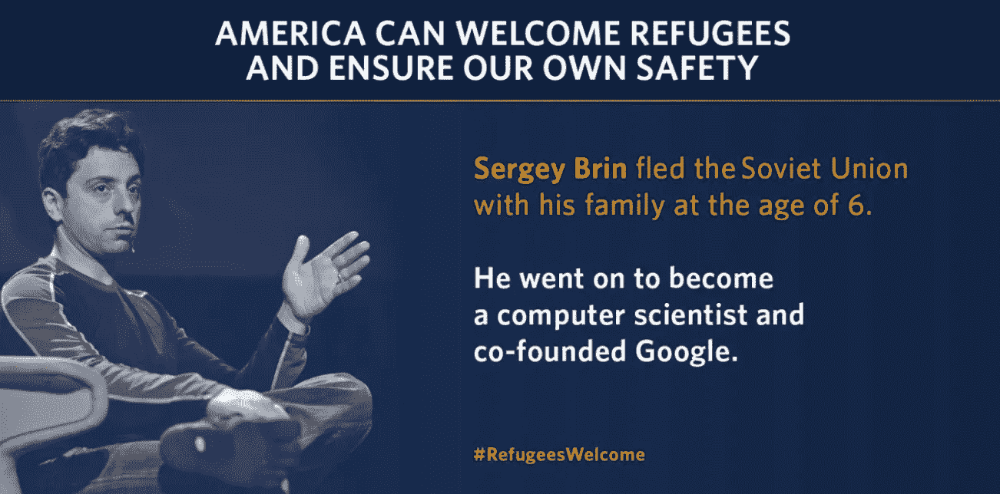

# 我们如何利用技术帮助难民获得就业。

> 原文：<https://medium.com/hackernoon/how-we-can-leverage-technology-to-help-refugees-gain-employment-d3c1e03ece08>

Image: The White House

> "没有人会离开家，除非家是鲨鱼的嘴."—沃桑夏尔，教我妈怎么生孩子。

目前，就业挑战是难民融入道路上的一个重大障碍。

即使在获得工作许可后，仍然有许多障碍阻止难民找到工作。

其中一些问题包括:

*   对他们所移居国家的工作文化和劳动力市场缺乏了解。
*   缺乏相关经验、[网络](https://hackernoon.com/tagged/network)和人脉。
*   缺少工作机会——许多难民所在的国家几乎无力养活自己的人口。
*   个人创伤——许多难民已经逃命。许多人受到他们所经历的事情的严重影响，可能需要进一步的支持才能选择找工作。
*   政府官僚机构。
*   来自雇主的社会歧视。

就业是社会融合的一个重要部分。事实上，[它是有利于难民长期融合的最重要因素](http://www.europarl.europa.eu/RegData/etudes/STUD/2016/578956/IPOL_STU(2016)578956_EN.pdf)。

有一份工作使人们能够与他们的新社区成员一起工作，作为慢慢重建他们的社会网络和更好地熟悉他们的新环境的一种手段。

它不仅仅是经济保障——它通过允许一个人使用他们辛苦获得的技能和资格来增加他们的自我价值，然后他们可以用这些技能和资格为社会做出贡献。

这对于通往归属感的旅程至关重要。

## 我们不能对难民置之不理

鉴于最近发生的事件，我们目睹了世界各地许多政治家试图对难民置之不理。

然而，这些恐惧策略既误导又有害于世界各地对难民的看法。

历史上一些最有影响力的人物都是难民。

**莫哈·法拉爵士和他的双胞胎兄弟一起在吉布提度过了他作为难民的童年。从那以后，他成为了英国最成功的长跑运动员。**

第二次世界大战期间，作为一万名儿童难民中的一员，阿尔夫·杜布斯勋爵作为一名犹太难民被带进了英国。此后，他成功地成为了英国工党政治家和前国会议员。

世界著名科学家阿尔伯特·爱因斯坦被迫从德国逃到美国，因为纳粹的反犹政策使他难以开展工作。

美国前国务卿亨利·基辛格是 1938 年获准进入美国的少数幸运儿之一，当时大多数美国人都反对接收难民。1973 年，他继续接受诺贝尔和平奖。

> 2012 年，基辛格表示，拒绝难民*“与美国的价值观和我们的形象不符”。*

## 许多难民技术高超，但仍难以找到工作

我们对难民危机的第一反应是:*我们如何能立即帮助他们？*

我们现在的第二个问题应该是:*我们如何帮助他们重建生活？*

许多难民在他们以前的国家有着长期成功的职业生涯，但在到达新的地点后却发现自己失业和无家可归。

出于多种原因，数字工具在帮助苦苦挣扎的难民重建生活方面一直是至关重要的一部分。首先，作为一种允许人们获取他们需要的信息的方式，其次，通过给予人们提高他们将需要的重要技能的能力，以及最终，通过允许人们找到工作。

在过去的几年里，旨在帮助难民利用他们的技能找到有意义的工作的技术越来越多。

几个著名的例子包括:

## 话匣子

Mursal Hedayat 创建了 Chatterbox，他作为难民从阿富汗来到英国。

这家初创公司成立于 2016 年，旨在帮助难民找到能发挥他们才能的有意义的工作。他们培训和雇佣流离失所的人，把他们的母语教给想学的人。

该平台的用户可以与这些演讲者联系，在线或亲自安排课程。

这个平台利用难民的语言技能，同时帮助减少语言技能赤字，目前英国每年的语言技能赤字超过 480 亿英镑。

## 安科曼

[Ankommen](https://play.google.com/store/apps/details?id=de.br.ankommen&hl=en) (“抵达”)是一款智能手机应用，致力于帮助以难民身份抵达德国的人在最初几周融入社会。

它是由[联邦移民和难民办公室](http://www.bamf.de/EN/Startseite/startseite-node.html)、[联邦职业介绍所](https://www.arbeitsagentur.de/content/1463061695190)、[歌德学院](https://www.goethe.de/en/index.html)和[巴伐利亚州经营基金会](https://www.br.de/index.html)开发的。

该平台拥有许多有用的功能，包括:

*   基础德语课
*   在德国生活的人应该注意的规则
*   关于庇护程序的重要信息
*   如何找到职业培训和就业

该应用程序提供五种语言(阿拉伯语、英语、波斯语、法语和德语)，免费，无广告，可免费离线使用。

## 微软慈善机构

[Microsoft Philanthropies](https://www.microsoft.com/en-us/philanthropies/refugees) 是一个致力于帮助年轻难民实现梦想的组织，致力于增强急救人员、人道主义组织和流离失所者的能力。

特别是，该方案向难民提供数字技能资源，帮助他们获得数字知识和计算机科学技能。

学习完这些课程后，用户将对技术、计算机科学、就业和企业家精神等重要学科有一个基本的了解。

## 帮助难民重建生活是我们的责任

不幸的是，纵观历史，难民常常被视为负担而被拒绝。

早在 1933 年，成千上万逃离纳粹政权的犹太人就是这种情况。

1970 年代末和 1980 年代初逃离祖国的 100 多万越南“船民”就是这种情况。

现在，[叙利亚难民](https://www.huffingtonpost.com/entry/trumps-reprehensible-rejection-of-syrian-refugees_us_5a26939ae4b0f0c7768d440a)和世界各地逃离本国危机的其他国家的难民就是这种情况。

然而，除了既是人道主义义务又是法律义务之外，有证据表明，欢迎难民实际上是一项有可能产生巨大经济红利的投资。

帐篷基金会(Tent Foundation)的一项研究发现，投资 1€(1.2 美元)欢迎难民可以在短短五年内产生几乎两倍的经济效益。

## 难民危机不是，也不应该仅仅是一种职业义务。

## [这是对我们性格的考验](https://www.ted.com/talks/david_miliband_the_refugee_crisis_is_a_test_of_our_character/transcript?language=en)。

# _

如果你喜欢这个，你可以给我发信息到 aimee.pearcy@gmail.co 的**。☺️**

否则，请鼓掌和分享，让我知道你喜欢它！👏 ⭐️ ❤️