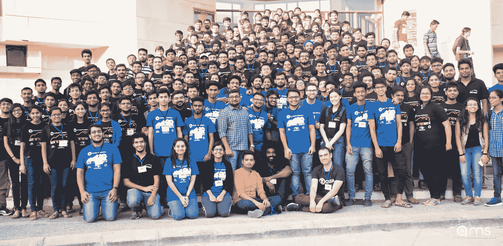
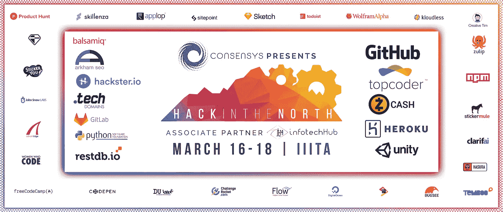

# 北方黑客 3.0:我们如何创建印度最好的学生黑客马拉松

> 原文：<https://medium.com/hackernoon/how-we-created-indias-best-student-hackathon-54eb67496aa2>

我们梦想创造最好的黑客马拉松体验，但最终也为我们的大学生活增添了快乐的篇章。这是 Hack 在北方 3.0 的故事。

回到 2017 年，当 Hack in the North 2.0 结束时，我们知道我们为自己树立了一个标杆。尽管我们是印度最优秀、最古老的学生黑客马拉松之一，但我们从未想到它会从第一版发展到第二版。我们已经从一个资金匮乏的大学活动成长为一个由 Github 自己赞助的活动。

为了重现这一点，我们回顾了北方黑客背后的核心使命:

> “创作者相遇的地方”

创作者/大学生往往有革命性的想法，但他们缺乏的是将这些想法点燃成现实的火花。因此，我们想给他们一个平台来实现这些想法。所以现在当我们清楚了动机，我们开始寻找所需的基本需求。

Hack in the north 3,0 photoshoot

在调查了一个人参加活动的目的后，我们得出了这样的结论:

## TL；速度三角形定位法(dead reckoning)

*   获胜者将获得更高的奖金:不
*   差旅费报销:是
*   增加好处:是(咄。)
*   增加参与人数:否(质量重于数量——今年我们选择了大约 10%的申请人)
*   食物:很明显
*   承诺:以热情和激情促进技术的多样性。

## 决定

我们确信的一件事是，金钱伴随着先前的成功而来。所以这一次钱不是大问题，而是决定花在哪里。

在北方的 Hack 中，奖金(不包括赞助奖金的现金奖励)总是很少，而且在早期版本中，我们从不报销差旅费。我们知道，即使得到更多的钱，我们也只能在两者中选择一个。为了决定这一点，我们看了看我们的核心任务。当我们看到它时，我们意识到虽然一大笔奖金可能会吸引更多的人，但这与我们的主张无关。我们一直希望成为一个平台，为想要创造东西的开发者提供一切。我们希望每个人都像胜利者一样被对待，而不是祝贺少数胜利者。

现在，我们的黑客马拉松已经到了必须决定是只有金钱赞助，还是与可能只给贴纸的赞助人合作的程度。从经验上来说，这并不意味着什么，但是从更广泛的角度来看，每一个赞助商都让我们的工作增加了一些。我们选择做额外的工作，因为归根结底，这都是关于人的，没有什么比好吃的更好。

虽然我们今年可以资助更多的参与者，但考虑到我们的后勤限制，我们决定保持人数不变，因为我们希望更多地关注可管理人群的整体体验。今年，我们收到了来自印度各地的 2000 多份申请，我们尽力邀请其中的佼佼者，最终创建了一个由来自四面八方的优秀开发者组成的中心。

为了促进多样性，我们为女性开发人员预留了 20%的名额。还为最佳女队保留了特别奖。每年的最佳硬件黑客也是如此。

# 我们组织黑客马拉松的指南:

## TL；速度三角形定位法(dead reckoning)

组织一次黑客马拉松很容易。你只需要简单的东西。

*   一群深深关心它的人。
*   惊人的品牌效应
*   努力工作的注册团队
*   最重要的是，赞助团队

为了让人们在个人层面上参与到活动中来，我们决定在组织团队中没有等级政策。我们采纳了小组一致同意的决定。这使得做决定的时间更长，但让每个人都感觉更有关联。一个大二，一个大四一起努力，是我们想象的，也是我们成功的。

品牌是任何活动中最重要的部分之一。重要的是人们如何看待这件事。我们的设计师和我本人都痴迷于极简主义。我们决定了我们的调色板，所有的事情都是按照那个颜色和风格来做的。这使得工作更容易，也更专业。我们还为这次活动创造了一个吉祥物，并给他取名为尼奥。

对于注册门户，我们使用了惊人的开源库 Quill，并做了一些我们自己的修改。为了消除选择过程中的偏见，每个人在被选中之前都要经过两个不同的人的审查。虽然选择过程花了很多时间，但当我们的一位导师说

> “这是我在黑客马拉松中见过的最好的人才库。”— Gaurav Dubey，ITH 技术公司首席执行官

我们非常感谢我们的赞助团队联合了像 consensys、ITH、Github、Topcoder、Z cash、Unity、Heroku、PSF、Gitlab、Hackster.io、RestDb、。技术领域及更多

Sponsors of Hack In The North 3.0

链接并命名每个人。我们在 3 年内从一个大学资助的活动变成了 99%的赞助活动。那是一段很长的路。

然后经过 6 个月的准备，大日子终于来了，我们见证了来自印度各地的人们聚集在一起，做出令人惊叹的事情。

像我们的参与者一样，我们的导师也表现出了巨大的多样性。我们有阿克索卡·芬利(纽约州)、李蕙敏(多伦多)、代表 consensys 的蒂姆(加利福尼亚州)、代表 Z Cash 的加布里埃尔(以色列)、来自 ITH 的高拉夫·杜贝、来自祖利普的毗湿奴·K·S 和罗希特·瓦希蒂亚。

我们有 Unity(他带了一个 oculus)、Consensys 和 Z cash 的工作室

## 黑客们

今年确定的曲目如下:

*   人工智能
*   区块链
*   虚拟现实/增强现实
*   五金器具

Facebook post contating details about the winners

要查看更多北方黑客的照片，请访问我们的 flickr 相册

 [## HackInTheNorth 的相册| Flickr

### 编辑描述

www.flickr.com](https://www.flickr.com/photos/157157665@N03/albums/with/72157665182166497) 

感谢您的阅读，祝您度过愉快的一天

A video we made for branding Hack in the north