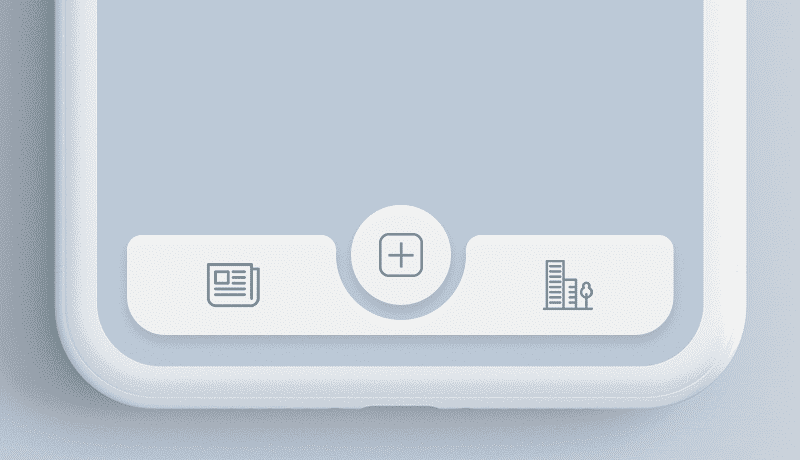

# 我们如何用 React Native 创建 Tabbar 插件

> 原文：<https://medium.com/hackernoon/how-we-created-tabbar-plugin-with-react-native-c00de2337f22>


现在，React Native 是跨平台应用程序开发的主要应用程序开发选择之一，在 [Mindinventory](https://www.mindinventory.com/) 我们非常喜欢它，但这不足以满足一个核心开发人员的愿望，不是吗？通常现在[谷歌的材料设计](http://www.mindinventory.com/blog/google-releases-material-designs-new-suite-of-tools-for-app-designers/)是高质量 UI/IX 的默认选择，我们想为什么不用最新的材料设计创造一些很酷的东西，并做出本土的反应，这让我们将这个概念变为现实。

编写这个漂亮的 Tabbar 代码并不像乍看上去那么简单。我们尝试了各种途径来开发它，最终我们做到了，它可以像设计的一样工作。

# 让我们来看看这个愿景的发展故事。

像往常一样，我们做了同样的事情，将这个想法放在一个应用程序中，我们搜索了各种插件，这些插件可以为我们提供预期的结果，但都是徒劳的，没有可用的插件可以工作，这是塞翁失马焉知非福，因此，我们为这个自定义标签设计开发了一个插件，它现在是开源的，你可以在你的设计中快速，简单地实现它。

第一种方法，我们尝试用 React 本地组件来做，但它没有像预期的那样工作，结果也不完全与设计的一样。所以，我们想出了另一个建造它的技术想法，让我们看看它是什么。同时你也可以在[转盘](https://dribbble.com/shots/4844696-Tab-bar-interaction-with-animated-icons)和[行为](https://www.behance.net/gallery/68043143/Tab-bar-interaction-with-animated-icons)上查看动画。



我们决定使用 SVG 组件创建一个完整的 Tabbar。下面是我们放在一起构建这个 Tabbar 的元素。

1.  中空半圆形 Tabbar
2.  圆形 Tabbar 项目
3.  Tabbar 项目图像
4.  切换时标签栏和圆形标签项中的动画。

因此，我们面临的下一个挑战是，React native 不支持 SVG，所以我们需要获得可以支持 SVG 的东西，我们发现了 react-native-svg 库，这是实现这一技术理念的一个突破点。

我们为圆形 Tabbar 项目和空心半圆形 Tabbar 创建了一个 SVG。

```
**import** Svg,{Circle,Path} from 'react-native-svg';<Svg version="1.1" id="bottom-bar" x="0px" y="0px" width='100%' height="100" viewBox="0 0 1092 260" space="preserve"><AnimatedPath fill="#f0f0f0" d={ `M30,60h${**this**.state.pathX}.3c17.2,0,31,14.4,30,31.6c0.2,2.7-0.3,5.5-0.3,8.2c0,71.2,58.1,129.6,129.4,130c72.1,0.3,130.6-58,130.6-130c0-2.7-0.1-5.4-0.2-8.1C${**this**.state.pathY}.7,74.5,${**this**.state.pathA}.5,60,${**this**.state.pathB}.7,60H1062c16.6,0,30,13.4,30,30v94c0,42-34,76-76,76H76c42,0-76-34-76-76V90C0,73.4,13.4,60,30,60z` }/><AnimatedCircle ref={ ref => **this**._myCircle = ref } fill="#f0f0f0" cx="546" cy="100" r="100" /></Svg>
```

接下来是使标签栏吸引人的关键点，即在两个标签之间切换时的动画。

好吧，在默认动画不起作用的地方，我们必须是创建者，必须创建一个定制的动画，因为这里默认动画不起作用，因为 Tabbar 的过渡动画由于中空的曲率和 Tabbar 中的曲率而失败，我们必须构建自定义 SVG，使用动态路径来支持动画和曲率。

下面是负责曲率过渡和圆形标签项的代码。

```
<AnimatedPath fill="#f0f0f0" d={ `M30,60h$ {**this**.state.pathX}.3c17.2,0,31,14.4,30,31.6c-0.2,2.7-0.3,5.5-0.3,8.2c0,71.2,58.1,129.6,129.4,130c72.1,0.3,130.6-58,130.6-130c0-2.7-0.1-5.4-0.2-8.1C${**this**.state.pathY}.7,74.5,${**this**.state.pathA}.5,60,${**this**.state.pathB}.7,60H1062c16.6,0,30,13.4,30,30v94c0,42-34,76-76,76H76c-42,0-76-34-76-76V90C0,73.4,13.4,60,30,60z`}/>
```

我们创建了一个圆形作为动画组件，Tabbar 作为动画路径。

```
**const** AnimatedCircle = Animated.createAnimatedComponent(Circle)**const** AnimatedPath = Animated.createAnimatedComponent(Path)
```

当用户点击标签切换动画作品，由于下面的书面代码的工作。

```
update(index) {**if**(index == 0) {**this**.setState ({selectedIndex: index,});Animated.spring(**this**.state.pathD,{toValue:22,duration: 10, friction: 10 }).start();Animated.spring( **this**.state.circleRadius, { toValue: 211, friction: 10 } ).start();}**else** **if**(index == 2){**this**.setState({selectedIndex: index,});Animated.spring(**this**.state.pathD,{toValue:691,duration:10,friction:10}).start();Animated.spring( **this**.state.circleRadius, { toValue: 880, friction: 10 } ).start()}**else** {**this**.setState({selectedIndex: index,});Animated.spring(**this**.state.pathD,{toValue:357,duration:10,friction:10}).start();Animated.spring( **this**.state.circleRadius, { toValue: 546, friction: 10 } ).start();}}
```

让标签项和标签栏看起来更有吸引力的方法是对其进行样式化。

```
TabBar.Item = TabBarItem;**const** styles = StyleSheet.create({container: {flex: 1,overflow: 'hidden',},content: {flexDirection:"column",zIndex: 0,width: (Dimensions.get('window').width - 30),marginBottom: '4%',left: '4%',right: '4%',},subContent: {flexDirection: 'row',marginLeft: 15,marginRight: 15,marginBottom: 10,zIndex: 1,position: 'absolute',bottom: 5,},navItem: {flex: 1,paddingTop: 6,paddingBottom: 6,alignItems: 'center',zIndex: 0,},navImage: {width: 45,height: 45,},circle: {bottom: 18,}});
```

将 Tabbar 默认状态设置为初始状态。

```
**this**.state = {
     selectedIndex: 1,
     defaultPage: 1,
     navFontSize: 12,
     navTextColor: "rgb(148, 148, 148)",
     navTextColorSelected: 'rgb(51, 163, 244)',
     circleRadius: **new** Animated.Value(546),
     pathD: **new** Animated.Value(357),
     pathX: "357",
     pathY: "675",
     pathA: "689",
     pathB: "706",
     showIcon: **true**
   }

**this**.state.circleRadius.addListener( (circleRadius) => {
      **this**._myCircle.setNativeProps({ cx: circleRadius.value.toString() });
});
```

这就是插件中要开发的代码。你可以在你的应用程序中使用这个插件，让它看起来很棒，让我们来看看如何使用它。

# 履行

```
**import** TabBar from "react-native-tab-bar-interaction";
...
render() {
 **return** (<TabBar>
        <TabBar.Item
         icon={require('./tab1.png')}
         selectedIcon={require('./tab1_sel.png')}
         title="Tab1"
         screenBackgroundColor={{ backgroundColor: '#008080' }}
     >
        <View>

        </View>
        </TabBar.Item>
        <TabBar.Item
         icon={require('./tab2.png')}
         selectedIcon={require('./tab2_sel.png')}
         title="Tab2"
         screenBackgroundColor={{ backgroundColor: '#F08080' }}
     >
        <View>

        </View>
        </TabBar.Item>
        <TabBar.Item
         icon={require('./tab3.png')}
         selectedIcon={require('./tab3_sel.png')}
         title="Tab3"
         screenBackgroundColor={{ backgroundColor: '#485d72' }}
     >
         <View>

         </View>
         </TabBar.Item>
         </TabBar>);
}
```

按照 [Github](https://github.com/Mindinventory/react-native-tabbar-interaction) 上提供的指南完成安装后，你需要导入“反应-本机-标签栏-交互”来将标签栏添加到你的应用中。

```
**import** TabBar from "react-native-tab-bar-interaction";
```

# 添加 Tabbar 项目:

```
<TabBar.Item
       icon={require('./tab1.png')}
       selectedIcon={require('./tab1_sel.png')}
       title="Tab1"
       screenBackgroundColor={{ backgroundColor: '#008080' }}
>

<View>
/*tabbar body content here*/
</View>
```

*你的应用程序必须包含 3 个选项卡。

# 1.在此行添加未选中的图标。

```
icon={require('./tab1.png')}
```

# 2.在此行添加选定的图标。

```
selectedIcon={require('./tab1_sel.png')}
```

# 3.在这一行添加标签标题。

```
title="Tab1”mind
```

# 4.在这一行添加标签屏幕背景颜色。

```
screenBackgroundColor={{ backgroundColor: '#008080' }}
```

在 [Github](https://github.com/Mindinventory/react-native-tabbar-interaction) 上查看 React Native Tabbar 的完整源代码。

[](https://github.com/Mindinventory/react-native-tabbar-interaction) [## mind inventory/react-native-tabbar-交互

### React-Native 的 Tabbar 组件。通过创建……为 mind inventory/react-native-tabbar-interaction 开发做出贡献

github.com](https://github.com/Mindinventory/react-native-tabbar-interaction) 

*原载于 2018 年 8 月 29 日*[*www.mindinventory.com*](https://www.mindinventory.com/blog/create-tabbar-plugin-with-react-native/)*。*