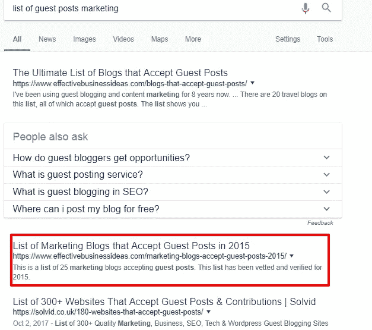

# 我们如何获得 400 个免费测试版(不涉及增长黑客)

> 原文：<https://medium.com/hackernoon/how-we-got-400-free-beta-testers-7b55ddb7cb2e>

你听过这个[启动叙述](https://www.kyleads.com/blog/startup-narrative/)吗？

想出一个主意，构建它，向全心全意接受你的观众推出，然后看着钱滚滚而来。

虽然这可能发生在少数人身上，但对我们这些普通人来说有点不同。

在你的产品进入黄金时段之前，它需要经过代表你的目标市场的用户群的测试。

这些测试人员会让你知道你是否在正确的轨道上，并帮助你发现错误和有用的功能。

您可以更多地了解您的客户，您的开发人员可以获得一个清晰的路线图，客户可以使用一个非常棒的产品。

**大家都赢了。**

[来源](http://www.quickmeme.com/meme/3shkxb)

过去，让人们注册你的应用很容易。现在——没那么多了。市场已经饱和。

在这篇文章中，我将分享我们是如何得到第一批 400 名测试者的，这帮助我们学到了宝贵的经验。

# 从(几乎)第一天开始写博客

当我们开始 [KyLeads](https://www.kyleads.com/) 的时候，它只是一个丑陋的登陆页面:

我们没有从第一天开始写博客，因为我们想要一个漂亮的博客来吸引我们的访问者。正因为如此，我们花费了大量的时间来设计和开发一个自定义的 WordPress 主题。

结果还不错，但是我们花了几个月的时间来来回回地做设计决策和处理出现的错误。

这是值得的，但我们应该从一开始就开始写博客，甚至在主题被设计的时候。

我们会在有机交通和社会足迹方面走得更远。你有得有失——对吗？

从那时起，我们专注于创建有深度的帖子，帮助那些我们有一天会称之为客户的人。

我们关注的主题有:这个关于[销售线索磁铁](https://www.kyleads.com/blog/lead-magnets/)，这个关于标题公式的[，还有这个关于](https://www.kyleads.com/blog/headline-formulas/)[网站优化](https://www.kyleads.com/blog/website-optimization/)。

因为这是一个新的领域，我们没有任何反向链接，观众，或社会足迹，我用我自己的邮件列表和社会帐户来推广我们的帖子。

从那里，我们获得了第一笔流量，并积极推广我们的邮件列表。

一些人会点击进入我们的主页并注册以获得我们测试版发布的通知。一旦邮件列表开始增长，我们就能够直接向他们推广帖子。

这是一个自我强化的循环，得到了回报。大约 25% (100)的测试用户来自与我们的博客内容互动的人。

# beta 测试人员的客座博文

当我们为我们的博客创建内容时，我们也注重通过客座博文传播信息。

我们从三个方面发现了机会。

1.  **我们追随利基市场的影响者**。

例如，我们只需输入尼尔·帕特尔或帕特·弗林，然后查看谷歌搜索结果。

前几个结果将是他们自己的网站和社交媒体账户。如果你继续下去，你会开始看到他们出现在其他网站上。

这向我们展示了否则我们会错过的机会。我们把每一个有前途的网站添加到电子表格中，并继续研究。

**2。我们使用 Ahrefs 反向链接机会**

如果你不熟悉 Ahrefs，它是一个 SEO 和竞争分析工具。我们会输入与我们处于相似空间但不直接与我们竞争的网站的 URL。

这给了我们一堆在我们的利基市场上链接的网站，它们有相似的受众群体。

我们对大约十个网站做了这项工作，并将它们添加到我们的电子表格中。

**3。用过的客座博文整理文章**

到目前为止，我们一直在寻找不明显的客座博文机会。他们中的大多数都没有积极寻找客座博文作者。

在我们用尽了这条路之后，我们走上了一条显而易见的路，在谷歌中输入了各种各样的“客博网站利基列表”。这带回了相当多的机会，并填写了我们的电子表格。

我们开始认真推销这些网站。以下是我们使用的营销方式:

**嘿名，**

**我叫(你的名字)，来自(你的公司/网站)。我在你的网站上阅读(文章名称)并喜欢(你喜欢的观点或观点)。**

**我想知道你是否对一些客座博文的想法感兴趣，我认为你的听众会觉得这些想法很有价值。**

**创意 1**

**想法二**

**和创意 3**

如果你选择其中任何一个，我会使用相关的图像和著名的参考资料来支持我的观点。以下是我过去写的一些文章的链接:

**链接一**

**链接二**

你也可以在社交媒体上找到我

**推特手柄**

**其他社会处理。**

我期待着你的回音。

**谢谢，**

**你的名字**

这让网站的编辑/所有者知道你花时间阅读了他们的内容，所以熟悉他们的风格。如果他们不喜欢第一个想法，这也给了他们一些选择的机会。

你也可以给他们看你以前写的地方，这样他们就可以知道他们是否喜欢你写的东西。

我很惊讶，因为有些网站会给我们回信息，告诉我们必须为客座博文付费。我从未为客座博文付费，也不打算开始。

其中一些很酷，我们在[销售渠道](https://bloggingwizard.com/low-touch-sales-funnel/)上找到了像这样的客座博文。

回过头来看，我们应该花更多的时间在客座博文上，但未来总是有的，对吗？

大约有 50 名用户通过客座博客注册了我们的 beta 测试。

# Quora

我在 Quora 上活跃了几年，在这个平台上有超过五百万的浏览量。我实际上挂在那里，并从中获得了很多乐趣，所以回答问题并链接到 KyLeads 是一个显而易见的事情。

Quora 策略的本质如下:

*   建立一个杀手档案，交叉推广你的数字资产(社交和网站)
*   关注您共享空间中的作者和主题(添加一些只是为了好玩)
*   选择关注者与回答比率较高的问题(确保他们至少有 20 名关注者)。
*   创建更长的答案(300-1000)单词，并在您的社交档案中分享。
*   添加带有行动号召的页脚

冲洗并重复。你可以在这里阅读更深入的使用 Quora 的指南。

几个星期以来，我几乎每天都在 Quora 上写文章，并把成千上万的访问者带回了 KyLeads。他们中的很多人注册了我们的邮件列表。

当尘埃落定时，我们有大约 100 名来自这条路线的测试者。

# 独立黑客

[独立黑客](https://www.indiehackers.com/)是一个充满创客的有趣社区。它是独一无二的，因为我们鼓励你分享你正在做的项目的链接。

如果你在 Reddit 上发布你的产品，你会被否决而被遗忘。在独立黑客上，如果你不分享你的产品，人们会要求你分享。

在过去的一年里，我是一名积极的成员。起初，我只是想分享我的经验，并向正在构建类似(和不太类似的产品)的人学习。

随着时间的推移，我有了几个关注者，数百个支持者，并与有趣的人建立了联系。

人们会浏览我的个人资料，点击我的网站。

除了一个关于独立黑客的产品页面，这是我唯一提到 KyLeads 的地方，除非有人问我一个直接相关的问题。

我们每周都有一些来自论坛的访客。

他们很快分享反馈，让你知道是否有任何错误或奇怪的设计问题。我们这里只有几个测试者(大约 20 个)，但是他们非常投入，所以这绝对是一个胜利。

# 贝塔界限

Betabound 是一个策展网站，将感兴趣的测试者和需要他们的人联系起来。除了 betabound 上没有付费选项之外，它们和 BetaList 没有太大区别。

该网站由 [Centercode](https://www.centercode.com/) 创建和维护，这是一家为高增长初创公司(read funded)和企业公司提供不同类型测试的公司。

我们向 betabound 提交了申请，几天后得到了回复，一周内就上了主页。

我们在网站上的表现还有很多需要改进的地方。这可能是因为他们的观众对我们的产品不感兴趣。

最终，我们从 betabound 获得了 34 次推荐访问，其中一些人成为了 KyLeads 的 beta 测试者。

# SaaS 目录

有很多 SaaS 目录，比如 G2 Crowd，SaasGenius，Capterra，GetApp 和其他目录。

我们并不热衷于使用这些平台，因为我们没有预算来注册他们的 PPC 活动，也没有内置的声誉/评论。

最后，我们将 KyLeads 添加到了 G2 Crowd 和 SaaSGenius 等几个最受欢迎的应用中。他们所有的审批过程都很简单，但这并不重要。

一旦我们在他们的网站上直播，我的团队希望流量开始滚滚而来。我没有被说服，因为我很清楚这些平台是如何工作的。

你拿出你放进去的东西。

我们没有投入太多的工作，所以我不指望能得到太多的好处。

我差点错过了推荐流量。来的没报名。我们从这条路线上总共得到了一个 beta 用户。

# 幻灯片共享

在阅读了 drift 使用的[策略来获得早期牵引力并为他们的博客建立受众后，我们受到了启发，重新调整了 SlideShare 上的内容。](https://blog.markgrowth.com/how-i-drove-28k-views-and-ranked-on-page-1-in-30-days-without-spending-a-dollar-c38157a0cb80)

我个人在 SlideShare 上取得了一些成功，并在他们的每日/每周综述中出现，所以我愿意尝试一下。

我们制作了两个演示文稿，时间比预期的要长。我们为我的个人 SlideShare 账户做了一个，为我们为 KyLeads 建立的全新账户做了另一个。

我个人账户上的那个只有 200 多点。

我们公司账户上的那个有 100 次浏览。

他们一起把 50 个人送回了凯列兹。坦白地说，我很震惊它给我们带来了这么多的推荐流量。

新手运气？

不管怎样，在这 50 个人中，有 10 个人决定注册成为 beta 测试者，来填补我们的数字。我再次对我们从 SlideShare 获得的参与度感到震惊。

这是我们计划在将来投入足够的精力来设计内容时重新考虑的事情。

# 我们做了一个赠品

我已经在这里详细地写了我们关于[赠品的经历。](https://www.kyleads.com/blog/host-a-giveaway/)

这是 TL。灾难恢复版本:

*   我们联系了一些我们尊敬的公司，与我们合作进行我们的赠品
*   我们招募了一些人，建立了一个价值 100，000+美元的奖金池
*   有大量的印象，但我们的转化率很低。
*   我们获得了 150 多名电子邮件订户。
*   在我们结束赠品后，他们非常积极地与我们合作
*   50+决定加入我们的测试版

这是我们遇到的最积极响应的一群人。我认为这与我们放弃的纯粹价值以及我们与合作伙伴一起为他们创造的折扣有关。

我们没有问，所以我们永远不会知道。

我们在测试期间注意到，通过赠品加入的人比我们通过其他渠道遇到的人需要更多的支持。

他们也直言不讳，并给了我们宝贵的反馈，告诉我们在哪些方面以及如何改善用户体验。

# 我们在 HARO 积极寻找测试者

我已经知道哈罗很多年了，但从未充分利用它的潜力。直到我听了皮特·沃尔特的《T2:喧嚣的国度》中的一集，我才决定重游此地。

我把这一集发给每个人，告诉他们报名参加哈罗。每天晚上，我都会坐下来浏览每天三次的电子邮件。

我每天至少会找到一个我能回答的请求。

为了确保每个人都在跟进，我会在早上 ping 他们，给我发送请求和他们的回复，这样我就可以帮助他们解决需要润色的问题。

我们通过这条路线得到了相当多的位置。

虽然直接推荐流量不多，但它对我们的搜索流量产生了积极的影响，在此期间我们的搜索流量开始增加。

分析这些来源的流量并不容易，因为并不是所有的来源都告诉我们我们的内容何时上线(或者他们是否接受了推介)。我们不得不[监控 ahref](https://www.kyleads.com/blog/affiliate-marketing-tools/)和我们的分析来发现它们。

通过将数据整合在一起，我们发现有 50 多人从 HARO 产生的推荐流量中注册了我们的测试版。

# 结论

如果你已经读到这里，我不需要告诉你测试人员对你最终的成功有多重要。我已经概述了我们用来获得 400 个测试用户的主要策略。

博客— 100

访客发帖— 51

Quora — 103

独立黑客— 18

β-bound-3

SaaS 目录— 1

幻灯片共享— 10

赠品— 56

哈罗——53 人

共计 395 人

(别开枪，我围捕了)

我们测试了很多渠道，但并不是所有渠道都成功。将这篇文章作为你努力设计一个测试的起点，它将帮助你最大化你的学习。

我们使用的一些方法可能有效，一些可能无效。如果你找到一个赢家，然后双倍下注。在测试阶段有效的东西在你发布时也会有效。

需要注意的是，beta 测试人员并不自动等同于参与用户或成功。在报名的 400 人中，超过一半的人在整个过程中退出了。

剩下的人并不像我们希望的那样投入。只有少数人像我们一样热爱我们正在做的事情。

这是制造产品的本质。

请在评论中告诉我们你是如何获得 beta 测试者的，不要忘记分享。

*最初发表于*【www.kyleads.com】