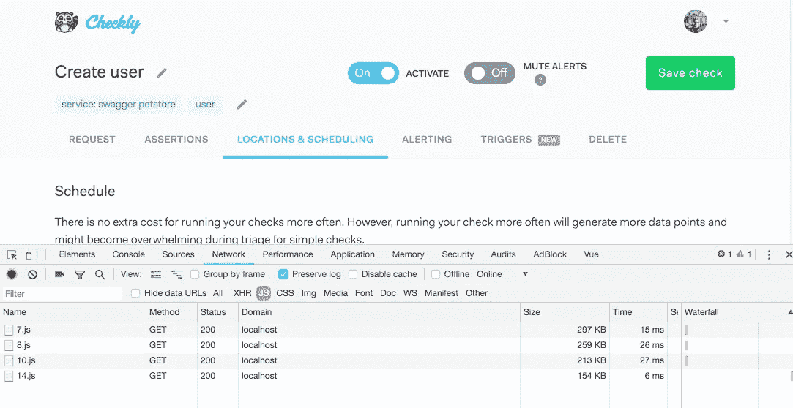

# 我们的 Vue.js 应用程序如何获得 100%的 Lighthouse 性能分数

> 原文：<https://medium.com/hackernoon/how-we-got-a-100-lighthouse-performance-score-for-our-vue-js-app-c6f9ca25714b>


“High Speed Tunnel” by Sekino Junichiro (late 20th century) — [Ukiyo.org](https://ukiyo-e.org/image/artelino/15177g1)

自推出以来，我们并没有过多关注主要 Checkly web 应用程序的前端性能。为我们感到羞耻。还有什么比谷歌的 Addy Osmani 在 2018 年出版优秀的[Javascript 的成本更好的理由呢？](/@addyosmani/the-cost-of-javascript-in-2018-7d8950fbb5d4)

TL；大卫:在我们的 Vue.js 应用程序上，花了大约半天时间从**糟糕的 34 分到了 100 分。**

# 关于 web 应用性能的简短入门

Osmani 的文章探讨了为什么 web/mobile 性能很重要，Javascript 与它有什么关系，以及关于移动设备、设备类型、渲染周期、加载等有什么问题。如果您不熟悉这些主题，请阅读它。要点是:

1.  Javascript 是网站性能中最昂贵的部分。不是图像，不是 CSS。
2.  更快的网站增加收入。
3.  优化 javascript 的性能是一个多步骤的、特定于受众和设备的过程。

如果你还想了解更多，可以去伊利亚·格里戈利克(也在谷歌工作)的[高性能浏览器网络](https://hpbn.co/)网站了解更多关于这个话题的知识。

# 运行灯塔

为了了解 Checkly 应用程序的当前性能，我在登录屏幕上运行了 [Lighthouse](https://developers.google.com/web/tools/lighthouse/) 。Lighthouse 是嵌入在每个 Chrome 浏览器中的性能审计工具。

不可否认，登录页面不是大多数用户花费大部分时间的地方，但它绝对是每个人都必须至少处理一次的页面。

Lighthouse 运行了以下设置，以针对目标受众进行优化:

*   **设备:桌面。**手机或平板电脑的使用并不是一个真正的因素(目前还不是？)针对 Checkly 目前的受众。
*   **审计:绩效。**其他选项有搜索引擎优化、可访问性等。我们只对性能感兴趣。
*   **节流:不节流。** Checkly 是一款 B2B、DevOps 应用。99%的用户将在办公室使用它。3G 和 4G 的性能并不那么重要。

请注意，设备和节流设置*对你正在阅读的网站和博客文章*很重要。至少 25%的 checklyhq.com 游客使用手机。

我们进行了测试，结果不言自明。**34 分**。很多红色的字母和警告标志。相当可怕。😞


一些“亮点”:

*   第一次有意义的绘画需要超过 6 秒钟。
*   CPU 又忙了整整一秒钟。

# 第一站:捆绑大小

我有一种挥之不去的感觉，我们发布的 Javascript 数量是“次优的”。Webpack 有一个很棒的[捆绑包分析](https://www.npmjs.com/package/webpack-bundle-analyzer)插件，它会告诉你你到底在打包(和运输)什么。

一个快速的 NPM 安装和 Webpack 配置中的几行代码，您正在运行:

```
npm i -D webpack-bundle-analyzer
```

在您的 webpack 配置中，只需添加:

```
const BundleAnalyzerPlugin = require('webpack-bundle analyzer').BundleAnalyzerPlugin ... 
plugins: [ new BundleAnalyzerPlugin() ] 
...
```

这将在每次构建后启动一个浏览器，并向您显示如下内容:


是的。也就是说，Checkly 总共发布了 2.01MB(未压缩的)javascript。与 Javascript 文章成本中推荐的 170KB 压缩/ 0.7MB 未压缩相差甚远。

我们的 Webpack 设置基于 Vue-CLI 引入的设置，并将代码拆分为**供应商**、**应用**和**清单**文件，如您在上面的截图中所见。这是一种常见的做法，确实有助于长期缓存供应商依赖关系，同时还能让您定期更新应用程序。

我们先攻击了 **vendor.js** 文件。

# gutting moment . js:1.75 MB-> 1.58 MB

Moment.js 是一个很棒的日期和时间处理库。它只是附带了完整的区域设置文件。我们在应用程序中不使用。遗憾的是，没有办法可选地安装它们，事实证明[我们不是唯一被这个](https://github.com/moment/moment/issues/2416)困扰的人。我们使用内置的 Webpack Ignore 插件消除了区域设置:

```
plugins: [ new webpack.IgnorePlugin(/^\.\/locale$/, /moment$/) ]
```

# gutting code mirror:1.58 MB-> 1.05 MB(！)

Codemirror 用于 Checkly 应用程序中的浏览器检查编辑屏幕。和 Moment.js 一样，它附带了一大堆我们没有使用的代码风格和主题。

幸运的是，已经有一个精简的代码镜像安装包 Vue.js，名为[vuecodemirrolite](https://github.com/cnu4/vue-codemirror-lite)。经过一些小的代码调整和 Monokai 主题和 Javascript 代码风格的单独安装，我们节省了将近 0.5MB！

# 移除完整 lodash: 1.05Mb -> 1019.82KB

快速代码扫描显示我们只使用了四种 Lodash 方法(`clonedeep`是黄金)。我们放弃了完全安装，只安装了我们实际使用的方法。洛达什人对此的支持值得称赞。

# bootstrap-vue 的智能导入:1.02MB - > 934.75KB

部分 UI 使用 Vue.js 版本的 Bootstrap，名为 [Bootstrap Vue](https://bootstrap-vue.js.org/) 。通过从库中导入我们正在使用的模块(模态、工具提示、导航等)。)我们得到了 1MB 以下的 vendor.js 包🎉

# 第二站:代码拆分

为了攻击 **app.js** 文件，我们查看了代码分割。代码拆分的思想是，使用 XHR 调用在正确的时间提供正确数量的 javascript。这意味着加载完整的应用程序不需要很大的前期成本。这将导致首次绘制和后续交互的时间更短。

[这篇关于 Vue.js 中代码拆分的文章](https://vuejsdevelopers.com/2017/07/03/vue-js-code-splitting-webpack/)描述了一些细节。要点是:

1.  你想使用组件，“单一文件”或没有。(通常我们使用单独的`.pug`和`.scss`文件)
2.  你想用 Webpack。阅读上面提到的关于如何设置的文章。如果你使用 Vue-CLI 来启动一个 Vue 应用，你已经很好了。
3.  你想按路线分开。还有其他选择，但这是迄今为止最直接的一种，通过请求页面导航上的资源，很好地模仿了传统(非 SPA)站点。

令我非常惊讶的是，实际上我们应用程序中唯一需要的改变就是我们的`router.js`文件中的一列导入语句。这可能不适用于所有人，但是在 Checkly 应用程序中，每条路线都整齐地映射到一个主/容器组件

这个:

```
import Login from './components/authentication/login' import Signup from './components/authentication/signup' 
...
```

变成了这样:

```
const Login = () => import('./components/authentication/login') const Signup = () => import('./components/authentication/signup') ...
```

现在，您可以有效地将标准的`import from`语句更改为 Webpack 特有的`import()`语句，从而实现组件的拆分和异步加载。您的路线分配代码甚至没有变化:

```
routes: [ { path: '/login', name: 'login', component: Login }, { path: '/signup', name: 'signup', component: Signup } 
...
```

在重建和重新加载应用程序后，看起来好像什么都没有改变。然而，在 Dev 工具中打开 Network 选项卡，可以看到导航路线时，编号良好的 javascript 块在网络上飞行。



# 再次运行灯塔

我们对包大小的减少以及实现代码分割的简单程度感到非常满意。我们对它的巨大影响没有做好准备。再次运行 Lighthouse 如上所述的相同设置——描绘了一幅完全不同的画面:100 分，绿色文本无处不在！哇！


如前所述，登录页面并不是应用程序中最令人兴奋的部分。我们在 home dashboard 和 check results 页面上运行了测试，这两个页面都包含了大量的 XHR 调用、数据解析和图形绘制。

**首页仪表盘**


**检查结果**


在这两个屏幕上，你可以看到“第一次 CPU 空闲”和“交互时间”大约是简单登录屏幕的两倍，但根据 Lighthouse 的说法，仍然很好。

# 结论

上述优化需要大约 4 到 6 个小时来实施、测试和推广。大部分时间都花在微小的代码调整上，以优化所使用的模块和库。时间花得值！

只要记住在迭代中工作

1.  瞄准一个区域。
2.  优化。
3.  衡量结果。
4.  转到 1。

*最初发表于*[*【checklyhq.com】*](https://checklyhq.com/blog/2018/08/how-we-got-a-100-lighthouse-performance-score-for-our-vue.js-app/)*。*

附:如果你喜欢这篇文章，请用**鼓掌**来表达你的欣赏👏下面还有 [**在 Twitter 上关注我**](https://twitter.com/tim_nolet) **！**但是等等，还有更多！

