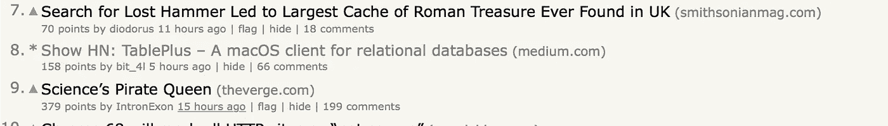
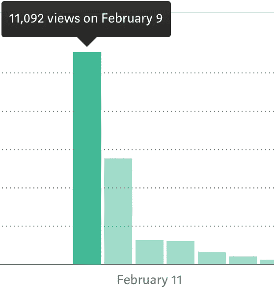

# 我们是如何出现在黑客新闻的头版…纯属意外

> 原文：<https://medium.com/hackernoon/how-we-got-featured-on-the-front-page-of-hacker-news-by-accident-78938b37092d>

TL；dr:在[黑客新闻](https://hackernoon.com/tagged/hacker-news)上提交的一篇文章在两天内就让 16000 多人访问了我们的博客。这篇文章记录了这段经历。

由于我们在技术领域工作，黑客新闻的头版就像圣杯一样。它给你带来流量、下载量、销售额、品牌知名度……这些都会对你的业务产生巨大的影响。每个人都很想得到它，但是它的空间有限，有时会有点棘手。你不能简单地通过分享链接来玩弄系统，并像在产品搜索中那样要求投票。事情不是这样的。它要求帖子的互动更加真实。

一点背景:我们正在构建 [TablePlus](https://tableplus.com/) ，这是一个现代化的本地工具，具有优雅的用户界面，可以帮助您以一种非常快速和安全的方式同时管理多个数据库，如 MySQL、Postgres、SQLite、Microsoft SQL Server、Redis…。它目前只在 macOS 上运行。

自从 7 个月前我们第一次发布以来，我们已经收到了很多用户的支持和积极的反馈。它让我们相信，有一天我们会成为《黑客新闻》的主角。我们只是不知道是什么时候。

**2018 年 2 月 9 日星期五**

那是一周的最后一个工作日，也是亚洲最大最重要的节日之一农历新年前的最后一个工作日。在这段时间里，我们把所有与工作有关的事情放在一边，回到我们的家乡，与家人共度时光。

我只使用黑客新闻来阅读新闻和寻找有趣的东西，但实际上从未提交任何东西。我想知道向黑客新闻投稿是什么感觉。所以在打包我们的东西离开办公室之前，我使用我的新账户，提交了我们的帖子[的链接，向黑客新闻介绍 TablePlus](/tableplus/modern-native-tool-for-relational-database-79efc35b647d) ，没有期待任何特别的东西。我只是想“检查一下”。

那是下午 4:30 左右。

我从 Medium post 上复制了确切的标题:**现代的本地关系数据库工具。**我得到了这个链接:[https://news.ycombinator.com/item?id=16339004](https://news.ycombinator.com/item?id=16339004)

大约 5 分钟后，我检查了提交，哇，2 分。我满怀希望地想，这可能是件大事。

10 分钟后，我检查了提交，1 点多。我查了头版，什么都没有。嗯，那已经慢下来了。

然后我把帖子的网址发给了我的联合创始人

[Still on it!](https://medium.com/u/ec6101542694#2。它正在蓬勃发展。
<figure class=)

[你可能注意到了，国防部把我的帖子的标题改成了【T2 展示 HN:】以表明我们正在展示我们的新产品，人们可以试用、反馈或提问。是啊，我也忘了。](https://medium.com/u/ec6101542694#2。它正在蓬勃发展。
<figure class=)

[我们知道速度是让你的帖子在首页停留更长时间的杀手锏。我们试图尽快回复那里的每个人，让他们开心，并产生更多的互动。大部分是赞美和个人经验分享。也有批评，但严厉的批评似乎很快就饱和了。也许人们也不喜欢它，并否决了它很多。别担心，:D](https://medium.com/u/ec6101542694#2。它正在蓬勃发展。
<figure class=)

# [结果呢](https://medium.com/u/ec6101542694#2。它正在蓬勃发展。
<figure class=)

[第一次登上头版几分钟后，我查看了谷歌分析，看看我们得到了什么。](https://medium.com/u/ec6101542694#2。它正在蓬勃发展。
<figure class=)

[没什么。没有一个来自 news.ycombinator.com 的新会话。我很困惑。太奇怪了，这应该会引起高峰。](https://medium.com/u/ec6101542694#2。它正在蓬勃发展。
<figure class=)

[然后我意识到我把链接放在了我们的媒体文章上，而我正在期待我们的](https://medium.com/u/ec6101542694#2。它正在蓬勃发展。
<figure class=)[原始博客文章](https://tableplus.io/blog/2017/12/modern-native-tool-for-relational-database.html)的流量。我真傻。这是一个不太好的举动，因为流量被过滤，大多数仍然在中等。只有当有人在评论区提到我们的网站后，它才把流量从 HN 直接带到我们的网站。然后我试图说服自己，与其立即下载应用程序，不如阅读我们的发布会，帮助人们更多地了解我们最初为什么以及如何建立 TablePlus。积极思考:D

几天后，我的帖子从最新新闻部分消失了，但它仍然在 Reddit、Twitter 和许多其他媒体上转发，带来了更多的流量，直到它冷却下来，一周后恢复正常。

这是我们帖子的流量情况:

第一天有 11092 次浏览，第二天又有 5540 次。两天内总共有 16632 次浏览。在一周内，Hacker News 上的帖子总共吸引了 23，453 名访客，我们的每日活跃用户在一天内超过了 400%，其中一半的数量直到今天仍然存在。这使得二月份的总收入比一月份增长了 200%。这是一笔不错的交易，对吧？

# 总结:我们是怎么上头版的？

**运气**。我毫无准备地提交了帖子，但我很幸运。那天也是周五，人不那么多，所以它有更高的机会登上头版，并在那里停留更长时间。然而，我猜它收到的流量比周中少。

**相关**。还记得《黑客新闻》的受众:黑客和创业者吗？因此，发布一些关于科技和创业的东西会让他们更感兴趣，也更有可能。我们的工具 TablePlus 是为开发人员设计的，因此它可以迅速吸引大多数人的注意。

**行动迅速**。正如我上面提到的，也许 HN 只关心你的帖子有机地获得互动(主要是向上投票)的速度。所以我们试着尽可能快。

讨人喜欢，避免被否决。也就是说，出现在《黑客新闻》上是一个巨大的成功，但这并不是从 HN 到美国的唯一途径。如果我们有一个蹩脚的产品，即使我们设法上了头版，它也可能很快被扔掉，因为那里的人很聪明，他们有权力否决或标记提交的内容。他们在几英里外就能闻到不好的邮件。我们很幸运，受到了社区的欢迎。所以，如果你正在做一些有用的东西来帮助人们，一定要有好运气。这也是了解你的受众和测试你的市场的好机会。

感谢阅读！如果你想知道是什么让 HN 用户对 TablePlus 感兴趣，请在这里免费查看工具。

黑客新闻上还有一个[隐藏规范列表，你可以了解更多。](https://github.com/minimaxir/hacker-news-undocumented)

享受黑客！