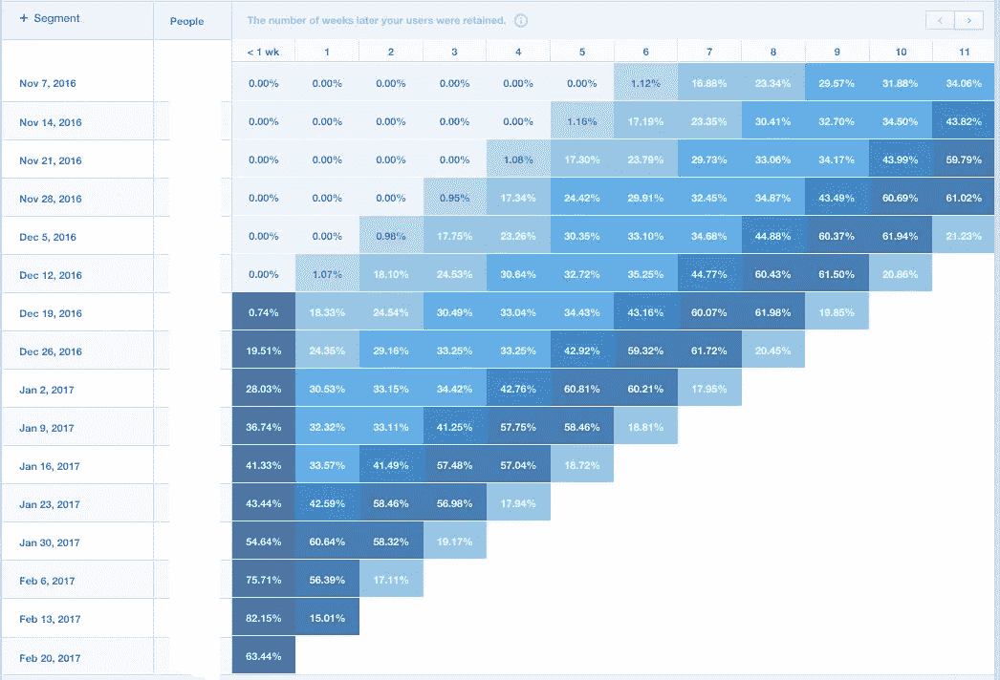
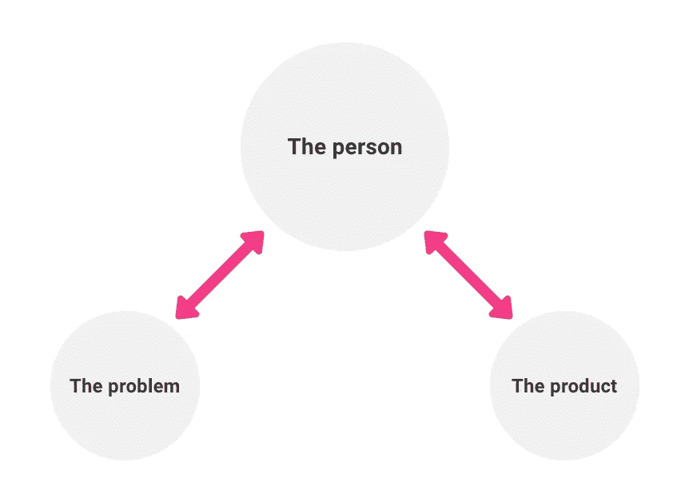
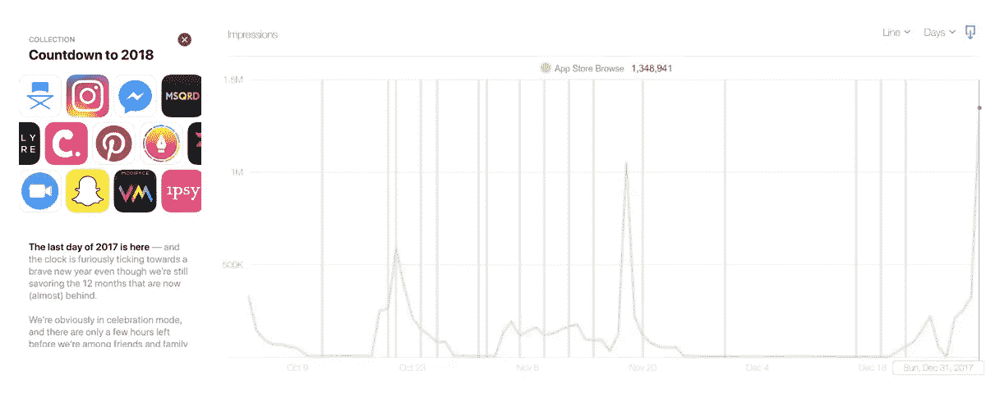
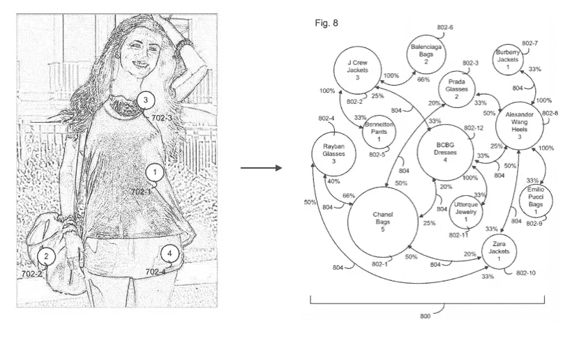
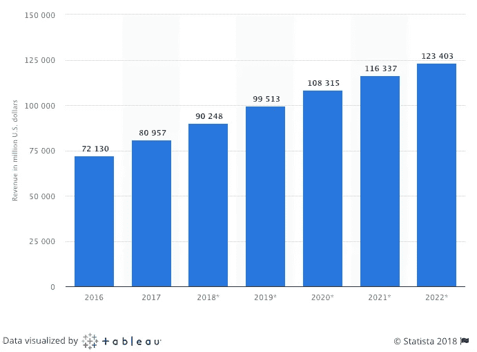

# 我们如何通过垂直机器学习方法，在我们的时尚应用上从 0 增长到 400 万女性

> 原文：<https://medium.com/hackernoon/how-we-grew-from-0-to-4-million-women-on-our-fashion-app-with-a-vertical-machine-learning-approach-f8b7fc0a89d7>

我叫 Gabi ( [我的简历](http://aldamiz.com/))，我是 Chicisimo 的首席执行官和联合创始人。我们在三年前发起，我们的目标是向提供自动化装备建议。今天，该应用程序上有超过 400 万名女性，我们希望分享我们的数据和机器学习方法如何帮助我们成长。情况很混乱，但现在已经得到控制。

# 我们的论点:服装和衣柜是了解人们品味的最佳资产。理解品味将改变网络时尚

如果我们想建立一个人性化的工具来提供自动化的着装建议，我们需要了解人们的时尚品味。一个朋友可以给我们一些着装建议，因为在看过我们平时的穿着后，她已经了解了我们的风格。我们如何建立一个学习时尚品味的系统？

我们以前有过基于品味的项目的经验，以及应用于[音乐](https://techcrunch.com/2006/04/04/new-features-at-musicstrands/)和[其他行业](http://web.archive.org/web/20081217022126/http://blog.strands.com:80/2008/10/16/100k-finalists-recsys/)的机器学习背景。我们看到了协作过滤工具如何将音乐产业从盲目转变为完全理解人们(查看[audioscopbbler](https://www.wired.com/2012/11/richard-jones-scrobbling/)故事)。也让热爱音乐的人生活的更美好，一路走来造就了几只独角兽。

在这种背景下，我们建立了以下论点:在线时尚将被一种理解品味的工具所改变。因为如果你理解品味，你就可以用相关的内容和有意义的体验来取悦人们。我们还认为“o*fits*”和“*我们自己的* *个人衣橱*”是可以让品味被理解的资产，可以了解人们在日常场合穿什么，以及我们每个人喜欢什么风格。

> 在线时尚将被一个理解品味的工具所改变。因为如果你懂得品味，你就能取悦人们。“O 配件”和“个人衣橱”是让品味被理解的资产

我们决定要建立一个工具来理解味觉。我们最终建立了自动化服装建议的基础设施:(I)一个存储你衣柜中衣服的消费者应用程序，以及一个专注于捕捉正确输入并提供正确输出的界面；(二)一个数据平台，自动解释输入数据，并向交付机制提供正确的输出；㈢一个数据集，反映人们穿什么，人们衣柜里有什么，以及人们在考虑衣服时的想法；(iv)保护上述所有内容的知识产权组合。

# **第一步:构建应用程序，让人们表达自己的需求**

从以前开发移动产品的经验来看，即使是在当时的 [Symbian](https://www.youtube.com/watch?v=jZvmyA6YVwo&t=70) 中，我们也知道让人们使用一个应用程序很容易，但留住他们却很难。所以我们专注于小的迭代来尽可能快地学习。

我们发布了一个非常早期的 Chicisimo 应用程序，它有一个关键功能。我们以另一个名字在另一个国家推出。你甚至不能上传照片…但它允许我们用真实数据迭代，并获得大量定性输入。在某个时候，我们推出了 *real* Chicisimo，并从 App Store 中移除了这个 alpha。

我们花了很长时间试图理解我们真正的留存杠杆是什么，以及我们需要什么算法来匹配内容和人。

三件事有助于保持记忆:

Releasing changes into the app.

**(a)使用行为群组**来识别保持力(我们使用 [Mixpanel](https://mixpanel.com/retention/) 来识别)。我们不仅对人们的行为进行分组，还对他们获得的价值进行分组。对于 Chicisimo 这样的应用程序来说，这很难被概念化。我们根据人们收到的具体和可衡量的价值来思考，衡量它，并对这些事件进行分组，然后我们能够迭代收到的价值，而不仅仅是人们执行的行为。我们还定义并移除了*反杠杆*(所有那些干扰主要价值的东西)，并获得了不同时间段的所有相关指标:第一次会议、第一天、第一周等。这些超级具体的指标允许我们迭代；

**(b)一旦我们了解了留住人才的手段**，请重新思考入职流程。我们将入职定义为新注册用户在失去他们之前尽快发现应用价值的过程。我们清楚地向自己阐明了需要发生什么(什么和什么时候)。事情是这样的:*如果人们在第一次治疗的前 7 分钟内不做(杠杆)，他们就不会回来。所以我们需要改变体验来实现这一点。*我们还对不同类型的人进行了大量的用户测试，观察他们如何感知(或者大多数情况下不感知)保持力；

**(三)定义我们如何学习。**上面描述的数据方法是关键，但在打造人们喜爱的产品时，数据远远不够。在我们的例子中，首先，我们认为*穿什么的问题*是一个需要解决的非常重要的问题，我们真的尊重它。我们沉迷于理解问题，以及理解我们的解决方案是否有帮助。这是我们表达尊重的方式。

这让我想到了构建产品最令人惊讶的一个方面:事实上，我们经常会接触到以前没有的新知识，这有助于我们显著地改进产品。当我们获得这些改变游戏规则的知识时，总是**通过关注两个方面:人们如何与问题相关，以及人们如何与产品相关(下图中的红色箭头)。在这两种关系中有一百万个微妙之处，我们正在通过试图理解它们来建立 Chicisimo。现在，我们知道在任何时候都有一些重要的东西我们不知道，因此问题总是:我们如何能更快地学会？**

This model helps us think. I understand that there are other models and this one might be controversial.

在与我的一位同事交谈时，她曾经告诉我，“这与数据无关，这与人有关”。事实是，从第一天起，我们就通过与女性交流，了解她们如何应对问题，以及解决方案，从而学到了很多东西。我们使用几种机制:进行面对面的交谈，阅读我们从女性那里收到的电子邮件，没有预先确定的问题，或者围绕特定主题征求反馈(我们现在使用 [Typeform](http://typeform.com) ，这是一个很好的产品洞察工具)。然后我们互相交流，试图把学到的东西清晰地表达出来。我们还寻求外部参考:我们与其他产品人员交谈，我们玩鼓舞人心的应用程序，我们重读帮助我们思考的文章。这个过程让我们能够学习，然后制造产品和开发技术。

在某个时候，我们很幸运地受到了 App Store 团队的关注，并且我们已经成为全世界的每日应用(查看苹果对 Chicisimo 的描述，[这里](https://itunes.apple.com/us/story/id1277633957?l=en))。12 月 31 日，在 App Store 团队的应用总结中，Chicisimo 被[列为特色](https://www.pinterest.com/pin/46936021101719264/)，我们是下面左图中的粉色“c”😀。

由于这一功能，该应用程序的[浏览量](https://www.pinterest.es/pin/46936021101719268/)达到了 957437 次，总计 130 万次。在我们的案例中，app 功能从印象到 app 安装有 0.5%的转化率(正常情况下:印象>产品页面查看>安装)；ASO 有 3%的转化率，推荐人有 45%。顺便说一下，我们还建立了一个通过 ASO 增长的方法，并在[Alexa Skills SEO-亚马逊 Alexa Skills Store 优化](https://aldamiz.com/the-guide-to-alexa-skills-seo-amazon-alexa-skills-store-optimization/)上发布了一个相关的帖子。

在下面的视频中，您可以查看我们的 iOS 应用程序的迭代。它显示了将衣服添加到您的[智能虚拟衣柜](https://fashiontasteapi.com/smart-virtual-closet-technology/)的机制之一，以及该系统如何为您的衣服提供即时想法。

Chicisimo [smart virtual closet technology](https://fashiontasteapi.com/smart-virtual-closet-technology/)

# **第二步:建立数据平台，了解人们的**时尚需求

我们的应用程序允许人们表达穿什么的需求，从客观的(服装类型、颜色、面料、印花……)到主观的(风格、场合、年龄……)。通过获取这些信息，我们可以更好地建议服装创意。传递正确内容的简单行为绝对让人们惊叹。

Chicisimo 内容是 100%由用户生成的，这带来了一些挑战:系统需要自动对不同类型的内容进行分类，建立正确的激励机制，并了解如何匹配输入和输出。

我们很快看到有大量数据进来。在想到“*嘿，我们多酷啊，看看我们拥有的所有这些数据*”之后，我们意识到这实际上是一场噩梦，因为由于混乱，这些数据是不可操作的。这一点都不酷。但后来我们决定开始给部分数据一些结构，我们结束了发明我们称之为社会时尚图。该图是需求、装备和人员相互关系的简洁表示，这一概念帮助我们建立了数据平台。该数据平台创建了一个高质量的数据集，与我们的应用程序——学习和训练世界相联系，因此，它会随着品味的每一种新表达而改进。

我们将服装视为播放列表:服装是可以一起消费的物品的组合。使用协同过滤，这里捕获的关系允许我们在应用程序的不同领域提供建议。

Screenshots of one of our patents. Chicisimo’s first source of data relations, and first representation of the Social Fashion Graph.

数据中仍然有很多噪音，最困难的事情之一是理解人们如何以不同的方式表达相同的时尚需求，这使得匹配内容和需求更加困难。很多人可能需要上学的想法，并以一百种不同的方式表达这种特殊的需求。你如何捕捉这种多样性，你如何为它提供结构？我们最终建立了我们的[时尚本体](https://fashiontasteapi.com/fashion-ontology/)——定义时尚产品或服装所需的所有描述符的多级列表，以及所有这些描述符之间的关系。它允许我们根据许多因素对内容进行自动分类，轻松匹配不同的目录，并让团队成员拥有共同的语言。

我们现在明白，如果你允许人们自由表达(应用程序)，同时背后有正确的系统(平台)，一个机构、一种需求或一个人可以有许多可以理解的**数据。结构化数据给了我们控制权，而鼓励非结构化数据给了我们知识和灵活性。**

当用户提供输入并响应输出时，整个体验鼓励他们提供进一步的输入。输入以(I)表达的品味的形式出现，例如表达他们喜欢什么类型的风格，表达就服装而言什么场合与他们相关，他们喜欢或拥有什么类型的服装。输入也以(ii)对内容进行分类的形式出现，例如将服装分组到所描述的相册中、给服装加标签、建立项目之间的相关性、提供相关查询等。这些输入为我们的团队提供了反馈，以构建更有效的界面并积累数据，这样我们就可以用它来响应更复杂的输入。

**最终结果是我们目前的无监督学习模型。一个学习一套服装的意义，如何回应一个人的需求或品味的系统。**

# 第三步:算法

当我们为音乐和其他产品建立推荐系统的时候，它是非常简单的(这是我们现在所认为的，我们当时显然没有这样认为:)。首先，很容易捕捉到你喜欢某首歌。然后，*很容易*捕捉到你和其他人听这首歌的顺序，因此你可以捕捉到相关性。有了这些数据，你可以做很多事情。

然而，我们很快发现，时尚也有自己的挑战。没有一种简单的方法可以将一套服装与可购买的产品相匹配(想想你衣柜里的大多数服装，你很可能找不到在线查看/购买这些服装的链接，而你可以为家里的许多其他产品找到链接)。另一个挑战是:该行业没有捕捉到人们如何描述衣服或服装，因此许多电子商务和购物者之间存在严重脱节(我们认为我们已经解决了这个问题。同样[相似。ai](http://Similar.ai) 和 [Twiggle](http://twiggle.com) 正在努力。另一个挑战是:风格很难被机器捕捉和分类。

我们的本体论解决了这个问题。最重要的是，我们的系统将时尚产品转换为元产品，元产品是任何目录或壁橱中特定产品的抽象。时尚产品是短暂的，但它的描述词不是，所以系统保留了价值。元产品是对产品最基本但相关的描述，我们的基础设施的首要任务之一是将任何到来的时尚产品转换成元产品。

# 为什么谷歌、亚马逊和阿里巴巴要进军服装行业？这是一场争夺 1230 亿美元市场的竞赛

在争夺 1230 亿美元的美国服装市场的竞赛中，服装是一项关键资产。数据也是许多玩家将*服装*带到技术前沿的原因:服装是一种日常习惯，并被证明是吸引和留住购物者并获取他们数据的巨大资产。许多玩家正在引入一个*商店，里面有真人的服装*:[亚马逊](https://www.amazon.com/af/shopthelook/feed?ref=specFW_11&ie=UTF8&keywords=nike&nodeID=7147440011&sr=1-11-acs&qid=1512246868&search-alias=fashion-womens&looks=2c9eba93-4882-46bc-8f92-2e8595438129,87012520-9d34-4995-a114-851374092a32,f12a3c2d-d4d1-4024-9371-afce154e3896,dd16de6a-ebd3-4da7-b357-f40d3e6177d1,5ef8772c-8482-42a7-bf32-1658ef4e2f39,e8ea36b2-e0c1-48dc-ab91-8f1c9645e04f,d9194396-7f3f-424d-8256-e8873fc8217a,00f0f539-a6f7-43d1-8d7c-e3d2af7d0318,5489e056-de96-45a1-a9b8-7b3562cb8732,2ae95344-f4da-4cbf-a2e4-e030577ffa89,5676e7a3-b924-460a-8899-d0910ffedc90,bb4afde2-a99f-44fa-bf7f-68dfdcdd9a76,58da64d7-2f6e-482b-9271-b0989edf0962,a2464ae7-936d-4097-99a4-a4da9c1fd42d,20e75d69-da35-48f5-a4da-11b76ccd3529,7a82c125-9739-4313-8cc4-35362f12bc1e,6d93f206-1a94-4f16-828f-aa40d99a0954,5e6af0b1-c7f7-4569-806e-741812793b58,570ec30d-1721-4623-89d8-e179680bb3b8,47b6318c-ddf0-42d6-82c7-9bddd4e82961,ff021b07-3e2f-4cc1-826f-80ab6da3f1c1,952c048c-10f2-447b-a4ed-90f5447249a3,8c04410e-404a-4cb9-b097-9c9f44db680c,c7833a55-f9bd-4d0b-b8eb-fb79b9fc1082,01eff3f6-dbaf-4875-9a47-4077e2f1b46b&psd=1)， [Zalando](https://www.zalando.de/get-the-look-damen/) 或[谷歌](https://techcrunch.com/2016/09/06/google-is-launching-shop-the-look-to-let-you-search-and-shop-by-outfit/)就是几个例子。

谷歌最近推出了一个名为[*的新功能，展示了一款*产品如何在现实生活中佩戴**](https://www.blog.google/products/search/now-image-search-can-jump-start-your-search-style/)*。同月，亚马逊[推出了](https://www.recode.net/2017/4/26/15436228/amazon-echo-look-alexa-camera-video)Alexa Echo Look 来帮助你搭配服装，阿里巴巴的人工智能私人造型师[帮助他们在光棍节期间实现了创纪录的销售。](https://www.technologyreview.com/s/609452/alibabas-ai-fashion-consultant-helps-achieve-record-setting-sales/)*

**

*Apparel, footwear and accessories retail e-commerce revenue in the US ([source](https://www.statista.com/statistics/278890/us-apparel-and-accessories-retail-e-commerce-revenue/)). “Clothing and shoes“ is the largest product category in the US ([source](https://www.statista.com/statistics/311406/us-online-shopping-categories-gender/)).*

# *更新:2020 年 10 月，我们关闭了奇奇西莫*

*我编辑这篇文章是为了告诉大家，很遗憾，我们已经关闭了 Chicisimo。你可以在[奇奇西莫验尸](https://aldamiz.com/chicisimo-postmortem/)中读到发生的事情。*

*如果你需要联系，请发电子邮件至[***aldamiz@d1w3.com***](mailto:aldamiz@d1w3.com)*