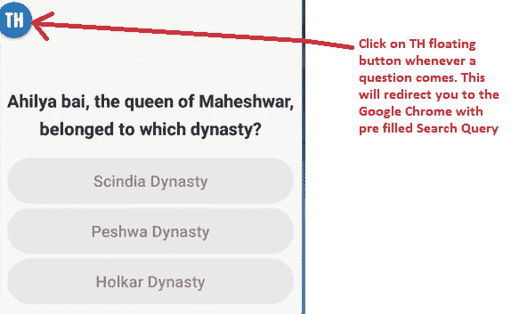
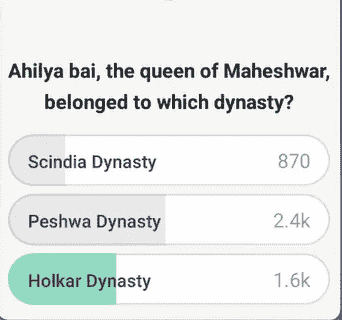

# 我们如何破解 HQ 琐事，Loco，BrainBaazi 以及他们如何防止它

> 原文：<https://medium.com/hackernoon/how-we-hacked-hq-trivia-loco-brainbaazi-and-how-they-can-prevent-it-5e40c97179ec>

我和我的朋友 Nitesh 曾经玩过 [HQ Trivia](https://play.google.com/store/apps/details?id=com.intermedia.hq) 、 [Loco](https://play.google.com/store/apps/details?id=com.showtimeapp) 和 [BrainBaazi](https://play.google.com/store/apps/details?id=com.brainbaazi&hl=en) 这是一个现场游戏节目应用程序，它会问几个问题，并向获胜者提供现金奖励。每个问题有 3 个选项和一个正确答案。为了进入游戏，你必须在 10 秒钟内回答问题。

这篇文章告诉你如何黑掉这类应用程序并赢得现金奖励。我们已经建立了一个名为“TriviaHack”的 android 应用程序，它可以读取问题及其答案选择，并帮助您通过在谷歌浏览器上搜索来回答问题。这就是应用程序的工作原理。该应用程序使用其唯一的 ID 读取问题，该 ID 分配给应用程序的所有文本。然后应用在谷歌 Chrome 上搜索问题。

# 唯一 ID

以下是问题和答案选项的唯一 id。

## 总部琐事

问题的唯一 ID 是`question`，答案 1 至 3 的唯一 ID 是`answer`

## 发疯的

问题的唯一 ID 是`question`，答案 1 到 3 的唯一 ID 是`answer`

## 布兰巴兹

问题的唯一 ID 是`text_question`，答案 1 的唯一 ID 是`button_option1`，答案 2 的唯一 ID 是`button_option2`，答案 3 的唯一 ID 是`button_option3`

一旦你有了唯一的 ID，你就可以得到文本并随意使用它。在这里，我们将搜索文本，即谷歌浏览器上的问题。

# 如何使用 TriviaHack

以下是使用 TriviaHack 对任何问题给出正确答案需要遵循的步骤。

**A)** 允许 TriviaHack 的访问权限。

每当问题出现在屏幕上时，点击圆形按钮。

**C)** 你会在谷歌 Chrome 搜索栏看到这个问题。

**D)** 快速阅读搜索结果，寻找可能的线索，选出正确答案。

**E)** 在琐事游戏秀 app 中选择正确答案选项。

你大功告成了。

对所有其他问题重复步骤 1 至 5。

应用程序的源代码可以在这里找到。

你也可以下载 APK。

# 他们如何预防它

以下是这些应用程序如何防止此类攻击。

android 中的每个视图都有一个字段`android:importantForAccessibility=”no”` ,如果这个字段存在，那么 accessibility 将无法读取该视图中的文本。

请👏这篇文章如果你觉得有趣！

> 快乐编码