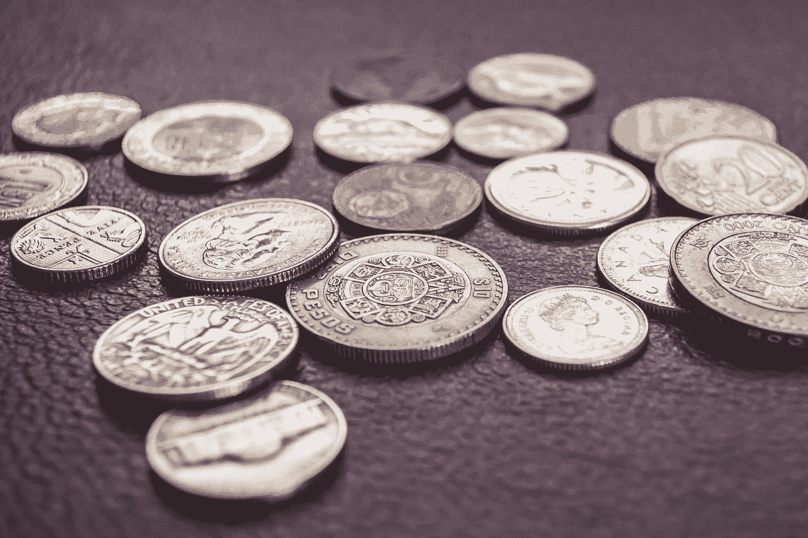
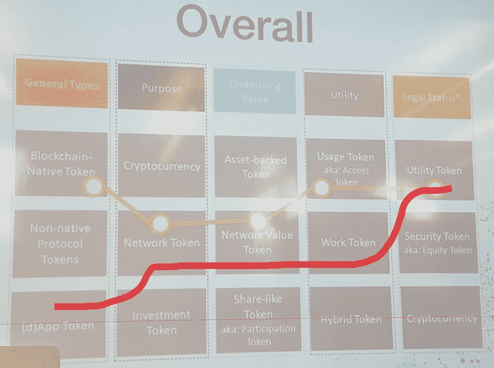

# 我们如何识别我们项目的记号组学

> 原文：<https://medium.com/hackernoon/how-we-identified-the-tokenomic-of-our-project-3163b9e73bd2>

> 这是“创业 180 天”系列的第 7 篇文章，记录了我的企业家之旅。如果你想从头开始，请点击[这里](https://theascent.pub/180-days-to-start-up-1-documenting-my-journey-to-building-a-potentially-valuable-solution-1b79191ccca3)看第一篇文章。

“round gold-colored and silver-colored coin lot” by [Steve Johnson](https://unsplash.com/@steve_j?utm_source=medium&utm_medium=referral) on [Unsplash](https://unsplash.com?utm_source=medium&utm_medium=referral)

# 令牌的用途

为了识别一个区块链项目的[令牌](/singulardtv/tokenomics-101-the-emerging-field-of-token-economics-e253b9e72ba3)，我们需要首先**弄清楚区块链如何在 [i](https://nodis.io) t 中扮演**的角色。最终，**令牌是双产品，作为对那些为生态系统做出贡献的人的奖励**。

在我们的[联合创始人的文章](https://hackernoon.com/blockchain-buzzword-or-a-whole-new-world-38fd749d7135)中，他谈到了区块链消除中间人的能力。*集中式的应用程序不需要多方之间的协调者来处理事务。根据应用程序以及如何利用这种优势，它可能会给用户带来显著的好处。*

*这里的关键词是**分权**。在我们看来，这是区块链最大的卖点。其他一切(加密货币、智能合约、令牌组学等)都是为了支持应用程序的去中心化方面。我们相信一个基于区块链的产品应该有一个去中心化的方面，这对用户来说是*实际上*有益的。*

## *[*nodis . io*](https://nodis.io)*区块链的用例**

*为了避免作弊，我们需要一个把关过程来验证所有的挑战提交。在我们的[用例](/@willchen319/what-is-nodis-io-trying-to-do-983cc67255aa)中，区块链在 ***分散我们平台*** *的投票功能中起着关键作用。*它有效地消除了对挑战提交批准流程的监督需求。如果我们以传统的方式来做，我们可能不得不要求企业所有者自己来批准所有的提交。这可能会有问题，因为:*

*   *在一周 7 天每天工作 12 个小时以上后，他们可能没有时间审阅数百份提交的材料。*
*   *个人决策经常受到偏见或个人驱动的影响。*
*   **挑战参与者可能不相信企业所有者拒绝后的决定。**

*通过分散投票机制并允许整个网络帮助验证，我们可以透明地自动化该过程并最大限度地减少业务用户的时间投入。它还可以帮助企业避免直接与愤怒的挑战参与者打交道，因为他们的提交被拒绝。*

*至于 NODIS 令牌本身的 ***作用*** ，则是 ***奖励系统*** 对于那些 ***促成给予商家更多线上曝光*** 。挑战和提交投票都是让企业在网上受到关注的循环的一部分。最重要的是， ***使用 NODIS 代币*** 兑换代金券的能力将激励用户在店内购物，这意味着 ***更多的流量*** 。*

# *令牌的特征*

*了解区块链和代币的用途是开发可持续代币的关键。根据 Nasser Rahal 的说法，代币有几个特征需要考虑:类型、目的、价值、效用和法律地位。*

**

*Image taken from Nasser’s Tokenomic presentation in York University of Canada*

*对于任何使用加密货币的项目来说，将代币有效集成到生态系统中绝对至关重要。每个令牌都因其在不同存储桶中的特征而独一无二。上面的红线显示了 NODIS 令牌的定位。*

*   *通用— **(d)App Token** —投票机制是去中心化的，对生态系统至关重要。不仅所有后 ICO 新令牌将从挑战中铸造，这是企业将获得在线曝光的好处。*
*   *目的— **网络代币** — Nodis.io 是一个社交媒体营销平台，需要人们的网络贡献，以增加代币的发行量。*
*   *潜在价值——基于网络效应的价值——随着越来越多的人帮助企业获得曝光率，越来越多的企业可能会加入网络。由于更多种类的优惠券和更多地点，这将增加效用潜力。*
*   *效用— **工作代币** —完成挑战和为提交投票是赚取新代币所需的工作。*
*   *法律地位— **公用令牌** — NODIS 令牌旨在用作 Nodis.io 上的代金券交换媒介。*

# *这对我们的用户意味着什么？*

*总之，我们对区块链使用和 tokenomic 的研究/评估帮助我们设计了 Nodis.io，为我们的用户提供了以下好处:*

*   *区块链将允许提交投票机制中的透明和自动化— *业务* *节省时间，同时仍然获得最大曝光度**
*   *企业不需要花费成本来吸引人们挑战，因为挑战者将获得代币的报酬——企业 *省钱**
*   *所有用户都可以使用 NODS 代币购买代币—*
*   **出售代金券获得的代币可以被企业用来购买更多的挑战，以获得更多的曝光率— *抵消代金券折扣商业成本的实用工具***
*   **代币具有独立的价值，可以兑换成法定货币— *这是企业抵消代币折扣成本的另一种可能方式***
*   **企业可以与加密货币联系在一起— *成为吸引千禧一代的潮流(47%的人表示，如果加密货币容易获得，他们愿意购买)***
*   **Nodis.io 可以让国外客户受益，因为代币没有边界— *位置的灵活性***

**在我的下一篇文章中，我想谈谈我是如何为我的客户和公众开发一条信息的。为什么这很重要？当我第一次询问人们对我们想法的反馈时，我让 95%的人感到困惑。区块链的概念令人困惑，这个概念本身一开始也不容易理解。**

**最终，我的目标客户是小企业，他们通常在适应新技术方面比较晚。如果我从“区块链”或“加密货币”开始，获得他们的认同将非常困难。**

**如果你觉得我写的东西有一点点有趣，请在媒体上关注我，并给我一些掌声。也可以在 [Telegram](https://t.me/nodisgetnoticedgroup) 和 [Instagram](https://www.instagram.com/nodis.io/) 上关注我们，获取最新内容和项目更新。感谢阅读！**