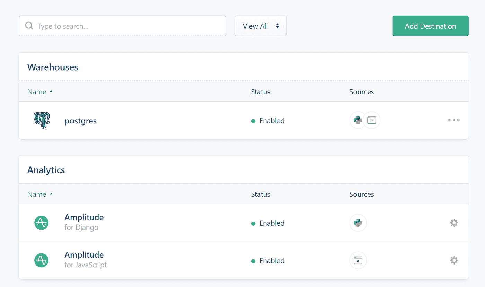

# 我们如何将应用的用户参与度提高 150%

> 原文：<https://medium.com/hackernoon/how-we-increased-user-engagement-in-our-app-by-150-8077831ff698>

当我刚开始从事产品开发时，产品完成的那一刻常常让我感到害怕——接下来我该做什么？我如何吸引顾客？我如何留住他们？

使用自动化方法降低 B2C 产品的流失率已经成为我实现目标的方式。经过多年的经验积累，我设法在不到 3 个月的时间里将我最新的应用 StoryTold 的粘性和花费时间增加了 150%。想知道怎么做吗？敬请关注。

 [## 我们如何将应用的用户参与度提高 150%

### 终于到了:你的产品完成的时刻，你需要进入下一阶段的客户…

producttribe.com](https://producttribe.com/case-studies/increased-user-engagement-app-150) 

**我们的产品是关于什么的**

科学和文学研究早已证明了故事在人类历史和发展中的重要性。自古以来，人们就通过故事来传递价值观、信仰、家庭传统和秘密。

我们创建了一个数字讲故事服务，帮助父母为他们的孩子编写简短有意义的故事，以便孩子们可以更好地了解他们的父母，并与他们保持联系，无论家庭情况如何。

**任务:吸引用户并为他们带来价值**

在 StoryTold，我们相信，如果故事做得好，可以拉近父母和孩子的距离，增进他们的联系，加深他们的信任。这就是我们把这作为神圣目标的原因。和我的同事一样，我知道为人父母不是最容易的工作，我们试图帮助其他父母度过这条道路上的坎坷——在他们购买订阅之前和之后。

我们的计划是:

1.  了解用户:他们的年龄、性别、问题类型和目标。
2.  在正确的时间给他们发送正确的信息。
3.  分析我们的方法对客户及其子女的影响，并在必要时进行纠正。

我们必须开始两个平行的过程，因为孩子和父母需要被不同地分析和参与。对我们来说，这意味着我们必须努力工作，创造细分市场——振幅——出站——web hook 包。

下面，我将详细介绍上面提到的三个阶段——我们如何发现我们的用户是谁，他们想达到什么目的，我们如何知道何时向他们发送哪些消息，以及我们如何分析我们的消息产生的效果。

**解决方案:实施分段-振幅-出站-Webhook 方法**

**1。使用段**收集数据

起初，当用户登陆我们的网站时，我们用 Google Analytics、Heap 和 Hotjar 对他们进行分析。

但是一旦他们去 app . story tell . io 试用这个应用程序，他们就注册并提交他们的数据。这意味着，当用户购买订阅时，他们的数据将被分类并进入细分市场。然后，我们用分段和幅度来分析。该分析还依赖于以下 SaaS 工具的业务模型:

-按每月跟踪的用户数量(MTU)划分账单

-每月事件数量的振幅账单

-按消息用户数量列出的出站账单

这样，我们可以免费开始我们的分析。但是随着我们用户群的增长，我们的成本也在增长。它不适用于 B2C 免费增值模式，但 StoryTold 使用免费试用模式，因此对我们来说很好。

要使用 Segment，我们必须将其集成到我们的软件中。幸运的是，Segment 提供了前端、python 后端(java、PHP、Python、go、node.js 等)的源代码。)和移动应用(Android、iOS、Xamarin、AMP)。

在我们的例子中，它是前端、后端 web 和移动应用程序(Android、iOS)。通过 Segment，我们从前端(JavaScript for web 和 React Native for iOS 和 Android 应用程序)和基于 Python 的后端收集数据。

借助于[识别](https://segment.com/docs/spec/identify/)呼叫来进行前端用户的识别。一开始，Segment 给每个用户一个特定的 ID。然后，从后端接收的有关登录用户的所有必要信息从前端传送到“识别”呼叫。我们将发送推送通知和电子邮件所需的用户属性传递给“identify”。通常，这些属性包括用户 ID、用户名、电子邮件、性别、与孩子的家庭关系(父亲、母亲、继父、继母)等。

用户动作通常通过[页面](https://segment.com/docs/sources/website/analytics.js/#page)(及其移动版[屏幕](https://segment.com/docs/sources/mobile/android/#screen))和[跟踪](https://segment.com/docs/sources/website/analytics.js/#track)调用来跟踪:

*   “页面”允许记录网站页面浏览量，以及关于被浏览页面的附加信息。
*   “跟踪”允许记录网站上高度定制的用户操作，直到将光标悬停在网站元素上(或者，对于移动应用程序，触摸触摸屏)。

我们还使用该服务来“跟踪”在后端生成并直接发送给 API Outbound 的事件。通过这种方式，我们可以传输用户属性，这些属性可能会有所不同，但对于一些个性化消息来说仍然很重要。

例如，对于 StoryTold，这样的属性可以包括故事草稿的标题列表，或者诸如已写故事或已写单词的数量之类的每周报告数据，或者孩子阅读父母的故事所花费的时间。我们通过“识别”将一些变量发送到细分市场，通过“跟踪”将一些变量发送到细分市场。

对于每个事件，我们分配必要的自定义属性——这些数据很容易实时调试。

总之，**我们为每个用户分析了大约 40 个变量和事件。**这使我们能够尽可能地为他们中的每一个人定制用户体验。

**1.1 根据振幅对用户进行分类**

没有父母或孩子是相同的，对我们来说，这意味着我们必须找到一种个性化的方法来对待他们中的每一个人。在这里，振幅中的类别派上了用场，振幅可以很容易地与段集成。

我们删除所有事件，并设置仪表板和图形来满足我们的需求。幸运的是，Amplitude 有很多工具可以解决这个问题。

以下是一些帮助我们分析 StoryTold 的仪表板示例。我们设置了每天 5 分钟的快速产品状态评估分析，以及更深入的分析，使我们能够获得深刻而可靠的见解。

我们开发了对我们的应用程序至关重要的分类系统。它被称为格拉夫系统。它通过以下方式分析用户:

*   性别
*   关系
*   年龄
*   通信频率

这样，**一个 12 岁女儿的勤劳母亲和一个 8 岁男孩的离异父亲得到了完全不同的体验。通过帮助他们个性化应用程序，我们帮助父母编写他们的孩子渴望阅读和评论的故事。**

地理和孩子的数量是我们可以用来分析的一些其他标准。图表显示了趋势和分类:

截图上的许多参数被标记为“无”。这意味着父母还没有填写完他们的个人资料。

另一个很好的见解是，会话持续时间显示了一个有趣的动态:

此外，还可以通过以前的访问和查看次数、故事类别和时间来过滤数据。此外，还有很多有趣的东西，比如行为群组，但我们还没有到达那里。

我们接下来要做的是，通过轻轻拨动 API 键，将所有这些数据和类别传输到出站:

**2。通过出站**发送消息

在我们弄清楚我们的用户属于哪个类别之后，我们可以开始给他们发送定制的消息。为此，我们使用 Outbound——它有一个非常方便的消息构造函数。通过考虑以下参数，我们可以为每个用户创建高度定制的触发消息:

*   触发器(对于 StoryTold 来说，它是在不同的类别中编写故事和评论)
*   用户类别(母亲、父亲、不同年龄的孩子、不同交流频率等。)
*   时间(一个故事多久前被放入某个类别，从完成草稿到发布一个故事之间经过了多少时间等等。)

最重要的是，有一种方法可以 A/B 测试不同的消息变体，每个变体都有一个给定的覆盖率。然而，我们的观众还不够多，我们无法在这样的测试中获得可靠的数字。

所有这些数据都可以用来创建大量的活动。

通过这种方式，我们可以单独激励用户写故事并获得评论。另一端，家长明白这种沟通的重要性，带着感激之情接收每一条推送通知。在我们这样一个疯狂的世界里，很容易从重要的谈话转移到 Instagram 上大众喜欢的小猫视频。

出站真的很酷，它允许我们同时与开发人员和我们产品的生产模式一起工作。在创建时事通讯时，我们可以首先使用产品的开发者模式来测试它们。如果活动按预期进行，我们可以在生产模式下通过单击启动活动。

接下来，我们可以调试与派单相关的所有流程，并查看属于派单一部分的所有事件的日志——从导致派单的事件，一直到派单本身！

如果通过出站发送电子邮件被证明是小菜一碟，那么推送通知就不会直接通过 Firebase 云消息令牌发出。我们必须为推送通知制作一个后端 webhook，并通过我们应用程序现有的调度系统发送它们。

**3。分析振幅和出站**

在这一部分，我们检查我们的激励努力是否成功，以及不同类别的用户行为如何。重要的是，不仅要进行复杂的整合，还要了解我们的信息在多大程度上吸引了用户，并帮助父母和孩子变得更亲密。保留率显示故事讲述功能是否被使用以及如何使用:

在这张图片中，你可以看到父母为他们的孩子写的不同类别的故事的受欢迎程度。您还可以看到基于家长自己想法的提示使用和书写的动态比较。

Outbound 还提供了一个很棒的功能——它可以跟踪活动的效率。因此，您可以看到用户是否根据收到的电子邮件或通知采取了行动。

由于这一功能，我们在推送通知中收集了最佳 CTA，并优化了调度时间，以便每个用户都能在正确的时间收到激励消息。

当我们在开发我们的应用程序时，我们意识到，如果你不能衡量他们并向他们展示结果，人与人之间的联系就无法改善。这就是为什么我们衡量用户在应用程序中的活动，并向他们发送每周报告。这样，他们可以看到自己一周的进步，并做出结论。多亏了 Outbound，我们甚至可以在没有开发人员参与的情况下完成所有工作。

我们的每周报告包括许多来自后端的变量:

使用所有这些集成，企业能得到什么？

如果你认为我为什么要经历这些麻烦，那么请记住我们的数字，我们增加了 150%的粘性和花在应用上的时间。但这并不意味着我们会停下来。我们必须从我们的成功中吸取教训，并将其转化为更大的成功。你也应该如此。

正如你所看到的，没有什么复杂的，像这样的工具不是只有大公司才应该使用的。请随意尝试用户参与，获得一些见解。如果你热爱你所做的事情，你会希望你的企业保持运转，成长和发展。我提供给你的是一个非常简单的方法。真心希望我的见解能帮你留住客户，做大做成功。不要放弃，相信你自己，你的团队和你的产品。

> 嘿！
> 
> 关于[如何提高用户参与度](https://producttribe.com/case-studies/increased-user-engagement-app-150)的文章由[数据科学家 Oleksandr Kot](https://producttribe.com/author/oleksandr-kot) 撰写。最初发表于产品部落博客。
> 
> 特意分享给[**hacker noon**](https://hackernoon.com/)**读者。**

# **想为产品部落博客写稿吗？**

# **发送您关于 yaroslav@producttribe.com 的文章**

# **如果你觉得这篇文章有用，请点击👏下面的按钮:)**