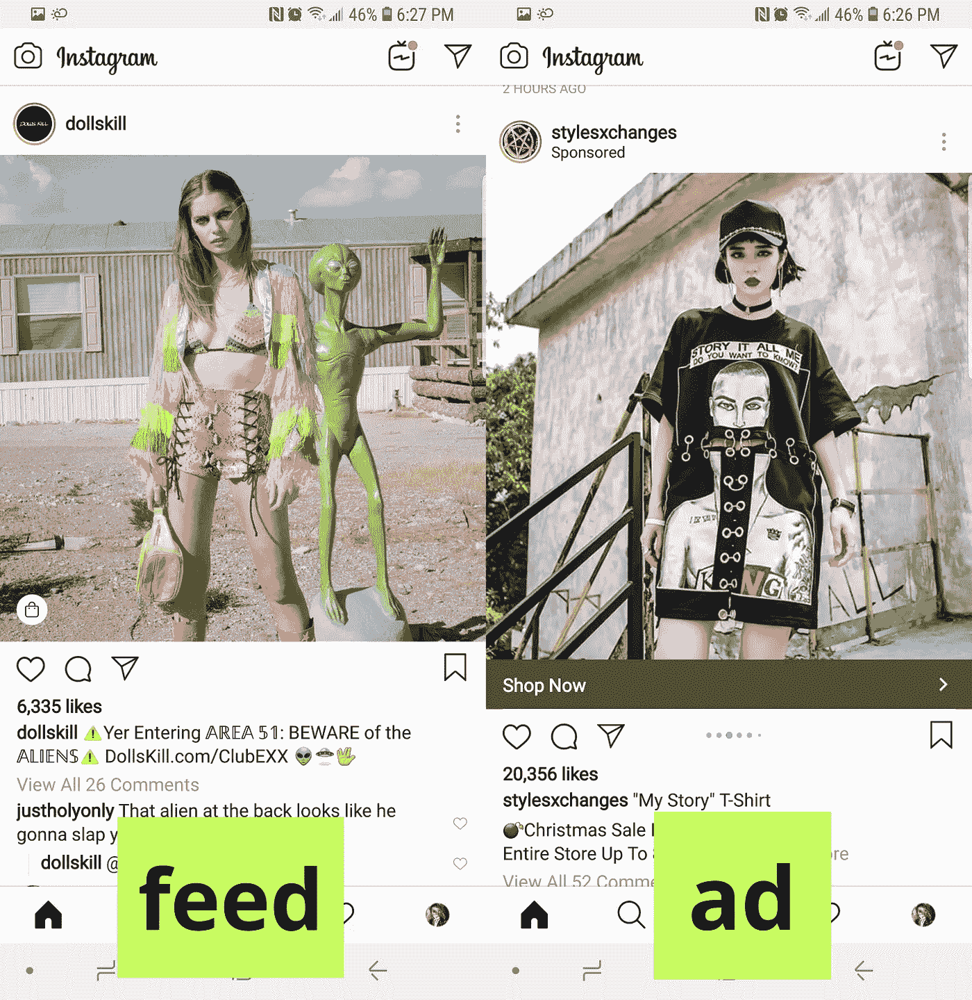

# 我们是如何输掉 Instagram 互动和其他故事的

> 原文：<https://medium.com/hackernoon/how-we-lost-the-battle-for-instagram-engagement-and-other-tales-c3079420b475>

Nintendo’s Super Mario makes a heroic jump for that IG coin.

我非常非常生气的时候会写文章。现在，我又一次怒火中烧，穿着睡衣，端着一杯咖啡，坐在我的键盘旁，所以系好你的安全带。几个月来，我一直在向人们解释为什么他们的 Instagram 参与度在下降。昨天，我试图为我公司的投资者宣传资料找到更多关于这方面的信息。因为，你知道，有些事情我可以通过社交媒体*看到*发生，然后有*来源。*

瞧，什么也没有。当你搜索“Instagram 参与度下降”时，谷歌的首页上满是满怀希望的博主，他们互相提供鼓舞人心的风格建议，说明新的 Instagram 算法更新如何有利于有意义的互动，以及你必须像神话中的独角兽一样闪亮和真实地面对自己，才能与观众互动并取得成功。耶！我们找到了治疗方法。你唯一需要做的就是:

*   永远不要有糟糕的一天，因为你需要一直发帖
*   保持积极的态度，回复你的粉丝留下的每一条评论，直到你的拇指流血(但不要发布有争议的照片，在 Insta-love 的世界里，真实是一个禁忌)
*   不要担心只有 1/10 的关注者真正看到你发布的内容——新算法是关于意义的。

片尾<*闪光炸弹* >

现在你已经清理了地板上所有的火花，我们又回到了现实世界，让我们更深入地挖掘到底发生了什么，找出这一切背后的真相。虽然我敢肯定，以上正是 Instagram 的人希望我们相信的(毕竟，他们自己的工作取决于此)，但他们一直在进行的改变也有丑陋的一面。

我一生中读过的最好的建议之一是特里·普拉切特的一本书(我不记得是哪本了，但它是在 *Discworld* 系列中)。我确信这已经被许多作者重复了很多次，这也可能是杜撰的，但尽管如此，我还是要感谢特里在我 12 岁的时候给了我这种洞察力。建议是这样的:*如果你不明白是怎么回事，那就找出钱在哪里*。

我不会说这是你理解他人所需要的唯一建议，但我们毕竟生活在一个资本主义社会，被利润、增长和对更多、更多、更多的不断需求所驱动。Instagram 也不例外。

**Instagram 的商业模式**

出售展示广告空间一直是大多数社交网络的标准收入模式。这种工作方式非常简单:

1.  创建免费应用程序
2.  让很多人加入这个应用，互相交流，发布内容
3.  让企业和品牌有兴趣在你的应用上向人们出售他们的产品
4.  出售广告空间
5.  善于向人们展示他们想买的东西

我试图故意推迟告诉你为什么你的 Instagram 参与度下降，因为我觉得如果有足够的提示，每个熟悉这个平台的人都应该能够自己找到它。毕竟，没有什么能比得上你自己的*啊哈*时刻的影响。(我保证，我会尽力给你看，而不是告诉你。)

即使是现在，大多数人都认为以上是一种值得尊敬的商业模式。显示添加已经在互联网上无处不在很长时间了。还有，大家都知道，想卖网络软件比卖七月的圣诞树还难。

可悲的是，免费的商业模式往往导致消费者数据的滥用。我在之前的一篇文章中详细描述了这一点( [*互联网巨头如何让千禧一代变得贫穷*](https://hackernoon.com/how-internet-behemoths-are-keeping-millennials-poor-216dcba55d35) )。在这里，我将重点关注免费模式对一家公司意味着什么，该公司对用户的价值主张是能够与他们的追随者分享创意内容。

**Instagram 的 Feed**

这就把我们带到了这个等式的第二部分。像任何出售广告空间的公司一样，Instagram 保留在你的 feed 中向你展示相关广告的权利。当他们开始的时候，情况并非如此——因为当平台很小的时候，广告商不太可能对它感兴趣。随着应用程序的发展，广告开始出现。

尽管许多人对广告感到恼火，但他们仍然直觉地理解大多数应用的生命周期包括赚钱阶段。你不能永远吸干你的风投。当应用程序达到一定的成熟度时，就会有广告客户愿意为销售产品的机会付费。

现在:我想让你为我做件事。转到你的 Instagram feed，统计每条广告之间的帖子数量。你看到我看到的了吗？如果是这样，这个数字就是 4。在过去的六个月里，我多次进行同样的练习。甚至在两个月前，这个数字还是 5。之前是 6 比 7。

随着脸书看到用户花在应用上的时间下降，他们购买了 Instagram，试图说服我们花时间在那里。据该公司称，现在在 Instagram 上花费的平均时间为 [53 分钟](https://www.recode.net/2018/6/25/17501224/instagram-facebook-snapchat-time-spent-growth-data)。虽然我肯定他们可以尝试进一步增加，但人们一天只有 1440 分钟。明白我的意思了吗？

*如果你在 Instagram 上被动地消费内容，那么你的朋友和你关注的创作者每发四个帖子，你就会看到一个广告*。

这是你的订婚信。此外，Instagram 广告优化得如此之好，以至于我有时很难分辨我看到的是付费广告还是我关注的人的一段内容。见下面两个例子。

**例 1**

I use my Instagram to follow niche fashion designers and artists. These two pictures appeared right beside each other. Even the pose is similar.

**例二**

Again, the second image could really be from Dolls Kill, the alternative fashion site I follow on Instagram.

Instagram 广告正在发挥作用，我不得不承认，我一直在与它们打交道，因为它们很酷，很相关，而且在视觉上很有吸引力。然而，潜在的事实仍然存在——insta gram 通过向用户展示如此多的广告，正在伤害自己的内容创作者。不，等等:我将进一步阐述这一观点。Instagram 的收入模式直接对他们的用户不利。他们现在所做的最终结果是让他们的用户为流量付费。所以，类似于脸书的《提升邮报》。很快，Instagram 上的内容创作者将面临付费接触自己的粉丝的现实。

**主人和仆人**

脸书的主要功能是让人们与他们已经认识的人保持联系。一些人可能会认为，脸书成为一个人们偶然消费内容的平台，它有权对其他人浏览其内容的页面收费。

Instagram 的主要目的是通过他们觉得有吸引力的内容来联系志同道合的个人(朋友或完全陌生的人)。分享美感是形成社区的一个重要因素。一个原本以内容为特色的网络，现在怎么会开始向创建内容的人收费，让他们与自己的追随者分享内容呢？

总之，Instagram 不会做的事情，脸书会做。4 月，扎克伯格(你知道他名字的意思是*糖山*吗？)在他和联合创始人凯文·斯特罗姆和迈克·克里格之间增加了一层管理，有效地降低了他们在脸书庞大结构中的地位。结果，在 2018 年 9 月，创始人离开了他们成长了九年的公司。无论这两个人对 Instagram 有什么样的愿景，都已经在脸书的绝对统治下消失了。

正如约翰·诺顿在《卫报》的文章中指出的

> 脸书是数据吸血鬼；它唯一做的事情就是吸取人们的生活数据，以便为广告商的利益在他们的背上画目标。

我说得再好不过了。脸书的主要目的是创建大数据仓库，这样他们就可以卖，卖，卖。无论 Instagram 打算完成什么，它都被搁置一边，以便成为脸书数据搅动机器中的另一个齿轮。

所有以这种方式运作的社交网络都有截止日期。他们直接与他们的用户对抗，他们的用户是他们吸引人和相关的原因。脸书对金钱和数据的追求将扼杀并最终杀死这两个品牌(哦，还有 WhatsApp——还记得他们怎么说他们不想要你的数据吗？那也是窗外的事，但那是在他们把我们都变成没有血的僵尸之前。

脸书已经证明，他们的成功并不取决于他们经营自己公司的能力，而是取决于成功收购关键竞争对手。他们把这些公司像待宰的猪一样培养起来，直到它们变得富有，拥有更多的用户，然后开始一点一点地割下它们的肉供自己使用。

这部机器中的另一个元素是脸书的合作伙伴——那些数据接收端的人。据[纽约时报报道](https://www.nytimes.com/2018/12/18/technology/facebook-privacy.html)脸书向他们的合作伙伴提供了广泛的数据访问权限，并向他们提供了*读取、写入和删除用户私人信息的方法，以及查看一个线程中所有参与者的方法。*

在同一篇文章中，我们读到:

> 脸书从未出售过自己的用户数据，担心用户反弹，也担心给潜在竞争对手复制其最珍贵资产的机会。相反，内部文件显示，它做了退而求其次的事情:以促进自身利益的方式，允许其他公司访问社交网络的部分内容。

在这一点上，我要做的唯一更正是，“不出售数据”真的不是“下一个最好的事情”。这是最好的事情。它允许脸书保持控制，并以超越简单销售协议的方式利用其“合作伙伴”对数据的使用。

最终，脸书将需要收购、发展并随后杀死更多的公司，以保持其数据收集机器运转良好。只有时间能告诉我们，人们是否能停止像扎克伯格称呼那些信任他的人那样“愚蠢”。

***关于我:***

1.  我是 Yuser 的首席运营官-首席运营官——一个游戏化的社交网络，分发区块链提供的奖励。你现在可以在 Android 和 iOS 上下载 Yuser，并在这里 *了解关于 Yuser* [*的更多信息。我们希望你成为我们社区的一部分，所以:*](https://yuser.co/) [*电报*](https://t.me/yuserQA) *和* [*推特*](https://twitter.com/yuser_network)*——你知道该怎么做！*
2.  我是一名作家，也是一个名为“我在你从未听说过的网站上发表我的小说”的艺术团体的成员
3.  我是一个百事通(我的注意力持续时间很短，但你仍然会感到惊讶)。