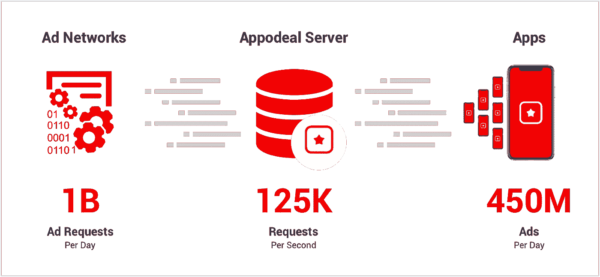
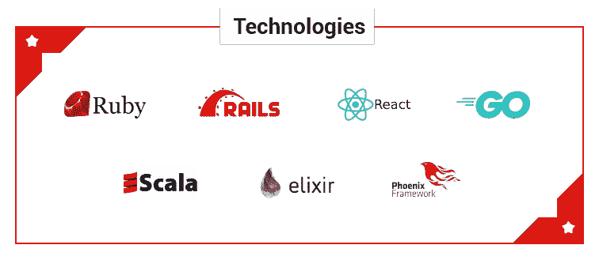
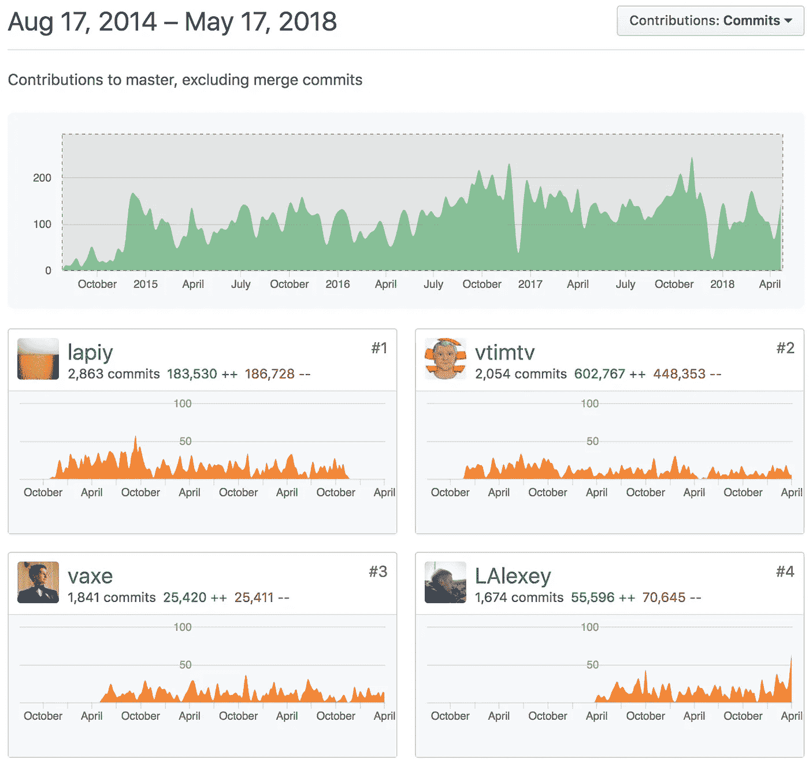
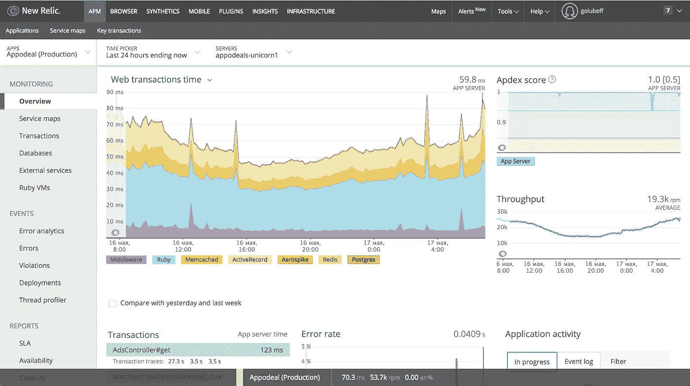
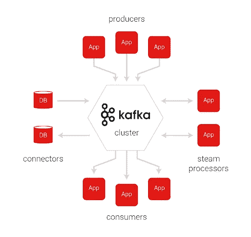
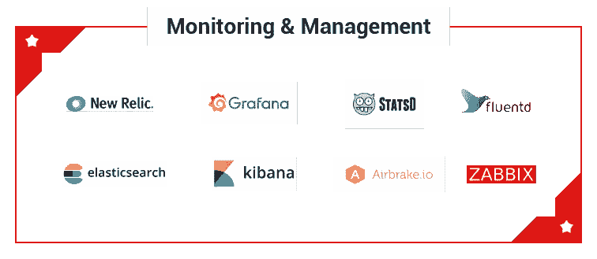
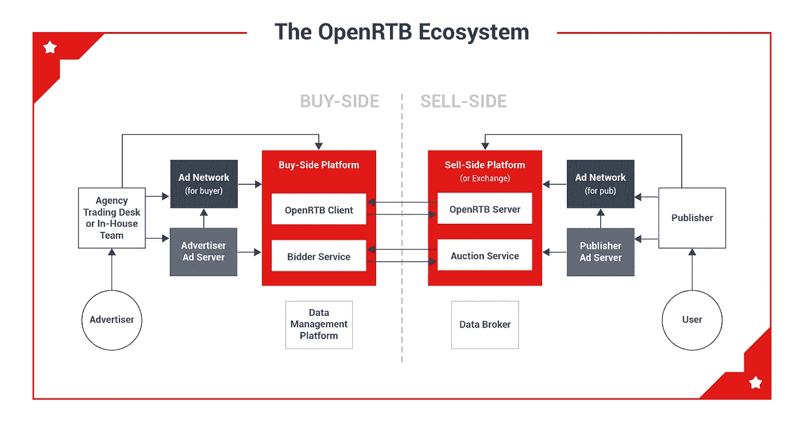

# 我们是如何设法建造一个 12 层的堆栈而不发疯的

> 原文：<https://medium.com/hackernoon/how-we-managed-to-build-a-12-story-stack-and-not-go-crazy-4fd90ed301b9>

Appodeal 有一个约 100 人的团队，从 2018 年 6 月开始，他们在三藩市、莫斯科、基洛夫、巴拿巴和巴塞罗纳工作，现在也在明斯克工作。我们通过向用户展示广告来赚钱。我们从广告中介开始，但由于技术堆栈的不断增长，新的广告技术产品不断增加。

对于那些不熟悉广告技术的人来说，这是广告技术公司的领域。当你告诉人们你在移动广告行业工作时，他们往往会持怀疑态度，可能会想到令人讨厌的“播放此视频”广告。然而，这种对广告的过时观点与以多样性和快速增长为特征的实际广告业务毫无关系。我们工作的移动领域早已超越了网络广告。

**究竟为什么要整合广告？**

发行商努力创建一个吸引人的应用程序，当他们准备好提交给应用程序商店时，他们需要考虑如何赚钱。为了成功货币化，出版商应该考虑许多因素。他们可以利用各种模式——从应用内购买到展示广告——来确保他们的应用蓬勃发展。展示广告是让人们免费使用应用程序的最佳方式之一，并确保更广泛的覆盖面。

毫无疑问，太多的广告会惹恼人们，影响用户保持，这是每个人都想避免的。这就是为什么出版商总是寻求聪明地整合广告，以便从他们的应用程序中赚最多的钱，同时减轻用户不必要的成本。

**这是怎么回事？**

一旦你决定通过广告赚钱，关注应用程序开发的这一部分并采用帮助你实现收入最大化的解决方案是非常重要的。

如果你注册了 Appodeal 会怎么样？在我们的网站上注册后，我们将一个应用程序集成到我们的服务中。这是通过客户端 SDK 完成的，它将 app 连接到服务器，并通过 API 与服务器进行交互。

为了简洁明了，互动被简化为:

a.确定此时要显示的广告

b.发送关于显示的广告的信息并将其记录在统计数据中

如今，Appodeal 每天为数千个活跃应用提供 4 亿至 4.5 亿条广告，向直接提供广告的广告网络发出的请求高达 10 亿次。为了确保一切正常运行，我们的服务器每秒处理大约 12.5 万个请求(即每天大约 10.8 亿个请求)。

**核心是什么？**

我们使用各种技术来提供速度和可靠性，以及敏捷开发和支持。目前，我们使用以下语言编码:

*   /Ruby / Ruby on Rails + React。JS(前端)/:我们的用户和员工可以看到的大部分 API 和整个 web 部件
*   /GoLang/:处理广泛的统计数据和其他数据
*   /Scala/:通过 RTB 协议实时处理与 traffic trading boards 交互的请求(有关详细信息，请参见本文的最后一部分)
*   /Elixir / Phoenix/:更多的是实验部分。构建几个微服务来处理一些统计数据和 API。

**为什么一开始就选择 Ruby 和 Ruby on Rails？**

在移动广告领域，Appodeal 与行业巨头竞争，因此我们知道我们需要时刻保持警惕，快速适应市场变化。通常，这感觉就像以 100 km/h 的速度行驶时更换车轮一样。Ruby on Rails 让我们能够继续竞争，并在市场中站稳脚跟，引领细分市场。我们看到了 Rails 的以下优势:

*   大量高素质的开发人员
*   伟大的社区
*   许多现成的解决方案和库
*   快速实施新功能并更改/删除旧功能

明显的缺点:

*   总的来说，效率还有待提高。我还应该提到缺乏 JIT(目前)和并行代码的能力(除了 JRuby)。这在一定程度上是可以容忍的，因为通常数据库和缓存会让事情变慢，从 NewRelic 截图可以看出:

*   很难将 rail block 划分为微服务，业务逻辑与数据访问逻辑(ActiveRecord)紧密相关

**你储存什么数据？**

我们有大量的数据。我们处理数十亿/数百亿/数千亿条记录。然而，由于这些数据非常多样化，我们以多种方式存储它们。架构永远不应该局限于一个被认为是通用的单一解决方案。首先，实践表明，实际上没有通用的高负载解决方案。通用性是以访问速度/读取速度/存储空间处于中等水平甚至远低于中等水平为代价实现的。其次，你总是需要尝试新事物，做实验，为手头的任务寻找非常规的解决方案。总而言之:

*   /PostgreSQL/:我们非常喜欢 Postgre，认为它是目前存储数据的最佳 OLTP 解决方案。我们在那里存储用户、应用程序、广告活动和其他数据。我们使用主/从复制，但只在圣诞节做备份，因为这是一个推饼干者的游戏(开玩笑)。
*   /VerticaDB/:一个面向列的数据库，我们用来存储数十亿条统计记录。简而言之，过去我们认为 Vertica 是商店分析的最佳 OLAP 解决方案。它的主要缺点是昂贵的(个人)许可证价格。
*   /ClickHouse/:一个面向列的数据库，我们正在逐步从 VerticaDB 迁移到这个数据库。我们认为 OLAP 是目前最好的解决方案。它不会花费你任何东西，因为它是完全免费的。它也非常快速和可靠。它的主要缺点是不能删除或更新数据(如果有人感兴趣，我们可以单独写一篇文章)。
*   /Aerospike/:这似乎是最快的 NoSQL 键值存储解决方案之一。它有一些缺点，但总的来说，我们对它很满意。在 Aerospike 的网站上，你可以看到一个表格，比较他们与其他解决方案的性能:[何时使用 Aerospike NoSQL 数据库与 Redis](https://www.aerospike.com/when-to-use-aerospike-vs-redis/)
*   /Redis/:奇怪的是，它的主要优点是易于使用和单线程架构，允许避免争用情况，例如在使用标准计数器时。
*   /CouchBase/:在某个时候，memcache 变得不能胜任手头的任务，所以我们切换到 CouchBase，只在一些本地节点上留下 memcache。我们将所有全局缓存存储在 couchbase 中。
*   /Druid/:我们将它用于大数据阵列，以便与 RTB 板配合使用。事实上，它与 ClickHouse 有许多共同之处，然而，到目前为止，我们还没有切换到单一工具。

你可能认为我们把一切都复杂化了，但事实并非如此。首先，Appodeal 有几个开发团队，一个项目内有很多子项目。其次，在这一点上我们并不孤单:许多广告技术公司在一个公司内使用了一整套不同的技术。

是这样吗？你如何监控这个？

不，那不是全部的故事。我们有更多有趣的事情在进行。例如，由于数据流非常大，它们必须排队。我们用卡夫卡来达到这个目的。我们认为它是一个用 Scala 编写的非常可靠的解决方案，迄今为止从未让我们失望过。

在这种情况下，对使用者的唯一要求是处理队列的速度要快于队列的增长速度。这是一个简单而明显的规则，我们主要使用 GoLang 来实现这个目的。然而，你必须记住，这个服务器必须有足够的内存。

为了跟踪所有这些东西，有必要监控和委派几乎所有的事情。为了帮助我们做到这一点，我们使用了以下解决方案:

*   /NewRelic/:这是一个经过时间考验的解决方案，与 Ruby on Rails 和 GoLang 微服务集成得非常好。因为 NewRelic 唯一的缺点就是价格，所以我们不一刀切。我们主要努力用手工收集的指标来代替它，并将它们放入 Grafana。
*   /Zabbix/:一个很好的实时监控工具，可以监控我们服务器上发生的一切。
*   /Statsd + Grafana/:一个收集我们内部指标的伟大工具，除了我们必须自己设置一切并“复制”NewRelic 的开箱即用功能。
*   /Fluentd + ElasticSearch + Kibana/:我们将几乎所有东西都放入日志中，从缓慢的 PostgreSQL 请求到一些 Rails 的系统消息。事实上，像 Kibana 这样基于 ElasticSearch 的解决方案可以将所有日志收集在一个地方，然后在其中搜索消息。
*   /Airbrake/:此过程不可或缺的一部分是收集错误和消息的堆栈跟踪。为了省钱，我们目前正在从 Airbrake 迁移到免费解决方案。

重要的是要明白，构建良好的监控是您的眼睛和耳朵。做猜测是浪费时间。您需要能够在任何给定时刻看到服务器上发生了什么。这就是为什么您产品的稳定性和可靠性很大程度上取决于您构建指标收集和可视化显示系统的好坏。

顺便说一下，说到可靠性，我们有几个试运行服务器，我们在那里执行试运行和测试发布，我们通过向它们发送实际流量的部分副本来保持稳定的负载。每周我们都会在生产和试运行之间同步数据库。这给了我们一面镜子来测试无法在本地验证的东西，并在负载测试级别查明问题。

真的有那么复杂吗？

是的。埃隆·马斯克在他的书*特斯拉、SpaceX 和对美好未来的追求*中提到，脸书早期的工程师杰夫·哈默巴赫尔告诉他:“我们这一代最聪明的人都在想如何让人们点击广告……这太糟糕了”。

下面是对 Appodeal 功能的简短描述:

*   我们整合了 60 多个广告网络和 DSP。我们自动在这些网络中注册应用程序，并设置各种参数，以便这些网络以最佳状态运行。并不是每个网络都有所需的 API，所以机器人出现了。
*   每个网络向用户支付展示费。必须接收这些费用，根据各种参数进行划分并进行处理。这是在循环中完成的。再一次，到处都有机器人被用于这个目的。
*   为了让用户的收入最大化，我们通过在广告中放置所谓的“瀑布”来引发网络间的竞争。瀑布是基于我们以各种方式预测的各种标准(例如 eCPM，1000 台显示器的平均价格)构建的。瀑布上的广告报价越高，其预测价格就越高。瀑布会根据需要经常转发到设备。你可能已经猜到了，没人打开的烦人广告是没人感兴趣的。或许，可口可乐、百事可乐和其他公司的“品牌”横幅广告是个例外，这些公司以迷恋形象而闻名。
*   这种交互的一部分是通过 RTB 协议完成的:实时竞价。

在这里，所谓的投标人在网上讨价还价，争夺在选定设备上显示广告的权利。这是一个有趣的话题，值得在另一篇文章中讨论。许多交易所市场，如 Google AdExchange，对服务器的响应时间设置了严格的限制(例如 50 毫秒),这就带来了性能问题。不遵守通常会导致数千美元的罚款。这正是用 Scala 编写的核心与 Druid 一起做的事情。

*   每个人都想知道内情，所以我们的客户(以及我们自己)想了解谁看过广告，什么时候看过，为什么看过。出于这个原因，我们必须用 Kafka 将我们所有的数据排队，然后逐步处理它，并将其放入 OLAP 数据库(ClickHouse)。许多人认为 PostgreSQL 可以像各种“时髦”的解决方案一样处理这项任务，但这是有争议的。PostgreSQL 很好，但是当用于过滤和排序的字段数量超过 10 个并且存储的数据记录数量接近 10 亿时，为快速数据访问建立索引的规范解决方案就失效了。存储所有这些索引的内存将会不足，或者在更新它们时会遇到问题。在任何情况下，对于分析请求，您都无法达到相同的性能水平，例如面向列的解决方案。

**总结**

在这篇文章中，我试图简要描述我们做什么，以及我们如何存储和处理数据。如果您希望在评论中说明您正在使用哪个堆栈，并随时提问，我们很乐意与您分享我们的经验。