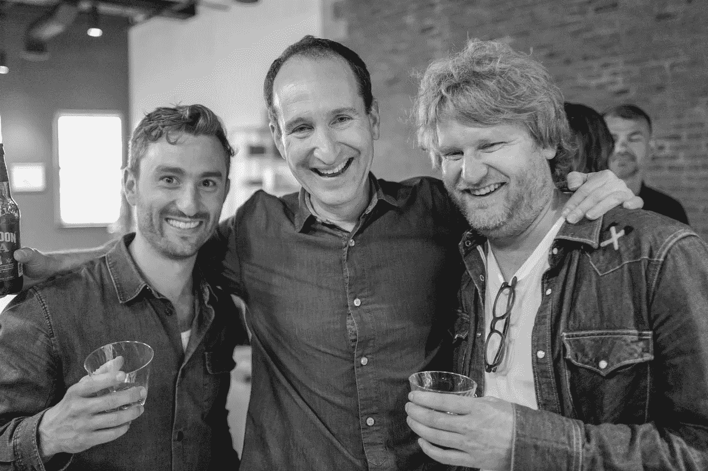

# 我们如何衡量“一致性”

> 原文：<https://medium.com/hackernoon/how-we-measure-alignment-7eb67bbcc3e6>

*由***，管理合伙人**

*我们的使命是[成为种子期创业者最一致的基金](http://www.foundercollective.com/index.html)，这是我们的动力，但很难客观衡量。一家旨在对创始人友好的公司可能能够通过其 NPS 分数来衡量成功，但没有简单的 KPI 来解释像结盟这样的抽象概念。*

*令人欣慰的是，我们不时会收到投资组合公司的确认，而 [PillPack 被亚马逊](https://hackernoon.com/5-lessons-from-pillpacks-sale-to-amazon-375bf9b6523c)收购似乎是分享一个具体例子的好时机。*

*我非常幸运地在 2013 年领导了 PillPack 的 pre-seed 轮，并共同领导了它的 seed 轮。按照惯例，我加入了董事会。在标准情况下，当公司从知名机构基金筹集 B 轮资金时，我会退出董事会。如果不是那样的话，PillPack 肯定会在 c 轮融资中筹集到 5000 万美元，但我很幸运地一直是董事会的活跃成员，直到被亚马逊收购。为什么？*

*这与我们交易文件中的苛刻条款或扩大董事会以腾出空间无关。PillPack 的联合创始人 TJ 帕克(TJ Parker)和埃利奥特科恩(Elliot Cohen)做出了一个非常不寻常的举动，让我有机会进入他们从一开始就控制的三个普通董事会席位之一。*

*一般来说，创业者最好避免董事会中有太多的风投。正如 HBS 大学教授 Richard Tedlow 所说，“风险投资就像马提尼酒；两个是伟大的，超过两个就有毒了。”我们通常还建议创始人在治理方面保持严格的比例——最佳做法是拥有奇数个董事会席位，其中一个是独立董事，以打破僵局。你经常会看到三个普通席位、三个投资者席位和一个独立席位。*

*任何读到这里的投资者都会知道，投资者坐在一个普通的董事会席位上是非常不寻常的——以至于我们不得不寻求法律建议，以确保没有意外的冲突。(感谢[尼克·古蒂拉](https://www.linkedin.com/in/nick-guttilla-8515a04/)，冈德森·德特默公司的合伙人，帮助我们解决了这个问题。)*

*在理想情况下，创始人会招募一名成功的企业家或初创企业高管，为创始人带来行业或职能方面的知识和建议，同时对投资者形成制衡。允许董事会向投资者严重倾斜通常是创始人失去控制的标志。我可以告诉你，作为一名企业家，自愿将一名投资者加入我的资本表对我来说似乎有些疯狂。*

*对我来说，谢天谢地，PillPack 没有出现这种情况。*

*虽然我很愿意相信是我的洞察力和努力让 TJ 和 Elliot 邀请我留在董事会，但我更愿意认为这是一个结构性因素——结盟。*

*Founder Collective 不是生命周期投资者，我们不会受到按比例分配权利的激励，也不会积极进行后续融资。我们公司的设计让我们和创始团队有同样的激励。虽然其他公司可能会寻求部署额外的资本来增加或维持他们的所有权，但我们与企业家一起稀释。这种结构改变了创始人和作为投资者的创始人集体之间的整个对话。它允许一种开放和信任，这种信任只能来自于强烈的经济联合。*

*从 A 系列开始，能和创始人们坐在同一张桌子上是一种纯粹的快乐。我们非常感谢 TJ、Elliot 和 PillPack 的团队为我们带来的巨大回报。也许对确认和加强我们的使命更是如此。我们每天都在努力完成我们的使命，但是如果没有这样的投入，我们只能模糊地感觉到我们完成的有多好。*