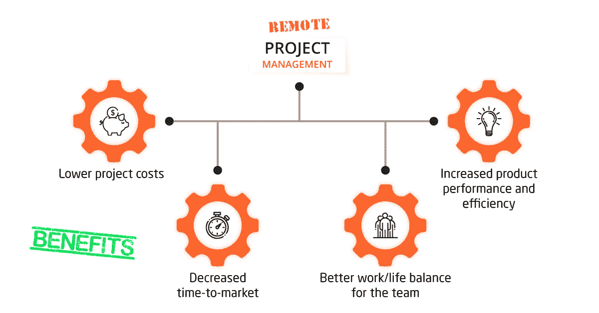

# 我们如何克服远程管理项目的挑战

> 原文：<https://medium.com/hackernoon/how-we-overcome-the-challenges-of-remote-management-projects-21c6ae92add1>

如果操作得当，远程项目管理可以为任何企业带来实实在在的好处。IT Svit 在执行远程管理项目方面拥有丰富的经验。我们是这样做的。

我们生活在远程协作的时代，随着技术的进步，我们可以毫不延迟地与地球另一端的同事通话，同时提交你们共同项目的代码。当客户和团队的某些部分(营销、销售、计费、业务分析、管理人员)位于一个国家时，远程项目管理支持整个 IT 外包行业，而团队的其他部分(开发人员、web 开发人员、数据科学家)则分布在全球各地。

这种方法确保了多种切实的好处:

1.  **降低项目成本**。外包专家在提供相同服务的同时成本更低(对于全球[前 15 大 MSP](https://clutch.co/it-services/msp)——与内部 IT 团队相比，拥有最高水平的专业知识和技能)
2.  **缩短上市时间**。通常晚上给的任务会在一夜之间完成，这大大减少了软件开发时间。
3.  **更好地平衡团队的工作和生活**。雇用有经验的专家增加了及时实现既定目标的机会，同样减少了团队其他成员长时间工作的需要。
4.  **提高产品性能和效率**。当你的产品由顶尖的专业人员开发时，他们能够从一开始就解决所有的细节问题。这样，由于内置的产品可扩展性、自动化基础架构供应和管理、深入的日志记录和监控解决方案等，您可以完全避免许多隐藏的挑战，并享受更高的产品效率和积极的最终用户体验。

然而，除了这些好处之外，远程项目管理也带来了一些挑战，为了确保分布式项目的成功执行，必须应对这些挑战:

1.  **生产力逐渐丧失**。没有持续的“友好肩膀的感觉”,许多 IT 专家会失去注意力和继续努力工作的意愿，无论他们在开始时多么专注和投入。这对自由职业者来说尤其如此，但也可能影响远程项目团队。
2.  **由于各种位置或连接问题导致的团队成员可用性问题**。不同的时区可能意味着团队成员无法进行有效的沟通，有时可能无法访问互联网，团队成员可能不得不出差，无法访问他们的计算机，等等。
3.  文化和立法障碍。当团队在遥远的国家工作时，他们可能会有不同的文化传统(包括宗教和法定假日)，或者不得不应对立法障碍(如 [GDPR](https://itsvit.com/blog/gdpr-can-ruin-trampoline-business/) 或 [USA PATRIOT 法案](https://www.justice.gov/archive/ll/highlights.htm))。
4.  **沟通问题**。对于许多远程开发人员来说，英语不是母语，更不用说理解俚语表达、语调或肢体语言的意思的困难了，这些可能会极大地改变对话的意思。这经常会导致沟通不畅，影响项目结果。
5.  **获取技术和数据安全**。当使用公司资源和数据时，整个团队应该使用相同的工具并遵循相同的实践。否则，就会出现产品开发瓶颈或安全漏洞，这可能会造成更大的损失。

IT Svit 在提供 DevOps 即服务、大数据解决方案、针对初创公司的全周期服务、web 开发以及此类远程项目的 QA 方面拥有丰富的经验。我们已经制定了应对上述所有挑战的对策。

1.一个小型的、积极的、高效的团队。我们公司根据客户的要求和所需的技术组成了一个团队。如果项目经理留在客户所在地，我们的团队领导将扮演产品负责人的角色，帮助团队全面了解项目需求，提供正确的评估，并适当地分配任务。

每个团队成员通过项目管理系统在早上提交每日计划，在一天结束时提交每日报告。也就是说，团队领导/产品负责人和远程项目经理都知道项目进展，以及任何可能的挑战和瓶颈。这有助于团队保持高效，并尽快解决任何问题。

2.**全职就业和远程访问**。我们全职雇用我们所有的专家，所以他们在营业时间总是有空的。我们有 2 条备用互联网上行链路，以防主办公室的上行链路出现故障，每个团队成员都配置了 VPN 访问，以防他们不得不从家里或出差回来时上网。

最后，由于我们位于乌克兰，我们的工作时间在很大程度上与欧盟的工作时间交叉，因此我们能够在一夜之间为美国客户提供结果。

3.**文化和法律合规性**。我们的工作日程几乎完全符合欧盟和美国的商业日程，因为我们的宗教和法定假日大部分是相关的。此外，我们的商业文化建立在美国和欧盟商业的最佳范例之后，这在 IT Svit 客户对离合器的独立[五星评论](https://clutch.co/profile/it-svit#reviews)中经常被提及。

我们还用心遵循法律要求，并根据 ITSM/ITIL 要求、NDA 和 SLA 开展工作，以确保我们的客户安全可靠。

4.**直接的点对点沟通**。我们的团队有丰富的与美国和欧盟客户沟通的经验。我们对创业公司、中小型企业和企业的商业文化和实践有着广泛的了解，并且我们总是能够与客户达成一致。

# 结论:你将成功地管理一个远程项目团队

因此，我们确信:IT Svit 远程项目管理将为您的企业带来成功。来自 DC 华盛顿州的国际商业评论和评级机构 Clutch 称，任何 IT Svit 项目的积极成果都由以下因素保证:13 年的经验、**600 多个已完成的项目、**以及我们作为乌克兰 IT 外包市场 T10 领导者之一的稳固地位。

如果您想要完成软件产品开发、基础架构优化、向云的过渡、构建 CI/CD 管道，或者只是需要开发运维即服务— [联系 IT Svit](https://itsvit.com/contacts/?utm_source=Medium&utm_medium=blogpost&utm_campaign=remote-management-projects) ，我们将竭诚为您提供帮助！

*最初，我在我公司的博客*—[https://it svit . com/blog/how-it-svit-handles-remote-management-projects/](https://itsvit.com/blog/how-it-svit-handles-remote-management-projects/)上发布了这个故事