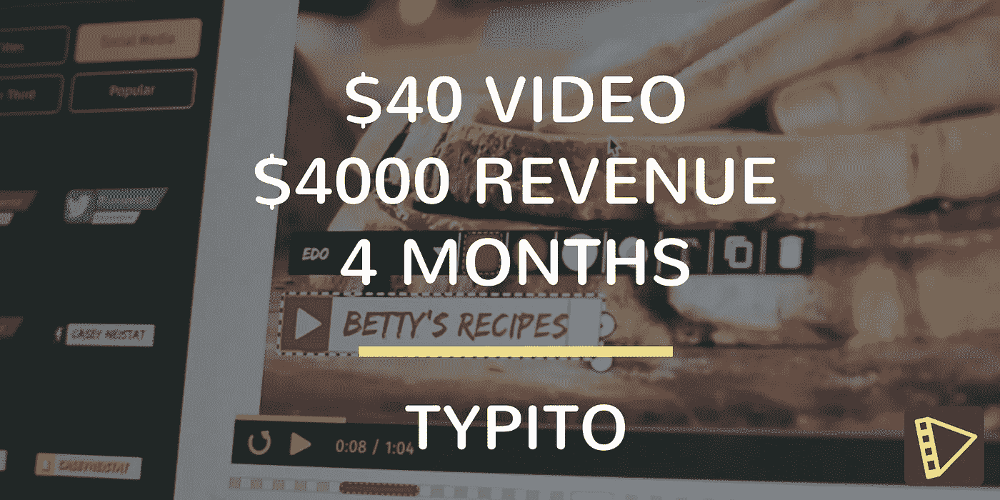
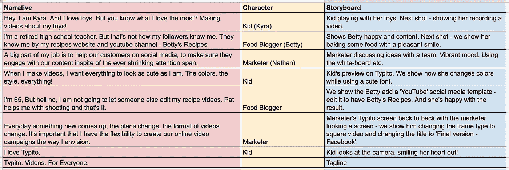
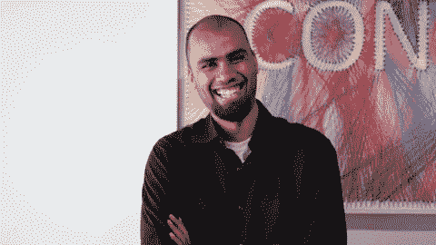
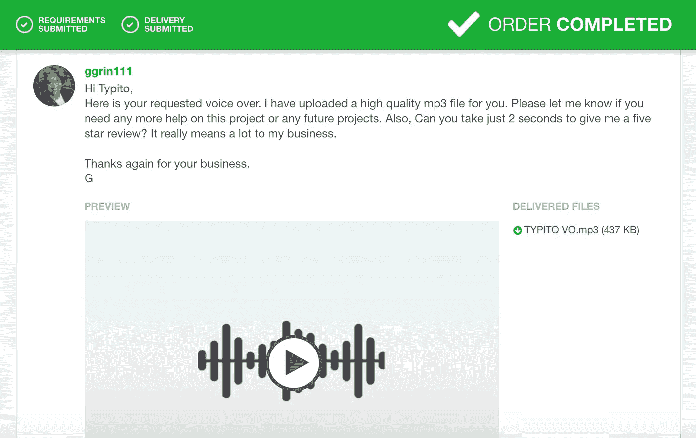
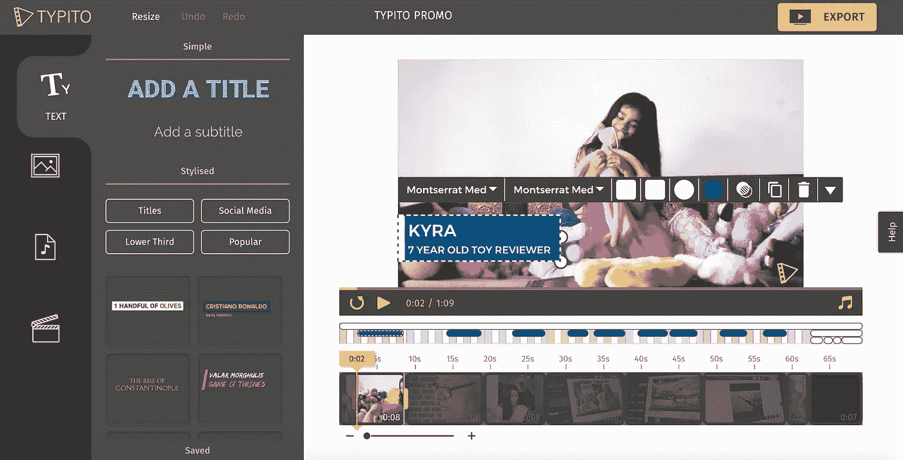
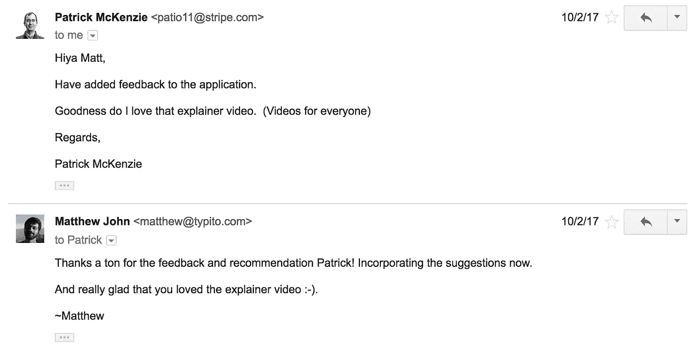
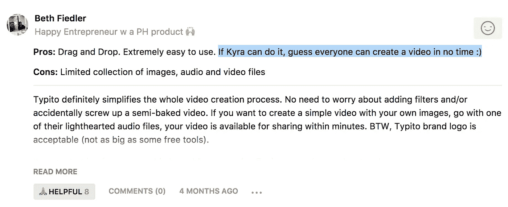
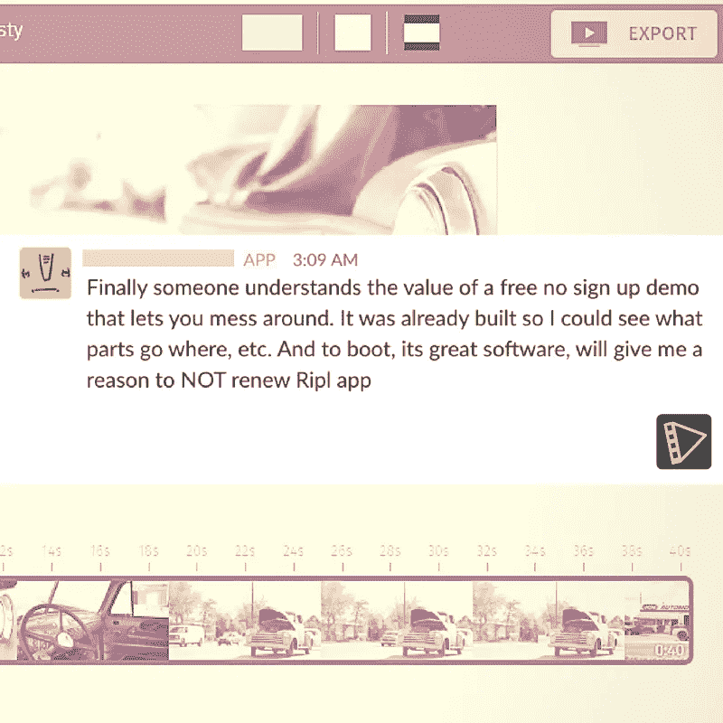

# 我们如何制作一个 40 美元的视频，并在 4 个月内实现 4000 美元的销售额

> 原文：<https://medium.com/hackernoon/how-we-produced-a-40-video-that-drove-sales-of-4000-in-4-months-e541e2a1414d>

Typito’s Explainer Video in ‘Action’

是的，没错。这个故事是关于我们团队在 2017 年 3 月上线后的过去 9 个月里实现的最大增长黑客——我们的解释者视频“人人视频”

Typito — Videos for Everyone

举个例子，我是在线视频制作工具[的联合创始人](https://hackernoon.com/tagged/tool)**，它试图使在线视频制作民主化，是 Buffer 推荐的[20 大社交媒体产品之一。Typito 为您提供了为互联网](https://blog.bufferapp.com/new-social-media-tools-2018)[制作强大视频所需的一切——易于使用的动画模板、添加您喜爱的音乐、创建图像和视频幻灯片以及为社交媒体制作方形视频的能力。想想](https://hackernoon.com/tagged/internet) [Canva](https://canva.com) ，但是对于视频！**

# **我们需要一个视频！**

## **距离产品搜寻发布还有 7 天**

**那是 9 月 24 日，我们的团队正在为即将到来的 Product Hunt (PH)发布做准备。整个团队在过去的两个星期里花了 16 个小时在办公室里为大发布修改产品。我是这次发布的负责人——与我们的自由设计师、开发团队、建立我们帮助部门的实习生、主动提出在 PH 上追捕我们的凯文，甚至是制作我们标志动画的艺术家进行协调。我们进展顺利，但有些不对劲——这种感觉让我不安了好几天。最后，我意识到了一个严峻的事实——我们是一家视频公司，我们没有解说视频！我们只有 7 天的时间在 PH 上直播。**

# **动画还是真人解说？**

## **距离产品搜寻发布还有 6 天**

**我们要做的第一个决定是确定我们想要制作的视频类型。在创建 Typito 之前，我与人合作创建了动画解说工作室 [Wildbeez](https://wildbeez.com/) ，我知道我会有一个制作动画解说的软肋。我最喜欢的解说视频一直是谷歌的 Project Loon，这是一个美丽的故事，用最简单的语言为每个人展示了最先进的技术解决方案。我认为这将是一个做类似事情的好机会！**

**Explainer video of Google’s Project Loon**

**然而，我越想越觉得，一些重要的问题突然出现在我的脑海里:**

**“动画视频非常适合解释抽象概念。泰皮托是理想的候选人吗？”
*“制作一部很棒的动画视频需要花费我们时间和金钱，而我们没有这两样东西。”*
*“我们有一个很棒的产品，但是真实的产品截图在动画视频上看起来 meh。”*
*“真人真事视频和一些产品截图——那太棒了，不是吗？但是谁来拍摄和剪辑呢？演员阵容是什么？配音、拍摄地点、设备——时间太少，要处理的事情太多了。”***

**真实视频似乎是一个几乎不可能的选择。所以是的，我们决定这么做！我们知道这是接近泰皮托解释者的正确方式。如何做到这一点—我们认为我们将在以后解决这个问题！**

**我们也得到了一个很好的真实解说者参考视频——[Canva 的第一个解说者视频](https://www.youtube.com/watch?v=3FZGN7BCs6k)。我们喜欢它对应用程序的良好预览。然而，我们不喜欢“设计就在我们身边”的叙述我们觉得这是陈词滥调，我们决定做一些不同的东西。**

# **3 个顾客的故事**

## **距离产品搜寻发布还有 5 天**

**每个视频都以一个脚本开始。接下来是故事板，它将作为你视频制作工作的指南。如果你有一个很棒的剧本和故事板，我会说你的工作已经完成了一半(我显然夸大其词)。我们为我们的剧本选择了不同的口号——“视频的力量”、“商业视频”等等。最终贴在墙上的意大利面条是“每个人的视频”,这是基于我们的使命，使 Typito 成为制作在线视频最简单的工具——为每个人而建。为了证明这一点，我们确实有 7 岁到 70 岁的客户。下一步——我们起草了一个基于第一人称叙述的脚本，基于 Typito 的 3 个实际用户，并制作了脚本的文本故事板版本。我们在进步！**

****

***Our video script and storyboard***

# **妈妈！视频里的花式演技？**

## **距离产品搜寻发布还有 4 天**

**我们的脚本要求 3 个角色(基于真实顾客)谈论他们使用 Typito 的体验——一个孩子 YouTuber，一个数字营销者和一个成功的美食博客。我的第一反应是检查我是否能处理好与故事相匹配的股票片段。我对我得到的结果感到失望。**吸取的教训——库存英尺数将始终保持库存英尺数。****

**我立即开始列一张愿意在视频中扮演角色的朋友和亲戚的名单。今天的第一个收获是我们在共同工作空间的朋友 [Karthik](https://twitter.com/kar666) ，他主动提出扮演营销人员的角色(1/3)。然后我联系了我的一个朋友，问他的女儿莎拉是否可以扮演我们的孩子优图伯。她同意了，并对演出感到非常兴奋！(2/3)我们还剩下一个角色——一个 65 岁的 YouTube 美食明星(基于[曼朱拉·贾恩](https://www.youtube.com/user/Manjulaskitchen/)，我们的早期客户之一)。一天就要结束了，我们还没有挑选出最终的角色。这时候我妈妈打电话给我。巴赞加！我们还有第三个演员，我决定了！🙂 (3/3)**

# **胶卷相机。滚动。开拍！**

## **距离产品搜寻发布还有 3 天**

**我们有 72 个小时来制作视频，并决定在中午前完成所有拍摄。在[贾丁](https://twitter.com/jatinkrastogi)的时候，我在 Wildbeez 的联合创始人帮助我们拍摄了扮演基拉的莎拉、[迪帕克](https://www.quora.com/profile/Deepak-G-Singh)他是 Karthik 在 [TMinus](https://tminusapp.com/) 的联合创始人，一名专业摄像师完成了营销人员的场景。那天和妈妈在家的哥哥本杰明分享了妈妈表演美食博主场景的视频。我们下午就把视频准备好了！**

****

***Karthik, our Marketer actor going full retard during a take!***

**现在，大多数人都没有给予解说者足够的重视。但从我在维尔德比兹学到的东西来看，我知道从质量的角度来看，这有很大的不同。我在 [Fiverr](http://fiverr.com/) 上联系了艺术家，他们可以为这三个角色配音，第二天就可以发货，这样我就可以毫不拖延地完成剪辑。**

# **对视频进行打字编辑和再利用**

## **2 天时间寻找产品**

**这是我 [dogfooding](https://en.wikipedia.org/wiki/Eating_your_own_dog_food) 的机会——用 typico 制作关于 typico 的视频:)。进展顺利，我们在一个小时的编辑工作中就完成了最终的视频上传。我们还准备好了五位艺术家的画外音。虽然我们喜欢孩子和美食博客的声音，但我们觉得营销人员的声音有点单调。我再次搜索了 Fiverr，找到了另一位非常符合要求的配音员，他也表示愿意在 24 小时内提供服务。祈求好运，我们会成功的。仅供参考，我们花了 40 美元从我们的口袋里为整个项目配音，这是值得的！其他的都是自己动手。**

****

**[*ggrin111*](https://www.fiverr.com/ggrin111) *(voice over artist for food blogger) and other artists on Fiverr did a great job.***

**同一天，我担心如何定位我们的视频，让用户观看并理解 Typito 代表什么。几个显而易见的选择是将它作为一个登录页面视频，分享制造商对产品搜索的评论链接。这些都是常规的东西，但是我们怎样才能做一些真正特别的事情呢？这时候，我们突然意识到，多亏了发明的父母，必要性和绝望，视频实际上是在 Typito 上编辑的！我们编辑了剪辑，添加了品牌文本布局，并用我们试图销售的相同工具缝合了音乐。我们决定该视频可以重新用作公开的项目演示，用户可以从中了解到两件重要的事情——什么是 typico，typico 是如何工作的！**

# **包装它**

## **距离产品搜寻发布还有 1 天**

**与离截止日期还有 1 天时的恐慌相反，这一天是平静而愉快的(暴风雨前的寂静？).我花了一些时间为视频的营销人员部分缝合最新的声音(出来真的很好！)，Srijith，我的联合创始人得到了 [**Typito 演示**](https://typito.com/demo) 并开始运行，我们在 YouTube 上发布了我们的视频，以便在不同的论坛上进一步分发。这种感觉太棒了——按照我们想要的方式制作了我们的解说视频！我记得那天走在街上，头抬得很高，像个老板一样自信。:-).**

****

***Our explainer video on Typito Demo — https://typito.com/demo***

# **进度报告—2010 年 8 月**

**从我们制作视频到[开始寻找产品](https://www.producthunt.com/posts/typito-videos-for-everyone)已经过去了 4 个月。从那以后，视频就成了我们转化漏斗的基石。在过去的 4 个月里，在观看了演示后决定订阅我们的一个付款计划的客户贡献了 4000 美元。我们相信，他们只有在尝试了免注册演示，并接受了 Typito 代表什么的教育后，才能建立起这种信心。虽然我们喜欢给解释者视频增长实验打 8/10 分，但这里有一些与我们喜欢珍惜的视频实验相关的时刻:**

**帕特里克·麦肯齐(Patrick McKenzie)看完视频后，在邮件中对我们竖起了大拇指。他在帮助我们反馈 2018 年 1 月的 Y Combinator 申请。一位因其在 B2B 和企业销售方面的专业知识而受到全球尊敬的连续创业者喜欢我们的视频，这对我们来说是一个很好的验证:)。**

****

***Patrick’s feedback for our video!***

****2/**Beth Fiedler 是一名产品搜索用户，他在关于 Typito 的评论中提到了 explainer 视频中的一个客户案例。对我们来说，这是品牌召回的标志，也是一个故事的证据，这个故事已经深入人心，足以产生影响。**

****

***Beth’s reference to Kyra in the explainer video***

**我们的一位创建者对我们的演示应用程序表示了赞赏。Demo 成为了一种简单的方式，让用户不用经历注册试用的痛苦就能掌握 Typito 提供的东西。**

****

***One of our users commenting on the Demo we created with the explainer video***

**总的来说，我们认为视频在很大程度上帮助了我们的发布，同时也确保了我们的用户参与变得比以前好得多。我们观察到，在演示中查看过我们的 explainer 视频的用户更有可能使用 Typito 制作至少两个视频。**

**希望您喜欢我们如何制作 40 美元视频的故事，它仍在推动客户学习和使用 Typito 来满足他们的视频需求。如果你计划为你的企业制作一个解释者视频，我强烈建议你考虑一下如何重新利用它来改善你的企业。然后反向工作，创建一个很棒的视频！**