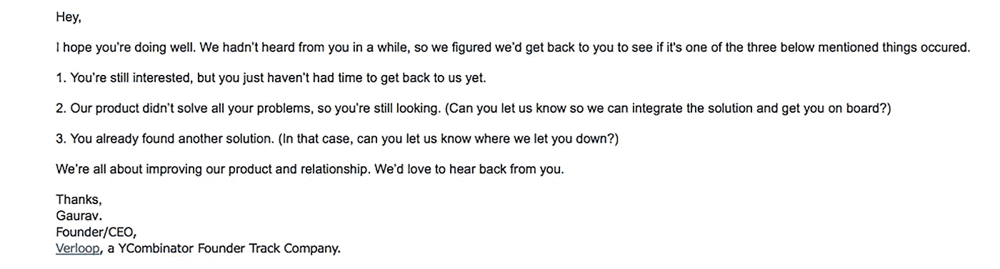

# 我们如何重新利用失去的销售线索，以及您也可以利用的 7 种方法。

> 原文：<https://medium.com/hackernoon/how-we-reengaged-with-lost-leads-and-7-ways-you-can-too-20e215af31d8>

## 丢失线索的原因、时间和方式。我们在创建印度发展最快的创业公司时学到的艰难的销售经验。

当我们一年半前开始 [Verloop](https://verloop.io/) 时，我们没有[销售](https://hackernoon.com/tagged/sales)或[营销](https://hackernoon.com/tagged/marketing)经验。在很大程度上，我们仍然没有，我们没有全职销售人员。我们只是三个对编码和对话自动化充满热情的工程师，试图有所作为。和一些钱。

我们跌跌撞撞了很多次，经常被自己的鞋子绊倒，试图到达终点线。但是销售过程坚持下来了，今天我们有 500 多个客户，我们准备谈谈我们学到的经验教训。

Don’t just push more people down the funnel, expand it at every level.

我们[擅长于在获得线索后转化它们](https://blog.verloop.io/5-ways-to-increase-your-conversion-rates-in-2018/)，但是通过起伏，我们也发现了我们销售漏斗中的几个主要漏洞，这些漏洞导致我们的线索丢失或消失。

但是什么是死的或丢失的线索呢？工业营销人员将其定义为

> *丢失/失效的销售线索是指未转化为销售并被搁置在营销荒地上的销售线索。他们可能会留在一个普通的电子邮件营销名单上，但他们往往束手无策，没有任何重新吸引他们的策略。*

要了解如何缩小这些差距并开始培育这些失去的线索，我们需要了解它们为什么会发生。通过我们的学习，我们确定了我们所说的“销售过程中的七宗罪”，详情如下。

# 1.缺乏意识

客户并不总是了解你的产品或行业的一切，如果他们不了解，很可能会退出销售过程。为了解决这个问题，你应该让他们尽可能容易地找到信息。与现有销售人员不同，在回答问题时，你的网站不是动态的，所以先占下需要的答案，然后插入到你的销售媒体中。(如果你在 FAQ 页面之外做，会得到加分。)

# 2.预算不足

你的客户退出可能是因为他们没有现金流来投资你的产品。这种情况下的问题分为两类:要么你的产品太贵，要么他们的预算太少。

# 3.输给竞争对手

有时，你的客户会流失到竞争对手那里，所以领先优势会消失。这可能有多种原因，从糟糕的客户体验到积极的挖人企图，但当您想要改善您的销售线索更新时，输给竞争对手是一些最重要的参考点。

# 4.人们从别人那里购买

在一个产品难以区分或相似的世界，比如可口可乐与百事可乐、温迪快餐与麦当劳，或者更具争议的 iOS 与 Android，人们和公司倾向于从他们喜欢的人和公司购买产品。

玛娅·安杰洛无意中将公司文化总结得很漂亮。

> *“人们会忘记你说过的话。人们会忘记你做了什么。但人们永远不会忘记你带给他们的感受。”*

# 5.缺失功能

你可能拥有你认为顾客需要的所有功能，但是如果你没有顾客认为他们需要的东西，你的销售可能会失败。你可能已经排除了这个功能，因为没人再用传真机了，但是[如果你的客户是美国医院](https://www.cnbc.com/2018/02/10/milllennial-doctors-forced-to-use-fax-machines-causing-puzzlement.html)，你就失去了一个领先优势。

# 6.竞争优先权

公司中的决策者每天都被信息淹没，并且有一系列具有不同紧急程度的优先事项。

商业趋势模仿干草的特性；它们非常热，但只是暂时的。

你的客户可能会因为超出他们能力的重要事情而不得不推迟某些商业决策，你的销售代表可能会因此而放弃他们。

# 7.销售裂缝

> *“一台机器最不完美的部分往往是操作它的人。”*

销售代表的工作很艰难。他们经常被指责所累，长时间工作，同时处理多个客户。当他们偶尔失误，将某人从销售名单中删除，或者因为延迟响应而失去一个线索时，这并不奇怪。

> 有问题并不是什么大问题；即使你知道他们的存在，也不采取任何行动，这让大多数公司处于平庸之中。

无论是作为一个公司还是作为一个个体营销者，你都应该定期后退一步，看看你如何能堵住任何漏洞，预测任何未来的失败并修复它们。

所有这七个问题都有直接的解决方法，如下所列。

# 1.跟踪销售线索变化

平均而言，公司每年会损失 30%的“衰退”线索。衰退指的是由于联系信息(如电话号码、电子邮件地址或雇主信息)的变化而变冷的线索。

借助外向营销，您获得和培养的某些潜在客户可能会离开目前的工作岗位，或者跳槽去寻找更好的机会。这看起来像是不可能的销售，但事实上这是你可能得到的最好的成交机会之一。

> *后雇主变更是指买家对新解决方案最开放的时候。*

一个刚换了工作的人有一个空收件箱，因此责备他们可以建立先发优势，巩固你和买家之间的忠诚度。

现在，你已经在你的公司和客户之间建立了更牢固的关系，而不是简单地失去了领先地位。你现在有他们的全部注意力，好好利用它。

在一个理想的世界里，你的网站复制了你的销售代表。它应该永不屈服，随时准备好，充满了关于你的产品的相关信息。

# 2.引导培养教育内容

通常情况下，情况并非如此。很有可能，内容是以 12 页长的 FAQ 格式填充的。研究表明，当通过视频或现场对话的方式展示时，信息同化率最高，而通过纯文本展示时，信息同化率最低。

在这一点上，我们作为一个团队决定吃自己的狗粮，并训练我们的 [Verloop](https://verloop.io/) 机器人回答常见问题并与游客互动。这使得我们的销售线索增加了 28%。

因为在适当的时间没有得到适当的信息，所以失去了销售线索。创建包含互动内容的活动，以达到教育客户的目的。客户评价、链接到谈话要点的行动号召按钮和竞争分析都有助于缩小知识差距。

# 3.财务关注、投资回报、总拥有成本

采用技术的最大障碍之一是成本。公司希望运行最先进的一切，但不这样做。出于两个原因，他们退出了销售；因为他们要么负担不起，但更多的是因为他们看不到公平的回报。

为了解决这个问题，关注你的公司提供的投资回报(ROI ),而不仅仅是价格。包括以前客户的实际例子，或更多关注更广泛的财政利益的概念性内容，如减少停机时间和总拥有成本(TCO)。

如果你知道你的销售线索的预算是 500 美元，但你的产品价值 600 美元，他们可能会从你更便宜的竞争对手那里购买。但是，如果你谈论你的 600 美元的产品如何为他们创造 1800 美元的销售额，这是一个更有说服力的推销，让他们把这额外的 100 美元。

# 4.品牌培育

作为销售代表，失去竞争对手的客户是你最沮丧的经历之一。这是可以理解的，为什么销售人员在为一条线索投入这么多工作后，却让他们选择了你的竞争对手，他们认为这条线索已经死了。

但是这些损失也是机遇。经常联系你失去的线索可以让你对你的竞争对手有一个行业分析水平的了解。通过与您的销售线索交谈，您可以了解您的竞争对手的核心产品、难点、优势和劣势。

将这些销售线索登记到一个特定的培养计划中，该计划将介绍您的新产品、明确的功能差异和特殊折扣。

在很大程度上，我们使用 [Polymail](https://polymail.io/) 开辟出一条创建滴滴营销活动的道路。它有助于更好地接触我们的客户，跟踪沟通，并帮助我们的销售和生产团队之间的合作。

这样，如果他们想在产品之间切换，我们的销售代表可以为他们提供个性化的、更相关的推介，因为我们确切知道他们想要什么，他们没有得到什么，以及你可以给他们什么。

# 5.产品路线图

> *产品路线图向内部团队和外部利益相关者传达方向和进展。*

在“特色”市场中，仅仅跟上曲线是不够的，你必须走在它的前面。

路线图只是一个管理文档，用于确保业务目标和产品设计的一致性。

我们已经试验了几个选项，但是最终，Verloop 团队一致决定选择[啊哈！](https://www.aha.io/)对于我们的路线图要求。我们用啊哈！在一个地方整理我们所有的生产流程和信息，以帮助团队保持一致。

像我们一样，你的产品团队可能有一个很好的理由放弃某些产品而加入其他产品。从客户的角度来看，拥有一份路线图可以决定一次成功的推销还是一次假定的失败。

然而，如果你的客户的直觉是正确的，并且你的产品真的可以使用所提到的特性，那么它必须被实现。如果他们因此而拒绝你的产品，那么你很有可能因此而失去顾客。实施这些更改后，请确保将这些更新传达给现有客户。

# 6.限时促销

一旦你吸引了顾客的注意力，你就不想让它溜走。确保这一点的方法是激励他们尽快行动。

时间敏感促销是这种现象最常用的版本，通过给你的销售线索有限的时间来利用优惠，你推动他们尽快将其转化为销售。

这些优惠可以是折扣价、附加套餐、额外的客户服务优惠或延长保修期。这些方法也可以用在电子邮件营销活动中，推动热情的潜在客户购买产品，并重新吸引失去的潜在客户。

# 7.调查技巧

重新吸引失去或失效的销售线索的终极工具是通过一个简单的邮件调查来确定您的客户遇到了上述哪些问题。

我们使用 [LeadSquared](https://www.leadsquared.com/) 作为我们的 CRM 工具，以实现更快的销售线索管理和转换优化的登录页面。为了确定本次调查的收件人，LeadSquared 对我们的销售线索进行了分类，并根据预先确定的客户端非互动期(通常为 3 个月)来确定“丢失”的销售线索。

> *如果你是一家拥有不到 100 个潜在客户的公司，你也可以在 Excel 表上手动维护一个工作中的 CRM。*

在您创建了死亡或丢失的销售线索列表后，您所需要的只是一个重新参与的触发器。触发器是一种与失去的线索重新连接的方式，以一种不受阻碍和有趣的方式。

有两种类型的触发器，人工的和自然的。

自然触发因素包括新高管、客户公告、公司扩张、产品公告、新活动、成功的财政季度/年度、奖励、额外资金或新闻报道。

任何公司引以为豪的东西，都是你进入他们收件箱的策略。给他们发一封邮件，(最好没有推销，这样看起来更真实)，祝贺他们的成就。一旦他们回复，你可以使用一个人工触发器的变体来观察他们的立场。

对于人工触发器来说，这个计划极其简单。你所要做的就是给他们发一封简单的电子邮件，里面有一个小调查。

这是邮件的样本。

这种人为触发的策略在三个不同的方面帮助你。

1.  你现在知道你的客户站在哪个路口了。
2.  你根据他们选择的选项来确定你的销售流程/网站的不足之处。
3.  你将学习如何在未来提高你的销售技巧，并根据他们的反应，学习在销售周期中前进的策略。

此外，对[羊群](https://flock.com/)的大力支持，帮助我们的销售和营销团队。我们是他们可用集成的超级粉丝！

我希望这篇文章对你目前的销售工作有所帮助。如果你有任何疑问或者你想谈谈，请随时在推特上联系我。

公司失去潜在客户的最大和最广泛的原因之一是缺乏与客户准确和及时的互动。

[Verloop](https://verloop.io/) 自动化常见问题解答、线索捕捉、线索确认、演示安排或订阅注册，这款永远在线的机器人会像与您的最佳销售代表交谈一样指导您的潜在客户。

如果你已经准备好为你的营销和销售工作增加动力，现在就注册吧。

*原载于 2018 年 2 月 15 日*[*blog . verloop . io*](https://blog.verloop.io/how-to-reengage-with-lost-leads/)*。*