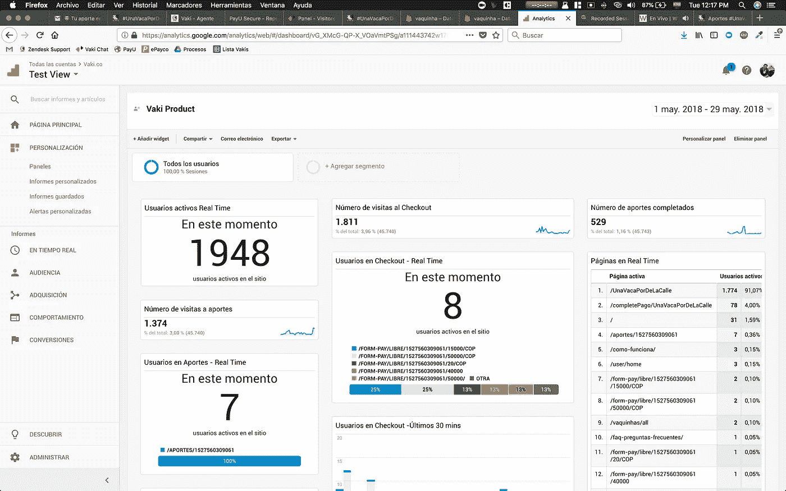
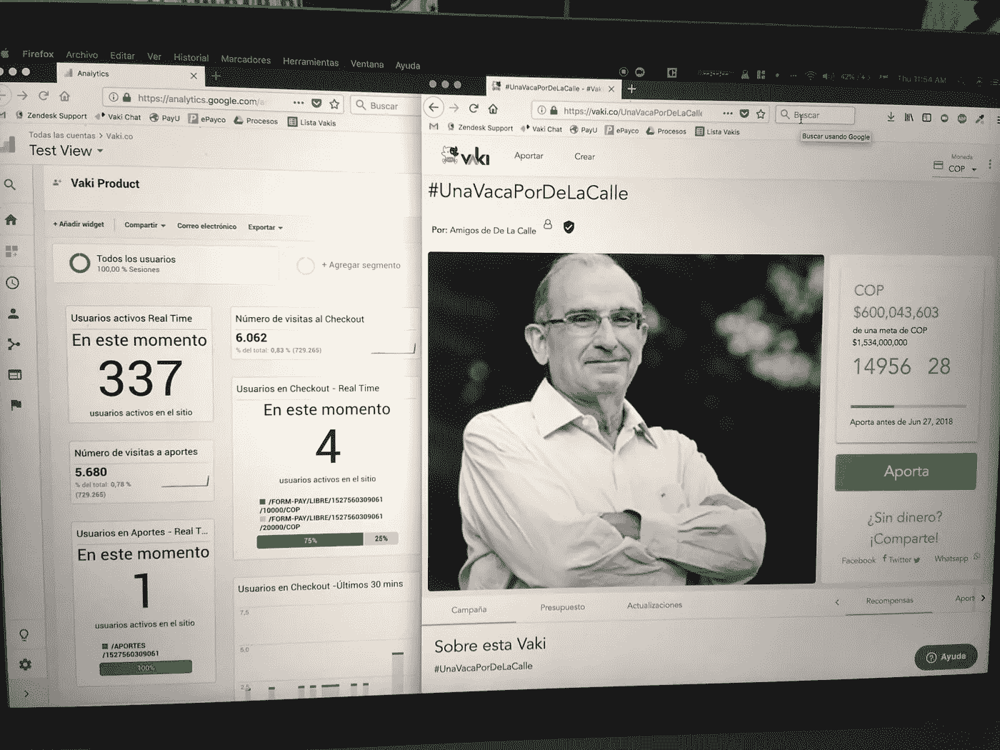
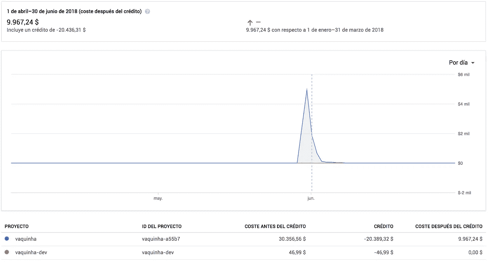
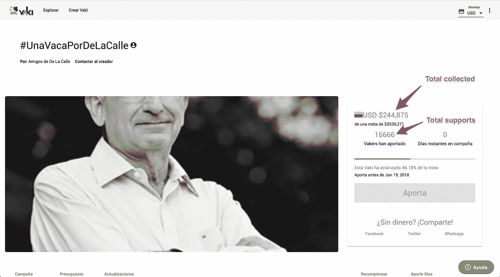
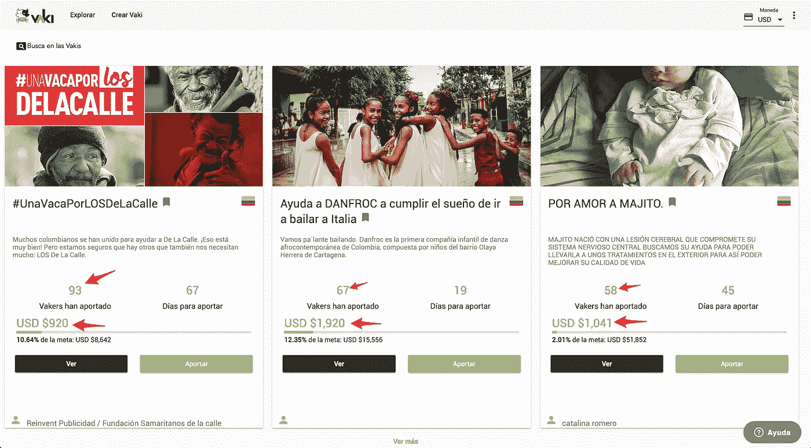

# 我们如何在不到 72 小时的时间内在 Firebase 上花费了 3 万美元

> 原文：<https://medium.com/hackernoon/how-we-spent-30k-usd-in-firebase-in-less-than-72-hours-307490bd24d>

[#UnaVacaPorDeLaCalle](https://vaki.co/vaki/UnaVacaPorDeLaCalle) 成为哥伦比亚最大的众筹活动，仅两天时间就募集到了超过此前纪录 3 倍的资金！这也成为历史上最大的政治众筹活动之一。

 [## 众筹，选举融资的另一种选择

### 在哥伦比亚有 13 个在线金融平台 Francisco rin con-frin con @ lare publica . com . co…

www.larepublica.co](https://www.larepublica.co/internet-economy/el-crowfunding-alternativa-hasta-para-la-financiacion-electoral-2734522) 

## **瓦基的巨大成功**

就在活动发布 48 小时后，我们已经创下了许多记录。该活动筹集的资金是当时哥伦比亚最高纪录的 3 倍。我们达到了 200 多万次会议，访问了 2000 多万个页面，收到了 15000 多个支持。这相当于平均有 1000 名用户活跃在该网站上，并且每分钟收集超过 20 个支持。

这对我们来说是一个巨大的成功，我们的工程团队非常自豪和高兴，我们像病毒一样传播，我们的网站每一秒都在运行。那一刻，我们一边庆祝，一边密切关注数据分析。

该应用程序正在运行，所有的支持者都能够支持，社交网络上的评论是，该应用程序使支持变得非常简单。我们非常自豪:)

我们不想在网站上有这么多用户的情况下发布任何新功能，所以我们决定将 Angular V.6 和我们正在开发的 lazzy 合并，这是一个很好的工作时间，我们说。网站加载速度开始变慢，有些用户花了 30 多秒才加载完页面。太奇怪了。我们的团队对此感到不舒服，我们无法理解是什么导致了这种情况，现在我们有了全新版本的 Angular 代码，可能还有生产中的许多其他错误。

我们的团队开始匆忙发布这个新版本，重构几乎所有东西，尽可能地延迟加载。我们做了现场重构。这是一个巨大的风险，我们希望这个活动是完美的，所以我们做到了！在仅仅一天半的时间里，我们的团队就完成了新版本的第一次发布。经过一些测试后，看起来重构有助于应用程序的速度，但没有我们想要的那么快。我们的目标是在 3 秒钟内加载，但它并不像我们预期的那样工作。这是我们第一次发现 Firebase 中有可以改进的地方。

当我们访问 Firebase 仪表板时，我们意识到，有这么多的访问者和支持，我们的 Firestore 服务不仅仅是超载，而是我们欠了谷歌**一大笔债，我们在短短 72 小时内就花了 30，356.56 美元！**

Our billing dashboard afterwards

## **一个代价高昂的代码错误**

自从活动发布以来，在接下来的 48 小时里，我们使用了 Firestore 的大量资源，我们的账单达到了 35，000 美元！！！我们向 Firestore 发出了超过 460 亿次请求。是的，十亿美元。

由于我们在 2017 年参与了 NXTP 实验室加速计划，我们的账户上有一笔 25，000 美元的谷歌云拨款，因此我们当时的债务“只有”10，000 美元。真正的问题是，谷歌云服务每小时要多花 600 美元。那时我们有两个选择:关闭网站停止收费，或者用桌上的钱钟开始调试每一行代码。我们选择第二个。

我们不知道在哪里可以优化请求。我们认为，如果我们使用 Firebase 作为我们的主机提供商，我们的公司不会盈利，我们已经开始担心需要将我们的数据带到其他地方。在我们的生命只剩下几个小时的时候，我们找到了线！只是一行糟糕的代码导致了如此多的请求(和成本): *this.loadPayments()*

为了理解这一点，让我解释一下我们的架构是如何工作的。我们在 Firestore 上有两个主要系列: *Vakis* 和 *Payments* 。 *Vakis* 拥有包含每个 Vaki 数据的文档，而 *Payments* 拥有包含每个用户付款数据的文档。

我们的功能之一是向用户显示一个 Vaki 实时获得的金钱和支持者的总数。所以我们有两个在客户端加载这些信息的服务，v *akis.ts* 和 *payments.ts.*

每次付款被批准后，我们都会用新的总数更新 Vaki 文档中的值。所以我们只需要读取集合 *Vakis* 来打印这些信息。但是，我们最大的错误是忽略了这一点，并通过读取收款金额来计算总数。

每次我们调用服务 *vakis.ts* 时，在构造函数方法上是调用服务 *payments.ts* 的行 *this.loadPayments()* ，并且通过该服务我们打印 Vaki 的信息。这意味着，对于我们网站的每个访问者，我们需要调用每个支付文档，以查看 Vaki 的支持数量或收集的总数。在我们应用程序的每个页面上！

这意味着我们网站的每个会话读取的文档数量与我们的支付数量相同。#UnaVacaPorDeLaCalle 获得了超过 16000 个支持者，所以:200 万个会话 x 16,000 个文档=在不到 48 小时内对 Firestore 的请求超过 400 亿次。

## 谷歌理解并激励我们！

在我们修复了这个代码错误并停止收费后，我们联系了谷歌，让他们了解情况，看看我们是否可以申请他们为创业公司提供的下一笔资助。我们告诉他们，我们花光了几天前获得的全部 25000 美元赠款，并看到了在谷歌云服务上申请 100000 美元赠款的机会。我们联系了谷歌开发团队 Latam，告诉他们刚刚发生了什么。他们允许我们申请下一笔拨款，谷歌批准了，在与他们会面后，他们让我们用这笔拨款支付账单。

现在，我们非常感谢谷歌，不仅因为它有一个像 Firebase 一样的令人敬畏的“后端即服务”，而且因为它让我们有 200 万个会话，每分钟 60 次支持和数十亿次请求，而不会让我们的网站宕机。此外，他们明白像我们这样的错误可能发生在一家[初创公司](https://hackernoon.com/tagged/startup)成长的时候，一些代价高昂的错误可能会危及未来的大公司。

## 结论

在发布之前，技术团队调试对服务器的每个请求是非常重要的。分析请求和数据传输的数量是否有意义，以及您的公司是否愿意承担大流量主机的成本。否则，你将会陷入循环，或者不优化的请求，导致巨额的账单或者网站瘫痪。

此外，如果你是一家使用任何精益方法快速启动、快速失败、快速学习的初创公司，请小心，技术敏捷性和技术完美性不是好朋友，你需要在它们之间找到一个良好的平衡，以防止代价高昂的错误，但仍然尽可能快地推进你的业务。

谢谢 Google，谢谢 Karen，Paco 和 Martín(团队 Google 开发者 Latam)，谢谢 NXTP Labs。没有你们，我们将无法忍受我们的第一次病毒式运动👊

*感谢 Juan Pablo Muriel、Katharine Vander Laan、Laura Cardona、Santiago Jaramillo 和 Vaki 团队阅读并评论本文草稿。*