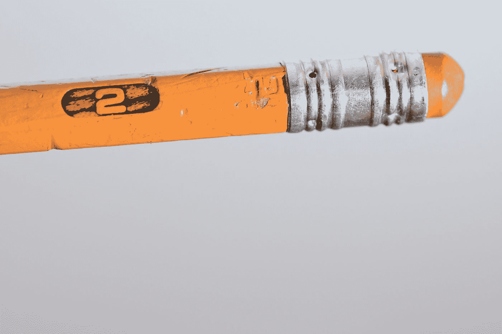
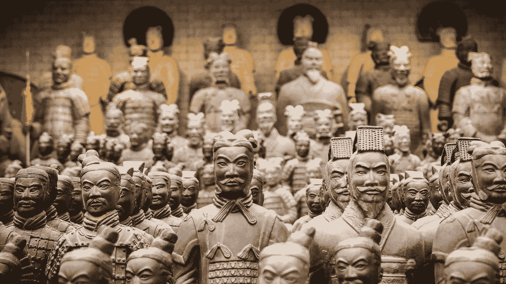
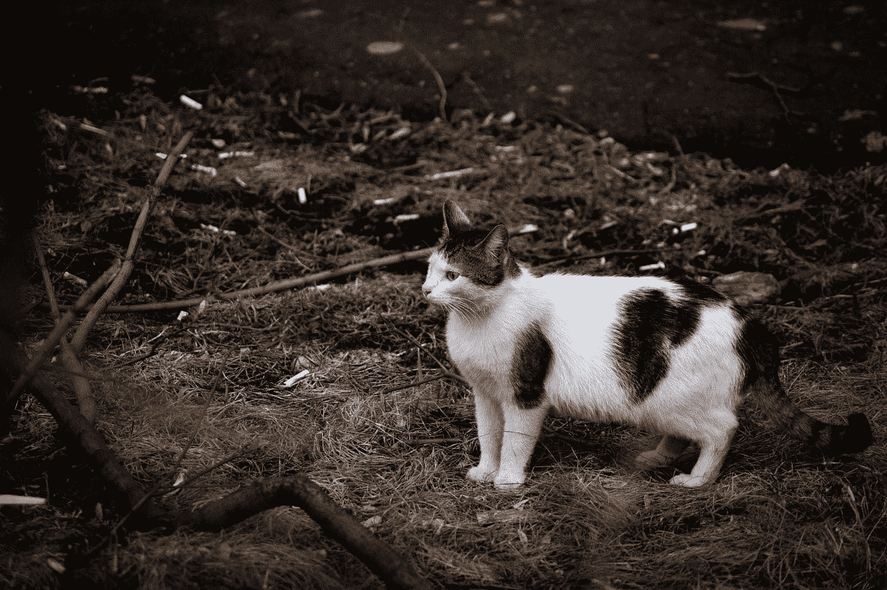

# 当我们开始赚钱时，我们是如何停止创作艺术的

> 原文：<https://medium.com/hackernoon/how-we-stopped-making-art-when-we-started-making-money-d734ff0cb918>

为什么我们要把事情写下来？人类表达的范围如此之广，以至于我不相信任何一个人能够了解所有的内容。我们欣赏绘画、交响乐、雕塑、建筑……然后有一天我们了解到西藏喉音歌唱、折纸和分层沙雕艺术的存在，我们的宇宙扩张了。几乎我们所有人都有一个共同点，那就是通过写作来表达思想。

Photo by [Clark Young](https://unsplash.com/@clark1?utm_source=medium&utm_medium=referral) on [Unsplash](https://unsplash.com?utm_source=medium&utm_medium=referral)

写作本身有多种形式。有些经历如此强烈，以至于我们有一句话:“言语无法形容。”但是你知道我这么说的意思，我用语言表达了我的想法。写作是一种艺术形式，无论我们个人是否擅长写作，我们都渴望通过写作来表达我们内心的想法、感受、情感和观点。留下我们的印记是很特别的。一些我们自身之外的东西，将我们的经验输出给其他人。

> “真正的艺术家的船。”—史蒂夫·乔布斯

书面文字的传播渠道经历了一段漫长的旅程。当石头和粘土作为碑文的媒介时，一份单独的副本作为真理的来源而存在，直到时间被投入到精心复制每一个标记、每一条线和每一条曲线。在一些文化中，抄写员的角色是神圣的，他们的产品在自然中是稀有的。稀有的东西有一种内在的价值，超越了任何其他客观的价值衡量标准。如果一支铅笔是一个名人用来写一件著名的事情的唯一一支铅笔，它可以卖几百万美元。

Photo by [Kim Gorga](https://unsplash.com/@kimgorga?utm_source=medium&utm_medium=referral) on [Unsplash](https://unsplash.com?utm_source=medium&utm_medium=referral)

印刷机的出现改变了一切。突然间，我们拥有了以高效方式从事大量劳动的机器，我们的价值观也发生了转变。有价值的不再是文字本身的稀有性，而是作者。

Photo by [Brad Neathery](https://unsplash.com/@bradneathery?utm_source=medium&utm_medium=referral) on [Unsplash](https://unsplash.com?utm_source=medium&utm_medium=referral)

无论是人类还是机器来复制书面文字，几千年来我们都明白，只有有价值的文字才会经历复制和分发的过程。被认为值得让你的文字被复制和分发是一种非常高的荣誉。

Photo by [Manoj kumar kasirajan](https://unsplash.com/@manoj25?utm_source=medium&utm_medium=referral) on [Unsplash](https://unsplash.com?utm_source=medium&utm_medium=referral)

我记得在 80 年代，当我还是个孩子的时候，我认为几个不同的职业很有声望。演员、音乐家、作家——所有这些角色只有那些“足够好”的人才能实现，以满足社会的严格审查，这个社会将通过购买工作产品在经济上支持这些追求。

Photo by [Jon Tyson](https://unsplash.com/@jontyson?utm_source=medium&utm_medium=referral) on [Unsplash](https://unsplash.com?utm_source=medium&utm_medium=referral)

像印刷机一样，万维网带来了技术赋权的又一次飞跃，随之而来的是价值的又一次转变。突然之间，任何人都有可能让全世界的人都能听到他们的话语，而不管话语本身包含的任何客观价值。

Photo by [rawpixel](https://unsplash.com/@rawpixel?utm_source=medium&utm_medium=referral) on [Unsplash](https://unsplash.com?utm_source=medium&utm_medium=referral)

> “哈哈，我不记得了，兄弟，我并不难过，但是你已经有了一个强大的和平的未来”——互联网

随着这些价值观的转变，一些有趣的事情发生了。有能力写作的人保持不变。嗯，大致说来。拥有训练和技能的文士被统治者给予荣誉和信任。知道如何建造、操作和维护印刷机的工匠最终处于同样的技术能力地位，同样可以说那些在现代技术早期知道如何更换打字机色带或发布网站的人也是如此。

Photo by [Matthew LeJune](https://unsplash.com/@matthewlejune?utm_source=medium&utm_medium=referral) on [Unsplash](https://unsplash.com?utm_source=medium&utm_medium=referral)

有一点从未改变:文字本身的力量。无论它是由皇家法令颁布的，还是用手写的，印刷在纸上的，打印在机器上的，还是通过电话线和阴极射线管带到你家的，文字在我们的世界里经历了令人震惊的各种范式转变后依然存在。

我们经常把伟大归因于我们强烈感受到的事物。这里有几个句子来说明我的观点；哪个让你有所感触？

> 虽然文档对象模型在传统浏览器模型中为我们提供了很好的服务，但是 WebAssembly 在所有主流浏览器中的可用性提出了一个问题，即我们是否甚至需要 DOM 来在 web 上交付现代应用程序。说明 1

有发现吗？这是第二个:

> 小猫非常兴奋地在后院品尝自由，我们鼓励他到处跑来跑去锻炼，没有意识到链节栅栏的底部足够宽松，鳄鱼可以压着它的鼻子扭动着穿过。插图 2

由于某种原因，当文字只是陈述事实时，我们似乎竖起了一堵情感墙。当我们讲故事时，我们的情感会投入，我们几乎*需要*来发现发生了什么。太好了。

The kitten was fine. Don’t worry.

当[互联网](https://hackernoon.com/tagged/internet)让万维网让我们的生活充斥着来自任何来源的词汇，没有理由，没有目的，通常也没有过滤机制的技能，我们的大脑呈现出独特的东西:这可能是有史以来第一次，我们正在经历内容创作者数量呈指数级爆炸式增长的即时全球联系。

Photo by [San Fermin Pamplona - Navarra](https://unsplash.com/@sanfermin?utm_source=medium&utm_medium=referral) on [Unsplash](https://unsplash.com?utm_source=medium&utm_medium=referral)

这真的很神奇。

我不知道该怎么处理。这是一个新事物，人类思想的网络。

你在网上冲浪的经历可能与我的大不相同。你的社交群体，兴趣爱好，甚至你在家里说的语言，对我来说可能都是完全陌生的。但是我们现在在一起，用这些话来说，分享我们大脑之间的联系，不管你是在我家庭办公室的门外(嗨，卡蒂亚！)，在我隆冬的时候体验夏天(嗨，马塞洛！)，或者在世界的另一边(嗨，列拉！).

Photo by [NASA](https://unsplash.com/@nasa?utm_source=medium&utm_medium=referral) on [Unsplash](https://unsplash.com?utm_source=medium&utm_medium=referral)

互联网上自我组织的大部分疯狂斗争都集中在策划内容的推广和展示上。如果你曾经找到我的第一个网页，你很快就会发现有些内容是在浪费你的时间，你可能会感到有点难过或生气，因为你花了这么多钱购买的神奇快乐机器没有发挥作用。

Photo by [Tim Gouw](https://unsplash.com/@punttim?utm_source=medium&utm_medium=referral) on [Unsplash](https://unsplash.com?utm_source=medium&utm_medium=referral)

我们没有说服一群有权势的人来补偿我们，因为他们赌上了我们与观众联系的能力，我们发现自己陷入了一场大规模的受欢迎程度竞赛，仇恨言论、种族主义、偏执，甚至直接的暴力威胁都像池塘里的渣滓一样浮上了社会的顶端。

在自己舒适的家中，我们不知不觉地站在了永恒的舞台上，因为我们立即、永久、非常公开地将我们最不精致的思想和最低级的情感奉为神圣。这种诚实的价值达到了惊人的程度。就像跟随电视剧《办公室》剧组的摄像机一样，我们得到了一份礼物(和惊喜),一份比其他方式更详细的生活记录，我们对这些反思的范围和性质感到惊讶。我们也许对负面回忆的价值感到惊讶。毕竟，早在互联网出现之前，积极的记忆就已经出现在故事和艺术中了。

这种新颖的镜头让我们可以观察自己和他人，对我们的群体动态和个人心理产生了迷人的影响。如果你能给我指出一些社会学和心理学领域的专业人士关于这个话题的好的读物，我会非常感激，他们正在研究这种对人类经验的影响。我的观点仅仅是技术和商业相关。

Photo by [Rubén Bagüés](https://unsplash.com/@rubavi78?utm_source=medium&utm_medium=referral) on [Unsplash](https://unsplash.com?utm_source=medium&utm_medium=referral)

在这场文化变迁中，我和你一样受到了同样的社会诱惑。我年轻的时候想成为一名摇滚明星或 F-16 飞行员或作家。一部分原因是对这些工作的兴趣，但更多的是骄傲和相信我是特别的。事实上，我不是一个很好的歌手，太高了，不能成为一名喷气式飞机驾驶员，而且容易学究式的独白并没有影响我。互联网让我们一夜成名。

Photo by [Elijah O'Donnell](https://unsplash.com/@elijahsad?utm_source=medium&utm_medium=referral) on [Unsplash](https://unsplash.com?utm_source=medium&utm_medium=referral)

当我们看到我称之为“好”的内容时，我们有积极的体验。我们可以说“坏”的内容是有害的、准备得不好的或呈现得不好的，或者可能是不准确的。为什么我要将内容简化为布尔型好/坏标签？因为这就是互联网如何依赖我们生产的一切。这就是我们处理信息的方式。有好的，坏的，平庸的，但平庸是坏的，所以我们回到这两个。赞成票或反对票；喜欢并分享，或者举报并禁止。转发，或愤怒推文。我们在筛选自己。

Photo by [Ieva Vizule](https://unsplash.com/@ievavizule?utm_source=medium&utm_medium=referral) on [Unsplash](https://unsplash.com?utm_source=medium&utm_medium=referral)

你见过剪贴画集吗？这在今天的网络上是一个非常陌生的概念，因为我们可以随意搜索图像和插图，并将其嵌入到我们的媒体中，而无需真正思考它，但我记得翻阅我爷爷的 Corel Draw printed clip art book，并记下软盘号码，在那里我可以找到一个俗气的回形针或电话图来添加到纸上。我喜欢想象在某个地方，一个极简主义艺术家找到了自己的使命，并真的靠这些剪贴画进城了。我猜在某个时候，完成布景所需的物品清单确实起到了一定的推动作用。

欺骗眼睛相信奇怪的事情是可能的。有时候诀窍是让不好的内容看起来像是好的内容。

7 Secrets for Making Fire Your Doctor Doesn’t Want You to Know

我们每天涉水而过的大量内容通常是由经济利益驱动的。这没什么不对，但这是一种不同的生物，不同于你的孩子用闪光和浆糊写的写着“我爱你”的诗或画。

Photo by [rawpixel](https://unsplash.com/@rawpixel?utm_source=medium&utm_medium=referral) on [Unsplash](https://unsplash.com?utm_source=medium&utm_medium=referral)

在“点击这里/现在购买”和“……擦去她眼中的泪水，他终于承认了他的爱……”之间有不同程度的平衡，但轶事肯定的心理锁定是强烈的。

好奇心也很强。有哪三种方法可以让你节省时间，省钱，并且在假期里更加自律？我也不确定，但这听起来像是一篇应该有人写的好文章。

Photo by [rawpixel](https://unsplash.com/@rawpixel?utm_source=medium&utm_medium=referral) on [Unsplash](https://unsplash.com?utm_source=medium&utm_medium=referral)

然后还有神秘的“*其实是*……”因素。"令人震惊的新研究证明苹果不是医生最害怕的东西."伟大的水冷却器统治，但其他的很少。据消息来源称。

我的最爱？真实的，有营养的内容。不含防腐剂，不含人工成分。艺术。因为作者深切关注主题而创作的作品。

Photo by [Ian Schneider](https://unsplash.com/@goian?utm_source=medium&utm_medium=referral) on [Unsplash](https://unsplash.com?utm_source=medium&utm_medium=referral)

我认为技术福音是真正的艺术家运送好内容的巨大空间。你是代码诗人吗？你喜欢写关于技术的文章吗？你期待你的休息日，这样你就可以用多种语言构建软件项目了吗？传播福音。

有目的地寻找高质量、无罪恶感的内容？追踪一个福音传道者并跟随他们。我不是指那种想让你给他们寄私人飞机钱买魔法信仰油的人。我指的是那种会回应“给我看看！”“好吧，看看这个。”

Photo by [rawpixel](https://unsplash.com/@rawpixel?utm_source=medium&utm_medium=referral) on [Unsplash](https://unsplash.com?utm_source=medium&utm_medium=referral)

我认为这种角色分类是一种非常健康的表现，体现了与网络时代许多蒸汽软件网站、产品和服务的薄薄外表的斗争。

当一家公司真正关心客户使用的技术中的艺术和科学时，它就会表现出来。它的“味道”不同于其他品牌。千万不要认为它有损传统的营销和销售。它实际上让这些角色变得更透明、更直率、更脚踏实地。当我们开始赚钱时，内容创作者停止了艺术创作，然后我们又开始艺术创作。随着社会接受这种心态，我希望看到更多的创造性、艺术性、科学性和工程性的角色出现。

好吧，但是一般来说，艺术家、创作者和作者的解决方案是什么？技术传播者已经找到了最佳点，但是“我们其他人”呢？也许如果我们反其道而行之，事情会自行平衡？我写过一篇文章，讲的是当我们开始赚钱的时候，我们是如何停止创作艺术的。接下来发生的事会让你大吃一惊。

Photo by [Andre Guerra](https://unsplash.com/@andredoesphoto?utm_source=medium&utm_medium=referral) on [Unsplash](https://unsplash.com?utm_source=medium&utm_medium=referral)