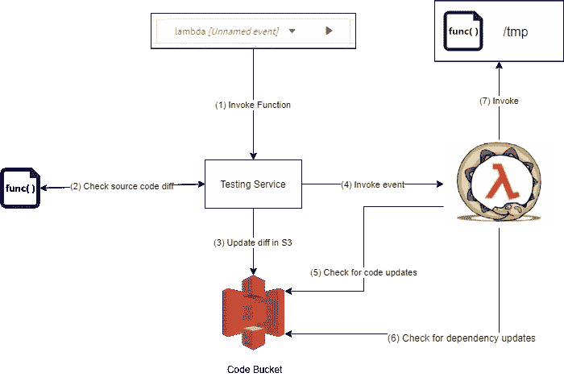

# 我们如何简化无服务器测试

> 原文：<https://medium.com/hackernoon/how-we-streamlined-serverless-testing-8f5e0bbdc7e5>


如果这不是你第一次听说[无服务器](https://en.wikipedia.org/wiki/Serverless_computing)和 [AWS Lambda](https://aws.amazon.com/lambda/) 的话，你可能已经见过 [AWS Lambda](https://aws.amazon.com/lambda/) 控制台中的橙色测试按钮，当你想在你的无服务器项目中使用第三方依赖时，或者如果你上传的包的大小大于某个大小限制时，它就变得无用了。


AWS Lambda Test Button


Okay. 🙄 Thanks for the information!

由于这个**完全打破了开发者**的节奏，对于[适马](https://sigma.slappforge.com)我们建立了一个测试按钮，它看起来&表现有点不同。


Sigma’s Test button

这个按钮，

*   作品**更快**！
*   当你想添加依赖项时，不会变得无用。
*   当你的 lambda 代码更大的时候不会变得没用。
*   **对于代码变更&运行时异常，尽量避免冷启动。**
*   允许您更有效地管理测试事件。


Testing Your Code in Sigma

我们通过利用我在《》中提到的简单技巧的基本概念，

[](https://hackernoon.com/writing-a-self-sufficient-aws-lambda-function-da6c0586f48c) [## 编写自给自足的 AWS Lambda 函数

### 如果你已经浏览了 SLAppForge 的新闻文章和博客，你可能已经知道那群…

hackernoon.com](https://hackernoon.com/writing-a-self-sufficient-aws-lambda-function-da6c0586f48c) 

## **在** [**AWS**](https://aws.amazon.com/) 上部署测试环境

为了实现上述所有功能，[适马](https://sigma.slappforge.com)在用户首次注册时在 [AWS](https://aws.amazon.com/) 上创建了一个测试环境。这个测试环境主要有三个主要组件。

1.  *依赖下载器*λ函数


Dependency Downloader

这个 lambda 负责处理所有的节点依赖关系更新。稍后，我将详细解释这个函数的功能。

2.*测试转轮*λ


Test Runner Lambda

这个 lambda 将被[适马](https://sigma.slappforge.com) IDE 直接调用来执行项目 lambda 文件上的测试事件。

3.代码桶


Code Bucket

这个桶将被*依赖下载器* Lambda 直接用来保存下载的依赖项，并被[适马](https://sigma.slappforge.com) IDE 的*测试服务*用来保存项目的源文件。

## 处理相关性更新


Dependency Update Flow

与其他[无服务器](https://en.wikipedia.org/wiki/Serverless_computing)框架不同，在[适马](https://sigma.slappforge.com)中，添加依赖项并不是一个痛苦的过程。


Adding a dependency in Sigma

一旦你给项目添加了一个依赖项，[适马](https://sigma.slappforge.com)会在后台把这个更新发送给*依赖下载器*函数**，它已经部署在你自己的 AWS 账户**中。

*依赖下载器*请求的有效载荷采用以下格式。

```
{
        "project": "${projectName}",
        "bucketName":"${bucketName}",
        "dependencies": {
             "dependency1": "version1",
             "dependency2": "version2",
             "dependency3": "version3",
         }
}
```

*依赖下载器*使用上述事件负载的*依赖*属性在其容器的/tmp/{project_id}目录下创建一个 package.json 文件。

> 对于每个 lambda 容器(函数的每个实例),在/tmp 目录下可以获得 512MB 的可写非持久磁盘容量。

然后执行带有[前缀标志](https://docs.npmjs.com/misc/config#prefix)的 npm 命令，将依赖项下载到**/tmp/{ project name }/node _ modules**目录

```
npm --prefix /tmp/projectName install /tmp/projectName
```

> 由于这个 lambda 并发地没有其他事情要做，我们使用 [syncExec](https://nodejs.org/api/child_process.html#child_process_child_process_execsync_command_options) 函数来产生所有子进程。

一旦 [syncExec](https://nodejs.org/api/child_process.html#child_process_child_process_execsync_command_options) 返回到父进程， [archiver](https://www.npmjs.com/package/archiver) 用于生成一个新创建的 *node_modules* 目录的 zip 文件。

生成的归档文件( *node_modules.zip* ，然后上传到您的 [AWS](https://aws.amazon.com/) 帐户中的 S3 存储桶(*代码存储桶)*，密钥为{projectName}/node_modules.zip

> 在 S3 什么是钥匙？
> 
> 当您创建一个对象时，您指定一个键名，该键名唯一地标识存储桶中的对象。[阅读更多](https://docs.aws.amazon.com/AmazonS3/latest/dev/UsingMetadata.html)。

## 测试项目功能代码



当用户点击▶️按钮时，以下事情按顺序发生。

1.  **调用*调用功能*命令**

[适马](https://sigma.slappforge.com)的测试服务接收*测试事件*的有效载荷，以及要调用的 lambda 函数的名称。

**2/3。检查源代码差异&更新差异** [**S3**](https://aws.amazon.com/s3/)

测试服务定期在[适马](https://sigma.slappforge.com)编辑器中检查源 javascript 文件的更新。如果发现更新的文件，它将该文件标记为*已更新*，并等待任何其他后续更新。如果它在一段时间内没有看到任何后续更新，该特定文件的内容将被推送到 [S3](https://aws.amazon.com/s3/) (代码桶)。

除此之外，当一个测试事件被调用时，它会立即检查项目中的所有 JS 文件是否有更新，如果有任何更新，它会立即将它们推送到 [S3](https://aws.amazon.com/s3/) 。由于我上面提到的定期更新检查，在大多数情况下，在测试调用时检测到的更新文件的数量将是 1。

源文件将被上传到关键字为{projectName}/{fileName}的 [S3](https://aws.amazon.com/s3/) 。因此，这将在 [S3](https://aws.amazon.com/s3/) 中创建项目文件结构的镜像。

**4。调用测试运行器**

在这一步，*测试服务*向测试事件&发送要调用的 Lambda 文件的名称给*测试运行程序* Lambda。该调用的有效负载采用以下格式。

```
{
        "project": "${projectName}",
        "type": "RUN",
        "lambda": "${path of file relative to the project root}",
        "bucketName":"${bucketName}",
        "testEvent": ${event}
}
```

**5。检查代码更新**

*测试运行器*函数通过检查前缀为{projectName}的 [S3](https://aws.amazon.com/s3/) 对象的 ETag 来检查代码更新。

> ETag 是什么？
> 
> 在 AWS S3 中，实体标签是对象的散列。ETag 只反映对象内容的变化，不反映其元数据。ETag 可能是也可能不是对象数据的 MD5 摘要。

然后，带有更新内容的源文件被下载到 lambda 容器的/tmp/{projectName}目录中。

> 对于每个 lambda 实例，您会在 lambda 容器的/tmp 位置获得一个**512 MB 的非持久空间。**

同时；*测试运行程序*生成(或更新)一组{FileName:ETag}元组，并将其分配给在*测试运行程序*函数中声明的一个全局变量。因为只要 lambda 容器运行，全局变量的值就会被保留，所以这些值在下一次测试调用中也是可用的。因此，在即将到来的调用中应该下载的文件数量将被最小化。

在这一步的最后，*测试运行程序*将在容器的/tmp/{projectName}目录中拥有一个完全相似的项目文件结构副本。

**6。检查依赖性更新**

我们在{ S3 bucket }/{ project name }/node _ mdoules . zip 中已经有了项目的依赖包。

Test Runner 应用上面解释的相同过程来检查 node_modules.zip 自上次调用以来是否有任何更新。

如果在 node_modules.zip 的 Etag 中发现任何不匹配， *Test Runner* 会下载 node_modules.zip 并将其提取到 lambda 容器的/tmp/{projectName}中。

> 与依赖下载器功能不同，上述步骤 5 和 6 同时发生，所有 S3 获取操作也同时执行。

**7。调用 lambda 函数**

在以上 6 个步骤的最后，在 lambda 容器的/tmp/{projectName}目录中，我们有了一个功能完整的 node.js 项目，其中包含所有必需的依赖项。

*测试运行程序* Lambda 现在调用预期的 Lambda 处理程序，如下所示。

有必要用 try/catch 块包装上述处理程序调用，以便在出现运行时异常时保留*测试运行器* lambda 容器实例。

除了上述类型为 *RUN* 的事件外， *Test Runner* lambda 还支持另一种事件类型， *WARM_UP* 。

```
{
       "project": "${projectName}",
       "type": "WARM_UP",
       "bucketName":"${bucketName}",
       "testEvent": {}
}
```

[适马](https://sigma.slappforge.com)定期向*测试运行器*发送预热事件*、*以保持其容器更热。除了保持容器更热之外，在这种情况下；*测试运行程序*执行上面的第 5 步和第 6 步，以使/tmp 目录与项目保持同步。

甚至在执行了依赖项更新之后，[适马](https://sigma.slappforge.com)向*测试运行器*发送一个预热请求，通过保持容器准备好依赖项，使*更快地运行*事件。

在大多数测试调用中，*测试运行器* lambda 可以跳过上面的第 6 步，因为 WARM_UP 请求做了大量的工作。

> [适马](https://sigma.slappforge.com)，在应用层，避免并行*测试运行程序*调用，以防止 AWS 产生*测试运行程序*的多个实例。这使得每个后续的测试调用非常快。然而，这并不是一个有保证的行为。如果 AWS 通过偶然的并发调用产生了一个额外的容器，适马将会经历一个冷启动延迟，仅仅是因为一个单独的测试调用。但是这种情况很少发生。

这就是我们如何**精简** [**无服务器**](https://en.wikipedia.org/wiki/Serverless_computing) **测试** &如果你和我一起走了这么远，你可能会想知道[适马](https://sigma.slappforge.com/)是什么。所以这是了解适马的最好时机！！

# 什么是[适马](https://sigma.slappforge.com)？

[适马](https://sigma.slappforge.com)于 2018 年 2 月 6 日在[斯里兰卡](http://www.srilanka.travel/)的[斯拉普佛格](https://www.slappforge.com/)诞生，其设计&的愿景是让[无服务器](https://en.wikipedia.org/wiki/Serverless_computing)开发者的生活更轻松。

如果你对适马很陌生，让我给你简单介绍一下。

[适马](https://sigma.slappforge.com)是一个让[无服务器](https://en.wikipedia.org/wiki/Serverless_computing)开发更加顺畅的工具。

*   [适马](https://sigma.slappforge.com)不是一个老式的命令行工具。
*   你不必在你的电脑上安装适马。
*   适马完全在你的浏览器上运行(因为 chrome 不是世界上唯一的浏览器，我们支持所有现代的网络浏览器)。
*   [适马](https://sigma.slappforge.com)给你现代集成开发环境(IDE)的丰富体验。
*   [适马](https://sigma.slappforge.com)自动更新。


You won’t see this in Sigma.

*   [适马](https://sigma.slappforge.com)为你生成代码(API 调用其他[无服务器](https://en.wikipedia.org/wiki/Serverless_computing)服务)。这样开发者就不用费心去阅读 API 文档了。
*   [适马](https://sigma.slappforge.com)为你管理资源(资源= DynamoDB 表，AWS 中的 S3 桶等)。

谈到[无服务器](https://en.wikipedia.org/wiki/Serverless_computing)开发，[适马](https://sigma.slappforge.com)提供从头开始部署无服务器应用所需的一切。我们的主要目标是让您在同一个浏览器选项卡中从头到尾开发您的应用程序。

这是关于适马的，既然我们已经谈论了适马的测试框架，让我给你介绍测试框架的其他组件，让你的生活更轻松。

# 适马测试框架的组成

## 测试事件管理器


Sigma Test Event Manager

适马的测试活动管理器让您能够，

*   为项目中的单个函数定义事件有效负载
*   复制现有事件，为同一功能或不同功能创建新的测试事件
*   用期望的测试事件直接调用函数

## SigmaTrail


Sigma Trail

SigmaTrail 实时显示所有的测试调用结果。除了[测试]日志，SigmaTrail 还显示每个功能的[生产]日志，当您的功能实际部署在 AWS 上时，这些日志将在生产环境中生成。多亏了 SigmaTrail，再也不用检查 [CloudWatch](https://aws.amazon.com/cloudwatch/) 的[无服务器](https://en.wikipedia.org/wiki/Serverless_computing)日志了。

希望你喜欢！快乐编码[无服务器](https://en.wikipedia.org/wiki/Serverless_computing)与[适马](https://sigma.slappforge.com)。

# 行动呼吁

*   **拍手。**欣赏并让别人发现这篇文章。
*   **评论。分享你对这篇文章的看法。**
*   跟我来。[Chathura wid anage](/@cwidanage)**接收类似文章的更新。**
*   保持联系。 [LinkedIn](https://www.linkedin.com/in/cwidanage/) ， [Twitter](https://twitter.com/cwidanage)

[](https://slappforge.com/) [## SLAppForge

### SLAppForge 将无服务器计算和应用程序带入最终用户商业成功的主流使用

slappforge.com](https://slappforge.com/) [](https://hackernoon.com/tagged/serverless) [## 无服务器-黑客正午

### 阅读黑客午间关于无服务器的文章。黑客如何开始他们的下午？

hackernoon.com](https://hackernoon.com/tagged/serverless)