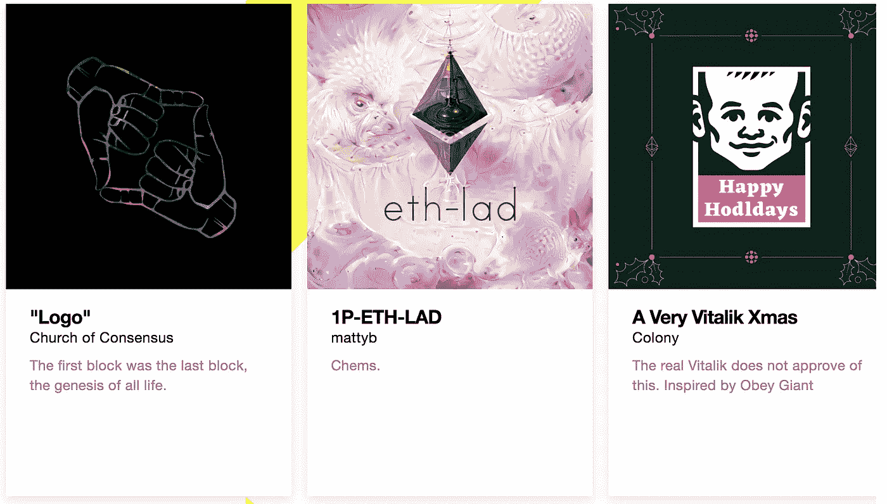
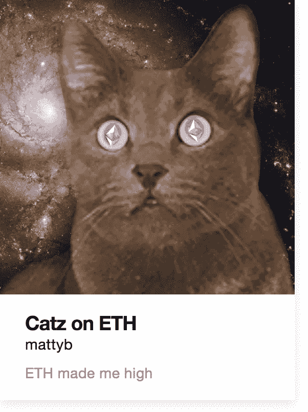
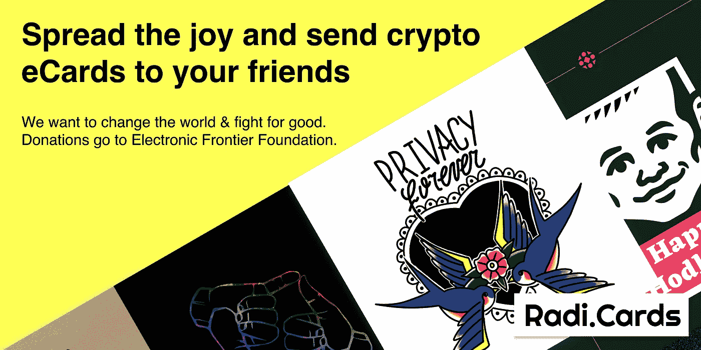

# 我们如何利用以太坊让电子贺卡再次变得酷起来

> 原文：<https://medium.com/hackernoon/how-we-used-ethereum-to-make-ecards-cool-again-723f8dda3116>

## ***TL；拉迪博士。卡片——第一张 NFT 电子卡片。我们允许您使用密码向您的朋友发送电子贺卡。***

Unique NFT eCards built on IPFS by the Ethereum community

现在是(秘密的)冬天，说冬天不会有什么好结果是不真实的。

***几月回来***

我和两个好朋友 Toby 和 Diego 一起为名为[CryptoDecks.co](http://cryptodecks.co)的不可替代令牌(NFT)设计分析，加入了以太坊社区。作为一名新的设计师，唯一的学习方式是“艰难的方式”,因为每天早餐后都要服用一定剂量的加密知识。分散应用程序的世界并不是最用户友好的地方，但我的目标是把它变成一个。所以我学会了，我失败了，我成功了，然而我又失败了。这是通常的生命循环。

以太坊社区的人们建造了一些世界上没有多少人会欣赏的东西，但我们不会屈服于此。如果我们一开始没有成功，我们会更努力地让我们的工作更有用，如果我们失败了，我们会学习，然后我们会重新站起来，再试一次。这是通常的生命循环。我知道这些人和我是一类人。所以我交了很多朋友。

***崩溃***

加密货币价格暴跌。我在柏林参加会议的时候就知道了。我的朋友给我发了几张密码价格下降的截图。几天后，关于公司资金被削减和人们失业的故事到处都是。“成长”是这个阶段的反命题。

I will never forget the way you made me feel.

***心爱的 NFT 贫民区***

我一直认为 NFT 项目是秘密宇宙中某种温暖的设计师/艺术家聚居区。居住在同一贫民区的人们往往彼此非常了解。我们可能同时在做我们的项目，但尽管如此，我们还是朋友。我们赚了一些利润，但不多，我说的多是指奥格的多，而不是苹果的多。

对 NFT 感兴趣的用户更多的是艺术品收藏家，而不是密码交易者。艺术中的两个关键概念是稀缺性和真实性，我们通过发行这种“独特的令牌”来数字化复制这两个概念。

人们出于各种原因收集。有些，是为了赚钱。但是大多数人这样做是出于一种内在的动机——事实上，收藏是人类最基本的行为之一。

***几周前回***

托比下午给我打电话，谈了一个在这个假期买 NFT 作为礼物的想法。我认为这是一个好主意，但“赠送收藏品”仍然没有太大意义。为什么有人会买自己非常喜欢的东西送人？这违背了人类的行为。我们不都更像是一个贮藏者，一个觅食者，一个采集者而不是一个给予者吗？

这让我开始思考——在这个季节，人们倾向于送什么礼物？当然有圣诞礼物。但这仅限于基督教文化。在我的家乡，96%的人口是佛教徒，我们庆祝耶稣诞生的方式和这里的人不一样。我们的活动包括一个商业版的圣诞老人，以及在闪闪发光的购物中心里走一圈。

Christmas at the malls.

但是有一种常见的行为。不同文化背景的人都会寄贺卡。

卡片是一种超越文化和宗教的礼物。虽然每张卡片的内容可能会受到文化相对性的制约，但卡片本身却不会。

我们为什么不把 NFT 铸造成一张卡片而不是一件礼物。我告诉托比谁不需要进一步说服。

***好玩却不错***

和朋友一起制作节日贺卡肯定比独自在家做更有趣。

这个 NFT 贺卡项目是为了和朋友们一起做，更好的是，作为一种回馈互联网社区的方式。首先，我们与 Diego 进行了交谈，他是一名全栈工程师，也是我们来自 [CryptoDecks](http://cryptodecks.co) 的联合创始人。然后我们的朋友安迪、詹姆斯和大卫来自 [KnownOrigin](http://knownorigin.io) 和乔恩和查尔斯来自 [SuperRare](http://superrare.co) 。他们都在。当谈到区块链的美学时，这两个项目是顶级的。也许我们的 NFT 卡想法并没有那么糟糕。

几天后，更多的朋友加入进来。丹尼尔是来自 [Pheme](http://pheme.app) 的明星设计师，马蒂来自 MetaCartel，克里斯来自[registere](http://registree.rocks)。秉承权力下放的精神，我们的团队由来自英国、泰国、意大利、南非和新西兰的全球人员组成。

此外，我们还与社区中的许多项目建立了合作关系:Ethberlin、[0xcert.org](http://0xcert.org)、[blockcities.co](https://www.blockcities.co/)、[bounts . network](https://bounties.network/)、[blockpunk.net](http://blockpunk.net)、[churchofconsensus.org](http://churchofconsensus.org)、metacartel、 [opensea.io](http://opensea.io) 、 [colony.io](http://colony.io) 、[astroledger.org](http://astroledger.org)。更不用说向该项目捐赠艺术品的天才艺术家:0xbull、Cristiana Vettor、、uly128、Ophelia Fu、HEX0x6C、Stina Jones、Aktiv Protesk、Hugh D'Andrade、Hernan Wave、Stas Leontyev、laazeecat 和 Oficinas TK。

这会很有趣的。

我们的计划是以公益的方式开展这个项目，并将扣除汽油费用后的所有收入捐给与以太坊社区有着一致价值观和目标的慈善机构。电子前沿基金会(EFF)在我们的名单上名列前茅。

今年早些时候，我去了敌无双，有机会听了一场多年来最好的演讲。我第一次半睡半醒地走进房间，被台上的一个家伙吵醒了，他正在谈论“代码即言论”是如何被美国政府认可的，这是第九巡回法院和上诉庭胜诉的结果。如果他们不这样做，比树莓派所能处理的更强的加密都将被取缔。

这个人实际上是科利·多克托罗，我当时不知道他在赛博朋克圈子里很出名。我从以太坊基金会的万可儿那里得到了他的名字，当时我正在询问那个谈论“代码即语言”的人的名字。Cory 后来很友好地把我介绍给 EFF 的开发总监 Aaron Jue，他对我们的计划给予了全力支持。

*在时间和资源有限的情况下，我们开始着手建设。首先，我们集体的设计师开始在 Figma 上充实一些基本的线框和 UX 流。一旦我们对结构和流程有了一个粗略的概念，我们就可以进入#BULD。*

*BlockRocket 是 KnownOrigin 的开发者，他们获得了一个基本的 ERC721 合同，并使用一个简单的 vue.js 前端项目进行了构建和测试，还构建了一个将所有这些连接在一起的管道。我们决定第一个版本在技术方面尽可能简单，决定只使用客户端 webapp，利用 IPFS 进行卡片图像，并使用 Infura 作为我们的网络接入点。一旦我们自己有了一个粗略的准备好的工作版本，克里斯、迭戈、马特、丹尼尔和团队的其他人就开始让它看起来和感觉起来都很光滑。我们最终得到的是一个简单但有效的首次发布或 MVP，未来的[迭代可以在此基础上构建。](https://hackernoon.com/tagged/future)*

****【互联网】生活中最好的东西都是免费的****

*真爱、友谊、同情和怜悯毫无疑问是生活中最美好的东西，你永远不需要为它们付出代价(对于那些靠有偿爱情或友谊生活的人，我同情你)。对我们大多数人来说，互联网属于这一类。如果我们必须为我们在网上获得的所有知识和乐趣付费，我们的生活会是什么样子？*

**

**Matty, in collaboration with Gio my pet cat, creates the best Ethereum meme ever titled “Catz on ETH”**

*自由互联网是自由社会的基础。所以，网上最好的东西应该是免费的。这就是为什么我们马上知道激进分子的所有卡也应该免费。毕竟，这是一个黑暗的冬天，许多人刚刚失去了工作。如果他们觉得不舒服，就不应该强迫他们捐献。通过免费赠送激进分子，每个人都可以帮助传播我们为 EFF 筹款的努力。此外，我们通过借用猫的魔力来确保这一点。*

****岁末欢乐****

*我们团队花了两周时间和一船的精力来设计、开发和交付 RadiCards dapp。我们注意到你的朋友和家人是秘密 noobs，可以像你一样享受激进。在 NFT 历史上，这是第一次你可以通过电子邮件和聊天软件把 NFT 发给你的朋友。*

*哦，我们还有一个功能，你可以在卡片背面添加一条抵制审查的信息。这个信息将是公开的——但是想象一下——没有政府，没有当局，甚至我们可以把你的信息记录下来，因为它将会在区块链上。决定权在你。你会说什么？*

*你可能会问，它是如何工作的？首先，你选择你最喜欢的 RadiCard，支付汽油费，*添加收件人的电子邮件地址或 ETH 钱包地址，添加抵制审查的信息，然后*瞧！**

*你可以给任何没有钱包地址的人发送激进的信息，但是作为发送者，你需要有一个钱包地址。从技术角度来说，我们制定 Web2.0 的互联网标准卡没有问题，但我们拒绝这样做。我们确实相信，少量的分散网络教育是必要的，因为我们想让你知道，你有一个更安全、更隐私和更安全的方式来享受互联网。CryptoKitties 是 dapps 中的一员，它帮助许多新人进入分散式网络，我们希望我们会是下一个。*

****所以现在轮到你了。****

*激进者现在在以太坊主网上直播。你只需要安装一个 ETH 钱包(MetaMask，Trust wallet，比特币基地钱包，Status)，从交易所(比特币基地，BitStamp，Gemini，BitBay)拿到你的第一个 ETH，你就准备好摇滚了。*

*祝您在年底过得愉快，我们希望不久能在 [https://radi.cards](http://radi.cards) 与您见面。*

**

*Crypto project that plans to change the world & fight for good. Too good to be true.*

*编剧[莉莉·费耶阿本德](https://medium.com/u/c5a6bc70b3ff?source=post_page-----723f8dda3116--------------------------------)和[詹姆斯·摩根](https://medium.com/u/6bb848438230?source=post_page-----723f8dda3116--------------------------------)*

*要获得 radiCards 项目的更新，请在 Twitter @radi_cards 上关注我们，不久我们将在 Pheme.app 上发布更多故事*