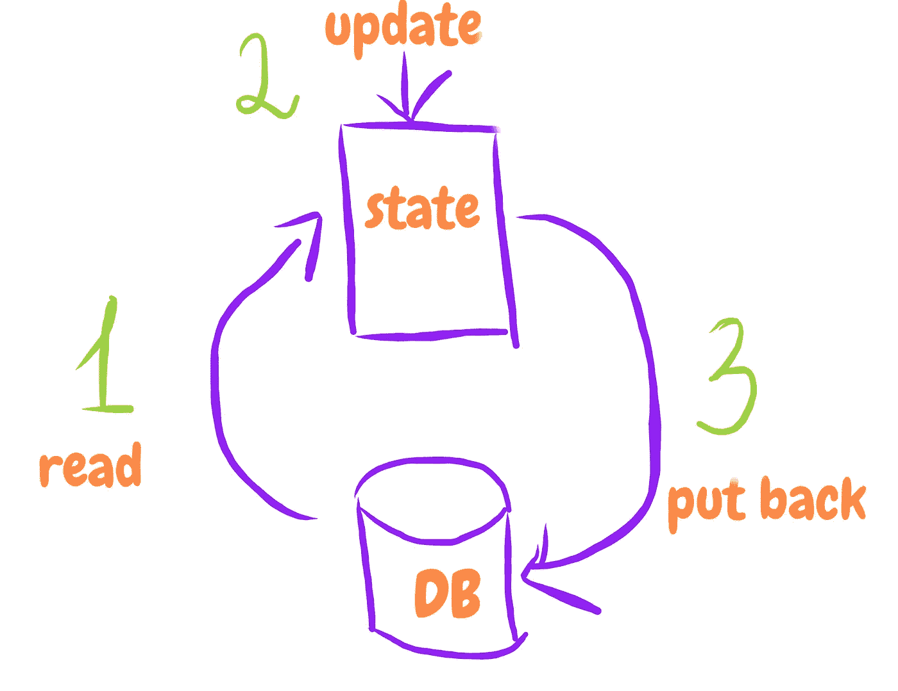
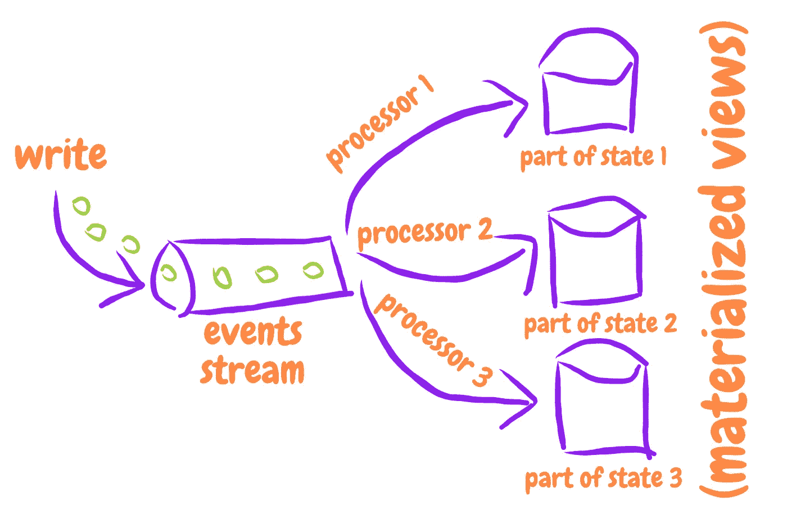
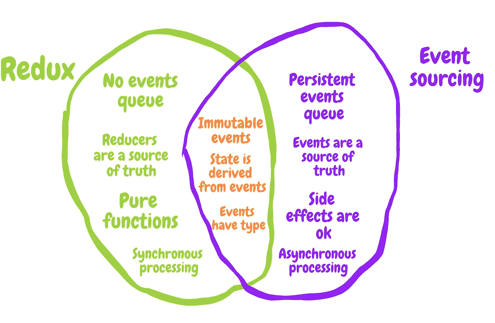
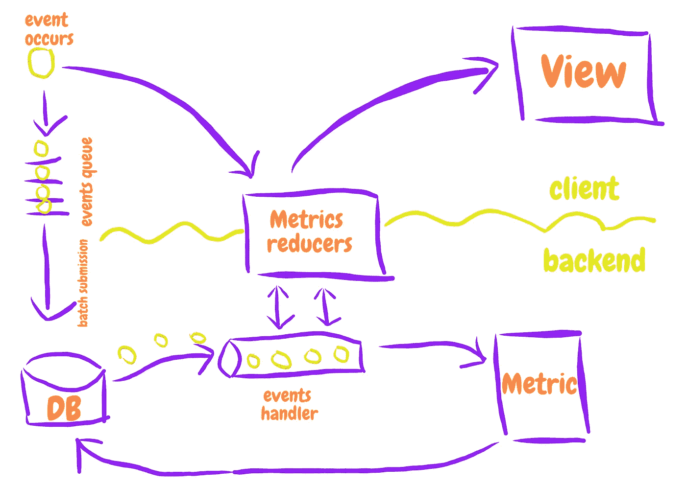
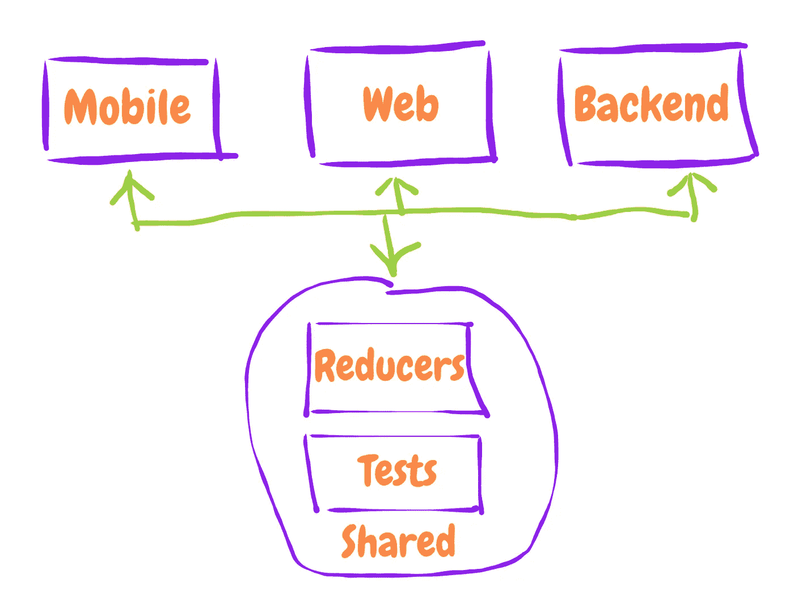

# 我们如何在后端使用 Redux，并因此获得离线的第一个移动应用程序

> 原文：<https://medium.com/hackernoon/how-we-used-redux-on-backend-and-got-offline-first-mobile-app-as-a-result-b8ab5e7f7a4>


今天，我想和你分享我们在后端服务器上使用 Redux-like 方法构建一个离线优先的 React-Native 应用程序的经验。

事实上，我们只是在我们的系统中利用了所谓的事件源模式，而没有为此目的使用任何特定的工具(例如[萨姆扎](http://samza.apache.org/)或[卡夫卡](http://kafka.apache.org/))。虽然您可能更喜欢在您的项目中使用这些工具，但我在这里试图展示的是，通过实际理解事件源背后的核心原则，您可以从这种方法中获益，即使不需要改变您的系统的整个架构或合并一些特定的 rocker-science 技术和工具。

让我们开始吧。

# 问题描述

那么，我们谈论的是什么类型的应用程序呢？事实上，这是一个相当庞大的学习管理系统，由 3 个主要部分组成:

*   网络客户端(React + Redux)
*   iOS 客户端和 Android 客户端(React-Native + Redux)
*   后端(Node JS + MongoDB + Redux？)

此外，我应该提到系统的以下一般要求:

*   *移动设备的离线模式*，因此用户可以在离线时获取数据并完成任何操作，我们应该在应用程序中反映这些操作的结果。
*   *手机和网络中的详细分析*，可能相同，也可能不同，例如，在网络上，我们可以显示一组用户的汇总统计数据，而在手机上，我们只显示个人的结果。
*   *对分析的要求在不断发展*，这实际上意味着任何时候你的老板都可以来到你的桌前，说一些类似“嘿，我很高兴你上个月一直在努力制作这张图表，但我们刚刚决定我们需要一些完全不同的指标和统计数据。
*   *审计跟踪支持*，因为该项目确实与法律活动领域紧密相关。

但首先让我们后退一步，思考一下我们过去是如何处理数据的，因为这个问题对我们未来的解决方案至关重要。

# 我们如何看待数据

操作系统中任何操作的实际结果都是内存转换。在应用程序中，内存通常由状态来表示。它可能是一个复杂的数据库，一个原始文件或者只是一个普通的 javascript 对象。与操作系统类似，我们应用程序中任何操作的结果都是状态转换。我们如何代表我们的状态并不重要，重要的是我们如何改变它。

这项任务的常用方法是只维护当前相关的状态，并在用户执行操作时改变它。以一个标准的创建、读取、更新、删除(CRUD)模型为例。该模型中的典型流程是获取数据，以某种方式修改数据，然后将更新的数据放回存储。您还需要控制并发更新，因为如果您的整个应用程序的状态是由当前累积的数据表示的，那么它们真的会把一切都搞砸。



随着软件工程开始快速发展，开发人员意识到这种传统的数据思维模式在某些类型的应用程序(比如企业)中并不十分有效。结果，新的架构模式开始出现。

我真的鼓励你去了解一下 **DDD** 、 **CQRS** 和**事件采购**模式(因为它们是非常相关的，并且经常被并排提及)，以获得关于数据处理的更广阔的视野，但是在这篇文章中，我不会深究它们中的任何一个。我们感兴趣的重点是**事件源**以及它如何改变我们对数据的看法。

如果我们不是保存一个日期的聚合状态，而是记录对该数据采取的所有操作，并在以后对它们进行后处理，会怎么样？这就像我们不知道这个行为会对国家产生怎样的影响，但是我们完全不能忽视它。因此，我们不断地将这些操作添加到日志中，并在以后想出如何处理时使用它们。



# 等等，但是为什么？

起初，你会认为这种方法很奇怪，比如如果我们想得到的唯一结果是改变状态，为什么我们要保存所有这些事件并在以后处理它们。这不是给我们的系统增加了更多的复杂性和额外的工作要做吗？

是的，它是，但它也给了我们许多无价的好处，否则我们将被剥夺。事实上，这是一个很常见的解决方案，为了确保你自己，只要看看真实的生活。

当你来看医生并带着你的医疗档案(也可能是电子版本)时，你的医生是否只是划掉你档案中的所有信息，只写下你目前的身体状况？或者他只是不断地将你的健康状况添加到你的档案中，这样久而久之，你就对事情的进展有了一个完整的了解，也对你遇到的所有问题有了一个完整的历史记录？这是一种活动采购模式。

还是拿法理学来说。假设你已经签订了一份合同，过一段时间你决定重新审视合同条款并做出一些改变。你是撕掉旧合同，从头开始创建一个全新的合同，还是对之前的合同进行补充？因此，随着时间的推移，你可以随时检查最初的合同和随后的所有附录，以正确识别合同最终的内容。这也是一项活动采购。

顺便说一下，我真的不明白我们是如何变得如此自信，以至于不需要存储数据。事实上，我们甚至无法想象一个数据在某些情况下有多有价值，那么为什么我们如此容易忽视它呢？留着不就理智多了吗？

# 何时不使用它

稍后我将向您展示我们在应用程序中从这种方法中获得的所有好处，但是您一定要记住，它并不适用于所有情况。如果您的系统有一点或没有业务逻辑，没有并发更新的危险，并且与 CRUD 自然地很好地工作，或者在数据和视图之间有实时更新，那么您可能根本不需要事件源。但是在其他情况下，如果您合并了至少一些稍后将讨论的模式，您可以获得很多优势。

# Redux 呢

众所周知，几年前脸书提出了一种新的前端状态管理方法，称为 Flux，它几乎不依赖于单向数据流，完全不同于以前的工作方式(例如 Angular 中的双向数据绑定)。而且 [Redux](https://hackernoon.com/tagged/redux) 用一些新概念增强了这些方法，并在现代前端开发人员的工具集中占据了一个光荣的位置。

为了改变状态，你需要分派一个动作，而一个动作实际上是一个事件描述，或者是一个事件本身。作为对这一事件的反应，我们相应地改变我们的状态。所以它非常类似于事件源模式，那么 Redux 与事件源到底有什么关系呢？

首先，我们应该提到 Redux 和事件源服务于相同的目的——管理事务状态。主要的区别是 Redux 在如何实际操作方面走得更远。

Redux 明确展示了动作(事件)的简化器如何成为应用程序状态的唯一真实来源。另一方面，事件源从不规定事件应该如何处理，只规定它们的创建和记录。

看一看一个典型的事件源实现，你会遇到许多面向对象的命令式代码，它们都有副作用。
另一方面，Redux 更喜欢纯函数(定义上没有任何副作用)，这更倾向于函数式编程范式。

当你寻找事件来源时，你经常强调你的事件是事实的来源，你几乎不依赖它们。但是在 Redux 的例子中，我们可以看到 Redux 更像是真理的来源。采取相同的行动，但不同的减速器，你会得到一个完全不同的状态。

几乎所有的事件源解决方案都不依赖事件队列和异步处理事件的能力。但是 Redux 更喜欢同步处理所有动作，并省略创建任何队列。

你可以给 event 带来更多的不同，但是现在让我们集中在两个非常重要的概念上，它们对于 event sourcing 和 Redux 是相似的。

*   状态来源于事件
*   事件是不变的。如果我们想有一个真正可预测的稳定状态，这是非常重要的，我们可以在时间上来回穿越。但不仅如此，事件不变性还为我们提供了一些更有趣的额外好处，不过我们稍后会回到这个话题



# 让战斗开始

所以让我们更接近实践。下面是我们在应用程序中所处情况的概述。

用户处于脱机状态。他通过了测试。我们应该:

1.  对他在移动设备上的行为做出反应，并根据他的通过结果重新汇总分析
2.  以某种方式在后端的数据库中获得相同的重新聚集分析，因此我们可以在应用程序的完全独立的 Web 部分中显示它

任务的第一部分实际上没有那么多问题。救援的乐观更新。即使在离线模式下，我们也可以在移动应用程序中触发操作和重新计算分析，因为显然互联网连接不是 Redux 工作的要求。

但是如何处理第二个问题呢？让我们暂时把我们的动作保存在某个地方，这样我们就不会错过用户在我们离线时做了什么。

我们应该这样对待每一个我们感兴趣的事件进行外部处理。因此，我建议创建一个单独的动作创建器文件(不过这取决于您更喜欢的 react 项目组织),其中我们描述了每个有趣的用户事件的动作创建器，如下所示:

```
*/* We rely on thunk-middleware to deal with asynchronous actions.* 
*If you are not familiar with the concept, go check it out,* 
*it may help you to understand our action creator's structure better */*
export function createQuestionAnswerEvent(payload) {
    return (dispatch) => {
        const formattedEvent = {
            type: ActionTypes.ANSWER_QUESTION, 
            *// It's crucial to have timestamp on every event*
            timestamp: new Date().toISOString(),
            payload
        };

        *// Dispatch the event itself, so our regular reducers that are responsible for analytics can process it and recalculate the statistics*
        dispatch(formattedEvent); 
        *// Dispatch the action that declares that we want to save this particular event*
        dispatch({ type: ActionTypes.SAVE_EVENT, payload: formattedEvent }); 
        *// At some point in time we gonna send all saved events to the backend, but let's get to it later*
        dispatch(postEventsIfLimitReached()); 
    };
}
```

这里是相应的缩减器，它采用类型为`SAVE_EVENT`的每一个动作，并将它推送到我们状态的分支，在那里我们收集所有事件，并由一个行数组表示

```
const initialState = [];

export default (state = initialState, action) => {
    switch (action.type) {
        *// Append event to our events log*
        case ActionTypes.SAVE_EVENT:
            return state.concat(action.payload);

        *// After sending events to the backend we can clear them*
        case ActionTypes.POST_EVENTS_SUCCESS: 
            return [];

        */* If user wants to clear the client cache and make sure*
 *that all analytics is backend based, he can press a button,*
 *which will fire CLEAR_STORAGE action */*
        case ActionTypes.CLEAR_STORAGE: 
            return [];

        default:
            return state;
    }
};
```

现在，我们已经保存了用户在离线时执行的所有操作。下一个合乎逻辑的步骤是将这些事件发送到后端，这正是您之前看到的`postEventsIfLimitReached`函数所做的。

在尝试发布事件之前，确保用户在线是非常重要的。此外，最好不要一个一个地发送事件，而是成组发送，因为如果您的事件日志记录很密集，并且用户在几秒钟内产生几个动作，那么您不会真的想要如此频繁地触发 HTTP 请求。

```
export function postEventsIfLimitReached() {
    return async (dispatch, getState) => {
        const events = getState().events;

        */* If user is online perform batch events submission */* 
        if (events.length > config.EVENTS_LIMIT && getState().connection.isConnected) {
            try {
                await api.events.post(events);

                dispatch({ type: ActionTypes.POST_EVENTS_SUCCESS });
            } catch (e) {
                dispatch({ type: ActionTypes.POST_EVENTS_FAIL });
            }
        }
    };
}
```

似乎不错。我们的移动应用得到了乐观的更新，我们设法将用户的每一个动作传送到后端。

# 切换到后面

现在让我们切换到后端。我们的 NodeJs 应用程序中有非常标准的 POST route，它接收一组事件并将它们保存到 MongoDB 中。

快速浏览一下活动方案:

```
const EventSchema = new Schema({
    employeeId : { type: 'ObjectId', required: true },
    type       : {
        type     : String,
        required : true,
        enum     : [
            'TRAINING_HEARTBEAT',
            'ANSWER_QUESTION',
            'START_DISCUSSION',
            'MARK_TOPIC_AS_READ',
            'MARK_COMMENT_AS_READ',
            'LEAVE_COMMENT',
            'START_READING_MODE',
            'FINISH_READING_MODE',
            'START_QUIZ_MODE',
            'FINISH_QUIZ_MODE',
            'OPEN_TRAINING',
            'CLOSE_APP'
        ]
    },
    timestamp   : { type: Date, required: true },
    isProcessed : { type: Boolean, required: true, default: false },
    payload     : { type: Object, default: {} }
});
```

我将省略对路线的描述，因为那确实没有什么特别的。让我们转移到更有趣的事情。

所以现在，当我们在数据库中拥有所有事件时，我们应该以某种方式处理它们。
我们决定为此创建一个单独的类，它被导入到我们的应用程序的启动文件中，如下所示:

```
import EventsHandler from './lib/EventsHandler';

const eventsHandler = new EventsHandler();

eventsHandler.start();
```

现在让我们来看看这个类本身。

```
export default class EventsHandler {
    *// Initialize an interval*
    start() {
        this.planNewRound();
    }

    stop() {
        clearTimeout(this.timeout);
    }

    *// Fire processing of new events every once in a while*
    planNewRound() {
        this.timeout = setTimeout(async () => {
            await this.main();

            this.planNewRound();
        }, config.eventsProcessingInterval);
    }

    async main() {
        const events = await this.fetchEvents();

        await this.processEvents(events);
    }

    async processEvents(events) {
        const metrics = await this.fetchMetricsForEvents(events);

        */* Here we should process events somehow.* 
 *But HOW???* 
 *We'll get back to it later*
 **/*

        */* It's critical to mark events as read after processing,* 
 *so we don't fetch and apply the same events every time */*
        await Promise.all(events.map(this.markEventAsProcessed));
    }

    async markEventAsProcessed(event) {
        event.set({ isProcessed: true });

        return event.save();
    }

    async fetchMetricsForEvents(events) {
      */* I removed a lot of domain-related code from this method, for the sake*
 *of simplicity. What we are doing here is accumulating ids of Metrics related to every event from argument events.* 
 *That's how we got metricsIds  */*

      return Metric.find({ _id: { $in: metricsIds } });
    }

    async fetchEvents() {
        return Event.find({ isProcessed: false }).limit(config.eventsFetchingLimit);
    }
}
```

这是我们课程的一个非常简化的版本，但它完美地反映了主要思想，所以你可以抓住它。我删除了许多方法、检查和与域相关的逻辑，因此您可以专注于事件处理。

所以我们在这门课上做的是:

1.  从数据库获取未处理的事件
2.  获取所有与事件相关的数据，这是处理所必需的。在我们的例子中，它主要是度量文档，呈现个人(*会话度量*)和组(*训练度量*)统计数据
3.  以某种方式处理事件并改变指标
4.  保存更改的数据
5.  将事件标记为已处理

由于几个原因，它不是一个完美的解决方案，但它完全符合我们的需求。如果你想要一个更可靠的解决方案，考虑以下几点:

*   这个解决方案是周期性的，这意味着在某些情况下你可以传递一些事件而不处理它们
*   我们使用 MongoDB 来存储事件，但是你可能更喜欢一个更合适的工具(例如[卡夫卡](http://kafka.apache.org/))
*   我们的事件获得了标准 Mongo 的 [ObjectId](https://docs.mongodb.com/manual/reference/method/ObjectId/) ，但是为每个事件使用一个增量标识符来代替主 Id 可能更方便。这样，你会对正在发生的事情以及事情的正确顺序有一个更坚实的了解
*   优先级排序是缺失的，但是在某些情况下，您更喜欢在处理其他事件之前处理一些事件

# 处理过程中的问题

好，我们继续。事件处理结构似乎准备好了。但是我们仍然有最复杂的问题需要解决:我们应该如何处理这些事件？

出现的巨大问题是我们在客户端上的乐观更新和我们在这里得到的结果之间的差异。从 UX 的角度来看，这是一个非常令人讨厌的错误——例如，一个用户通过了离线测试，看到他已经完成了 81%的测试，但一旦他上线，他突然发现他的实际进度是 78%,他处理测试的时间比他在离线模式下被通知的时间少得多。

因此，保持客户端和服务器上的分析同步是一个相当大的问题。如果你最终设法将其存档，那么你的 QA 会突然发现计算中的一个错误，你应该在客户端和后端分别修复它，并确保修复在两个平台上产生相同的结果。或者更常见的是，业务需求发生了变化，现在您应该在两个平台上重写处理过程，很可能您不会得到匹配的结果。又来了。


# 拯救代码重用

这真是令人沮丧。为什么要做双份工作，纠结于前后矛盾？如果我们可以重用处理代码。这个想法一开始可能听起来很疯狂，因为在状态管理的客户端，我们使用 Redux 提供的东西，而在后端没有类似的东西。但是让我们更仔细地看看我们是如何用 Redux 做到这一点的。

Reducers 只是纯粹的函数，它获取一个动作和初始状态作为参数，并返回一个全新的状态。这里最令人困惑的部分是，真正简化了开发人员的日常生活的是 Redux 调用这个 reducer 函数本身，而不需要我们的直接语句来完成它。所以我们只是在某个地方分派一个动作，我们确信 Redux 会调用所有声明的 reducers，为它们提供这个动作和适当的初始状态，并将新的状态分支保存到状态中相应的位置。

但是如果我们重用 reducer 函数，但是在后端自己完成所有的困难工作，而没有 Redux 呢？

激动吗？我敢打赌你是，但这里有一些事情我们应该记住，不要把一切都搞砸了:

*   Reducers 必须是带有业务逻辑的纯函数，没有任何副作用。所有副作用都应该分开保存(例如，DB 交互，我们在`EventsHandler`类中有很多，但是在 reducers 中是禁止的)
*   永远不要改变指标和事件

这里是你以前见过的一个 **processEvents** 函数的完整版本:

```
async processEvents(events) {
    const metrics = await this.fetchMetricsForEvents(events);

    await Promise.all(metrics.map(async (metric) => {
        */* sessionMetricReducer and trainingMetricReducer are just functions that are imported from a separate repository,*
 *and are reused on the client */*
        const reducer = metric.type === 'SESSION_METRIC' ? sessionMetricReducer : trainingMetricReducer;

        try {
            */* Beatiful, huh? :)*
 *Just a line which reduces hundreds or thousands of events*
 *to a one aggregate Metric (say analytical report)*
 **/*
            const newPayload = events.reduce(reducer, metric.payload);

            */* If an event should not reflect the metric in any ways*
 *we just return an initial state in our reducers, so we can*
 *have this convenient comparison by link here  */*
            if (newPayload !== metric.payload) {
                metric.set({ payload: newPayload });

                return metric.save();
            }
        } catch (e) {
            console.error('Error during events reducing', e);
        }

        return Promise.resolve();
    }));

    await Promise.all(events.map(this.markEventAsProcessed));
}
```

下面是对正在发生的事情的快速解释。

`sessionMetricReducer`是用于计算单个用户的统计数据的函数，而`trainingMetricReducer`是用于计算群组统计数据的函数。他们都是纯洁的。我们将它们保存在一个单独的存储库中，从头到脚都覆盖了单元测试，并且将它们导入到客户端。这就是所谓的代码重用:)，我们稍后将回到它们。

我打赌你们都知道`reduce`函数在 JS 中是如何工作的，但是这里有一个关于`const newPayload = events.reduce(reducer, metric.payload)`的快速概述。

我们有一个`events`数组，它是 Redux 动作的模拟。它们具有相似的结构和相同的用途(我已经在客户端的`createQuestionAnswerEvent`函数中展示了事件创建期间的结构)。

`metric.payload`是我们的初始状态，你所要知道的就是它是一个普通的 javascript 对象。

因此，`reduce`函数获取我们的初始状态，并将其与第一个事件一起传递给我们的`reducer`，这只是一个纯函数，它计算新的状态并返回它。然后`reduce`获取这个新状态和下一个事件，并再次将它们传递给`reducer`。它这样做，直到每个事件都不会被应用。最后，我们得到了一个全新的度量有效载荷，它受到了每个事件的影响！非常好。



# 更可靠的符号

虽然符号`events.reduce(reducer, metric.payload)`非常简洁和简单，但是如果其中一个事件无效，我们可能会有一个陷阱。在这种情况下，我们将捕获整个包的异常(不仅仅是这个无效事件),并且不能保存其他有效事件的结果。

如果您的事件类型存在这种可能性，则更好的方法是逐个应用它们，并在每个应用的事件后保存指标，如下所示:

```
for (const event of events) {
  try {
    *// Pay attention to the params order.*
    *// This way we should first pass the state and after that the event itself*
    const newPayload = reducer(metric.payload, event);

    if (newPayload !== metric.payload) {
      metric.set({ payload: newPayload });

      await metric.save();
    }
  } catch (e) {
    console.error('Error during events reducing', e);
  }
}
```

# 这是一个减速器

正如您可能猜到的，这里的主要挑战是在后端和 state 分支上保持 **Metric.payload** ，它以类似的结构表示客户端上的用户统计数据。如果你想合并代码重用，这是唯一的方法。顺便说一下，事件已经是相同的了，因为如果你还记得的话，我们在前端创建它们，首先通过客户端 reducers 进行调度，然后我们将它们发送到服务器。只要满足这两个条件，我们就可以自由地重复使用还原剂。

这里是一个简化版的 **sessionMetricReducer** ，所以你可以确保它只是一个普通的函数，没有什么可怕的

```
import moment from 'moment';

*/* All are pure function, that responsible for a separate parts*
*of Metric indicators (say separate branches of state) */*
import { spentTimeReducer, calculateTimeToFinish } from './shared';
import {
    questionsPassingRatesReducer,
    calculateAdoptionLevel,
    adoptionBurndownReducer,
    visitsReducer
} from './session';

const initialState = {
    timestampOfLastAppliedEvent : '',
    requiredTimeToFinish        : 0,
    adoptionLevel               : 0,
    adoptionBurndown            : [],
    visits                      : [],
    spentTime                   : [],
    questionsPassingRates       : []
};

export default function sessionMetricReducer(state = initialState, event) {
    const currentEventDate = moment(event.timestamp);
    const lastAppliedEventDate = moment(state.timestampOfLastAppliedEvent);

    *// Pay attention here, we'll discuss this line below*
    if (currentEventDate.isBefore(lastAppliedEventDate)) return state;

    switch (event.type) {
        case 'ANSWER_QUESTION': {
            const questionsPassingRates = questionsPassingRatesReducer(
                state.questionsPassingRates,
                event
            );

            const adoptionLevel = calculateAdoptionLevel(questionsPassingRates);
            const adoptionBurndown = adoptionBurndownReducer(state.adoptionBurndown, event, adoptionLevel);
            const requiredTimeToFinish = calculateTimeToFinish(state.spentTime, adoptionLevel);

            return {
                ...state,
                adoptionLevel,
                adoptionBurndown,
                requiredTimeToFinish,
                questionsPassingRates,
                timestampOfLastAppliedEvent : event.timestamp
            };
        }

        case 'TRAINING_HEARTBEAT': {
            const spentTime = spentTimeReducer(state.spentTime, event);

            return {
                ...state,
                spentTime,
                timestampOfLastAppliedEvent : event.timestamp
            };
        }

        case 'OPEN_TRAINING': {
            const visits = visitsReducer(state.visits, event);

            return {
                ...state,
                visits,
                timestampOfLastAppliedEvent : event.timestamp
            };
        }

        default: {
            return state;
        }
    }
}
```

看看函数开头的检查。我们希望确保在已经应用了后续事件的情况下，不会将一个事件应用到指标。如果发生无效事件，此检查有助于忽略无效事件。

这是保持事件不变原则的一个很好的例子。如果你想存储一些额外的信息，你不应该把它添加到事件中，最好把它保存在状态的某个地方。这样，你可以依赖事件作为任何时间点的一种真理来源。您还可以在几台机器上建立并行事件处理，以获得更好的性能。

# 最终概述

这是最终的项目结构。



正如我之前提到的，我们将共享的 reducers 保存在一个单独的存储库中，并将它们导入到客户机和服务器。这是我们通过重用代码和存储所有事件而实现的真正好处:

*   手机离线工作。
*   移动、网络和后端的分析总是同步的。
*   减速器易于维护和扩展。你只需要修复一个地方的错误。您只需要在一个地方添加测试。
*   如果我们在计算中发现一个错误，我们可以修复它，并从头开始重新计算所有的统计数据。
*   我们可以很容易地在统计学上进行时间旅行，向前或向后移动几年。
*   每当分析的业务需求发生变化时，我们都可以轻松地创建和计算新的指标。
*   事件处理过程可以在后台运行，独立于用户使用应用程序的主要工作流程，这可以极大地提高应用程序的性能和响应能力。
*   所有事件的可用性非常有助于测试和调试系统，因为您可以随时轻松地重放事件并观察系统的反应。
*   我们获得了对分析计算的更多控制。例如，在手机上，我们只计算个人统计数据，但在服务器上，除了单个用户的统计数据，我们还计算不同群体的统计数据和更重要的东西。我们不局限于在客户端上进行实时用户交互来做到这一点。我们可以对这些存储的事件做任何我们想做的事情。
*   持久的事件列表是一个无穷无尽的来源，可以用来分析我们系统中的用户行为，并确定用户每天面临的主要趋势和问题。我们可以从这些日志中检索到很多有用的商业信息。
*   开箱即可完成历史记录和审计跟踪。

顺便说一下，所描述的方法通常更适合流。如果你不熟悉这个概念，简而言之，流就是我们在应用程序中考虑数据流的方式。与传统的响应-请求模型不同，我们处理的是我们应该以某种方式做出反应的无穷无尽的事件队列。

这种方法确实可以使未来的一些问题更容易解决。例如，如果我们想要实时更新 web 应用 a 中的分析，我们所要做的就是`subscribe`客户端上的数据变化(例如，可以通过 WebSockets 建立连接),并且每当后端上的数据变化时，我们都应该向客户端`notify`发送特定类型的消息。

这是一个处理数据流的普通方法的原始描述，它可以帮助我们非常有效地解决这个问题。

# 结论

正如你可能看到的，我们显然没有实现如何做事件源的最规范的例子。我们也没有将 Redux 与所有 it 生态系统完全整合到 NodeJS 应用程序中。但是我们真的不需要这些。主要目的是创建一个稳定的离线优先的移动应用程序，它具有流畅的、可扩展的业务逻辑和共享的分析报告。这就是我们设法以非常不寻常和有效的方式做到的。

因此，我希望这是一个有趣的和有益的阅读给你。如果你有任何问题或意见，请在下面的评论中留下。

最后，这里有一个在构建离线优先应用程序时可能会遇到的一些非常棘手的问题的快速概述，以及我们处理这些问题的方式。

# 离线的常见问题以及我们如何处理它们

**第一期。** *我已经修复了计算中的一个错误，但客户端仍在使用旧版本的缓存分析。如何强制 it 使用后端重新计算的指标？*

我们为每个指标加入了一个`version`属性(对于那些熟悉常见缓存失效策略的人来说，这是一种电子标签)。当客户端从服务器获取指标时，我们将客户端的版本与服务器的版本进行比较，并找出哪个指标更相关。赢得一个更高版本的。因此，在错误修复之后，我们所要做的就是增加`version`的数量，这样客户就会知道他的指标已经过时了。

**第二期。我需要离线创建实体，并使用它们的 id 进行进一步的通信。该如何应对？**

我们采用了一个简单但不完美的解决方案，在客户端手动创建一个 id 为 [uuid 为](https://www.npmjs.com/package/uuid)的 id，并确保我们用这个 id 在数据库中保存实体。但是请记住，最好是在后端控制这类数据，以防您更改数据库或者从 uuidV4 迁移到 uuidV5。作为一种选择，您可以在客户机上使用临时 id，并在 BE 上创建后用真实 id 替换它们

第三期。*RN 中的数据持久化应该用什么？*

我们不使用任何外部解决方案来实现这一目的，因为我们需要通过加密来提供数据安全性，而且似乎自己实施要容易得多。但是我们使用[redux-async-initial-state](https://www.npmjs.com/package/redux-async-initial-state)来异步加载初始 app 状态。

下面是我们如何创建 Redux store:

```
import { createStore, applyMiddleware, combineReducers, compose } from 'redux';
import thunkMiddleware from 'redux-thunk';
import * as asyncInitialState from 'redux-async-initial-state';

import { setAutoPersistingOfState, getPersistedState } from '../utils/offlineWorkUtils';
import rootReducer from '../reducers';

const reducer = asyncInitialState.outerReducer(combineReducers({
    ...rootReducer,
    asyncInitialState: asyncInitialState.innerReducer
}));

const store = createStore(
    reducer,
    compose(applyMiddleware(thunkMiddleware, asyncInitialState.middleware(getPersistedState)))
);

setTimeout(() => {
    setAutoPersistingOfState(store);
}, config.stateRehydrationTime);

export default store;
```

下面是来自**离线工作实用程序**的主要实用程序:

```
export function getPersistedState() {
    return new Promise(async (resolve) => {
        *// A wrapping function around AsyncStorage.getItem()*
        const encodedState = await getFromAsyncStorage(config.persistedStateKey);

        if (!encodedState) resolve(undefined);

        *// A wrapping function around CryptoJS.AES.decrypt()*
        const decodedState = decryptAesData(encodedState);

        resolve(decodedState);
    });
}

export async function setAutoPersistingOfState(store) {
    setInterval(async () => {
        const state = store.getState();

        if (!state || !Object.keys(state).length) return;

        try {
            *// A wrapping function around CryptoJS.AES.encrypt()*
            const encryptedStateInfo = encryptDataWithAes(state).toString();

            *// A wrapping function around AsyncStorage.setItem()*
            await saveToAsyncStorage(config.persistedStateKey, encryptedStateInfo);
        } catch (e) {
            console.error('Error during state encryption', e);
        }
    }, config.statePersistingDebounceTime);
}
```

对于大的斑点(图像、音频等)，我们使用 [react-native-fs](https://github.com/itinance/react-native-fs) 。

*原载于*[*blog.webbylab.com*](http://blog.webbylab.com/redux-on-backend/)*。*