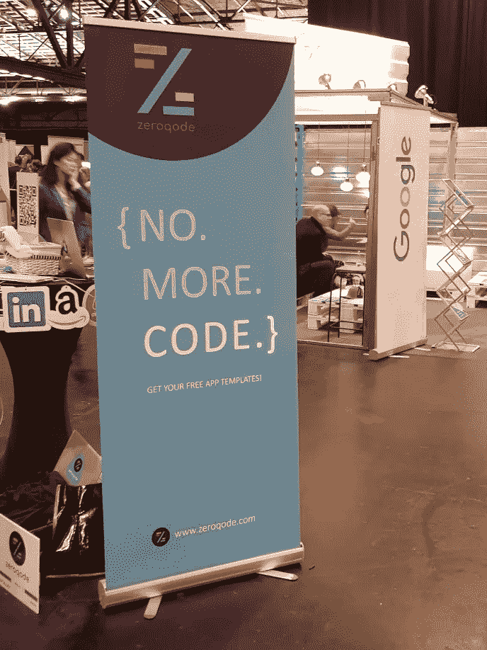

# 我们是如何赢得 TechCrunch Disrupt Berlin 的“外卡”并接受 TechCrunch 采访的

> 原文：<https://medium.com/hackernoon/how-we-won-the-wild-card-at-techcrunch-disrupt-berlin-and-got-interviewed-by-techcrunch-8ec6803aae07>

每年在旧金山、纽约、伦敦和柏林举办的 TechCrunch Disrupt 活动是来自世界各地最具创新精神的创业公司的盛会。空气中充满了如此充满活力的[创业](https://hackernoon.com/tagged/startup)能量，让你对自己的创业更加充满热情。
这是一个独特的机会，可以向世界展示你的想法，向创业社区介绍你的产品，寻找新的合作伙伴，并从多个不同的来源获得融资。我们在 [Zeroqode](https://zeroqode.com/?utm_source=Blog&utm_medium=blog_post&utm_campaign=BlogArticles&utm_content=WildCardOnTechCrunch&ref=blog) 并不寻求任何融资，而是我们的目标是传播关于[无代码开发](https://bubblewits.com/?utm_source=Blog&utm_medium=blog_post&utm_campaign=BlogArticles&utm_content=WildCardOnTechCrunch&ref=blog) [技术](https://hackernoon.com/tagged/technology)的消息，该技术允许在没有代码的情况下构建[网络和移动应用](https://zeroqode.com/native?utm_source=Blog&utm_medium=blog_post&utm_campaign=BlogArticles&utm_content=WildCardOnTechCrunch&ref=blog)的速度提高 10 倍。这是我们第一次参加 TechCrunch Disrupt，也是一次非常成功的经历，所以我们想分享一些关于我们如何做到这一点的提示和技巧:)

## 在活动前 3-4 个月找到一个赞助组织

参加 TechCrunch Disrupt 是一项相当昂贵的冒险，所以如果你预算不足，你可能会考虑调查是否有一个组织会代表你的国家赞助初创公司。有时，参与是由创业加速器和孵化器赞助的。通常，这些初创企业被组织成国家馆或加速器馆。

## 开始准备——至少在活动前 3-4 周

不要低估你需要做的准备工作，即使你只有一张小桌子。因此，一旦你的参与被确认，你可能想继续前进，并尽快开始准备一切。

## 电话亭

如果你是创业巷的一员，那么你得到的只是一个直径 80 厘米的小圆桌。不多，对吧？但是通过一些创造性的方法，你仍然可以从中获得最大的收益。一个绝对必须是一个卷起的横幅。

大多数访问者不喜欢来问每一家初创公司他们到底在展示什么。他们更喜欢通过快速浏览图片来理解主旨，然后如果他们感兴趣，他们会走近你并和你交谈。因此，确保你的易拉宝上的信息非常清楚，或者至少你确信它会引起别人的注意。不要害怕发挥创造力，大胆地说出会引起人们兴趣的话，就像我们一样:)

我们没有详细描述我们做了什么，而是决定简单地写下“不，更多”。码。”所以人们很想知道我们这么说是什么意思。

[开发人员](https://zeroqode.com/developers?utm_source=Blog&utm_medium=blog_post&utm_campaign=BlogArticles&utm_content=WildCardOnTechCrunch&ref=blog)前来询问他们是否会失业——我们解释说情况正好相反——我们只是想让他们的工作更有效率。
[创始人](https://zeroqode.com/founders?utm_source=Blog&utm_medium=blog_post&utm_campaign=BlogArticles&utm_content=WildCardOnTechCrunch&ref=blog)询问我们的技术如何帮助他们更快地推出产品，并节省预算。设计师们很好奇他们是否可以开始构建功能性的应用程序，而不是简单的静态设计。

我们还印制了一些带有著名和引人注目的网站和应用程序标志的卡片，如 AirBNB、Slack、Trello、Instagram 等。还有一个标志写着“不用代码构建你自己的应用[”:](https://zeroqode.com/?utm_source=Blog&utm_medium=blog_post&utm_campaign=BlogArticles&utm_content=WildCardOnTechCrunch&ref=blog)

我们把它们钉在桌子周围，以便从各个角度都能看到。这让访问者更加好奇，他们想知道是否可以不用代码就能开发出像那些[一样的应用程序](https://bubble.is/?ref=zeroqode),因此他们向我们提出问题。

我们还打印了一张卡片，上面写着“获取你的[免费应用程序模板](https://zeroqode.com/?utm_source=Blog&utm_medium=blog_post&utm_campaign=BlogArticles&utm_content=WildCardOnTechCrunch&ref=blog)”，并把它放在桌子的顶部——我们都喜欢免费赠品，TechCrunch 的参与者也不例外:)

我们做的另一件事是在桌子上放一个平板电脑，播放无代码应用程序开发过程的循环录音。

综上所述——醒目的横幅、别在桌子上的卡片、带视频的平板电脑和免费的模板卡给人留下了深刻的印象。因此，访客会关注至少一个促销元素，如果感兴趣，他们会看所有其他元素，或者直接联系我们。

## 品牌 t 恤

他们不仅有助于创造一个积极的形象和品牌意识，他们也可以吸引兴趣！通常，初创公司只有 1 天的展示时间，而 Disrupt 活动是 2 天。所以，第一天我们穿着这些 t 恤在创业巷闲逛，这本身就足以让人们好奇我们在做什么，并向我们提出问题。我们的 t 恤上写着“不，不要了。码。”前面还有"[app 没有代码？](https://bubblewits.com/?utm_source=Blog&utm_medium=blog_post&utm_campaign=BlogArticles&utm_content=WildCardOnTechCrunch&ref=blog)背面问我怎么样。所以有几次我们被问到一个词的问题——“怎么做？”:)

My partnerVlad and me at TechCrunch Disrupt

## 印刷(或非印刷)材料

名片很明显，所以我们印了一些。每人几百块应该足够了。但是我们决定不印其他东西，因为网站在展示产品方面做得更好，而且现在没有人喜欢拿着一大堆纸。避免打印会被扔进垃圾桶的东西对环境也有好处。

## 现场线索捕捉

我们已经建立了一个简单的电子邮件捕获表单的[登陆页面](https://zeroqode.com/get-templates?utm_source=Blog&utm_medium=blog_post&utm_campaign=BlogArticles&utm_content=WildCardOnTechCrunch&ref=blog)。一旦有人输入他们的电子邮件，它就会自动添加到我们的 [mailchimp](https://mailchimp.com/?ref=zeroqode) 列表中。对于该列表，我们配置了一个 onboarding 回复模板，感谢您访问我们，并包括由 Zeroqode 构建的[免费应用模板](https://zeroqode.com/?utm_source=Blog&utm_medium=blog_post&utm_campaign=BlogArticles&utm_content=WildCardOnTechCrunch&ref=blog)的链接。

最初的计划是获得一个二维码，并把它放在名片上，这样人们就可以扫描它们并进入页面。但是在活动当天，我们意识到，如果我们要求他们立即填写，我们可以更快地得到结果！否则，他们中的大多数人会忘记，永远不会回来。

因此，在我们的笔记本电脑上展示产品并回答所有问题后，我们用电子邮件捕获表单打开了网站，并要求访问者分享他们的电子邮件，以获得免费模板的链接。通过这种方式，我们在一天内捕获了 **72 封电子邮件**！(对我们的产品感兴趣的高质量销售线索)

这也将节省您的时间，因为您不必在交易会后手动处理收集的卡片。

## 未知因素 TECHCRUNCH 采访

TechCrunch 选择了一些初创公司进行面试，但是因为有太多的初创公司参展，你被选中的可能性很小。但是外卡赢家(投票选出当天最有趣的创业公司的访客)会自动获得面试机会。

所以我们决定继续努力，尽我们所能争取尽可能多的选票。
投票通过 Disrupt 移动应用程序完成，参与者每天只能为 1 家初创企业投票。投票通常在上午 9 点开始，下午 1 点结束。因此，我们请每一位走近我们展位的人，如果他们感兴趣，请给我们投票……许多人同意了，因为他们喜欢我们的工作。

你也可以在那里交一些朋友，请他们支持你。第一天给某人投票，第二天让他们给你投票(或者反过来)。

☝ **有用的技巧—** 有些访问者不安装应用程序，因此要求他们安装并投票需要时间。后来我们才意识到，我们可以使用手机上安装的应用程序，只需扫描他们徽章上的二维码，就可以在其他人的名下签出和签入。然后我们会在列表中查找我们的公司，并要求他们按下“投票”按钮:)事实证明这非常有用，因为 Disrupt Android 应用程序在那天不工作，我们因此失去了相当多的选票:)

因此，在我们赢得外卡后，我们被邀请上台采访来自 Tech Crunch 的[约翰·比格斯](https://www.crunchbase.com/person/john-biggs)。

**好消息:**

1.  阅读来自 TechCrunch 的所有电子邮件——它们发送各种更新，以及可能对你很重要的简短通知。此外，他们会给你发送指南，物流细节，时间，时间表和其他许多东西。
2.  在你的展览日早点来(在我们的例子中，门在早上 7 点开门，我们在 7:20 左右到达)
3.  使用 TechCrunch 官方标签( [#TCDisrupt](https://twitter.com/search?q=%23TCDisrupt&src=tyah) )发布关于你的创业公司的推文
4.  提前安装好 [**Brella app**](https://app.brella.io/) 寻找活动参与者，活动前预约。

## 奖励材料:)

