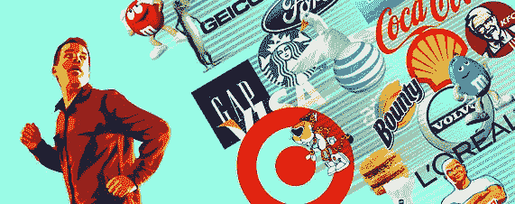

# 为什么广告和新闻不能混合

> 原文：<https://medium.com/hackernoon/how-web-2-0-turned-into-a-manipulative-ad-monster-bab6dc09b9d4>

## **以及 web 2.0 如何变成一个操纵型广告怪兽**

他的故事很复杂。一个善恶界限模糊的故事。一个原本可能是善意的故事被扭曲了，最终产生了远远超出最初想象的影响。

这是 Web 2.0 的故事，也是社交媒体和数字化新闻的故事，它们最近一起陷入了一场争议和缺乏远见的混乱，现在正在走向自我毁灭——或者更糟糕的是，对社会本身造成不可挽回的损害。

人们已经在讨论 Web 3.0 将会是什么样子，让每个人的在线状态与区块链无处不在的虚拟身份相关联，这将为交易带来责任，更重要的是分散网络内容，允许用户为他们生成的内容获得补偿(例如 [Steemit](https://steemit.com/) )。这听起来很有希望…

***但是！***

缺少的是，我们访问和浏览网络内容的传统方法——即媒体公司发布的新闻和信息，而不是社交平台上的个人用户——从根本上被打破了。

*在我们转向 Web 3.0 之前，我们需要修复我们已经拥有的东西。*

# **Web 2.0 向广告机器的转变**

以获取信息为目的的网络导航方法被打破有一个非常明显的原因——这是他们所有人的一个共同点，也是他们迄今为止没有“修复自己”的原因。即所涉及的那些平台的财务优先级。

科技领域的大牌都在一个简单的产品上建立了自己的品牌——谷歌用 Pagerank，脸书用社交图连接用户。但是，是什么让他们成为今天的庞然大物，不应该理所当然地认为这是他们各自产品的固有品质。这些平台通过早期利用新开放的机会来理解网络上杂乱无章的信息景观，能够以指数速度获得大量用户。但是用户本身并不能维持一项业务(很容易忘记，这正是这些平台的本质)。为了维持他们的业务，他们需要赚钱，而最简单的方法就是通过 [*广告*](https://hackernoon.com/tagged/ads) *。*

通过利用用户的活动数据为他们提供更有可能点击的广告，这些 Web 2.0 先驱设法增加了他们的收入，并开始扩大他们的业务，加强了他们对我们整个社会信息流的控制。

脸书做得很好；事实上，如此之好，以至于它不断增长和扩展，直到它变得头重脚轻，现在变得难以维护——不是从财务角度，也不是从用户采用角度，而是从***质量角度和 [*责任*](https://www.theguardian.com/technology/2018/jul/02/facebook-mark-zuckerberg-platform-publisher-lawsuit) 角度。自那以后，其他社交平台也采用了类似的基于广告的收入模式，因此在质量和责任方面也受到了同样的影响。***

**这是网上信息生态系统瓦解的第一步。**

# ****数字新闻的悲剧****

**在 21 世纪初报纸开始过时后，新闻出版商不得不寻找适应的方法来维持他们的运营。他们发现，人们不太愿意为订阅数字内容付费，因此不得不调整他们的收入模式。这意味着他们不得不走大多数其他网站的路线，依靠广告来维持正现金流。问题是网络广告比纸质报纸广告便宜得多。再加上付费用户很少(或没有)，这意味着出版物必须找到一种新的方式来吸引新的读者。**

> **“受众推动了这一变化，他们更喜欢更新自己的社交信息和应用，而不是访问网站主页。随着社交网络的发展，访问网站在某些方面变成了不必要的绕道，导致新闻网站的流量减少。媒体公司的销售人员很难向客户解释为什么他们应该为分散的受众购买广告，而不是去强大的社交网络。——[**约翰·赫尔曼**](https://www.nytimes.com/2016/04/18/business/media-websites-battle-falteringad-revenue-and-traffic.html)**

**那时他们开始意识到，为了维持业务，他们需要开始用广告推广自己的内容，这样他们才能吸引读者到他们的网站(即，他们必须*支付*广告，以提高广告的点击率，他们从开始*支付* *)。因此，他们需要发布最有可能获得点击的内容(就像广告应该做的那样)。这里的问题是，新闻的目的总是提供信息，而不仅仅是推动点击。这就是财务动机和内容质量之间冲突的开始。当内容是为了点击而不是为了告知而发布时，clickbait 变得越来越丰富，报道变得[越来越耸人听闻](https://www.jstor.org/stable/24356141?seq=1#page_scan_tab_contents)，最终社会的看法变得扭曲。***

**除了广告赖以生存的平台——社交媒体平台，哪里最适合发布广告。**

# *****社交媒体是破碎的信息生态系统的原因，而不是结果*****

**我们到目前为止描述的情况是，一方面，社交媒体行业发展成为历史上最大的营销解决方案，另一方面，由于向数字格式的转变，媒体行业陷入困境。结合起来，我们就有了一个信息生态系统，它奖励参与的数量，而不是内容的质量。更糟糕的是，现代社交媒体的机制旨在利用新闻内容为自己谋利，通过改变它在用户订阅源中出现的顺序(参见[脸书的不透明新闻订阅算法](https://www.newscientist.com/article/mg22329804-200-the-secret-system-controlling-your-facebook-news-feed/))来最大化用户互动(了解用户以改进有针对性的广告)，从而进一步扭曲用户的信息摄入，并进一步推动出版商对越来越多的分裂性、耸人听闻的内容的需求。**

**请注意，尽管存在[数据隐私](https://me.pcmag.com/facebook-1/11747/news/facebook-discloses-hack-affecting-50-million-accounts)和[政治干预](https://www.usatoday.com/story/news/2018/05/11/what-we-found-facebook-ads-russians-accused-election-meddling/602319002/)的问题，但所有这些都是社交媒体行业当前结构可能带来的外部威胁(如果你愿意，这是一个子问题)。**

**如果这不是一个可怕的情况，我不知道什么是。**