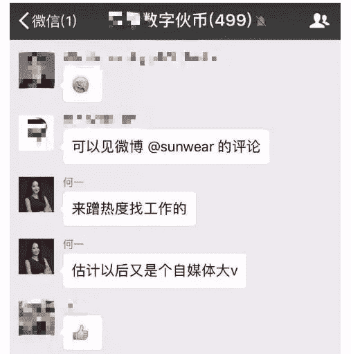

# 微信和支付宝如何在中国的加密货币世界中使用

> 原文：<https://medium.com/hackernoon/how-wechat-and-alipay-are-used-in-the-chinas-cryptocurrency-world-d21f48ca1425>

要获得中国和亚洲加密货币事件的最新消息，请订阅下面的时事通讯。这将是一个快速，无障碍的每周更新到您的收件箱。

# 微信

你可能听说过微信，它是由一家名为腾讯的公司创建的。微信是一个人们用于商业和个人生活的信息平台。但是你知道中国人在加密货币中到底是怎么用的吗？以下是一些现实生活中的例子:

*   **用于冷遇和新介绍的微信—** 当你在会议的展位上遇到某人时，通过同事的介绍，你可以通过扫描他们的二维码在微信上添加他们。(这相当于在 facebook 上添加他们，并获得他们的号码，你可以与高管、奶奶、你遇到的任何人一起这样做)。**在中国没有“哦，我刚认识你，但我对你不够了解，所以我不放心加你为微信，我不想侵犯你的隐私”这样的话。没这回事。**因此，如果你看到许多人围着某人，他们拿出手机，你知道他们正在将手机添加到微信，所以你应该上去这样做:

*   用于个人或公司向一群人(最多 500 人)发布独家内容或公告的微信。这些微信对话经常被复制，截图，发给媒体或分享给其他人，就像我在这里做的一样

[This convo is from Steemit and featuring](https://steemit.com/busy/@abasitsheikh/a-tencent-programmer-claims-to-hack-binance-in-one-week-and-asks-for-1-000-bitcoins-as-reward) a conversation between Binance execs and Binance

*   **微信曾经动过市场。一群群陌生人组成秘密聊天室，一起买卖硬币:**这些人(一个聊天室最多 500 人)谈论硬币和其他新闻。他们中的一些人试图推动市场，并就买卖什么给出建议，他们中的一些人不太老练。

# 支付宝

尽管禁止交易硬币，但阿里巴巴的移动支付应用支付宝(Alipay)仍在进行场外交易。中国国家互联网金融风险技术平台已经能够监测场外比特币交易，并追踪到用户账户。其中，场外交易监控显示用户 id 和支付方式。[支付宝几乎占了这些场外交易的三分之一。](http://bit.ly/2IEvY00)

下面是 youtube 上的一段视频，讲述了微信和支付宝是如何做到这一点的(虽然有点粗糙，但还是很有见地)

关于中国/亚洲加密货币，您还想了解什么？欢迎在下面留言或直接给我发消息。