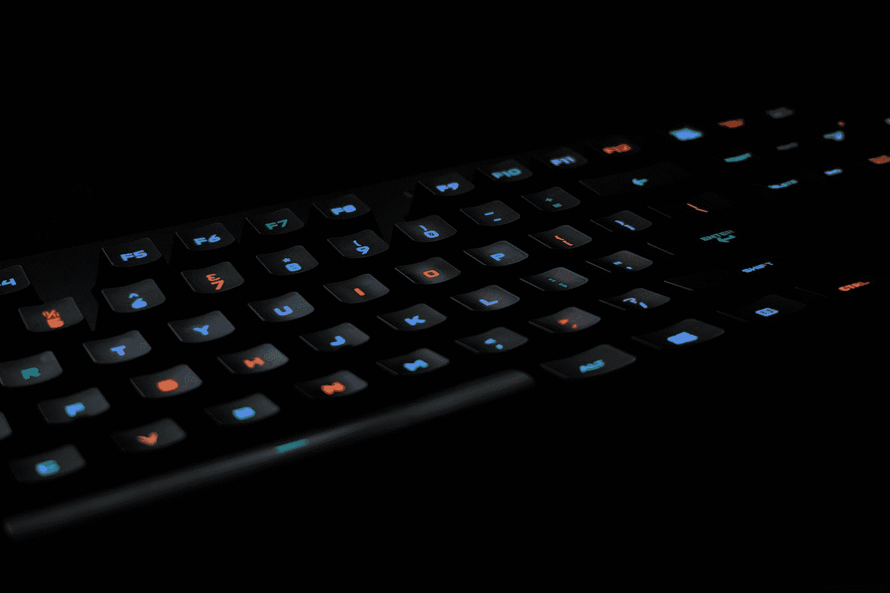
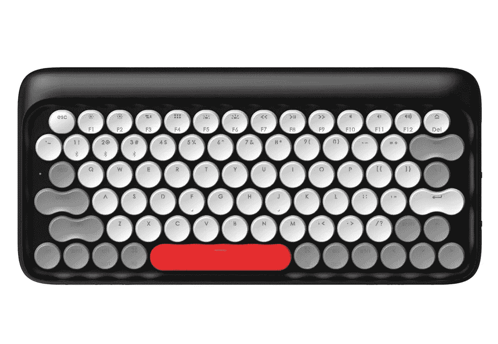
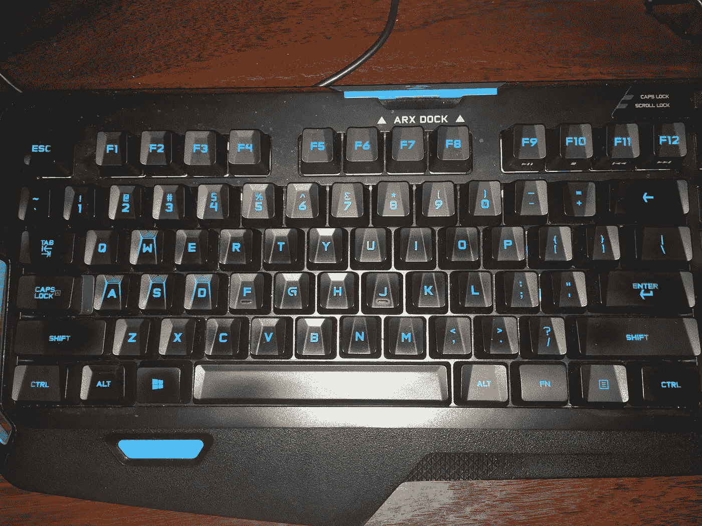

# 你对你的键盘了解多少？

> 原文：<https://medium.com/hackernoon/how-well-do-you-know-your-keyboard-708d821daf02>

Photo by [Nhu Nguyen](https://unsplash.com/@nguyendqnhu?utm_source=medium&utm_medium=referral) on [Unsplash](https://unsplash.com?utm_source=medium&utm_medium=referral)

我们大多数人整天坐在电脑前。诚然，有些人使用鼠标、触控板或平板电脑，但对于大多数使用电脑的人来说，键盘是我们的手通常放在上面的。

回到我的问题:你对你的键盘了解多少？

一旦你把手放在“home”键上，你的手会本能地移向它吗？你每秒钟打 10 个字吗？我是说，我不知道，但我只是好奇。同样由于多年来玩 FPS 游戏，我手中的 home 键是`w`、`a`、`s`和`d`键——你用来移动玩家的键。

你为什么提出这个问题？嗯，在工作中，我现在用同事的机械键盘已经快两年了(感谢 Rupert！)而我在 Indiegogo 上看到一个 [Lofree 键盘的广告就立刻爱上了。活动已经结束了，我刚刚收到了我的免费贷款，这真是太好了(对我来说！).我喜欢颜色(我买的是黑色的，但是如果我有资金的话，四种颜色我都买了！)，而且我喜欢机械键盘的手感和声音。就是这样。我跑题了。](https://www.indiegogo.com/projects/four-seasons-colorful-retro-mechanical-keyboard#/)

I got the ‘Hibernal Black’ color. So cool!

当我的 Lofree 到来时，我想在还给他之前清洗一下 Rupert 的键盘，因为我不想在使用了他心爱的键盘几年后，把我所有的细菌和污垢都还给他。所以我拿出所有的键，清洗它们，并决定我应该试着不看任何指南就把它们放回去，只是为了看看我对我已经使用了两年的键盘有多了解。

我从小就开始使用电脑，我不太有信心不看指南就能把所有的钥匙放回去。我至少知道第一行，因为我年轻时把它们作为一次性密码使用(谁不知道呢？).

这就是我清理键盘并放回键盘后的样子:

Old keyboard, but very good!

当我把钥匙放回原位时，我注意到的第一件事是，我不能仅仅通过把我的手或手指放在某个特定的钥匙上来确定它是什么。我不是触摸打字员，所以有时我会看看键盘，看看我的手指将要按下哪个字母。

我注意到的另一件事是我不太确定底部的键是怎么回事，因为我几乎从来没有用过它们。我非常确定左边的`CTRL`按钮和⌘键(或者 Windows 键，如果你在 Windows 上的话)。

我做得对吗？如果你仔细观察，或者如果你有一个罗技 G310(这是这种特定键盘的型号)，你会注意到 Windows 键是错的。我也注意到了，但我 100%确定那个特定的键在空格键旁边，因为那是苹果键在苹果键盘上的位置。我是对的！鲁珀特在让我借钥匙之前已经换了钥匙，因为他也是苹果用户。

另一件微妙的事情是这个键盘有不同的`CTRL`键！如果你仔细看，左边的有两个脊，而右边的只有一个。这就是让我困惑的地方，尽管我打字时总是用`CTRL`,我也不确定是哪一个！所以，是的，在这个例子中，我错了，我把两把`CTRL`钥匙放在了错误的地方。

这就是我开始思考我们对键盘有多了解的原因。我们每天都在使用它们，然而，我发现要记住每把钥匙放在哪里很困难。我们把我们的大多数工具视为理所当然，我不确定这是一件好事还是我觉得我不应该做的事情，但这真的无关紧要。我的意思是，我需要多久才能知道我到底按了哪个`CTRL`键？

# 那么，你对你的键盘了解多少？