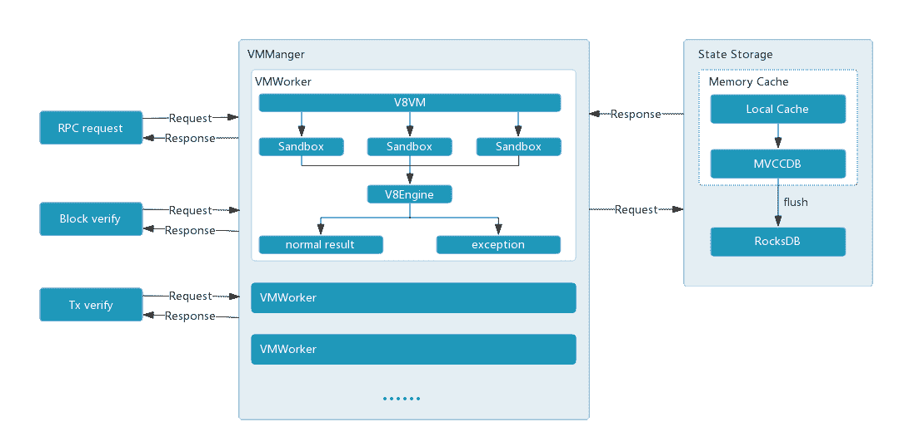
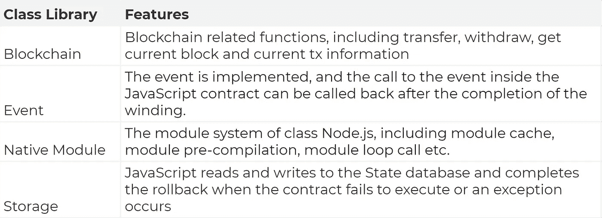
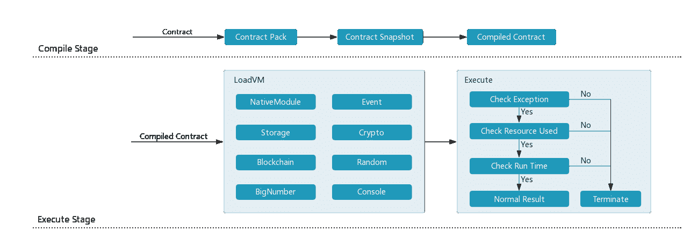
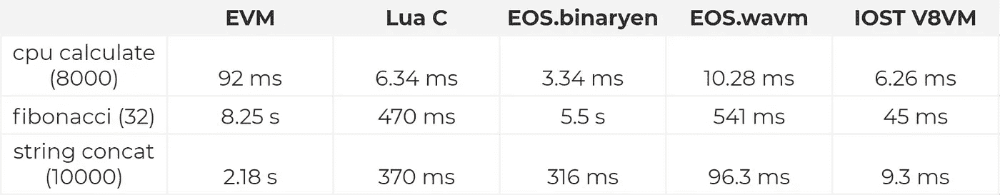

# 我们如何设计比以太坊和 EOS 更好的虚拟机

> 原文：<https://medium.com/hackernoon/how-were-designing-a-better-virtual-machine-than-ethereum-and-eos-7b60ba62fc5a>

**作者李海锋—** [IOST](https://iost.io/) 高级工程师

*前腾讯高级工程师，成功企业家。负责领导腾讯新闻和田甜快报的重组，实现了超过 1.5 亿的日访问量。IOST 虚拟机的首席工程师。*

所有[区块链](https://hackernoon.com/tagged/blockchain)开发者都认识到**虚拟机设计**和性能——以及智能合约功能——对于成功采用主流 DApp 至关重要。因此，这些核心功能的实施已成为主要公共区块链网络之间竞争和差异化的主要焦点。正是这些实现可能会决定哪个[网络](https://hackernoon.com/tagged/network)会成功，并最终赢得现实世界的采用和用户增长。

上周 **IOST** 向公众发布了我们测试网络的第二次迭代——[珠穆朗玛峰 v1.0](/p/c75dd7c91342) 。除了支持使用 JavaScript 的智能合约编程、智能联系域名系统(DNS)和多版本并发控制(MVCC)之外，此次更新还包括部署我们基于 V8 引擎的新虚拟机。

在下面的技术文章中，我对以太坊和 EOS 的虚拟机开发进行了分析和评论，并概述了 IOST 的实施和设计选择，这些实施和设计选择专门解决了我们竞争对手网络面临的几个问题。

# 以太坊虚拟机(EVM)

**以太坊**虚拟机(EVM)是一个“准图灵完全”的 256 位虚拟机，是以太坊网络最重要和不可或缺的组件之一。

随着 EVM 智能合约开发的逐步完善，网络上推出的 DApp 应用程序也越来越复杂，例如最近流行的 Fomo3D 游戏。

然而，随着这种发展，有几个障碍和问题限制了以太坊 DApp 的发展，最终阻碍了该网络的功能和长期潜力。

## **首先，以太坊虚拟机(EVM)不是图灵完全的**

目前有一种普遍的误解，认为以太坊虚拟机是图灵完全的，然而事实并非如此。

图灵完备性意味着任何可计算的问题都可以被解决。编程语言或虚拟机的本质是图灵机。如果一种编程语言或虚拟机是图灵完备的，就意味着它能做图灵能做的所有事情，也就是说它能无一例外地解决所有的计算问题。

在以太坊虚拟机的设计中，由于指令的计算受到 gas 的约束，这就限制了可以完成的计算数量。这是图灵不完全的一个常见原因，因为循环、递归或计算边界会导致程序终止，所以在 EVM 上运行的应用程序会受到许多限制，从而使 EVM 不是图灵完全的。

## **其次，EVM 的设计不合理**

随着使用智能合约的 DApps 的开发增加，EVM 的原始设计的一些缺陷逐渐显现，其中一些导致了严重的安全问题。在以太坊虚拟机上，我们认为在设计和安全级别上存在以下问题:

## **1。智能合同设计级别**

*   **EVM 缺乏完整的标准库支持。**即使是最基本的字符串类型支持，在 EVM 也是很难的，比如字符串拼接、剪切、搜索等——都需要开发者自己实现。同时，自实现的类库在时间和空间复杂度上可能过高，导致消耗大量不必要的气体。或者，开发人员可以从开源项目本身借用相关的类库代码，但这将再次引入更多的安全问题，并增加合同代码审计的复杂性，这将使该过程非常低效。
*   DApps 很难调试和测试。除了抛出 OfGas 异常，EVM 不会向开发者返回任何信息。无法打印日志、制作断点、单步调试。虽然事件机制可以部分改善问题，但是事件机制本身的设计决定了它并不是一个优雅易用的调试工具。
*   **不支持浮点数**。以太坊以卫为最小单位。Wei 只有整数，不支持其他粒度度量。这种设计产生了由浮点数的引入引起的精度问题。为了表示一个 ETH 变量，变量后面会有大量的零，使得代码维护异常复杂。同时不可否认的是，浮点数在某些场景下还是有很大价值的，不能完全抛弃。
*   合同不能升级。合同升级是智能合同开发中的一项强烈要求。这是每个合同开发者必须为他们的项目考虑的问题。合同升级可以为现有部署实施安全补丁，并扩展其可用性、功能等。EVM 完全不支持升级，这意味着开发商只能通过签订新合同来解决这个问题，这既费时又费钱。

## **2。智能合同安全级别**

*   **溢出攻击的忧虑。**默认情况下不使用 EVM 的 safeMath 库。例如，当开发人员计算实度 uint256 时，如果最终结果大于 uint256 的最大值，溢出将被更改为一个较小的数字，从而产生溢出漏洞。BEC、SMT 等令牌都遭受过溢出攻击，带来了极其严重的后果。BEC 的溢出漏洞示例如下:

```
function batchTransfer(address[] _receivers, uint256 _value) public whenNotPaused returns (bool) {
 uint cnt = _receivers.length;
 uint256 amount = uint256(cnt) * _value; // overflow occurred here
 require(cnt > 0 && cnt <= 20);
 require(_value > 0 && balances[msg.sender] >= amount);   
// require is always established after overflow, generating a vulnerability

 balances[msg.sender] = balances[msg.sender].sub(amount);
 for (uint i = 0; i < cnt; i++) {
 balances[_receivers[i]] = balances[_receivers[i]].add(_value);
 Transfer(msg.sender, _receivers[i], _value);
 }
 return true;
}
```

*   **再入攻击。**solidity 的一大特点是可以调用其他外部契约，但是当你发送 ETH 到外部地址或者调用外部契约时，需要提交外部调用。如果外部地址是恶意契约，攻击者可以向回退函数添加恶意代码。当这种传输发生时，回退函数被调用来执行恶意代码。恶意代码执行调用约定的易受攻击的函数，导致传输被重新提交。最严重的重入攻击发生在以太坊早期，即众所周知的 DAO 漏洞。以下合同段具体演示了重入攻击:

```
contract weakContract {
 mapping (address => uint) public balances;
 function withdraw() {
// Transfer the caller's balance out and set the caller's balance map to 0
 //As long as the un-executed balance map is set to 0, you can always call msg.sender to transfer funds, and reenter here.
 if (!msg.sender.call.value(balances[msg.sender])()) {
 throw;
 }
 balances[msg.sender] = 0;
 }
}
contract attack{
 weakContract public weak;
// This is a fallback function. It will be triggered when an external call is transferred. It will always trigger the withdraw method of weak Contract to perform a re-entrant attack.
 function () payable {
 if (weak.balance >= msg.value) {
 weak.withdraw();
 }
 }
}
```

*   **意外的功能执行。** EVM 没有严格检查函数调用，如果契约地址作为传入参数是可控的，可能会导致如下意外行为:

```
contract A {
 function withdraw(uint) returns (uint);
}
// When executing contract B, it will only check if contract A has a withdraw method, and if so, the contract will be called normally.
// If the transferred parameter does not have the withdraw method, A's Fallback function will not be called, resulting in unexpected behavior
contract B {
 function put(A a){ a.withdraw(42);
}
```

总之，EVM 在设计和安全方面有几个问题。尽管 EVM 团队开发了一种新的合同开发语言——Vyper——但它仍处于试验阶段，目前还不能使用。目前，当以太坊被大规模使用时，这些安全和设计问题的积累最终将导致网络及其用户面临严重的漏洞。

# EOS 虚拟机

**EOS** 是最近推出的另一款备受瞩目的区块链应用，紧随以太坊的脚步。它有自己的一套基于 WebAssembly 的智能合约引擎。然而，EOS 的合同开发存在几个明显的问题:

*   账户系统不容易进入。 EOS 需要一个已有的账户来创建一个新的账户，只有在创建账户之后，才可以签发合同。要求朋友或第三方提供 EOS 帐户是一个糟糕的解决方案，并且会对该网络的可访问性造成障碍。要创建一个没有推荐的帐户，您需要首先购买 RAM，这又是一个财务障碍。创建账户后，需要以 EOS 为赌注，换取在 EOS 网络上运行的 CPU 使用时间和网络带宽。对于潜在的开发者来说，这些需求过于复杂和繁琐。
*   **公羊很贵。**与带宽和 CPU 不同，EOS 网络上的 RAM 没有固定的汇率。开发人员暴露于 RAM 和 EOS 之间的汇率风险，并且通常不会收到他们下注的相同数量的代币。这也造成了 RAM“交易”的问题，为投机创造了机会，这反过来又消除了开发人员对成本的可预测性。
*   **发展中的困难。**使用 C++作为契约语言，大大增加了开发者社区契约开发的壁垒。C++本身极其复杂，需要调用 EOS 的 C++ API 来完成智能合约开发。因此，在 EOS 网络上开发 Dapp 所需的技能和知识非常广泛，导致能够在该平台上进行开发的开发人员数量不断减少。

面对所有这些问题，EOS 智能合约开发对开发人员来说不是很有吸引力，我们已经看到这是开发人员放弃 EOS 用于其他项目的原因之一。

# IOST 虚拟机

在 **IOST** ，我们相信一个成功的虚拟机必须为开发者提供易用性，确保强大的安全性，以及实现优雅的架构设计。在这方面，我们旨在解决 EVM 和 EOS 中目前存在的不合理设计和安全问题。在比较了 EVM、EOS、C Lua、V8 等虚拟机的优缺点后。，并且基于 V8 在 NodeJs 和 Chrome 上的优异表现，我们最终决定基于 V8 打造 IOST 虚拟机。

## **IOST VMManager 系统架构**

V8VM 架构的核心是 VMManger，它有以下三个功能:

*   **虚拟机入口**。它连接来自其他模块的外部请求，包括 RPC 请求、块验证、Tx 验证等。在预处理和格式化之后，工作被移交给 VMWorker。它为所有请求提供了统一的入口。
*   **VMWorker 生命周期管理**。工作线程(VMManager 线程)的数量是根据系统负载动态设置的，从而实现高效的重用。在 workers 中，JavaScript 热启动和 hotspot 沙盒快照的持久性有助于减少虚拟机的频繁创建，并在加载相同代码时避免 CPU 和内存的繁重负载。这将提高系统的吞吐量，使 IOST V8VM 即使在处理高交易量的合同(如 fomo3D)时也能实现高性能。
*   **与状态数据库的接口管理**。这确保了每个 IOST 事务的原子性(防止对数据库的部分更新)，当出现资金不足的错误时，拒绝整个事务。同时，在刷新到 [RocksDB](https://rocksdb.org/) 之前，在状态数据库中实现两级缓存。这确保了不同版本数据的访问时间更短，并优化了临时数据的性能。



*Architecture of the IOST Virtual Machine*

## **IOST 沙盒系统架构**

作为 JavaScript 智能合约最终执行的载体，IOST 沙盒完成对 V8VM 和 Chrome V8 下一个包的调用，分为编译和执行两个阶段:

## **编译阶段**

主要用于合同开发和缠绕，主要有两个功能:

*   **合同包。**基于 webpack 实现的打包智能合同将当前合同项目下的所有 JavaScript 代码打包，并自动安装依赖项，使 IOST V8VM 开发大型合同项目成为可能。同时，IOST V8VM 和 Node.js 模块系统完全兼容，可以无缝使用 require、module.exports、exports 等方法，给合约开发者原生的 JavaScript 开发体验。
*   **合同快照。**借助 V8 的快照技术，IOST 的虚拟机消除了初始默认的空状态，从而提高了性能。真正的实现只需要对快照进行反序列化就可以完成执行，大大提高了 JavaScript 的加载速度和执行速度。

## **执行阶段**

对于连锁契约的真正实现，有两个主要功能:

*   **LoadVM** 。完成 VM 初始化，包括生成 Chrome V8 对象，设置系统执行参数，导入相关 JavaScript 类库等。，从而完成智能合同执行前的所有准备工作。一些 JavaScript 类库如下:



*   **执行**。JavaScript 智能契约在 IOST V8VM 上的最终实现将打开一个单独的线程执行契约，并监控当前的执行状态。如果发生异常，资源的使用超过了限制或者执行时间超过了最大限制，那么将调用 Terminate 来结束当前的契约执行，从而返回异常结果。



## **IOST V8VM 性能**

构成公共区块链基础架构核心的虚拟机必须提供卓越的性能，以满足网络的需求和要求。在设计和虚拟机选择之初，IOST 就把性能作为最重要的指标之一。

Chrome V8 使用 JIT、内联缓存、延迟加载等等来实现 JavaScript 解释。得益于 Chrome V8 的高性能，IOST V8VM 的 JavaScript 执行速度大幅提升。在测试了 EVM、EOS、C Lua 和 V8VM 在递归斐波那契、内存复制和复杂 CPU 操作中的性能后，我们观察到以下结果:



这些结果清楚地表明，IOST V8VM 在主流 VM 实现中表现良好。上述测试包含虚拟机启动和加载配置的时间。可以看出，IOST V8VM 直接冷启动也有很多性能优势。稍后，我们还将加入 VM 对象池、LRU 缓存等。提高虚拟机 CPU 和内存的使用率，以更好地增强 IOST 处理智能合同的能力。

# **结论**

目前，我们的测试网络正在运行 IOST V8VM 虚拟机的第一个版本。在第一个版本中，我们实现了所有预期的功能，并验证了许多设计概念，如投票、合同域名、令牌功能等..展望未来，我们将继续围绕以下重点改进 IOST V8VM:

*   提高所有层和系统的安全性
*   高性能和提高合同执行速度
*   易于开发和使用，包括增加和改进标准库
*   支持大型项目建设、调试和完整的工具链

更多新功能将在未来几周的测试网络更新中实现。我们在部署行业领先的虚拟机的最终目标方面取得了巨大进展，该虚拟机能够超越并改进所有当前可用的网络，不仅对当前的发展，而且对整个 IOST 生态系统都感到非常兴奋。

# **附录:虚拟机基准程序**

## EVM 电码

```
package evm

import (
 “math/big”
 “testing”

 “github.com/ethereum/go-ethereum/accounts/abi/bind”
 “github.com/ethereum/go-ethereum/accounts/abi/bind/backends”
 “github.com/ethereum/go-ethereum/common”
 “github.com/ethereum/go-ethereum/core”
 “github.com/ethereum/go-ethereum/crypto”
)

var bm *Benchmark

func init() {
 key, err := crypto.GenerateKey()

 auth := bind.NewKeyedTransactor(key)
 gAlloc := map[common.Address]core.GenesisAccount{
 auth.From: {Balance: big.NewInt(1000000)},
 }
 sim := backends.NewSimulatedBackend(gAlloc)

 _, _, bm, err = DeployBenchmark(auth, sim)

 if err != nil {
 panic(err)
 }
 sim.Commit()
}

func BenchmarkFibonacci(b *testing.B) {
 for i := 0; i < b.N; i++ {
 _, err := bm.Fibonacci(nil, big.NewInt(32))
 if err != nil {
 b.Fatalf(“fibonacci run error: %v\n”, err)
 }
 }
}

func BenchmarkStrConcat(b *testing.B) {
 for i := 0; i < b.N; i++ {
 _, err := bm.StrConcat(nil, “This is vm benchmark, tell me who is slower”, big.NewInt(10000))
 if err != nil {
 b.Fatal(err)
 }
 }
}

func BenchmarkCalculate(b *testing.B) {
 for i := 0; i < b.N; i++ {
 _, err := bm.Calculate(nil, big.NewInt(5000))
 if err != nil {
 b.Fatal(err)
 }
 }
}
```

## **Lua 代码**

```
function fibonacci(number)
 if number == 0
 then
 return 0
 end

 if number == 1
 then
 return 1
 end

 return fibonacci(number — 1) + fibonacci(number — 2)
end

function strConcat(str, cycles)
 local result = “”
 for i = 1, cycles do
 result = result .. str
 end

 return result
end

function calculate(cycles)
 local rs = 0
 for i = 0, cycles-1 do
 rs = rs + math.pow(i, 5)
 end

 return rs
end
```

## **EOS 代码**

```
class fibonacci : public eosio::contract {
public:
 using contract::contract;

 /// @abi action
 void calcn(int64_t n) {
 int64_t r = calc(n);
 print(r);
 }
 int calc( int64_t n ) {
 if (n < 0)
 {
 return -1;
 }
 if (n == 0 || n == 1)
 {
 return n;
 }
 return calc(n — 1) + calc(n — 2);
 }
};

EOSIO_ABI( fibonacci, (calcn) )

class stringadd : public eosio::contract {
public:
 using contract::contract;

 /// @abi action
 void calcn(std::string s, int64_t cycles) {
 std::string ss(s.size() * cycles, ‘\0’);
 int32_t k = 0;
 for (int i = 0; i < cycles; ++i)
 {
 for (int j = 0; j < s.size(); ++j)
 {
 ss[k++] = s[j];
 }
 }
 print(ss);
 }
};

EOSIO_ABI( stringadd, (calcn) )

class calculate : public eosio::contract {
public:
 using contract::contract;

 /// @abi action
 void calcn(uint64_t cycles) {
 uint64_t rs = 0;
 for (uint64_t i = 0; i < cycles; ++i)
 {
 rs = rs + i * i * i * i * i;
 }
 print(rs);
 }
};

EOSIO_ABI( calculate, (calcn) )
```

## **V8 代码**

```
function fibonacci(cycles)
{
 if (cycles == 0) return 0
 if (cycles == 1) return 1
 return fibonacci(cycles — 1) + fibonacci(cycles — 2)
}

function strConcat(str, cycles)
{
 let rs = ‘’
 for (let i = 0; i < cycles; i++) {
 rs += str
 }
 return rs
}

function calculate(cycles)
{
 let rs = 0
 for (let i = 0; i < cycles; i++) {
 rs = rs + Math.pow(i, 3)
 }
 return rs
}
```

## **关于 IOST**

[IOST](https://iost.io/) 正在建设超高 TPS 的区块链基础设施，以满足分散经济的安全性和可扩展性需求。在一个久经考验的创始人团队的领导下，在包括红杉资本和 Matrix Partners 在内的世界级投资者的支持下，我们的使命是成为未来在线服务的底层架构。

通过设计 POB 共识机制和第二层扩展方案，实现了水平扩展和高吞吐量。IOST 为第三方开发者、企业家和企业提供了一个平台，通过提高交易性能来实现价值，而不会牺牲去中心化的关键属性:隐私、开放参与和社区免受恶意攻击。IOST 比 EOS 的 DPoS 机制更加去中心化，比以太坊智能合约平台更具可扩展性。

[迷路了的 io](https://iost.io/)