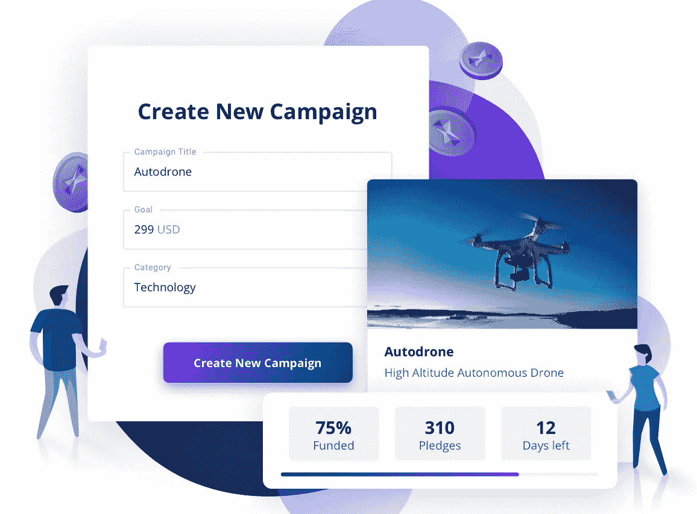
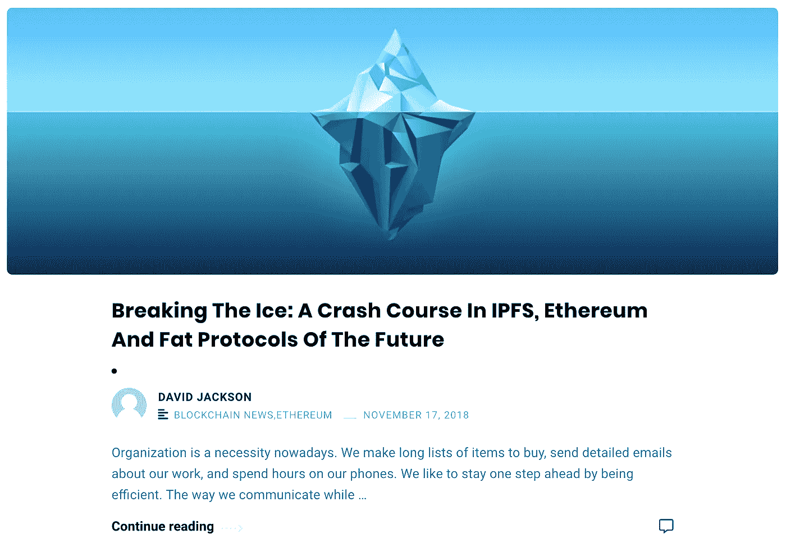
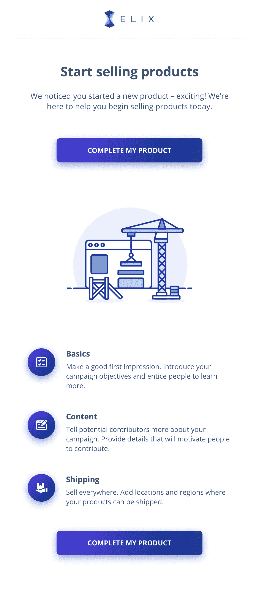
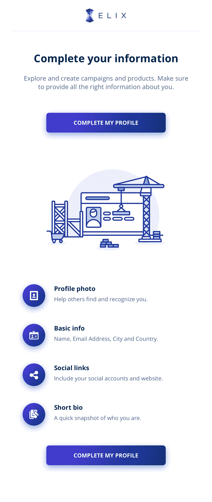

# 我们如何让产品和活动易于探索+所有最新的 ELIX 更新

> 原文：<https://medium.com/hackernoon/how-were-making-products-campaigns-easy-to-explore-all-the-latest-elix-updates-4978d42c177e>

我们一直忙于向 ELIX 添加许多新功能！以下是我们在过去一周对门户网站所做的所有改进。

## 签约雇用

如果您还没有，请在此注册 ELIX。注册只需要一秒钟，将允许尝试创建您的第一个产品或活动。点击此处加入 ELIX [或点击下图开始:](https://elixirtoken.io/signup)

## 探索产品和活动

本周，我们将完成探索页面的最后润色！使用 Explore 菜单浏览产品和活动是一种简单的方法。使用左上角的菜单，您可以根据类别对产品或活动进行排序。排序是非排他性的，因此当您选择多个类别时，您将能够看到属于其中一个类别的产品和活动。下面是一个演示视频，展示了新的探索页面的运行情况:

我们正在对探索页面进行最后的润色，并计划很快发布。点击这里加入 ELIX [的行列，在新的探索页面准备就绪后试用一下。](https://www.elixirtoken.io/signup)

## 打破僵局:IPFS 速成班，以太坊和未来的 Fat 协议

我们最近发布了一部名为 ***的新作《打破坚冰:IPFS 速成班，以太坊和未来肥胖协议*** 》。在文章中，我们来看看互联网将如何因去中心化而改变。以下是讨论这些变化的影响的简短摘录:

*在 Web 3.0 中，价值在网络中的贡献者和参与者之间共享，而不是在几个大型应用程序之间共享。这是网络的一个根本性转变，把用户放在第一位。这意味着今天的科技巨头需要更好地照顾他们的用户，如果他们明天还想保持相关性的话。*

点击[此处](https://blog.elixirtoken.io/breaking-the-ice-a-crash-course-in-ipfs-smart-contracts-and-fat-protocols-of-the-future/)或下图阅读全文。

Click to read our latest article on trends and changes in the architecture of the internet

## 设计进度

我们的设计团队一直在努力改进我们平台的外观。他们通过添加支持无奖励活动的选项、添加社交链接、添加更新和评论来完善活动页面。以下是改进后的活动详细信息页面的外观:

设计团队还致力于电子邮件设计，以鼓励人们完成发布他们的产品、活动和简介。以下是成品提示:

下面是完成个人资料的提示:

这星期就这些了！一定要在这里报名参加 ELIX [。在几分钟内创建您的第一个产品或活动。](https://elixirtoken.io/signup)