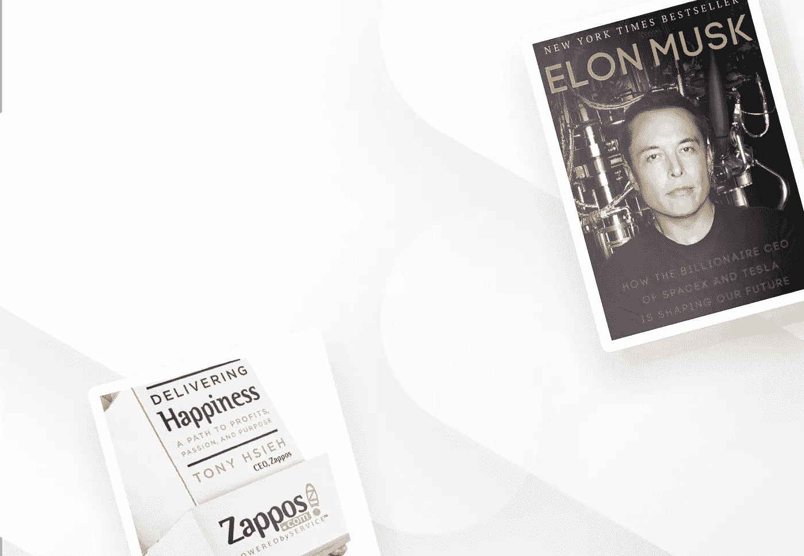
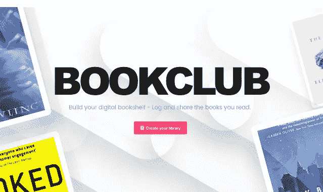

# 我们如何重新想象好阅读

> 原文：<https://medium.com/hackernoon/how-were-reimagining-goodreads-e2c4387bef6b>

## 认识一下[书友会](https://www.producthunt.com/posts/bookclub)，你的新数字书架

> “一个读者在他死之前经历了一千次生命，Jojen 说。从不读书的人只活一个。”
> ――乔治·马丁

在过去的几年里，我已经把我的大部分内容消费从 30 秒的标题片段转移到了长篇叙事。读书(和听书)已经迅速成为我学习经历的一个基本组成部分。我什么都读，从详细的传记到科幻小说，再到关于自我意识的小说。

我为什么爱看书？为什么我几乎所有最聪明的朋友都对他们读过的书着迷？

在一个现代媒体形式高速发展的世界里，为什么书还存在？为什么我们仍然关心他们？

## 书籍永不过期。好的永远不会变坏。他们的话是永恒的。

就是这个原因，加上很多个人动机，让我继续看书。我的动力总是在进化。

我读书是为了迷失在别人的故事里。我通过阅读来了解我从来不知道存在的概念。我读书是为了增长智慧。消除焦虑。探索不同的世界。理解视角。建立同理心。

当然，消费书籍的理由有很多:每一个都是独一无二的，没有一个是错的。

我发现自己经常回到这个解释上来:

## “我们读书是为了感觉自己并不孤单。”——[威廉·尼科尔森](https://en.wikipedia.org/wiki/William_Nicholson_(writer))

人类喜欢故事。几个世纪以来，围绕着引人入胜的故事，社区已经形成并受到启发。

## 今天，我们推出了[读书俱乐部](http://bookclub.cool/)——这样你就可以记录和分享你读过的书。

这是 Goodreads 的一个美丽、简单的替代方案。点击查看我的简介[。](http://www.bookclub.cool/@jordangonen)

那么它是如何工作的呢？

只需点击几下，你就可以建立你的读书俱乐部档案(通过 Twitter/FB 登录)。从那里，你可以开始填写你的个人图书馆。将一本书添加到您的个人资料非常简单易行(我们查询 Amazon API 来查找您阅读的书)。您只需添加评论、评级和日期。

从那里，你的个人资料就可以在互联网上分享了。

我们的路线图上有许多功能(实际上有无限的东西要构建)，我们将在下一次更新中更深入地分享这些功能(阅读统计数据、社区订阅等)。).不过，我们从一个简单的“数字书架创建器”开始

当我们几个月前开始拼凑图书俱乐部时，我们受到了将人和知识结合在一起的机会的启发。虽然读书俱乐部简介只是一个更大的问题空间的一个组成部分，我们仍然非常兴奋地看到社区对这个方向的感受。

## 很想听听你的想法。

我们今天在@producthunt 上直播！