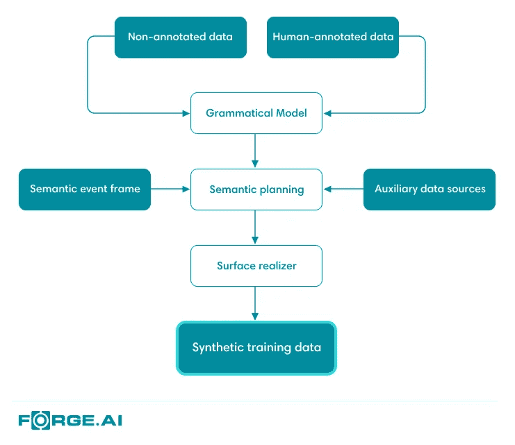
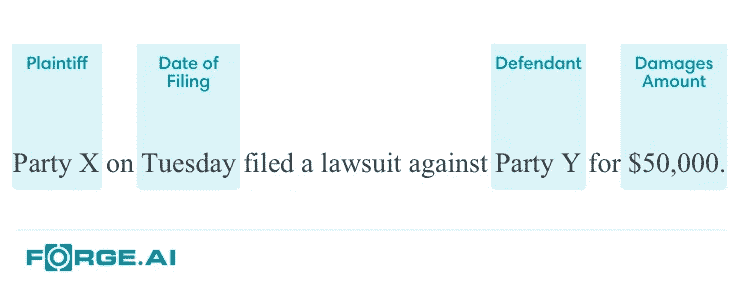
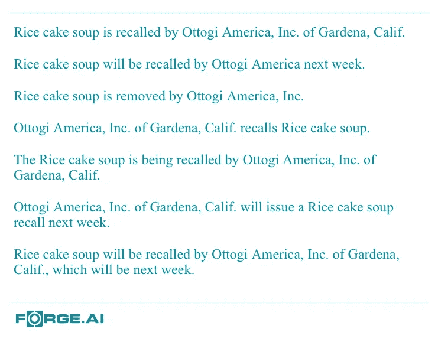

# 我们如何使用自然语言生成来扩展

> 原文：<https://medium.com/hackernoon/how-were-using-natural-language-generation-to-scale-at-forge-ai-f7f99120504e>

杰克·尼利

在[锻造厂。AI](http://www.forge.ai) ，我们从非结构化数据中捕捉事件，并以一种适合于机器学习、决策和我们客户的其他算法任务的方式来表示它们(关于广泛的技术概述，请参见[这篇博文](https://www.forge.ai/blog/forge.ai-technical-overview))。为了做到这一点，我们采用了一套最先进的机器学习和自然语言理解技术，其中许多是监督学习系统。为了让我们的业务积极扩展，我们需要一种经济可行的方法来为那些受监督的学习者快速获取培训数据。我们使用自然语言生成来做到这一点，以敏捷的方式用带注释的合成语言补充人类注释。

# 背景

获得用于监督学习的高质量训练数据集所需的成本和时间是机器学习可部署性的主要瓶颈。为了最大限度地减少这些影响，更广泛的研究社区中的许多工作都集中在减少模型本身固有的训练数据要求上。这已被证明在各种模型和用例中是有效的(例如，用于文档分类的注意力网络的成功 [*1*](http://www.cs.cmu.edu/~./hovy/papers/16HLT-hierarchical-attention-networks.pdf) )但是实施的困难和对基准的相当狭隘的关注表明，从训练数据本身的方向解决问题的补充方法可能是富有成效的。

优先使用人工扩展的训练数据集来增强监督学习。在图像和语音识别中这被称为*训练数据扩充*，它已经非常成功[*2*](https://arxiv.org/pdf/1708.06020.pdf)*[*3*](https://arxiv.org/pdf/1412.5567.pdf)。这是因为在自然度量空间中存在模型应该具有的不变属性，例如图像旋转或说话的速度/音调。然而，在自然语言中，不存在这样的内在空间。这使得扩展文本训练语料库的任务变得相当复杂。以下是三个旨在解决自然语言训练数据匮乏问题的研究示例:*

1.  **同义词膨胀* [*4*](https://arxiv.org/pdf/1502.01710.pdf) :概率性地用同义词替换标记，这些同义词的权重是同义词与原始含义的距离*

*2.*数据伪造* [*5*](https://arxiv.org/pdf/1603.01232.pdf) :对每个标注话语的所有标注槽和值进行去虚化，在某种聚类下用相似槽随机替换去虚化的槽，产生一组伪标注话语，例如一个基本的主宾话语会变成伪标注:*

> *“昨天下午 SLOT_SUBJECT 打电话给 SLOT_OBJECT 谈工作”*

*3.*弱监督* [*6*](https://arxiv.org/pdf/1703.00854.pdf) :近似地、嘈杂地注释文档，以产生低质量的训练数据以及相关联的分数，在适当的损失函数内使用那些分数来实现“噪声感知”训练。对于弱监督的艺术框架的伟大境界，请看*数据编程*[*7*](https://arxiv.org/pdf/1605.07723.pdf)*[*8*](https://arxiv.org/pdf/1711.10160.pdf)**

**这些方法类似于数据扩充来扩充现有的训练语料库，并且不依赖于繁重的语言建模。在从文本分类到口语对话系统的领域受限用例中，它们被证明是有效的。对于我们的用例，我们需要能够快速地将我们的事件覆盖范围扩展到新的领域，并且相信没有特定领域规则的深度语言建模是实现这一点的强大而有效的方法。**

# **挑战**

**训练数据生成很容易陷入先有鸡还是先有蛋的困境:很难设计这些系统，使它们本身不需要大量的训练数据。因此，构建一个必要的健壮的和领域不可知的系统最终可以解决为受监督的学习者保留的问题。特定领域的规则集、语法和监督学习模型上的约束是解决这个问题的方法，但有时会导致过度专门化和僵化的系统。**

**训练数据生成的第二个关键挑战是控制监督学习系统上引起的偏差。数据生成方法必须产生足够多样的语料库，使得监督模型不仅仅是学习训练数据的生成模型。很难定义什么对于训练语料库是有效的和充分的。稍后，我们将讨论对训练语料库的内在属性进行调查的一些途径，这些内在属性可以预测训练行为。这些属性可以是**充分可变性**的度量，其不依赖于训练的监督模型的结果性能。**

# **我们是如何设计系统的**

**我们的系统的主要设计约束是，它必须是健壮的，并且容易扩展到新的事件和语义结构；这意味着我们不能依赖手工编码的特定领域的规则或语言。我们正在设计这个系统，这样一切都可以从样本数据、辅助数据源和*英语语言结构的先验*知识中学习。**

**我们的系统架构从传统的自然语言生成系统 *9* 中获得了一些灵感。初始设计分为三个关键部分，我们正在努力验证这三个部分(见图 1):**

1.  **语法模块:这个模块负责学习所讨论事件的语法特征。该模型本身最初是从一个[概率上下文无关语法](https://en.wikipedia.org/wiki/Probabilistic_context-free_grammar)中导出的。通用英语树库用于初始化语法，然后人工注释用于特殊化/细化。我们使用分类的无注释数据来进一步细化特定领域的生产概率。**
2.  ***语义规划:*在这里，我们使用语义事件框架和任何可用的辅助数据源，结合所学习的语法来规划自然语言表达式，即，决定要包括在表达式中的语义相关的角色和标记。我们最初将它作为一个概率图形模型来构建。**
3.  **表层实现器:这个模块的工作是获取一个语义计划，并使其语法正确。这是负责变调、时态、语态、顺序、复数等的成分。这种系统的任何版本都有可能包含这个模块，但是我们正在研究不同的、可能是新颖的方法，这些方法的区别性大于生成性。高质量表面实现器的一个例子是 [OpenCCG](https://github.com/OpenCCG/openccg) ，它基于[组合分类文法](https://en.wikipedia.org/wiki/Combinatory_categorial_grammar)。由于 ccg 是基于选区的，因此是一种短语结构语法(像 PCFG)，这个实现器与我们的语法模型有一些方便的相似之处。**

****

*****Figure 1.*** *Architectural plan of Forge.AI’s natural language generation system.***

**我们期待着分享更深入的变化和改进，因为我们证明了这项技术。**

# **一个例证**

**作为一名客户，假设您希望开始接收有关诉讼的事件。您可以用四个字段定义诉讼的最小结构化表示:**

*   **原告**
*   **被告**
*   **损害赔偿金额**
*   **提交日期**

****

*****Figure 2.*** *Example of an event annotation for the basic lawsuit event.***

**我们将这些字段的集合称为*语义事件框架*。有了这个框架，我们就可以用非结构化的自然语言获得这些事件的几百个人类注释的例子(参见图 2 中的人类注释图片)。从那里，我们可以将框架与人工注释和任何内部或外部的辅助数据源(例如一个[知识库](https://www.forge.ai/blog/knowledge-graphs-for-enhanced-machine-reasoning-at-forge.ai)，一个提交日期的存储库)以及我们的自然语言生成系统结合起来。这产生了一个合成的训练语料库，比我们从人类那里获得的几百个样本要大得多。由于我们的提取技术相当复杂，它需要大量的训练数据。通过减少我们必须寻找的人工注释的数量，我们可以将这个新诉讼事件的培训和部署时间减少相当大的一部分。**

**这是一个非常简单的合成诉讼事件的例子:**

***X 方周二对 Y 方提起诉讼，要求赔偿 50，000 美元。***

**还有一个稍微复杂一点的问题:**

**X 方起诉 y 方。该诉讼于周二提起，要求赔偿总额为 50，000 美元的损失。**

**当然，真实的数据通常更复杂:事件被表达在不止几个句子的跨度上，有时表达事件的文档有许多语义不太相关的文本。我们的系统被构建来产生显示这些特征的文档。**

# **迄今为止的结果**

**虽然我们的自然语言生成系统还处于起步阶段，但我们已经取得了非常有希望的成果。下面的图 X 展示了我们的系统产生简单产品召回事件的语法变化的一些例子，重点是改变时态和语态。这是使更复杂的语言生成能够产生结构多样的文档的特性之一。**

****

*****Figure 3.*** *Natural language generations expressing a recall event of the “Rice cake soup” by “Ottogi America.” These are simple examples of some forms of grammatical variation we are able to produce for a single event.***

**在图 Y 中，我们看到了一个更加复杂的语言事件的例子。这个生成的文本包含大量的变化、复杂的内容和结构，以及领域特异性。我们能够生成语义相关但角色隐含的句子和从句(例如参见最后一句)，并且能够将该事件描述为与游戏相关，尽管该别名不存在于事件框架中。**

****

*****Figure 4.*** *A product delay event generated by our system, showing more complexity.***

# **走向未来**

**我们通向高度健壮和丰富的自然语言生成的道路才刚刚开始。以下是我们打算追求的研究领域的一些进展。**

## **通过 Forge 的知识库改进语义**

**训练数据生成最具挑战性的方面之一是确保捕获正确深度和广度的语义。我们目前正在探索我们萌芽的知识库上的路径遍历(见[这篇博文](https://www.forge.ai/blog/knowledge-graphs-for-enhanced-machine-reasoning-at-forge.ai))作为重新排列语义计划的一种手段。这有望生成更大、更一致的相关文档。**

## **通过强化学习提高领域特异性**

**目前，领域特异性是从分类的、未注释的文档和少量人工注释的样本中学习的。我们一直在探索强化学习作为一种手段来进一步细化特定领域生成的文档。我们设想将它实现为一种用户参与的交互模式，以加快开发时间。**

## **支持多种语言**

**作为概念的初步证明，我们正在探索神经机器翻译 [10](https://arxiv.org/pdf/1703.03906.pdf) 方法，在生成管道的末端将英语翻译成目标语言。这有可能放大语法模型中引入的系统性错误，所以我们需要注意这一点。**

## **训练行为与训练语料内在属性的关系**

**许多行业从业者，尤其是那些在资源受限的组织中的从业者，已经认识到许多已发布的方法在商业用例中面临的高度嘈杂和变化的真实世界自然语言训练数据上的有限适用性。为了理解如何可靠地和可持续地收集和产生训练数据，我们必须理解训练语料库的内在属性，这些训练语料库从不太理想的训练数据中预测监督学习行为。**

**我们可以把这些属性分为三类:词汇的、句法的和语义的。**

1.  **词汇属性:词汇用法的可变性是这种属性的一个例子。归一化词频分布是这种属性的直接测量。我们正在探索这些分布和一些参考分布之间的交叉熵，这些参考分布来自足够大的通用英语语料库，以及语料库内的逐点互信息。后者在历史上被认为是一种语义度量，但我们认为它是词汇性的和浅层语义的，因为深层语义度量需要一些推理组件，如知识库**
2.  ***句法属性*:语法的可变性和复杂性是这里感兴趣的属性。我们正在研究根据一些训练过的解析模型来比较解析树上的分布的度量。类似于群体遗传学，我们想考虑跨语料库的独特标记在系谱(祖先树)上的分布，其中金曼的联合 [11](https://www.sciencedirect.com/science/article/pii/0304414982900114) 将作为系谱的合适先验(这已经在另一个方向上有效地用于层次聚类 [12](http://legacydirs.umiacs.umd.edu/~hal/docs/daume07coalescent.pdf) )。*发展水平量表* [*13*](https://www.aaai.org/Papers/FLAIRS/2008/FLAIRS08-043.pdf) 是另一个潜在的强大指标，我们正在探索解决训练数据的语法复杂性**
3.  **语义属性:语料库中包含和表达的意义非常重要。收集和生成训练数据的最大挑战之一是确认您已经捕获了足够数量的必要语义内容。我们声称测量这些属性的最佳方法是使用知识库。将语料库想象成表达的实体和关系的集合，我们可以在知识库中为每个语料库的语义内容推断出一个子图。这些子图之间的图相似性是语义相似性的自然度量。先前的工作已经考虑了在外部知识库的上下文中跨语料库的单词相似性，如 WordNet [14](https://pdfs.semanticscholar.org/1374/617e135eaa772e52c9a2e8253f49483676d6.pdf) 。**

# **结论**

**我们已经展示了我们如何使用自然语言生成来减少通常与监督学习相关的培训时间和成本，这使我们能够加快我们的事件覆盖范围，并进行深度和横向扩展。我们很高兴分享我们的进展，因为我们继续建立这一语言理解的基础技术。**

**注意:这篇文章最初发表在我们的博客上:[https://www . forge . ai/blog/how-we-are-use-natural-language-generation-to-scale-at-forge ai](https://www.forge.ai/blog/how-we-are-using-natural-language-generation-to-scale-at-forgeai)**

**参考**

1.  **杨等著 2016: [著/hovy/papers/16 hlt-hierarchical-attention-networks . pdf](http://www.cs.cmu.edu/~./hovy/papers/16HLT-hierarchical-attention-networks.pdf)**
2.  **泰勒和尼茨克 2017:[https://arxiv.org/pdf/1708.06020.pdf](https://arxiv.org/pdf/1708.06020.pdf)**
3.  **汉南等人，2014 年:[https://arxiv.org/pdf/1412.5567.pdf](https://arxiv.org/pdf/1412.5567.pdf)**
4.  **张&乐村 2016:[2016](https://arxiv.org/pdf/1502.01710.pdf)**
5.  **文等，2016: [，](https://arxiv.org/pdf/1603.01232.pdf)**
6.  **巴赫等人，2017:[https://arxiv.org/pdf/1703.00854.pdf](https://arxiv.org/pdf/1703.00854.pdf)**
7.  **拉特纳等人，2017:[https://arxiv.org/pdf/1605.07723.pdf](https://arxiv.org/pdf/1605.07723.pdf)**
8.  **拉特纳等人，2018:[https://arxiv.org/pdf/1711.10160.pdf](https://arxiv.org/pdf/1711.10160.pdf)**
9.  **赖特，埃胡德和罗伯特戴尔。*构建自然语言生成系统*。剑桥大学出版社，2000 年。**
10.  **布里茨等人，2017:【https://arxiv.org/pdf/1703.03906.pdf **
11.  **金曼 1982:[https://www . science direct . com/science/article/pii/0304414982900114](https://www.sciencedirect.com/science/article/pii/0304414982900114)**
12.  **Teh、Daume 和 Roy 2007:[http://legacy dirs . umi ACS . UMD . edu/~ Hal/docs/Daume 07 coalesce nt . pdf](http://legacydirs.umiacs.umd.edu/~hal/docs/daume07coalescent.pdf)**
13.  **鲁 2008:[2008](https://www.aaai.org/Papers/FLAIRS/2008/FLAIRS08-043.pdf)**
14.  **Mihalcea，Corley 和 Strapparava 2006:[https://pdfs . semantic scholar . org/1374/617 e 135 EAA 772 e 52 C9 a2 e 8253 f 49483676d 6 . pdf](https://pdfs.semanticscholar.org/1374/617e135eaa772e52c9a2e8253f49483676d6.pdf)**