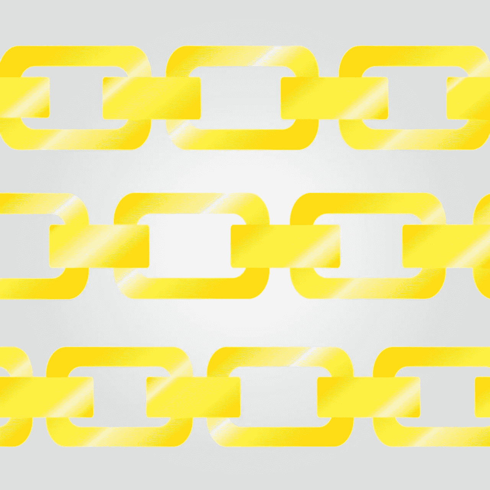
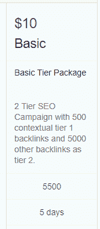

# 如何(&为什么)更好地跟踪你的反向链接

> 原文：<https://medium.com/hackernoon/how-why-to-keep-better-track-of-your-backlinks-a1434263bf3d>

Source: [Pixabay](https://pixabay.com/en/backlink-blog-gold-645255/)

像互联网上几乎所有的东西一样，SEO 也有黑暗的一面。仍然有很多人没有赶上谷歌，还有一些人只要有人付费就不在乎链接质量。

仅仅因为你不使用这些服务，并不意味着你对它们免疫。大多数人都满足于在搜索领域从道德上击败竞争对手，但并不是每个人都是诚实的。一个不择手段的竞争对手可能会戴上他们的黑帽子，跳上 Fiverr，给你一份不友好的礼物:

这是一个来自 Fiverr 卖家的截图，他将在五天内生成，数一数，五个半*千个*链接，价格 10 美元。这些类型的链接*极有可能被打上操纵的标记。因此，一个竞争对手花 10 美元，插入你的网站，突然间你就有了 5000 多个指向你的垃圾链接。*

谷歌在防止合法企业成为竞争对手针对他们的负面搜索引擎优化的受害者方面做得越来越好。然而，这仍然是一个非常好的主意，跟踪你的反向链接配置文件，保持对你的链接网络的健康状态的了解，并且能够在垃圾链接出现时迅速拒绝它们。

**反向链接是怎么回事？**

文章旋转和批量反向链接生成是 SEO 时代的倒退。仍然提供这些服务的人的真实意图是一个谜，但是在一个时间点上他们是相对标准的实践。

谷歌的算法一直是建立在链接上的。然而，谷歌优先考虑的链接种类是不断变化的。目前情况的要点是，链接需要自然和用户友好。我们不知道所有的细节，但我们知道的是，该算法被设计成尽可能接近地以人类的方式评估链接。

[因此，获得反向链接](https://hackernoon.com/beginners-guide-to-seo-101-143d792a36a0)并确保它们有用的最佳方式是创建人们自然分享、参考和享受的内容。获得链接的最糟糕的方式是旋转文章和批量创建链接。

**你能做些什么来保护自己？**

幸运的是，谷歌很快就了解了各种各样的操纵行为。起初，这种低质量的反向链接会严重损害你的网站，但是这种算法不一定会因为链接差而惩罚整个网站。然而，它继续贬低垃圾链接的价值。许多 SEO 行业专家也持怀疑态度，认为负面 SEO 造成的“问题”是谷歌用企鹅算法造成的。

另一方面，随着更新和工具的出现，大多数人都认为负面 SEO 是一个罕见的问题。

在竞争激烈的利基市场，这仍然是一个需要注意的问题。对负面 SEO 最好的防御是自己保持良好的链接实践，并留意你的反向链接。流量突然下降，反向链接数量突然激增，关键字排名突然下降*可以*表明负面 SEO 攻击。

除了最复杂的攻击之外，对抗所有攻击的工具都非常简单，这要归功于 Google 在 Penguin 中添加的“否认”工具。这是一个工具，让你告诉爬虫你关心一个链接，你宁愿它不被计数。

否认每一个看起来奇怪或来自低域权限站点的链接可能没有必要或特别有帮助。真的，你需要注意推荐域名的峰值，这表明有人大量链接到你。在你的谷歌网站管理员工具中，查看、导出和分析你的反向链接，以及取消它们是一个简单的过程。这篇来自 [Page One Power](https://www.pageonepower.com/linkarati/monitor-backlinks-google-webmaster-tools-negative-seo) 的便捷博客文章详细介绍了对抗负面 SEO 的过程。

**总之:没有完美的算法，手动跟踪**

即使谷歌有最好的意图，他们也不可能百分之百地阻止负面的搜索引擎优化策略。算法更新是一个持续的过程，与此同时，对你网站的意外攻击会造成各种各样的麻烦，并且很难恢复。因此，在网站管理员工具中留意你的链接，并在它们造成损害之前准备好捕捉大量可疑链接。