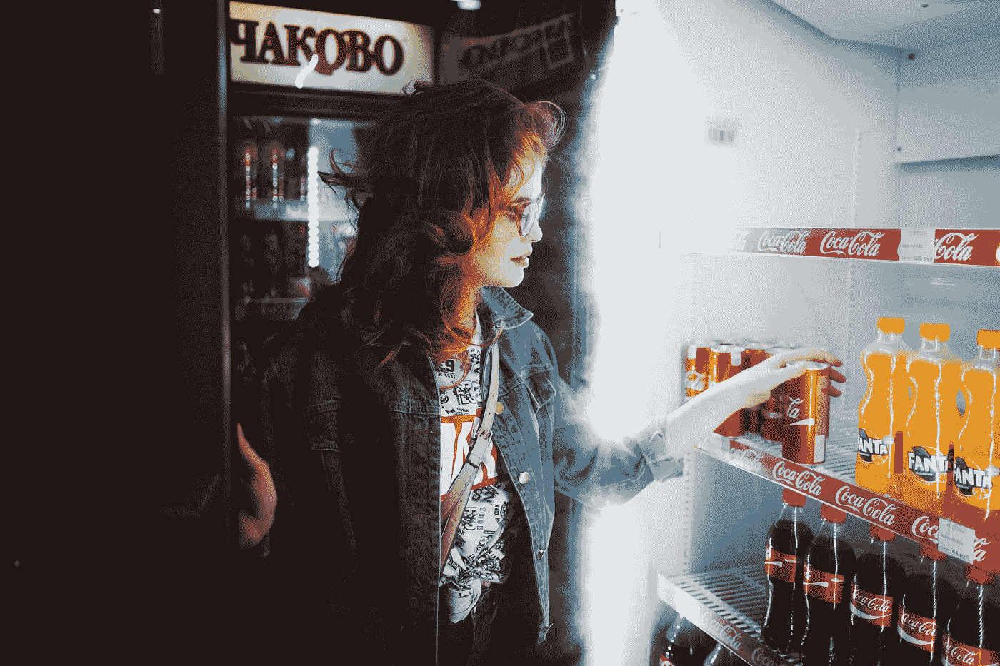
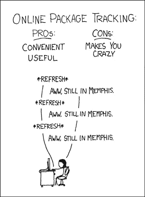
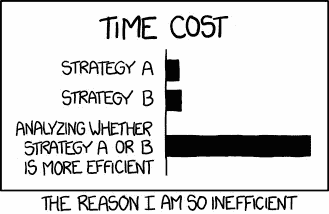
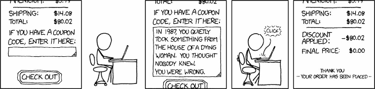

# 区块链会让你省大钱

> 原文：<https://medium.com/hackernoon/how-will-blockchain-make-you-save-big-money-on-shopping-a199d47d8db2>



**This post was sponsored by an affiliate of Cartel.**

约翰拥有一家椅子厂。他做了漂亮的椅子。他不断创新它的设计。他的椅子的基本版本制造成本为 50 美元。如果你想买它，你必须支付大约 400 美元。

***为什么会这样呢？***

这是因为在它到达你之前，他的椅子在很多人周围移动。链条上的每个人都要分一杯羹。这将增加它的成本。

***它为什么会绕着人转？约翰不能直接把椅子卖给他的顾客吗？***

说起来容易做起来难！管理生产和销售对约翰来说是一件头痛的事。因为他只想专注于产品质量，所以他将销售外包给了一家分销商。约翰必须把他的椅子运送给经销商。运费被加到椅子的价格中。



Credits : [xkcd](http://www.xkcd.com/281)

经销商需要制定一个销售策略。他们会分析并找出哪些批发商会给约翰的椅子一个好价钱。经销商需要为他的工作得到补偿。这将进一步增加椅子的价格。是的，需要考虑运送椅子到批发商的成本。

即使是批发商也不会直接把椅子卖给消费者。他们需要找出哪些零售店(如沃尔玛、塔吉特等)适合摆放约翰的椅子。他们的工作也应该得到报酬。同样，应该考虑将椅子送到零售商处的运输成本。零售商将把产品卖给消费者。他需要因出售产品而得到报酬。

让我们列出成本

1.  制造成本-50 美元
2.  约翰给经销商的运费——20 美元

2.经销商报酬-100 美元

3.经销商到批发商的运输成本-20 美元

4.批发商补偿-100 美元

5.批发商到零售商的运输成本-20 美元

6.零售商补偿-40 美元

总计-350 美元

***费用应该是多少？***

1.  制造成本——50 美元
2.  约翰的利润是 10 美元
3.  客户的运输成本-20 美元

总计-80 美元



Credits : xkcd

相差很大，大约高出 4 倍。大约 270 美元被中间人吃掉。在某些情况下，差距高达 10 倍。

我们如何降低成本？

为了让您以 80 美元的价格购买椅子，我们需要直接将您与约翰联系起来。单靠这一点解决不了问题。约翰需要最低数量的订单。这样他就可以批量生产，有利可图。换句话说，我们需要一个平台，可以将对同一产品感兴趣的买家和制造商联系起来。如果达到了购买者的最低数量，该平台会提醒制造商。然后，制造商将制造产品并运送给客户。

还有一个问题。这就需要买家和厂商 ***信任*** 这个平台。平台的基础设施成本增加了产品的价格。有欺诈的可能。制造商可以接受付款，而不交付或交付劣质产品。我们需要一个自我维护的平台，这样就不会增加成本。重要的是我们需要解决信任的问题。



Credits : [xkcd](https://www.explainxkcd.com/wiki/index.php/837:_Coupon_Code)

***我们如何解决信任问题？***

我们在其他地方解决过这个问题吗？在这种情况下，我们需要处理列出的事情。

1.  保护买方的资金(只有在产品交付后，资金才应发放给 John)。
2.  向 John 保证(一旦达到最低购买量，他们就不能取消订单)

这些是基于条件的触发器。想想你最后一次从亚马逊购买电子书。亚马逊只有在确认付款后才会发货。

计算机程序始终如一地执行这些指令。当你点击这篇文章，向下滚动，等等的时候，它就出现了。为了帮助约翰和你，我们需要将合同的协议转换成代码。

***买家与约翰之间智能合约的伪代码***

```
If the customer placed an order then Lock $80 on customer's account If minimum amount of buyers reached and date is 30th June 2018 then Alert John to start manufacturing chairs Else Release customer's money If the chair is delivered to the customer then Transfer $80 from customer's account to John's account
```

但是我们在哪里部署这些代码呢？如果我们遵循传统的方法，我们必须将这些代码部署在一台集中的计算机上。这是不可信的，因为拥有计算机的人可以修改它。相反，我们需要在买家和制造商的电脑或手机上部署这些代码。我们也可以在以太坊这样的公共区块链上部署这些代码。基本上，它会在多台计算机上，这样一个人就不能垄断了(*去中心化*)。重要的好处是平台可以自我维护，基础设施成本大幅降低。这就是区块链。

现在，当客户下订单时，订单金额将被锁定。他不会被起诉。制造商可以设定达到最低购买人数的最后期限。如果在那之前没有联系到买家，那么这笔钱就会被退回。一旦联系到买家，约翰就可以开始制造椅子。一旦他将椅子交付给客户，代码就会执行，客户账户中的锁定资金就会发送给 John。

> 约翰很高兴，因为他得到保证，如果工作出色，他会得到报酬。客户很高兴，因为他们可以放心，只有在收到产品后才会付费。基本上，双方都不必信任对方。


Credits : [xkcd](https://xkcd.com/501/)

卡特尔正在建立类似的东西。看看这个视频。

卡特尔将世界各地的买家与制造商联系起来。将他们的单个订单集中到一个大批量价格中。他们取消了前面讨论过的中间商，如经销商、批发商、零售商等。他们甚至使用智能合约来保护买家。他们添加到交易中的成本只有不到 3%。一辆售价约 15 万美元的路虎揽胜在 T2 卡特尔(T3)的售价仅为 8 万美元左右。这将通过大幅降低产品价格来扰乱零售业。他们现在开始接受[早鸟 ICO 注册](http://www.cartelcoin.io/registration/)。

[](/wethinkideas/how-to-validate-if-your-ideas-need-a-blockchain-e1a4846d16fd) [## 如何验证你的想法是否需要区块链

medium.com](/wethinkideas/how-to-validate-if-your-ideas-need-a-blockchain-e1a4846d16fd) 

***鼓掌请*** 👏，*谢谢*😊。**请注意，这篇文章是由卡特尔的一个分支机构赞助的。** *关注我们，*[*hacker noon*](https://hackernoon.com)*和我(*[*Febin John James*](https://medium.com/u/75a616711f4e?source=post_page-----a199d47d8db2--------------------------------)*)了解更多故事。我想向您介绍两项令人惊叹的服务。* [*赚*](https://earn.com/febin/referral/?a=rzjbj73qc4dhiv6y) *付给你读邮件的比特币。*[*Mentorbox*](https://mentorbox.com/partners?affiliate_id=898086&aff_sub=&aff_sub2=&nopopup=true&noautoplay=false&cookiepreview=false)*总结热门书籍，提供可操作的见解。*

[](https://www.linkedin.com/in/febinjohnjames/)