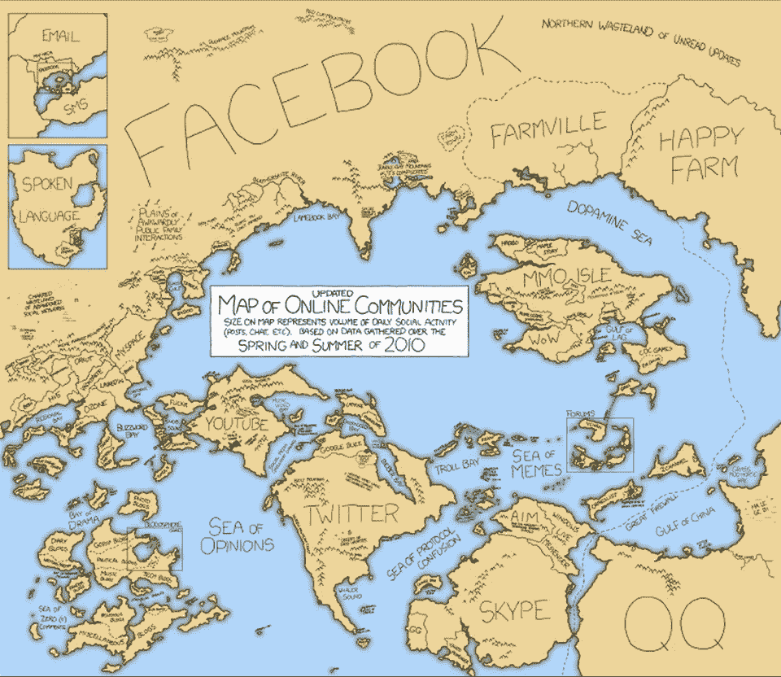

# 区块链技术将如何赋能在线社区

> 原文：<https://medium.com/hackernoon/how-will-blockchain-technology-empower-online-communities-4a13dbf5d26>

Photo by [davide ragusa](https://unsplash.com/photos/gcDwzUGuUoI?utm_source=unsplash&utm_medium=referral&utm_content=creditCopyText) on [Unsplash](https://unsplash.com/search/photos/community?utm_source=unsplash&utm_medium=referral&utm_content=creditCopyText)

如果你回到远古时代，你会发现[部落](http://amzn.to/2GEToBS)。几乎每个人都属于一个部落。他们为共同利益而工作。它仍然存在于我们的基因中。唯一的变化是部落现在被称为社区。你是不同社区的一部分。你是一个 iPhone/Android 粉丝，你可能属于一个宗教或无神论社区。

维基百科/Linux/比特币/以太坊是由社区建立的。甚至盈利组织也非常重视社区建设。去苹果/谷歌的支持论坛，你的问题都有你我这样的人来回答。社区是每个组织的核心。社区在构建我们现在拥有的互联网中发挥了重要作用。

Credits : [xkcd](https://www.theatlantic.com/technology/archive/2015/06/the-tragedy-of-the-digital-commons/395129/)

为了激励人们并提高贡献的质量，社区加入了游戏化。给了积分、徽章、头衔等。忠诚度积分，媒体上的顶级作家，Quora 上最受欢迎的作家就是一些例子。然而，这些没有货币价值。它可能有社会价值。这取决于人，有些人可能会认识到这一点。

开源贡献者的工作几乎没有报酬。有的放一个【T2 给我买咖啡】的页面。如果是一个更大的组织，他们会为企业提供支持以获取收入。

大约一年前，我是斯坦福人群研究的一员。这个团体的任务是用简单的术语解释复杂的研究论文。换句话说，让研究对所有人开放。参加这个项目有很多额外津贴。你可以和志同道合的人交往。你可以直接接触到在斯坦福工作的人。当你想申请大学时，他们会帮你写推荐信。甚至有机会与他们共同撰写研究论文。我们是一个松散渠道的一部分。当你做出贡献时，社区成员会奖励你积分。

有些人会从这些额外津贴中受益。但是，这对我没什么好处。我很久以前就离开了大学，我并不热衷于写研究论文。如果我可以和别人交换积分呢？当然，他们不能合著论文，也不能给不认识的人做推荐。然而，一个 Skype 会话或几个小时的咨询似乎是公平的。 [Earn](http://earn.com/febin/referral/?a=rzjbj73qc4dhiv6y) 可以让你花 5-100 美元联系风投、CEO、区块链影响者、Go/HTML/Javascript 程序员。

社区可以用以太坊创建自己的代币。例如，Linux 基金会的 Kubernetes 项目可以创建一个名为 HLG 的令牌。他们可以在开放的区块链中编写智能合同。也就是说，如果开发者的拉请求被接受，就发给他 10 个 HLG 代币。现在，开发人员可以使用这些令牌向高级 Linux 工程师咨询。或者他可以在代币交换中交换来自斯坦福人群研究的 SCR 代币。为了得到斯坦福大学讲师一小时的咨询。我希望你明白我的意思。人们甚至可以兑现他们的代币。 [Earn](http://earn.com/febin/referral/?a=rzjbj73qc4dhiv6y) 也在从事类似的工作。这并不局限于开源社区。任何在线社区都可以将令牌整合到他们的系统中。这将激励社区贡献者的辛勤工作。

***拍手请*** 👏 😬

 [## 加入费宾·约翰·詹姆士的 Earn.com

### 通过阅读你的电子邮件和完成调查等其他任务获得比特币报酬。

earn.com](https://earn.com/febin/referral/?a=rzjbj73qc4dhiv6y) 

我不会把我的内容放在付费墙后面。如果你喜欢我的内容，可以通过 [***请我喝咖啡***](https://www.buymeacoffee.com/febin) ***来支持我。如果你有兴趣在云上制作应用程序，请在亚马逊上查看我的书*** [***【云是小菜一碟】***](http://amzn.to/2n03pzO) ***。***

 [## 如何验证你的想法是否需要区块链

medium.com](/wethinkideas/how-to-validate-if-your-ideas-need-a-blockchain-e1a4846d16fd) 

> 谢谢你远道而来。关注我们， [HackerNoon](https://hackernoon.com) 和我( [Febin John James](https://medium.com/u/75a616711f4e?source=post_page-----4a13dbf5d26--------------------------------) )了解更多故事。我正在写一本关于区块链的书。如果你想得到预发布版本[，在这里注册](https://goo.gl/forms/jhkzLnsYm3yrLMlD2)。我还推荐一本书，里面有我写的每一个故事。对于这个故事，它是 [*区块链革命:比特币背后的技术如何改变货币、商业和世界。*](http://amzn.to/2EtascE) **读书是无价之宝。(如果您没有时间阅读，请查看**[**Mentorbox**](https://mentorbox.com/partners?affiliate_id=898086&aff_sub=&aff_sub2=&nopopup=true&noautoplay=false&cookiepreview=false))。

## 比特币

1 nywhkugdfsm 5 kmxnkkmwe 5 zre 6 es 9 jbpg

## BCH

16 ju 3 fswl 23 syftykbeh 7 gfudxzjrfzyfx

## 以太币

0x 847376 bc3e 7459 b 4324 df 33 BC 17 b 2335 aa 14 af 05