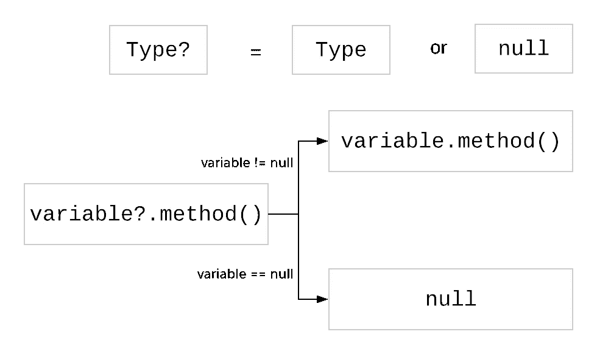

# 如果你正在设计一门新的语言，你将如何处理空引用？

> 原文：<https://medium.com/hackernoon/how-will-you-handle-null-references-if-you-are-designing-a-new-language-b1e4056456fc>

## 科特林处理零安全的惯用方法

计算机科学家**东尼·霍尔**说:

> 我称之为我的十亿美元错误。这是 1965 年零引用的发明

*可空的*对象引入了类型系统的一个基本问题。例如，如果您将一个对象声明为 String，它不能保证该值是真实的 ***String*** 或 ***null*** 。

基于我们对控制代码流的假设，我们通常会跳过 *null* 检查。但是当我们出错时，代码崩溃，出现空指针异常。Java 8 引入了处理可空对象的选项。但是它有一些缺陷

# 为什么 Java 选项不是处理空值的好方法？

将对象包装和解包到可选类中会使代码冗长。此外，因为它只在 JDK8 中引入，所以您仍然需要处理从旧的 JDK 方法返回的空值。

# 科特林如何处理空安全？

如果你正在设计一种新的语言，你将如何处理空引用？你不会为 nullables 添加一个显式类型定义吗？科特林就是这么做的。

默认情况下，所有对象都是*不可空的*，所以不能在其中存储*空值*。但是如果一个变量可以保存空值，你必须显式地追加`?`来表明它的*可以为空*。然后，Kotlin 强迫你使用安全调用操作符`?.`调用它们的方法

# 如何替换 Kotlin 中的 Java 选项？

用 Java 选项可以做的任何事情都可以用 Kotlin 的惯用方式来完成。例如:

*   做转换`Optional.map(...)`可以换成安全调用操作`?.`
*   为了从集合中过滤非空值，我们可以使用集合库中的`filterNonNull()`方法。
*   要仅在值为非空的时执行一段代码，可以使用 Kotlin 中的`let`函数。`let`函数在值为*非空*时执行一段代码很有用。
*   要在 null 的情况下指定默认值，可以使用 elvis `?:`运算符。
*   Elvis `?:`操作符也可以用于在 null 的情况下抛出异常

下面的代码展示了 Java 选项和它们在 Kotlin 中的对等物。

# 与 Java 代码混合时，Kotlin 如何确保空安全？

Kotlin 与接受*可空的*对象作为参数的 Java 方法很好地互操作。它使用注解`@Nullable`和`@NotNull`来完成，你可以从`org.jetbrains.annotations`包中导入它们。

1.  如果一个方法参数没有被注释，Kotlin 编译器不能阻止你传递空值，所以如果你传递空值，它会导致 NPE。
2.  如果一个方法参数用`@NotNull`注释，Kotlin 编译器不允许你传递空值*。*
3.  如果一个方法参数用`@Nullable`注释，Kotlin 编译器将允许您传递空值*，但是如果不安全处理，可能会导致 NPE。*

下面的例子展示了带有注释的 Java 方法，以及从 Kotlin 调用时它的行为。

> 从 Kotlin 调用 Java 代码时，总是使用`@Nullable`和`@NotNull`注释。

# 你真的需要使用可空对象吗？

*   如果参数值为 *null* ，只需不调用方法，就可以避免将可空类型作为方法参数传递。
*   使用集合时，可以用空集合替换可空变量。
*   如果你需要表现一个物体的缺失。例如，链表中的下一个节点或树中的左节点。使用[空对象设计模式](https://sourcemaking.com/design_patterns/null_object)代替空引用
*   这将使你有唯一的理由使用空引用在边界条件和错误的情况下从一个方法返回值。甚至这也可以通过使用函数式风格[来避免，试试 Monad](http://erajasekar.com/posts/better-exception-handling-java8-streams-using-javaslang/) 。

> 除非绝对需要，否则不要使用可空类型

# 参考

书:[科特林在行动](https://amzn.to/2HdDX3c)