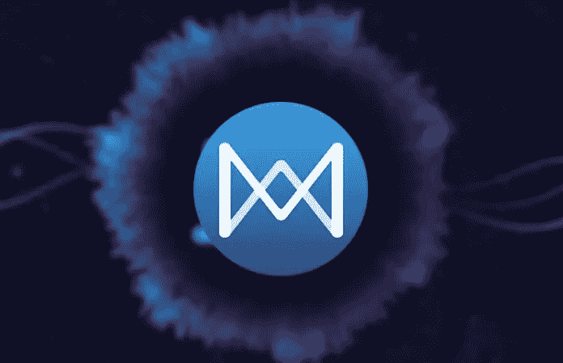

# 没有技术背景的女性如何进入区块链行业

> 原文：<https://medium.com/hackernoon/how-women-can-enter-the-blockchain-industry-without-a-technical-background-an-interview-with-7f46d7bbf283>

## 专访夸克链、项

Anthurine Xiang (center) and team.

瞿

越来越多的人在 Quora 上提问，关于如何进入[区块链](https://hackernoon.com/tagged/blockchain)领域，特别是没有技术背景如何进入，以及女性在这个行业做得如何。为了寻找这些问题的答案，我又采访了的一位下层公众、夸克、项。

在与 Anthurine 交谈时，她分享了营销在区块链行业中的作用，她的初创公司中女性员工的比例，以及对进入该行业的一些建议。

Quarkchain

**FQ *:为什么营销在区块链行业很重要？***

区块链的产业非常有趣。与传统的科技公司不同，它需要专注于技术和服务好用户。

区块链有个东西叫*共识，意思是*有社群。无论你做什么，你都是公共区块链的一部分..我们都普遍面临着大 Dapps，需要让他们建立在我们的区块链。然而与此同时，我们仍然必须让普通人知道我们在做什么。

这样做就是我们所说的“营销”。区块链营销和传统营销不太一样。它不是一个“获取”用户的过程，而是一个教育用户的过程。

也可以把这个行业的营销看做一个桥梁。你必须用一种没有技术背景的人也能理解的方式来传达一个工程师想要达到的目标。我觉得女性在这方面更有优势，因为她们往往有很强的沟通能力。

在过去，没有人特别关注区块链市场的这种营销需求。他们分发免费代币来吸引人们，而不是真正教育社区告诉他们我们是什么样的。

Marketing is like a bridge. Photo from upsplash Samule Oakes.

但现在很多(区块链)项目方问我，我们能否为他们培训一些首席营销官。现在似乎每个人都意识到了营销的重要性，不管你的项目有多专业。

我们在营销中的作用就是让用户相信我们能达到目标。例如，在营销时，我会解释 Quarkchain 和其他区块链公司的区别，以及我们的方法有何不同。

我还会介绍一下我们的路线图，就是我们计划现在达到 1 万 TPS，以后达到 100 万 TPS。用户会发现我们正在逐步实现我们的目标。这是我们在营销中的角色；我们让人们知道我们的进步。

营销人员还负责向用户介绍我们的背景。例如，我们分享我们曾经在谷歌和脸书这样的大公司工作过，这表明我们非常有经验..唯一不同的是，现在我们的项目是分散的，我们把以前的经验和想法搬到了一个新的领域。这是营销人员用来说服非技术人员的工具。

**FQ:** ***夸克链战队男女比例是多少？***

**AX:** 大概是一半一半吧。我们公司是三分之一工程师，三分之一营销，三分之一业务拓展(BD)。BD 和营销都有很多女性员工。

**FQ:夸克链的 BD 的主要工作和传统公司有什么不同？**

**AX:** 我们的 BD 是 VC+孵化器+传统 BD。因为我们有自己的资金，我们会支持我们认为好的项目。那部分和传统风投是一样的。

然后是保温箱。有些项目形成得很早，但有潜力。如果是这样的话，我们会花一些时间一步一步地引导他们。例如，我们将告诉他们如何建立自己的结构，向投资者介绍他们，然后如何设计公开募股流程，如何建立自己的社区。

然后第三部分类似于传统的 BD。有一些项目已经启动，并且已经筹集了资金。这些项目都是比我们早形成的。他们可能目前正在使用以太坊或其他公共区块链，所以我们可能希望与他们合作，请他们尝试我们的公共区块链。

FQ:你在招聘时最看重的品质是什么？是经验吗？

**AX:** 在招聘营销和 BD 的时候，我们从来没有说过你需要有区块链经验，因为这个领域太新了。你必须首先是一个有国际背景的人。你会经常接触到的项目遍布全球，所以你首先要有国际化的视野。

第二个品质是你需要能够快速学习。因为我在区块链领域开始的时候也是从零开始学习，所以我告诉我们营销部门的员工，你不需要理解编程，但你必须知道我们技术的所有技术特征。否则，你将如何向其他人清楚地讲述我们的故事和我们正在做的事情？这些都是需要学习的东西。

第三个品质是，你必须能够承担不同的角色，并真正享受其中。在这个领域，我们经常在世界各地飞行。如果你对了解所有这些事情感到非常兴奋，那么你可能会尝试这个行业。

Photo by [Priscilla Du Preez](https://unsplash.com/photos/EFoH8YajQuA?utm_source=unsplash&utm_medium=referral&utm_content=creditCopyText) on [Unsplash](https://unsplash.com/search/photos/globe?utm_source=unsplash&utm_medium=referral&utm_content=creditCopyText)

**FQ:** ***这个行业会不会更适合年轻人？***

**AX:** 年龄不是最重要的；心态才是。好奇心也很重要。我们接触过一些刚毕业的很年轻的人，但是他们不会角色转换。他们只能专注于一个方面。

因此，有时我认为，在尝试创业之前，在大公司工作并不是浪费时间。在我加入创业公司之前，我也曾在 Linkedin 这样的大公司工作过。我想他们教会了我很多关于*过程*的知识。

**FQ:** ***加入区块链的创业公司成本高吗？***

AX: 如果加入区块链项目，试错成本会更低。你这个行业热钱比较多。你能够更容易地获得资金，但如果项目不成功，你也会更快地知道。

相比一个传统的创业，你可能真的需要三年，四年，或者五年，才知道行不通。在区块链你只需要一年半。

**FQ: *如何找到好的区块链企业？***

区块链行业仍处于早期阶段，因此这个行业是一个大杂烩。建议认识人，以便判断创始团队是否可靠。如果你想知道更多，许多人非常愿意通过参加会议或 Meetup 小组来教你。总体来说，认识的人越多，越容易知道哪个项目最靠谱。