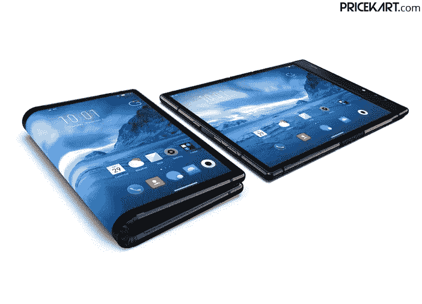
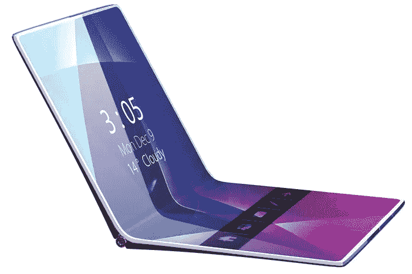

# 可折叠智能手机将如何增强我们的日常使用？

> 原文：<https://medium.com/hackernoon/how-would-a-foldable-smartphones-enhance-our-everyday-usage-b4a06ae18013>

多年来，智能手机迅速带来了新的创新和设计。在几年的时间里，我们从经典的诺基亚手机发展到了触屏手机。然而，很长一段时间以来，我们还没有看到智能手机的重大技术或创新变化。我们今天有更好的智能手机，但很长一段时间都没有改变。但是，事情预计会很快改变。多年来，我们已经看到可折叠智能手机的各种概念、专利和原型出现在网上。

许多智能手机公司一直在努力完善可折叠智能手机，这不是一个隐藏的事实。现在终于，看起来我们可能会在 2019 年看到这些灵活的智能手机。这些设备将具有不同的外形。而一些智能手机将带有向外折叠；一些将具有打开和关闭显示。可以肯定的一点是，这些可折叠智能手机将增强我们日常的手机使用。想知道怎么做？看一看！

## 多任务处理变得简单

[**最新手机价格表**](https://www.pricekart.com/mobile/latest-mobiles-price-list) 中的智能手机所提供的多任务处理能力，与可折叠智能手机所能做的相比，简直不值一提。目前，许多运行最新 Android 操作系统的智能手机允许用户同时使用两个不同的应用程序。不过屏幕空间小让它超级不舒服。另一方面，可折叠智能手机将为我们提供更大、更灵活的显示屏。一部可折叠的智能手机可以让你将显示屏一分为二，舒适地使用两个不同的应用程序，而不会有被限制在有限空间内的感觉。

## 便携性变得简单

可以肯定地说，可折叠智能手机将和平板电脑一样大。可折叠智能手机将同时为您提供平板电脑和智能手机的优势。因此，有了灵活的设备在身边，您就不必一次携带多个设备。此外，你甚至可以将智能手机折叠起来，像普通智能手机一样放在口袋里。而且，这些设备也是完美的旅行伴侣。

## 单摄像机装置

智能手机公司正在相互竞争，在他们即将推出的 [**手机**](https://www.pricekart.com/mobile/upcoming-mobiles-price-list) 上安装越来越多的摄像头。不仅仅是双摄像头手机，智能手机公司也在致力于设计多达八个摄像头的智能手机。现实中，我们需要这么多摄像头吗？我们大多数人都在寻找高质量的前置和后置摄像头。有了可折叠智能手机，用户将只需要一台出色的相机来满足他们所有的摄影需求。

可折叠智能手机将允许单个传感器充当前置和后置摄像头。用户将能够折叠他们的智能手机来点击自拍或普通图片，这取决于他们折叠智能手机的哪一面。一台高度出色的 [**好相机移动**](https://www.pricekart.com/mobile/good-camera-mobiles-price-list) 就是我们所需要的一切。

## 忘记破裂的显示器

现在说这些柔性智能手机是否完全安全，不会出现划痕和裂缝还为时过早。然而，这些智能手机的灵活性水平可能会大幅降低损坏的风险。这些智能手机肯定会采用具有高度抵抗力和柔韧性的材料来设计。因此，用户不必担心这些智能手机的显示屏破裂或屏幕更换。

## 新功能的范围

可折叠智能手机将开启一个充满新可能性的世界。用户将能够在面对面的时候同时观看两个不同的视频。除此之外，这些智能手机可能会取代我们现在看到的游戏智能手机。有了两个不同的屏幕，一个屏幕可以专用于游戏，而第二个屏幕可以用于控制。游戏和应用程序也很有可能很快被设计成支持可折叠手机并提供更多功能。