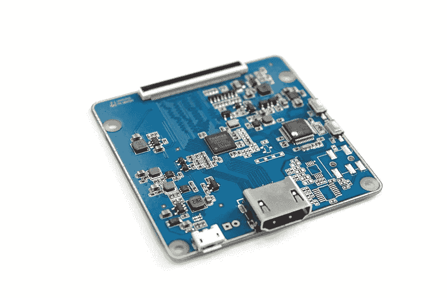

# 如何在一个月内开发物联网原型

> 原文：<https://medium.com/hackernoon/how-you-can-develop-an-iot-prototype-in-one-month-8ed93f6c27ba>

精益创业方法论认为，原型制作是一个高度优先的阶段，因为它有助于在很短的时间内，使用最少的资源，从技术和市场的角度验证你的想法。但是开发第一个功能原型需要多长时间呢？

我们团队的目标是在一个月内完成一个智能台钟原型。以下是我们从这个过程中学到的一些有用的技巧。

> 查看来自 Lemberg 团队的[更多物联网项目](https://lembergsolutions.com/work/iot)。

# 首先敲定产品创意

在采取任何开发步骤之前，您应该最终确定产品想法，以便您的团队清楚地了解您将要开发的设备特性和功能。

我们开发世界时钟的想法是创造一个智能桌面时钟，它有一个圆形显示屏，可以显示几个不同地方的实时时间。这将帮助与远程团队合作的人更快地在时区间导航。

用户将能够通过应用程序控制时钟，设置所需的时区。一个额外的特征将是个人事件的提醒。时钟会在主时钟周围以彩色条纹的形式显示每天的约会。

# 创建原型开发计划

当我们描述了所有的功能后，我们将开发智能时钟的总体任务分成几个小任务:元件选择和电气设计、软件开发和机械工程。为了节省时间，我们计划同时处理一些任务，因此开发过程如下所示:

# 元件选择和电气设计

对于电气工程，开发原型时最好使用现有的模块或电路板。这大大简化了工作，节省了时间。我们建议只开发那些你买不到的模块。

当您为原型选择硬件组件时，您基本上是在验证这个想法。有时，某些组件的物理功能不合适，因此您可能需要对产品设计进行更改。

> 让我们的专家向您展示如何从零到大规模生产，检查我们的产品设计、电气工程、机械设计和其他[物联网服务](https://lembergsolutions.com/services/iot)。

为了实现 WorldClock 功能，我们需要一台显示器和一台单板计算机。当然，我们可以自己开发这些，但那会花很多时间。因为我们的目标是在几周内有一个现成的原型，所以我们决定寻找合适的现成模块。

然而，我们在这里面临一些挑战。

首先，世界时钟的设计要求使用圆形显示器。我们发现的大多数圆形显示器对我们的时钟来说都太小了，我们花了一些时间才找到几个合适的。

其次，将显示器连接到单板计算机是一个挑战，因为它使用特定的接口进行连接——MIPI DSI 3。

最初，我们选择 C.H.I.P .作为我们原型的单板计算机。这是最实惠的解决方案，包含了我们需要的一切；它可以运行 Linux，并有蓝牙模块。所以，我们有了一个想法，为 C.H.I.P .制作我们自己的特殊转换器，在显示器上显示图像。我们估计了创建我们自己的转换器的时间，它太长了。因此，我们开始寻找现有的解决方案。显示器制造商建议我们使用他们使用的 HDMI-MIPI 转换器。

Converter for C.H.I.P.

挑战在于，我们的电脑 C.H.I.P .没有内置的 HDMI 接口来连接 MIPI。

因此，我们决定使用另一台具有嵌入式 HDMI 接口的单板计算机，Raspberry Pi Zero W。这台计算机非常小，我们随它一起获得了大量的技术文档以及一个大型社区的支持，因此这是一个非常好的决定。

# 机械工程

由于每个产品的设计都是独一无二的，机械工程通常需要大量的努力。好消息是，今天，你可以简单地 3D 打印你的产品，所以你只需要先开发一个 3D 模型。

对于世界时钟，我们需要创建一个塑料外壳，在上面安装显示器、电路板和转换器。因此，我们根据我们的设计在 SolidWorks 中开发三维模型，然后打印案例，后期处理并绘制它。

# 嵌入式软件和应用程序开发

您可以在进行电气和机械设计的同时开发软件，对于原型，您可以使用现有的 Linux 发行版，而不是创建自己的发行版。

我们开始开发应用程序代码，同时为 WorldClock 选择平台。

该设备需要显示时钟，并通过 BLE(蓝牙低能耗)与用户设备通信。作为一个编程框架，我们选择了 Qt (C ++ ),因为它有可能在我们选择的任何平台上使用。

惠普和 Raspberry Pi 的官方操作系统是基于 Linux 内核的，所以移植所有软件没有什么大问题。功能软件由许多操作组成，例如使用小部件在屏幕上显示当前时间，为设备设置时间，以及显示或隐藏小时钟。

当时钟的嵌入式软件准备就绪后，我们启动了[移动应用开发](https://lembergsolutions.com/services/mobile)。我们决定创建一个原生应用程序，允许在开始时仅在 iOS 设备上用智能手机控制时钟。

> 另请阅读[选择本地或混合应用开发的业务要点](https://lembergsolutions.com/blog/business-points-choosing-native-or-hybrid-app-development)。

# 外卖食品

四周后，我们有了一个可以通过移动应用程序控制的世界时钟的现成原型。

根据我们的经验，这里有一些关于如何快速开发产品原型的提示:

*   选择需要最少开发时间的组件非常重要。
*   对于电气工程，您可以使用现有的模块或电路板。
*   机械零件，比如船舱，你可以简单地 3D 打印。
*   为了节省时间，您可以在从事电气和机械工程的同时开始开发软件。

您还可以在[完整案例研究](https://lembergsolutions.com/work/worldclock)中找到更多照片以及时钟的工作原理，或者观看下面的视频。

敬请关注更多关于[物联网](https://lembergsolutions.com/services/iot)、[移动](https://lembergsolutions.com/services/mobile)和 [web 开发](https://lembergsolutions.com/services/web)的文章！