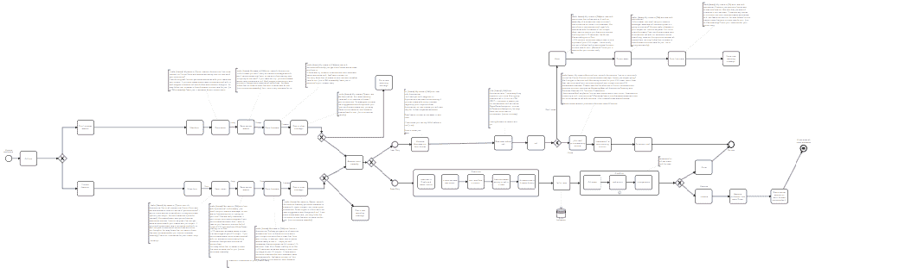
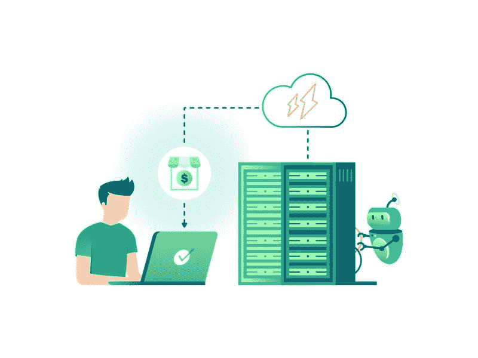

# 如何将所有的电话和邮件保存在一个地方

> 原文：<https://medium.com/hackernoon/how-you-can-now-keep-all-your-calls-and-mails-in-one-place-3e1e993b0a82>

销售线索培育过程有助于在销售漏斗的每个阶段与客户建立关系。它侧重于营销和沟通工作，专注于目的，并提供他们需要的信息和答案。

从小型企业到大型企业集团，所有公司都需要工作流及其管理。这种模型用于表示真实的工作以供进一步评估，例如，描述一致重复的动作序列。如果它是自动化的，销售过程中的所有成员都会松一口气:企业主、经理和客户。

# 可视化工作流程

哪种工具更适合舒适和更快的自动化流程？下面我们来介绍一下我们的合作伙伴康明达研发的 ***BPMN 车型*** 。它是一个建模和管理业务流程的工具。BPMN 有助于在图表中表达人工任务流、事件处理等等！这在技术上是可行的，但对于普通用户来说很容易理解。

要经常盯着。同样重要的是不要和你的客户失去联系。在之前的文章中，我们谈到了一个购买漏斗，但它是一般的形象。让我们开始实际操作吧！

首先，我们根据客户执行的操作来构建他/她的路径。条件是从用户端产生的。顾客从第一次接触到购买产品的所有阶段的理想方式。

但通常情况下，一切都不会如你所愿的那样完美。对吗？

因此，这个工具将有助于可视化所有条件和整个路径，引导客户走向销售漏斗的末端。

# 电子邮件链有助于促进营销

我们审查了公司的工作流程，并发现了效率低下的根源以及沟通中断的原因。

从哪里开始？肯定与创造*一个电子邮件链*！

让我们回顾几种客户端行为条件:

Email Chain

# 条件 1:错过电话

当一个客户在网站上填写了表格，但忘记约定电话时间时。然后，一名助理不得不仔细检查交易的全部信息。这需要很多时间，有时经理们不会注意到这一点。

有了 BPMN，流程现在看起来是这样的:电子邮件链跟踪客户到某个时刻。过了一会儿，系统将这个客户提交给市场部，在那里线索被重新培育到合适的状态，并重新发送给销售团队。

通过这种方式，你不会失去与客户的联系，并且能够回顾和改进断开的步骤。

# 条件 2:客户遵循所有步骤

当客户在预定的通话时间内遵守所有预定义的条件，并收到指定经理发给客户的电子邮件时，他/她应该检查有用的信息，以提高通话效率。下一封邮件会提醒你关于视频室、时区等的所有详细链接。通话结束后，还有第二个选项，即根据请求自动发送电子邮件。

上面我们描述了我们的电子邮件链的第一块。然而，这只是整个过程的一部分。我们将在下一篇文章中描述电子邮件营销的下一步进展。

# 如何改善通话后的工作流程？有解决的办法！

我们的团队一直在跟踪所有有利可图和无利可图的案例，以便在相当长的一段时间内提高通话质量。

因此，我们开发了以下步骤:

1.  在打电话之前，该程序向客户发送一封电子邮件，提供完整的信息，并澄清日期、时区等。
2.  视频通话会自动录制，以提高销售经理的通话质量
3.  可以选择发送“推介资料”。

下面说一下如何改善通话后的工作流程。

许多公司都面临着主呼叫存储容量的问题:存储空间太小或缺乏购买订阅的成本。你认为我们是如何解决这个问题的？我们已经实现了 ***Zoom 和 Google Drive 集成。*** Zoom 为现代企业提供视频通信，包括视频和音频会议、聊天和网络研讨会。

让我们来看看这个过程是如何进行的！在调用之后，使用 API-key 帮助提取数据。然后在一天结束时被重定向到一个单独的文件夹。每个月，在经理或任何其他员工检查后，所有系统记录都会被删除。现在一切都是自动完成的，在文件夹中搜索所需的记录并不需要花费很多时间。清理和刷新文件夹是不断进行的。这种转移的频率可以根据公司的目标而变化。

我们还开发了与 Pipedrive 集成的 ***。对于活动呼叫，我们生成它们与该客户端的自定义链接。因此，销售经理可以从他/她的 CRM 系统加入。现在，他/她不应该采取额外的行动来查找通话的地点。***

# 结论

了解工作流程进展情况的最佳方式是将其可视化。所以，BPMN 模式将简化这个过程，并帮助你在正确的方向上建立电子邮件链，让你了解所有耗时和低效的额外点击或动作。

*我们的新解决方案是 Zoom-Pipedrive 和 Zoom-Google Drive 集成，以便于所有与视频通话相关的活动。*

*总而言之，问题总有解决的办法，最主要的是找到它的根源。*

请将此分享给你所有的媒体朋友并鼓掌👏这篇文章支持我们的团队。我们感谢您花时间阅读这篇文章，订阅并等待一些新的有用的信息！访问我们的官网了解更多:realomat.com

www.facebook.com/realomat/[脸书](http://www.facebook.com/realomat/)

LinkedIn:https:[www.linkedin.com/company/realomat/](http://www.linkedin.com/company/realomat/)

推特:twitter.com/realomat_biz

Instagram: realomat_biz