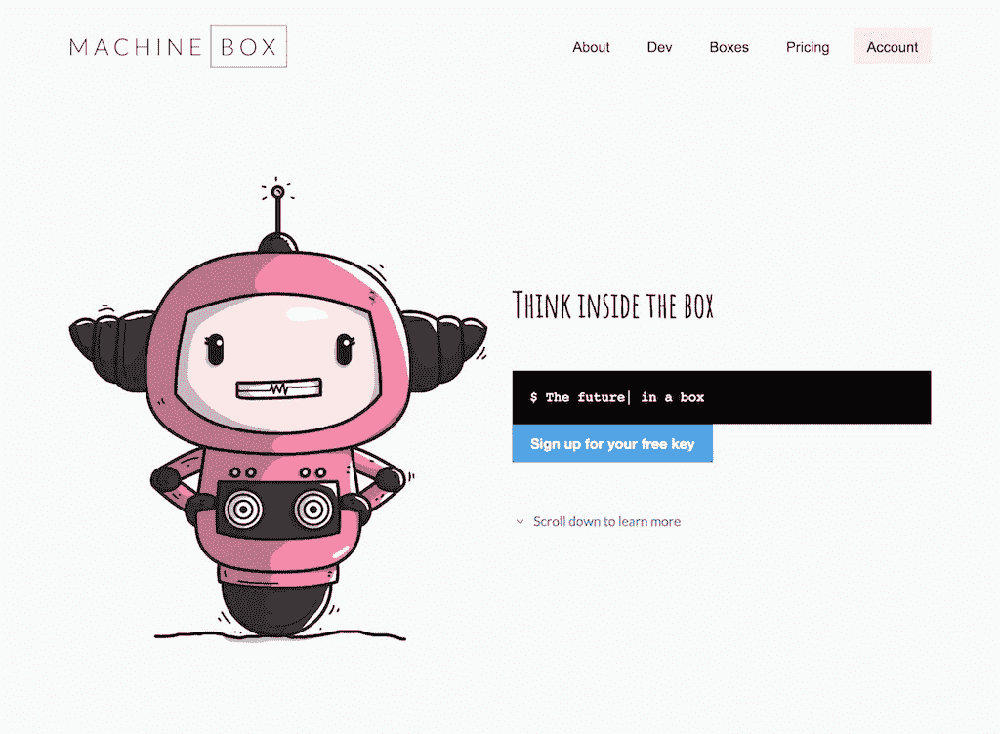

# 你如何使用网飞使用的强大的机器学习

> 原文：<https://medium.com/hackernoon/how-you-can-use-the-same-powerful-machine-learning-netflix-uses-4079715a5ff8>

Image from Netflix’s blog: [https://medium.com/netflix-techblog/artwork-personalization-c589f074ad76](/netflix-techblog/artwork-personalization-c589f074ad76)

你有没有想过为什么当你每天登录你的账户时，网飞用于不同展览的艺术品有时会改变？前一天是全体舰桥人员的照片，第二天是 Worf 评判性地瞪着我。这是因为机器学习正在幕后运作，试图猜测什么会让你选择观看某个特定的节目。他们根据你挑选节目的历史，为你提供个性化的体验。

这是强大的机器学习，你可以用它来。

来自网飞关于这项技术的博客:

> 对于艺术品个性化，我们使用的具体在线学习框架是*语境强盗*。与其等着收集一整批数据，等着学习一个模型，然后等着 A/B 测试得出结论，上下文强盗们会迅速为每个成员和上下文找出最佳的个性化艺术作品选择。

要做到这一点，有几个有趣的挑战。首先，你需要把你的选择从数百万减少到 50 个或更少。艺术品选择是一个漂亮的用例，因为代表每个展览的不同艺术品肯定不到 50 件。这个机器学习模型需要做的选择越少越好。

[https://en.wikipedia.org/wiki/Collaborative_filtering](https://en.wikipedia.org/wiki/Collaborative_filtering)

你需要做的第二件事是在人工智能做对的时候奖励它。对网飞来说，当你点击节目时，回报就来了。他们给你看了同一个节目的 10 张不同的图片，在第 10 张的时候，你终于点击了它。可能还有其他决定进入你点击的那个节目，你也可以捕捉并投入到机器学习模型中；一天中的时间，你已经在线多长时间，地理位置等。，以防图像不是唯一的决定因素。该模型将找出哪些因素比其他因素更重要。

顺便说一下，这就是为什么网飞有不同的侧面。科学家们普遍认为《星际迷航:下一代》是一部伟大的电视剧，但并不是每个人都接受这个事实。网飞不知道是你还是你的孩子在任何给定的时间选择观看节目，所以他们鼓励你使用个人资料，这样他们就可以区分流量。

## 那么我该怎么用呢？

不行，太难了。

为了让它工作，你必须做的事情太多了。你需要一个数据科学家来构建算法，你需要机器学习专家来理解模型和数据的流动，你需要 rockstar 开发人员来将其集成到产品或解决方案中，以及开发运营神来部署它并使其规模化。

或者你可以使用开箱即用的机器学习工具，比如来自[机器盒](https://machinebox.io/?utm_source=Medium&utm_medium=Post&utm_campaign=Netflix%20uses%20collaborative%20filtering)的[建议盒](https://machinebox.io/docs/suggestionbox?utm_source=Medium&utm_medium=Post&utm_campaign=Netflix%20uses%20collaborative%20filtering)。在一个包装在简单 API 中的 Docker 容器中，它拥有解决这个问题所需的一切。建议你先从这个入手，在深入 AI 复杂性地狱之前先做实验。

## 但是我能用它作为我的用例吗？

实际上，有许多不同的奇妙方法可以使用由机器学习驱动的协同过滤来为您的客户个性化定制产品。

1.  [个性化你网站的布局](https://blog.machinebox.io/forget-a-b-testing-order-elements-using-personalized-machine-learning-recommendations-in-7703233cc4ef)和元素位置，以增加参与度。
2.  根据谁在访问您的订阅源来订购或显示新闻文章。
3.  个性化产品图片。还是不要…看你的了。
4.  为公寓、酒店房间、汽车或其他你想出售的物品挑选英雄照片
5.  一些有趣的第五件事

## 请现在就了解情况

个性化可以是微妙的，可以是动态的，可以极大地增加点击、参与、购买等指标。这是机器学习的一个很好的用例。

网站的每一个访问者都将向模型提供信息，然后模型可以使用这些信息来选择你更有可能参与的元素、图像、布局、广告、产品或新闻文章。像 [Suggestionbox](https://machinebox.io/docs/suggestionbox?utm_source=Medium&utm_medium=Post&utm_campaign=Netflix%20uses%20collaborative%20filtering) 这样的工具会给你一个模型，当更多的人使用它时，它会学习，并使用[在线学习](https://en.wikipedia.org/wiki/Online_machine_learning)来动态适应，这给你(除了其他事情之外)做远不止 A/B 测试的能力。

## 这不是很有争议吗？

可以，真的取决于你。我不主张试图从用户那里收集太多的个人信息来训练一个模型。当用户开始感觉到推荐中有偏见时，网飞遇到了这个问题。在网飞的案例中，尽管他们没有收集个人信息，这种情况还是发生了。这是否意味着我们必须防范用户自己的集体偏见？也许吧。

这个过程的一个好的实现部分是一个系统，它偶尔随机产生结果，这样用户就不会只得到模型认为他们想看的东西。为了让模型学习，它需要探索，这意味着向用户展示随机选择，并观察他们如何参与。这有助于我们避免在模型中建立过多的假设。

伟大的机器学习伴随着巨大的责任。

# 什么是机器盒子？

[Machine Box](https://machinebox.io/?utm_source=Medium&utm_medium=Post&utm_campaign=Netflix%20uses%20collaborative%20filtering) 将最先进的**机器学习**功能放入 **Docker 容器**中，这样像您这样的开发人员可以轻松地将自然语言处理、面部检测、对象识别等功能融入其中。到您自己的应用程序中。

这些盒子是为了扩展而建造的，所以当你的应用真正起飞的时候，只需要水平地添加更多的盒子，直到无限甚至更远。哦，它比任何云服务都便宜**([而且可能更好](https://hackernoon.com/which-face-recognition-technology-performs-best-c2c839eb04e7))……而且**你的数据不会离开你的基础设施**。**