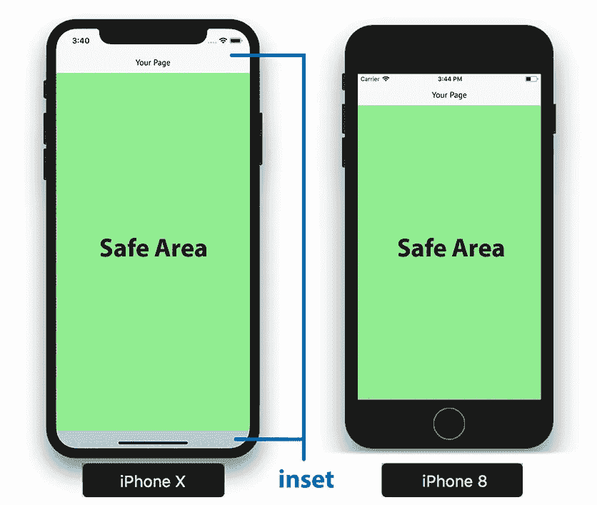
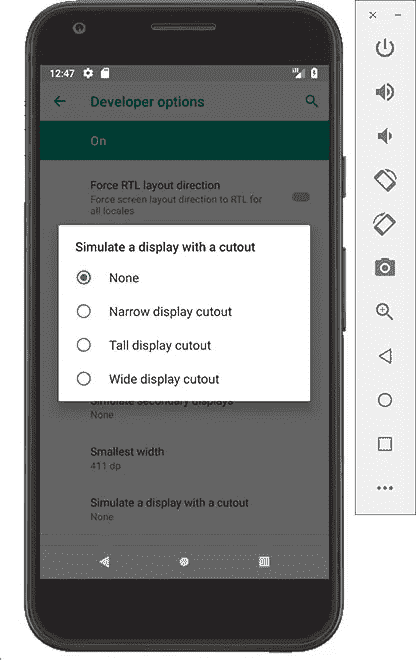
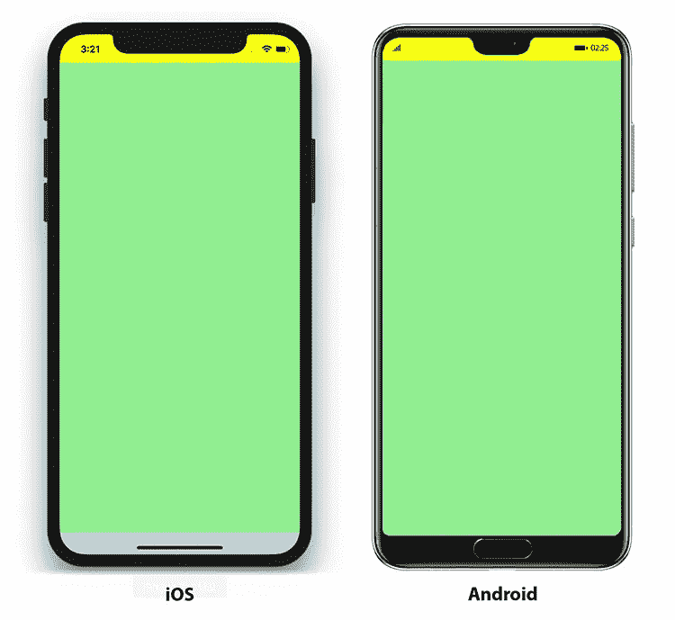

# 如何在缺口地狱中生存 iPhone X 和 Android P 上的安全区域插图

> 原文：<https://medium.com/hackernoon/how-you-survive-the-notch-hell-on-ios-android-9badd9d6b935>

越来越多的移动设备都有一个凹口(或称之为显示屏切口，在 Android 上是这样称呼的)。为了对付这个小怪物，移动应用开发者现在面临许多新的挑战。

这一趋势正在迅速蔓延，许多制造商已经宣布了 2018 年新机型，采用边到边屏幕。例如，使用 Android P 设备，如 Essential Phone、OnePlus 6、Oppo R15 Pro、Vivo X21、LG G7、华为 P20 或华硕 Zenfone 5。与 iPhone X 类似，苹果的新 iPad Pro 型号 iPad X 也将包括一个凹槽，并以 Face ID 为特色。

"*支持 notch 有多难——可能需要一两天时间来优化现有应用？*

这是我们最初的想法。事实证明，这比预期的要难得多**。在将 20 多个应用程序&游戏移植到*支持的过程中，我们遇到了很多困难。***

作为一个原生 iOS 和 Android 开发者，当你开始为边缘到边缘屏幕的设备开发时，你自己也会遇到类似的问题。对于 iOS，苹果甚至**要求**你支持 iOS 11 和 notch:2018 年**7 月**之后提交的所有新应用&应用更新都会被拒绝，否则。

因此，我们准备了这份指南，向您展示如何在您的应用中支持 notch。因此，你越早开始遵循这个指南，你就能越好地为苹果 7 月份的变化和 Android P 的变化做好准备。

本指南中提供的提示适用于 iOS 和 Android，对跨平台开发人员也很有用。在此过程中，我们还修改了 V-Play 中的所有组件，这是一个用于应用和游戏开发的跨平台框架。它现在支持 notch 开箱即用，因此您无需亲自经历这一“notch 地狱”。

开始了。我们希望您喜欢《生存极限指南》:

# 边对边显示设备的用户界面挑战

许多制造商已经宣布了带有窄边框屏幕的新机型，这在 iPhone X 发布后变得更加流行:

这种屏幕可以最大限度地利用设备提供的可用空间。除了圆角以外，移动应用程序开发人员还有一个主要的痛点:缺口。

应用开发者现在面对的不是一个清晰的矩形框，而是任意形状的屏幕。此外，前端的硬件按钮不再存在。它们被操作系统提供的屏幕按钮和手势所取代。以下部分描述了如何为 iOS 和 Android 创建适应性布局来应对这些挑战。虽然这篇文章使用了 iPhone X 的例子，但是相同的概念和建议的解决方案也适用于其他具有类似屏幕的设备和平台，比如即将推出的 Android P 设备。

# iPhone X 更大的屏幕尺寸和安全区域

对于 iPhone X 来说，新屏幕有两个主要因素需要在移动应用程序中考虑:

*   屏幕通常更大，因此您的应用程序可以使用更多空间。
*   您的应用程序内容不应覆盖带有凹口或原生屏幕按钮的区域。否则，您放置在屏幕这些部分的元素是不可访问的。

为了支持不同的设备型号和屏幕，大多数应用程序都使用响应式布局。这意味着页面使用完整的高度和宽度来显示尽可能多的内容。这是好事。但是，如果不考虑凹口和保留区域，应用程序的某些部分会被覆盖或无法访问。

在上面显示的 iPhone X 截屏示例中，凹槽在纵向模式下覆盖顶部导航栏，在横向模式下覆盖页面内容，即列表项文本。对于这两种方向，主滑动手势的区域在底部覆盖您的应用程序。还要注意，新屏幕带有圆角。

要解决这个问题，你的 app 需要考虑屏幕的**安全区域**。它是你的应用程序的一部分，不会被凹槽或屏幕手势覆盖。所需的顶部和底部屏幕插图决定了纵向模式下的安全区域:

例如，导航栏要求顶部有更多的填充，才能位于安全区域内。在风景模式下，它看起来有点不同。然后，我们需要左右边距(圆角和凹口)，以及底部的小插图(主滑动手势):

# 现有的应用程序在 iPhone X 上看起来如何？

如果你担心你发布的应用已经受到了 notch 的影响，你可以放松了。只有针对 iPhone X 配置的应用程序才能全屏运行。您现有的 iOS 应用程序将带有**黑色边框**，如本图右侧所示，不会覆盖带有缺口或屏幕手势的区域:

缺点是边框不好看，应用程序与其他 iPhone X 应用程序的风格不匹配——你的用户会意识到这一点，你的应用程序会得到更差的评级。黑色边框后退只是苹果的向后兼容特性，不会破坏任何东西。然而，这也意味着美国应用程序开发人员需要做一些工作来支持新屏幕。

# 如何使用 Xcode 创建 iPhone X 应用程序

# 为您的应用程序启用 iPhone X 支持

除非您的应用程序支持 iPhone X，否则默认情况下它会显示黑色边框。这也意味着，你的*现有应用将不会受到槽口*的影响。然而，如果你想完全支持 iPhone X，并让你的应用程序充满整个屏幕，你需要在 Xcode 中添加一个额外的 iPhone X 分辨率的启动图像:

为横向模式添加一个 2436 x 1125 像素的图像，如果您想支持纵向模式，则添加一个 1125 x 2436 像素的图像。

# 将您的内容放在安全区域布局指南中

许多 iOS 应用程序在顶部使用导航栏，在底部使用标签栏。在 iOS 7 中，苹果决定添加 *topLayoutGuide* 和 *bottomLayoutGuide* 属性，这些属性与视图中这些条形的插图相匹配。开发者因此可以调整他们的内容来匹配这些插入。

对于 iPhone X 来说，只照顾上下页边距是不够的。我们在屏幕的左边和右边也有插图，例如在横向模式下。因此，苹果在 iOS 11 中引入了新的[safearayoutguide](https://developer.apple.com/documentation/uikit/uiview/2891102-safearealayoutguide)属性。顶部和底部的版式参考线现在**已弃用**。

要确保您的内容没有被凹口覆盖，请将其放置在安全区域布局指南中。与前面的顶部和底部布局参考线类似，这可以通过约束来实现。

但是这个简单的解决方案还远非完美。尤其是在横向模式下，限制你的内容区域会留下一些难看的空白。为了避免这种情况，您可以改为只在必要的地方向内容添加自定义插入。

新的[safareainsets](https://developer.apple.com/documentation/uikit/uiview/2891103-safeareainsets)属性提供了对安全区域的精确像素插入的访问。因此，您可以根据自己的需要调整布局。例如，您可以将列表项的单元格设计为具有较大缩进的安全区域。视图内容可以覆盖整个屏幕。

# 如何迁移现有的原生 iOS 应用程序以使用安全区域插件

为了让你的应用程序更容易更新，你可以选择激活 Xcode 中每个故事板的*使用安全区域布局指南*设置。

然后，故事板用安全区域替换顶部和底部的布局参考线，并更新约束。这是让你的应用为 iPhone X 做好准备的第一步。

但是如上所述，您仍然需要检查所有的视图，以提供最佳的用户体验。例如，要:

*   让子视图的背景使用全屏，同时保持内容安全。
*   决定在滑动 UIScrollView 时如何处理插图。
*   设置 UITableView 或 UICollectionView 以正确布局 iPhone X。

此外，如果您的应用程序**隐藏了系统状态栏**，您可能不会满意默认*使用安全区域布局指南*设置的结果:

由于最新的 iOS 11 SDK 中的一个错误，导航栏在这种情况下没有考虑凹槽。除了一些变通方法之外，在撰写本指南时，对于这个问题还没有简单的解决方案。至少在依靠带有 Xcode 的原生 iOS 开发时是这样。

# Android P 开发者预览版:显示剪切图

许多 Android 手机制造商已经宣布了他们即将推出的设备型号，采用边对边显示屏和圆角。例如:

谷歌也已经发布了 Android P 的开发者预览版。它具有处理这些所谓的显示剪切的能力。在 iOS 的世界里，display cutout 相当于 notch。

# 如何在 Android P 中测试带有显示剪切的应用

Android P 开发者预览版允许模拟显示剪切。Android P 可通过 Android Studio 的 SDK 管理器获得。在虚拟 Android P 设备上安装 Android P SDK 和系统映像进行测试就足够了:

安装完成后，您可以启动运行 Android P 的仿真器。Android P 上的开发人员设置提供了四种不同的显示剪切选项供选择:

选择此选项后，Android 设备将显示一个更大的状态栏，其中还包括一个显示剪切块:

[layoutInDisplayCutoutMode](https://developer.android.com/reference/android/view/WindowManager.LayoutParams#layoutInDisplayCutoutMode)属性控制当出现显示剪切时窗口的布局。默认情况下，你的 Android P 应用程序不会延伸到剪切区域——只有一个例外。正如上图所示，你的应用程序可以安全地覆盖整个屏幕，不超出状态栏区域。

**注意:**当 [FLAG_FULLSCREEN](https://developer.android.com/reference/android/view/WindowManager.LayoutParams#flag_fullscreen) 或[SYSTEM _ UI _ FLAG _ full screen](https://developer.android.com/reference/android/view/View#SYSTEM_UI_FLAG_FULLSCREEN)被置位时，窗口将失去伸入剪切区域的能力。

为了让您的应用程序始终利用全屏，您可以设置值[LAYOUT _ IN _ DISPLAY _ CUTOUT _ MODE _ ALWAYS](https://developer.android.com/reference/android/view/WindowManager.LayoutParams#layoutInDisplayCutoutMode)。然后，您有责任将您的应用程序内容保持在屏幕的安全区域内。例如，当设备处于横向模式时，或者当剪影超过纵向状态栏时。

# Android P 中带有安全区域插入的自定义布局

像 iOS 11 一样，Android P 包括确定屏幕安全区域和处理给定插图的功能。新的 [DisplayCutout](https://developer.android.com/reference/android/view/DisplayCutout) 类可以让您找到不应该显示内容的非功能区域的位置和形状。

要确定剪切区域的存在和位置，使用 [getDisplayCutout()](https://developer.android.com/reference/android/view/WindowInsets.html#getDisplayCutout()) 方法。然后您可以访问*显示剪切*的以下字段:

*   [getSafeInsetBottom()](https://developer.android.com/reference/android/view/DisplayCutout#getSafeInsetBottom()) —返回屏幕底部的安全区域插图。
*   [getsafeinsteleft()](https://developer.android.com/reference/android/view/DisplayCutout#getSafeInsetLeft())—返回屏幕左侧的安全区域插图..
*   [getSafeInsetRight()](https://developer.android.com/reference/android/view/DisplayCutout#getSafeInsetRight()) —返回屏幕右侧的安全区域插图..
*   [getSafeInsetTop()](https://developer.android.com/reference/android/view/DisplayCutout#getSafeInsetTop()) —返回屏幕顶部的安全区域插图..
*   [getBoundingRects()](https://developer.android.com/reference/android/view/DisplayCutout.html#getBoundingRects()) —返回描述屏幕非功能区域的 *Rect* 对象列表。

**总的来说，让你的应用程序布局适应这些新的显示方式需要做很多工作。尤其是针对 iOS 和 Android 的开发者。**

通过使用具有 notch 支持的跨平台框架，您可以节省构建移动应用程序的时间和精力。

# 创建 iOS 和 Android 应用程序，支持凹口和显示切口

V-Play Engine 专注于简化移动应用程序开发。它还支持 iPhone X notch 和 Android P 设备，开箱即用。您可以一次编写您的应用程序，只需在 1 个 IDE 中按一下按钮，即可构建适用于 iOS、Android 甚至桌面的应用程序。源代码在所有平台之间 100%共享。

V-Play 建立在 C++ & Qt 的基础上，利用了 QML 和 JavaScript。QML 是一种快速易用的声明式 UI 语言。只需几行代码，就可以创建在任何设备上都看起来很自然的原生 iOS 和 Android 应用程序:

[**Run this code**](https://v-play.net/web-editor/?snippet=7e3e5ae8) **on your iOS or Android device now, with Live Code Reloading**

上面的示例应用程序在 iPhone X 上是这样的:

使用的组件如[导航](https://v-play.net/doc/vplayapps-navigation/)和[导航堆栈](https://v-play.net/doc/vplayapps-navigationstack/)准备好与安全区域插入一起工作:如果需要，它们会自动为标签和导航栏包含额外的边距。

与原生 iOS SDK 相比，隐藏状态栏没有任何问题。您可以通过在代码中设置一个属性来实现这一点:

[**Run this code**](https://v-play.net/web-editor/?snippet=48f9d111) **on your iOS or Android device now, with Live Code Reloading**

V-Play 中的顶部导航栏总是自动支持凹槽，即使有隐藏的状态栏。

像 Xcode 故事板的*使用安全区域布局指南*设置一样，你的页面内容不会与屏幕的保留区域重叠。但是 V-Play 不需要额外的设置来实现这一点。页面内容与现成的安全区域对齐。对于没有凹口的设备，应用程序不会显示任何额外的边距或插页:

注:如果您有现有的 V-Play 应用程序，请为您的 iOS 应用程序配置 iPhone X 启动图像，以便在 iPhone X 上获得全屏支持。对于新应用程序，这是自动设置的。

# 使用适应性布局优化您的用户界面

对于大多数用例，默认设置可以让你的应用在有或没有显示剪切的设备上看起来都很好。如果你想更多地控制如何显示你的内容，你可以禁用每个*页面*的[使用安全区域](https://v-play.net/doc/vplayapps-page/#useSafeArea-prop)设置。然后，您有两种选择来处理安全区域:

1.  仅配置页面中的某些内容项目以与安全区域对齐。
2.  根据需要检索屏幕和布局项目的确切安全区域插图。

以下示例取消 *useSafeArea* 设置，并显示两个选项:

[**Run this code**](https://v-play.net/web-editor/?snippet=3f3698a8) **on your iOS or Android device now, with Live Code Reloading**

默认情况下，页面内容现在可以覆盖整个屏幕。您可以使用*页面*的[安全区域](https://v-play.net/doc/vplayapps-page/#safeArea-prop)属性将项目与屏幕的安全区域对齐。在上面的例子中，我们用绿色矩形填充安全区域。这是您可以放置内容项目的地方。

[native utils . safe area Insets](https://v-play.net/doc/nativeutils/#safeAreaInsets-prop)以像素为单位保存屏幕的精确安全区域 insets。没有凹口的设备没有任何插入，因此返回 0。对于 iPhone X，黄色矩形将覆盖顶部插图，其中包括状态栏。为了支持旧设备，如果*native utils . safareainsets . top*没有返回 inset，则填充状态栏。

可用的[安全区域插入](https://v-play.net/doc/nativeutils/#safeAreaInsets-prop)属性有:

*   native utils . safareainsets . top
*   native utils . safareainsets . right
*   native utils . safareainsets . bottom
*   native utils . safareainsets . left

在 iOS 或 Android 上运行此应用程序会产生以下结果:

以这种方式开发自适应用户界面非常方便。下面的例子展示了如何使用*native utils . safareainsets . left*为列表中的单元格添加更多的缩进。

[**Run this code**](https://v-play.net/web-editor/?snippet=9038ee98) **on your iOS or Android device now, with Live Code Reloading**

通过这些简单的添加，你可以确保你的应用在有或没有安全区域插入的屏幕上看起来像素完美。

你不需要为那些提供默认的带有导航条和标签栏的用户界面的应用程序添加这样的调整。V-Play 页面和导航组件在所有设备上看起来都很好，并自动调整其样式。

# 支持 Android P 设备上的显示剪切

V-Play Engine 是一款跨平台的开发工具，同时支持 Android 和 iOS。你可以把你的 iOS 应用的 QML 代码直接用于 Android，反之亦然。所有组件都会改变它们的外观和行为。它们符合给定平台的本机风格和用户体验:

上图显示了同一个示例应用程序的 Android 和 iOS 风格。Android 风格已经准备好支持边到边屏幕。**不需要额外的工作，就可以让你的应用跨平台运行于 iOS & Android，带有显示剪切块、安全区域和凹槽！**

# 在桌面上开发时模拟安全区域插入

总是要花相当多的时间来构建和部署到您的手机或模拟器。使用 V-Play，您可以直接在桌面上运行和测试您的应用程序。甚至可以模拟不同的设备和分辨率，看看你的应用程序会是什么样子。你可以在运行时改变分辨率，**而无需重启你的应用。**这为 UI 开发&测试节省了大量时间！Android 或 iOS 的原生开发需要部署到另一个真实或虚拟设备来测试 UI。

除了支持显示凹槽，V-Play 还为 iPhone X 提供了一个新的分辨率模拟器条目。最棒的是:它甚至覆盖了你在真实设备上获得的安全区域插图:

因此，在为 iOS 和 Android 开发时，V-Play 引擎可以节省大量时间。V-Play SDK 是免费使用的，所以一定要去看看！

如果你喜欢这篇文章，请留下评论或在脸书或推特上分享。

# 更多相关应用开发资源

*   [如何为 iPhone X 等有安全区域的设备制作手机游戏](https://v-play.net/updates/release-2-16-0-iphone-x-support-and-runtime-screen-orientation-changes#iphonex-support-for-games)
*   [如何支持多种屏幕尺寸&屏幕密度—响应式应用指南](https://v-play.net/doc/apps-supporting-multiple-screens-and-screen-densities/)
*   [应用布局指南](https://v-play.net/doc/apps-howto-layout-and-positioning/)
*   [应用导航指南](https://v-play.net/doc/apps-howto-use-app-navigation/)
*   [iPhone X 人机界面指南](https://developer.apple.com/ios/human-interface-guidelines/overview/iphone-x/)
*   [iOS 文档:相对于安全区域定位内容](https://developer.apple.com/documentation/uikit/uiview/positioning_content_relative_to_the_safe_area)
*   [iOS 安全区开发指南](/rosberryapps/ios-safe-area-ca10e919526f)
*   [在 iOS 10 & 11](https://blog.smartnsoft.com/layout-guide-margins-insets-and-safe-area-demystified-on-ios-10-11-d6e7246d7cb8) 中，布局指南、页边距、插图和安全区域不再神秘
*   [Android P 文档:显示剪切支持](https://developer.android.com/preview/features#cutout)
*   [探索 Android P 显示屏剪切图](/exploring-android/exploring-android-p-display-cutouts-42885e8a2a96)

# 最佳应用程序开发教程和免费应用程序模板

所有这些教程都附有移动应用程序的完整源代码！你可以免费复制代码来制作你自己的应用程序！

*   [如何用单一代码库为 iOS & Android 创建移动应用](https://v-play.net/doc/apps-getting-started/)
*   [如何在您的手机应用中支持多语言和国际化](https://v-play.net/doc/howto-multi-language/)
*   [跨平台应用中的常用 Widgets &控件](https://v-play.net/doc/apps-howto-common-widgets-and-controls/)
*   [如何给你的手机 App 添加原生代码](https://v-play.net/doc/apps-howto-app-logic/)
*   [如何用主题轻松设计你的应用](https://v-play.net/doc/apps-howto-style-your-app-with-themes/)
*   [如何为你的应用添加动画](https://v-play.net/doc/apps-howto-make-animations/)
*   [如何在手机应用程序中添加聊天内容](https://v-play.net/cross-platform-app-development/how-to-add-chat-service-and-cross-platform-leaderboard-with-user-profiles-to-your-ios-or-android-app)
*   [如何让天气 App 接入休息天气服务](https://v-play.net/cross-platform-app-development/access-rest-services-qt-v-play-weather-service-example-app-open-source)
*   [会议 App 模板](https://v-play.net/events/qt-world-summit-open-source-conference-app)
*   [Widget Gallery 应用模板](https://v-play.net/doc/v-play-appdemos-showcase-example/)
*   [推特应用模板](https://v-play.net/doc/v-play-appdemos-twitter-example/)
*   [Messenger 应用程序模板](https://v-play.net/doc/v-play-appdemos-messaging-example/)
*   [房产查询应用模板](https://v-play.net/doc/v-play-appdemos-propertycross-example/)

# 应用开发视频教程

感谢阅读和滚动到这里！

关于 app 开发的帖子或者教程有什么建议吗？
在这里简单地给我们发一条你想看哪个教程的消息[。](https://v-play.net/contact/)

# 更多这样的帖子

[How to Make Cross-Platform Mobile Apps with Qt — V-Play Apps](https://v-play.net/cross-platform-app-development/qt-v-play-apps-video)

[Release 2.16.0: iPhone X Support and Runtime Screen Orientation Changes](https://v-play.net/updates/release-2-16-0-iphone-x-support-and-runtime-screen-orientation-changes)

[How to Expose a Qt C++ Class with Signals and Slots to QML](https://v-play.net/cross-platform-development/how-to-expose-a-qt-cpp-class-with-signals-and-slots-to-qml)

*原载于 2018 年 5 月 17 日*[*v-play.net*](https://v-play.net/cross-platform-app-development/notch-developer-guide-ios-android)*。*